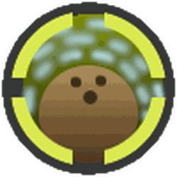
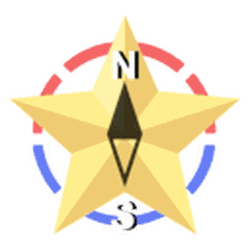

# Passive Abilities

{ align=right width=150 }

**Passive Abilities,** or simply **passives** are effects found on some accessories, [amulets](amulet.md), or [bees](bees.md). These abilities are active all the time or only activate when specific actions are done, as an additional effect of those actions.

Passive abilities granted by an accessory or an amulet are displayed near the hotbar. Some passive abilities require the player to do the same action multiple times, as shown by the number displayed on the passive's icon, indicating how close it is to activating the ability. When the ability is activated, the number will reset to 0.

Some passive abilities have a cooldown. When in cooldown, the number of seconds left will be displayed on the passive's icon in pale red. No trigger will activate the ability, nor will the trigger counter be increased. These passive abilities also have an initial cooldown when the player equips items that have those passives to prevent bypassing the cooldown.

## Accessory Passives

### Haste Pulser

**Haste Pulser** activates every 30th [Haste token](ability-tokens.md#Haste) collected.

When activated, it fires a blue pulse that hops to each blue bee, identical to that of [Cobalt Bee](cobalt-bee.md).

Haste Pulser is granted by equipping the [Cobalt Guard](cobalt-guard.md).

If the player has no blue bees, then nothing happens.

### Focus Pulser

**Focus Pulser** activates every 30th [Focus token](ability-tokens.md#Focus) collected.

When activated, it fires a red pulse that hops to each red bee, identical to that of [Crimson Bee](crimson-bee.md).

Focus Pulser is granted by equipping the [Crimson Guard](crimson-guard.md).

If the player has no red bees, then nothing happens.

### Bubble Bombs

**Bubble Bombs** activates every 25th [Bomb token](ability-tokens.md#Bomb) collected, with a 2-minute cooldown.

When activated, it spawns 25 [bubbles](bubble.md) randomly in the [field](fields.md) the player is in.

Bubble Bomb is only granted by equipping the [Bubble Mask](bubble-mask.md), or the [Diamond Mask](diamond-mask.md) if the player owns the Bubble Mask.

### Diamond Drain

**Diamond Drain** activates every 30th Blue [ability token](ability-tokens.md) collected, with a 45-second cooldown.

When activated, it summons a giant diamond that instantly converts 5 million pollen plus the [total conversion amount](system-page.md#Convert_Total). The conversion amount increases by 10% for every Blue bee the player has and increases by 50% for every Gifted Blue bee type they have. It also pollinates 10 (+3 per Blue bee) blue flowers within the field.

Diamond Drain is granted by equipping the [Diamond Mask](diamond-mask.md).

### Ignite

**Ignite** activates every 15th Red [ability token](ability-tokens.md) collected.

When activated, it creates 5 [flames](flame.md) in a plus shape where the 15th red token is collected.

Ignite is granted by equipping the [Fire Mask](fire-mask.md), or the [Demon Mask](demon-mask.md) if the player owns the Fire Mask.

### X-Flame

**X-Flame** activates every 25th Battle [ability token](ability-tokens.md) collected (ability tokens that can be generated in combat), with a 20-second cooldown.

When activated, it creates 29 [flames](flame.md) in an X shape around the player.

X-Flame is granted by equipping the [Demon Mask](demon-mask.md).

### Coin Scatter

**Coin Scatter** activates every 20th [Mark token](ability-tokens.md#Mark) collected, with a 2-minute cooldown.

When activated, it converts pollen equal to 300% of the player's [total conversion amount](system-page.md#Convert_Total), scattered into 24 honey tokens around the field the player was last in. The honey tokens last for 1 minute.

Each token will give a minimum of 1000 honey, increasing with the amount of pollen converted and the player's [Honey From Tokens](system-page.md#Honey_From_Tokens) stat.

The honey tokens cannot be collected by [Token Link](ability-tokens.md#Token_Link), but can be collected by [Triangulate](ability-tokens.md#Triangulate).

Coin Scatter is granted by equipping the [Honey Mask](honey-mask.md), or the [Gummy Mask](gummy-mask.md) if the player owns the Honey Mask.

### Gummy Morph

**Gummy Morph** activates every 30 [Gumdrops](gumdrops.md) used or 10 [Gummy Bee](gummy-bee.md) ability tokens collected (Gummy Bee ability tokens count as 3 gumdrops).

When activated, the player will be transformed into [Gummy Bear](gummy-bear.md), Gummy Bee will glow, and the field will be covered fully in [goo](goo.md).

As Gummy Bear, the player will be granted +75% [Goo](system-page.md#Goo), +100% [Instant Goo Conversion](system-page.md#Goo_Conversion), +24 [Movespeed](system-page.md#Movespeed), and +60 [Jump Power](system-page.md#Jump_Power).

As Gummy Bee glows, it is granted +1000% [Gather Amount](stats.md#Gather_Amount), +300 [Attack](stats.md#Attack), and +200% [Movespeed](stats.md#Speed) for 10 seconds. The Gummy Bee also leaves a trail while glowing.

Gummy Morph is granted by equipping the [Gummy Mask](gummy-mask.md).

### Coconut Haste

**Coconut Haste** activates whenever the player is hit by a falling [Coconut](coconut.md).

When activated, the player gains a single stack of [Haste](buffs-debuffs.md#From_Ability_Tokens) and 2 seconds of [Coconut Surge](buffs-debuffs.md#From_Ability_Tokens), giving x1.5 [Bee Movespeed](stats.md#Speed) and +10 [Player Movespeed](system-page.md#Movespeed).

Coconut Haste is granted from equipping the [Coconut Clogs](coconut-clogs.md) or [Gummy Boots](gummy-boots.md).

### Goo Trail

<figure class="thumb show-info-icon" style="width: 139px" typeof="mw:File/Thumb">  <figcaption class="thumbcaption"> <svg><use xlink:href="#wds-icons-info-small"></use></svg> 
The trail of goo left behind.
 </figcaption> </figure>

**Goo Trail** passively covers 5 surrounding flowers with [goo](goo.md) wherever the player walks on a field. The passive is always active while the player has it.

Flowers directly behind the player will have more goo than those surrounding.

Goo Trail is granted by equipping the [Gummy Boots](gummy-boots.md).

### Emergency Coconut Shield

<figure class="mw-halign-center" style="text-align:center"><figcaption>
The icon for Emergency Coconut Shield.
</figcaption></figure>

**Emergency Coconut Shield** activates when the player takes damage directly from a [mob](mobs.md), with a 5-minute cooldown.

When it activates, it summons 5 [Coconuts](coconut.md) in the field the player is last in, gains 100% Defense, and increases Bee Attack by x1.25 for 10 seconds.

This does not protect the player from kill bricks, [Tunnel Bear](tunnel-bear.md) or [Cave Monsters](cave-monster.md), as these all instantly kill the player upon contact; however, using the shield early can be used to prevent this.

Emergency Coconut Shield is granted by equipping the [Coconut Canister](coconut-canister.md).

### Inspire Coconuts

**Inspire Coconuts** activates every 5th [Inspire token](ability-tokens.md#Inspire), Star Shower's shooting stars or [Beesmas Light](beesmas-lights.md) collected.

When activated, it summons 5 falling [Coconuts](coconut.md) in the field the player is last in.

Inspire Coconuts is granted by equipping the [Coconut Canister](coconut-canister.md).

### Petal Storm

**Petal Storm** activates every 30th [boost token](ability-tokens.md#Boost) collected, with a 30-second cooldown.

When activated, it fires 30 Petal Shurikens around the player in a spiral pattern. When the shuriken passes through a bee, the bee instantly converts 10,000 pollen, increased by 7% of its conversion amount.

Petal Storm is granted by equipping the [Petal Belt](petal-belt.md), or the [Coconut Belt](coconut-belt.md) if the player has the Petal Belt.

### Combo Coconuts

**Combo Coconuts** activates every 40th [Coconut](coconut.md) the player drops onto a field (through items or abilities).

The 40th [Coconut](coconut.md) dropped becomes a Combo Coconut. When caught by any player, the Combo Coconut is kicked and either falls onto the summoner's field (if on the first drop, the coconut was caught within the blue circle) or onto another player's field.

Every time it is kicked, it speeds up and gives the kicker stacks of [Coconut Combo](buffs-debuffs.md#From_Passives). Many more stacks are granted if caught by other players in fields with different colors:[1]

* Gives 1 stack by default.
* Gives 1 bonus stack if caught in a field different from where it was last caught.
* Between +1 to +4 bonus stacks depending on how long it has been since the coconut was caught in a field with the same color classification (Red/Blue/White/Mixed) as the current field it's being caught in.
* +10 bonus stacks if the catcher is another player who has not yet caught this coconut, in a field with a color classification that the coconut has not yet been caught in.

The buff grants between 25% to 75% Unique Instant Conversion, between x1.2 to x2 Pollen, and between +1% to +50% Red Pollen, Blue Pollen, White Pollen, Bee Attack, and Honey From Tokens.

When the Coconut fails to be caught, it despawns and reapplies the buff to all players who caught it at least once.

Combo Coconuts cannot be passed to players in the [Ant Field](ant-field.md). Combo Coconuts spawned in the Ant Field will always result in a miss.

There is a limit of 50 Combo Coconut kicks before it ends prematurely.

The blue circle doesn't work as intended and even if caught within it on the first drop, the coconut will fall onto another player's field.

Combo Coconuts is granted by equipping the [Coconut Belt](coconut-belt.md).

## [Star Amulet](star-amulet.md) Passives

### Guiding Star

<figure class="mw-halign-center" style="text-align:center"><figcaption>
The icon for Guiding Star.
</figcaption></figure>

**Guiding Star** activates every 250th [Boost token](ability-tokens.md#Boost) collected, with a 5-minute cooldown. Additionally, it permanently grants 1.25x capacity.

When activated, it summons a Guiding Star over 1 of the 5 fields the summoner has collected the least from for 10 minutes. The chance that a Guiding Star falls on a field depends on how much pollen the summoner has collected on said field relative to other fields. Specifically, the *n-th* least collected field has a \((6-n)/15\) chance of being chosen.

The Guiding Star grants x2.5 [Pollen](system-page.md#Pollen), Convert Rate, and [Capacity](system-page.md#Capacity_Multiplier) to the player who summoned it, and x1.25 Pollen, Convert Rate, and Capacity to other players in that field. While active, the star pollinates 15 (+1 per Gifted Bee Type) flowers every 15 seconds. It will disappear if the player who summoned it leaves the server.

Guiding Star is granted by having a Diamond or Supreme Star Amulet with the Guiding Star passive.

Guiding Star can also be summoned if a player used [Onett's Lid Art](onett-s-lid-art.md) during the Beesmas event.

### Star Shower

**Star Shower** activates every 40th [Boost](ability-tokens.md#Boost) or [Mark](ability-tokens.md#Mark) token collected, with a 30-second cooldown. Additionally, it permanently grants 1.25x capacity.

When activated, 10 shooting stars will fall onto the field the player is standing on, which collect and instantly convert 30 pollen (+50% per Gifted Bee Type) from 5 flowers. Catching a shooting star grants a stack of [Inspire](buffs-debuffs.md#From_Ability_Tokens) and instantly converts 1,000,000 pollen, added by 200% of the player's [total conversion amount](system-page.md#Convert_Total).

Star Shower is granted by having a Diamond or Supreme Star Amulet with the Star Shower passive.

The passive is similar to the falling Beesmas Lights, which can be activated by completing [Science Bear](science-bear.md)'s [Beesmas Lights](beesmas-lights.md) quest during the Beesmas events.

### Pop Star

<figure class="mw-halign-center" style="text-align:center"><figcaption>
The icon for Pop Star.
</figcaption></figure>

**Pop Star** activates every 30th [Boost token](ability-tokens.md#Boost) collected, with a 1-minute cooldown. Additionally, it permanently grants x1.25 Blue Field Capacity.

When activated, it summons a Pop Star, which grants 10% [Instant Blue Conversion](system-page.md#Instant_Blue_Conversion) and x2 [Blue Pollen](system-page.md#Blue_Pollen) for 45 seconds.

When the Pop Star is activated, it automatically applies 2 minutes of [Bubble Bloat](buffs-debuffs.md#From_Passives). While the Pop Star is active, every one of the player's bubbles popped increases the bonus Blue Pollen by 1% (up to x4.5 from x2) and grants 4 seconds of Bubble Bloat (6 seconds if the bubble is gold, 1 second if the bubble is not the player's).

Bubble Bloat increases [Blue Field Capacity](system-page.md#Blue_Field_Capacity) and [Convert Rate at Hive](system-page.md#Convert_Rate_At_Hive) by up to x6 for up to 2.5 hours.

When it ends, the Pop Star spawns several bubbles over the field that increase with the number of Bubbles popped.

Pop Star is granted by having a Supreme Star Amulet with the Pop Star passive.

### Gummy Star

<figure class="mw-halign-center" style="text-align:center"><figcaption>
The icon for Gummy Star.
</figcaption></figure>

**Gummy Star** is activated at a 2% chance when using Gumdrops, or at the 75th use after the cooldown ends, with a 1-minute cooldown. Additionally, it permanently grants x1.25 White Field Capacity.

When activated, it summons a Gummy Star, which grants 10% Instant [White](system-page.md#White_Pollen) and Goo Conversion for 45 seconds. Collecting goo during this time will make the star grow, granting bonus White Pollen and Goo (up to x2).

After the 45 seconds are up, the Gummy Star will pop, scattering honey tokens and [Gumdrops](gumdrops.md) tokens on the field the player was last in. The honey tokens are worth, in total, a percentage of the goo collected during the Gummy Star's duration, equal to 1.5% per gifted colorless bee type on the player's hive. The number of [Gumdrops](gumdrops.md) tokens increases with the amount of goo collected.

Gummy Star is granted by having a Supreme Star Amulet with the Gummy Star passive.

### Scorching Star

<figure class="mw-halign-center" style="text-align:center"><figcaption>
The icon for Scorching Star.
</figcaption></figure>

**Scorching Star** activates every 30th [Boost token](ability-tokens.md#Boost) collected, with a 1-minute cooldown. Additionally, it permanently grants x1.25 Red Field Capacity.

When activated, it summons a Scorching Star for 45s, which grants 50% [Instant Flame Conversion](system-page.md#Instant_Flame_Conversion), +5 Conversion Links, and x2 [Red Pollen](system-page.md#Red_Pollen) and [Convert Rate](system-page.md#Convert_Rate).

Standing near flames causes the star to grow, increasing the bonus Red Pollen and Convert Rate (up to x5 from x2) and the number of Conversion Links (up to 30 from 5).

When Scorching Star ends, it converts all of the player's pollen in their bag into Honey.

Scorching Star is granted by having a Supreme Star Amulet with the Scorching Star passive.

### Star Saw

**Star Saw** activates after using 3 [Stingers](stinger.md).

The 3rd Stinger used will be refunded, while also summoning a Star Saw that lasts for 30 seconds.

The Star Saw circles around the player, damaging hostile mobs (equal to 15% of the player's [Total Attack](system-page.md#Total_Attack), with accuracy equal to the average bee level of the player's hive, not including summons), collecting tokens, and collecting and instantly converting 3 pollen (+0.5 for every 100 Total Attack) from 5 flowers 10 times a second. The saw instantly converts additional pollen equal to the amount it gathers.

Star Saw is granted by having a Supreme Star Amulet with the Star Saw passive.

## Bee Passives

### Gathering Bubbles

Main article: [Bubble](bubble.md)

**Bubbles** have a percentage chance to be spawned by certain bees when gathering.

Bubbles spawned by this passive ability can be generated by [Bubble Bee](bubble-bee.md), [Tadpole Bee](tadpole-bee.md), and [frogs](frog.md). There is a 35% chance (50% if gifted) for Bubble Bees to spawn a bubble while gathering, and a 65% (85% if gifted) chance for Tadpole Bees to spawn a bubble while gathering.

### Gathering Flames

Main article: [Flame](flame.md)

**[Flames](flame.md)** have a percentage chance to be spawned by certain bees when gathering.

Flames spawned by this passive ability can be generated by the [Fire Bee](fire-bee.md), [Demon Bee](demon-bee.md), [Spicy Bee's](spicy-bee.md) [Inferno](ability-tokens.md#Inferno), and bees with the [Electric Candle](electric-candle.md) Beequip. There is a 35% chance (50% if gifted) for Fire Bees to spawn a flame while gathering, and a 65% (85% if gifted) chance for Demon Bees to spawn a flame while gathering.

### Steam Engine

**Steam Engine** is a passive ability exclusive to Spicy Bee. It boosts any Spicy Bee's [speed](stats.md#Speed) by up to 100% with [Flame Heat](buffs-debuffs.md#From_Passives). While Steam Engine is active, Spicy Bee will increase the number of steam particles from its exhaust pipes proportionately with the amount of flame heat.

### Fuzzy Coat

**Fuzzy Coat** is a passive ability exclusive to [Fuzzy Bee](fuzzy-bee.md). It has a chance to [pollinate](pollination.md) up to 5 surrounding [flowers](flowers.md) (9 if gifted) when gathering. Lower-tier flowers have a higher chance of being pollinated than higher-tier flowers.

### Nectar Lover

**Nectar Lover** is a passive ability exclusive to [Shy Bee](shy-bee.md). It makes Shy Bee twice as likely to sip from a [planter](planter.md) than any other bee. When sipping, it also collects twice as much [nectar](nectar.md) and contributes twice as much to the growth of the planter.

### Shimmering Honey

**Shimmering Honey** is a passive ability exclusive to [Diamond Bee](diamond-bee.md). Whenever this bee converts at the hive, it grants a 25% bonus honey (+2.5% per level). This bonus is doubled if the bee is Gifted.

### Balloon Enthusiast

**Balloon Enthusiast** is a passive ability exclusive to [Buoyant Bee](buoyant-bee.md). When converting from Balloons, this bee gains x3 its normal [convert amount](system-page.md#Convert_Amount). Additionally, this bee's base attack scales linearly up to x3 with [Balloon Blessing](buffs-debuffs.md#From_Ability_Tokens).

### Sniper

**Sniper** is a passive ability exclusive to [Precise Bee](precise-bee.md). In battle, this bee uses slow, long-range, more accurate shots and deals x2 damage. The accuracy is calculated as if the bee were 1 level higher (2 if gifted), and it can never be below 5%. If the shot is a [Critical Hit](critical-hits.md), the reload time after shots is cut in half. If it's a [Super-Crit](critical-hits.md#Super-Crit), it's reduced by 75%.

### Drive Expansion

**Drive Expansion** is a passive ability exclusive to [Digital Bee](digital-bee.md). Using a [Drive](drives.md) while this bee is active in [Robo Bear's Challenge](robo-bear-challenge.md) corrupts the field you're standing in by an amount proportional to the number of flowers that match the Drive's color (Glitched Drives corrupt all fields equally). Additionally, it permanently enhances this bee, increasing the Corruption of its abilities and granting it the following stats:
  
- Red Drive: +0.03 [Attack](stats.md#Attack)
  
- Blue Drive: +2 [Convert Amount](stats.md#Production_Amount)
  
- White Drive: +0.25 [Gather Amount](stats.md#Gather_Amount)
  
- Glitched Drive: +0.05% [Ability Rate](system-page.md#Bee_Ability_Rate)

Every 10 [Glitched Drives](drives.md#Glitched_Drive) Enhancements grants a Hive Bonus of 0.03% Ability Duplication Chance.

Digital Bee can be enhanced with up to 500 of each type of Drive. You can view the number of enhancements by clicking on Digital Bee's [hive slot](hive-slot.md).

Upon maxing out with all 2000 Drives, Digital Bee gains +10 [Movespeed](stats.md#Speed).

## Other Passives

### Unlimited Gumdrops

**Free Gumdrops** is a passive ability that can only be obtained through the [Unlimited Gumdrops](buffs-debuffs.md#From_Areas) buff, which can be activated through certain [codes](codes.md) and the [Glue Dispenser](glue-dispenser.md).

It allows the player to use their [Gumdrops](gumdrops.md) without losing any from their inventory. Having this buff active does not increase the amount of [Gumdrops](gumdrops.md) in the player's inventory.

## Trivia

* There is a visual glitch where, if the player has the Fire, Honey, Bubble, Demon, Gummy, or Diamond Mask equipped, looking at it through the coconut shield will make the front of the mask disappear. This is caused by glass textures overriding particles and transparent parts.
* Bubble Bombs causes each bubble popped to increase in pitch. This does not happen anywhere else in the game.

## References

1. ↑ [[1]](https://discord.com/channels/427553293862961153/676148494276362260/1243135794789613610) Update log from Onett.

