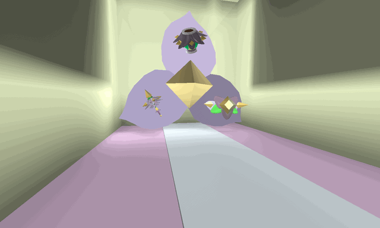

# Petal Shop

<aside class="portable-infobox pi-background pi-border-color pi-theme-wikia pi-layout-default" role="region">
<h2 class="pi-item pi-item-spacing pi-title pi-secondary-background" data-source="title1">Petal Shop</h2>
<figure class="pi-item pi-image pi-photo"></figure>

<h3 class="pi-data-label pi-secondary-font">Location</h3>

In the cave near the Windy Bee Gate, under the Wind Shrine.

</aside>

The **Petal Shop** is a [shop](shops.md) located past the [Windy Bee Gate](windy-bee-gate.md). Inside, the player can craft the [Petal Wand](petal-wand.md), the [Petal Belt](petal-belt.md) and the [Petal Planter](petal-planter.md). The All-Time Top White Collectors Leaderboard and Daily Top White Collectors Leaderboard can also be found here.

It is called the Petal Shop because of the giant petals draped across the back wall. In addition, each of its items require a [spirit petal](spirit-petal.md) to craft (except for the Petal Planter).

<table class="article-table">
<tbody><tr>
<th>Item
</th>
<th>Cost
</th>
<th>Description
</th></tr>
<tr>
<td><figure class="mw-halign-center"></figure>
<a href="petal-wand.html">Petal Wand</a>

</td>
<td>1.5B <a href="honey.html">Honey</a> 

1 <a href="spirit-petal.html">Spirit Petal</a> 
10 <a href="royal-jelly.html#Star_Jelly">Star Jellies</a> 
25 <a href="glitter.html">Glitter</a> 
75 <a href="enzymes.html">Enzymes</a>

</td>
<td>Collects 5 <a href="pollen.html">pollen</a> from 37 patches in 0.7s and boosts it by 100%. Every 3rd swing fires a Petal Shuriken that causes <a href="bees.html">bees</a> to instantly convert <a href="pollen.html">pollen</a>!
</td></tr>
<tr>
<td><figure class="mw-halign-center" typeof="mw:File"><figcaption></figcaption></figure>
<a href="petal-belt.html">Petal Belt</a>

</td>
<td>15B <a href="honey.html">Honey</a> 

25 <a href="royal-jelly.html#Star_Jelly">Star Jellies</a> 
50 <a href="glitter.html">Glitter</a> 
100 <a href="glue.html">Glues</a> 
1 <a href="spirit-petal.html">Spirit Petal</a>

</td>
<td>Drape these petals about your waist to harness unlimited flower power.
<ul><li>+250,000 <a href="system-page.html#Capacity_Multiplier">Capacity</a>.</li>
<li>+50% Capacity.</li>
<li>+100 <a href="system-page.html#Convert_Amount">Convert Amount</a>.</li>
<li>+100% <a href="loot-luck.html">Loot Luck</a>.</li>
<li>+75% <a href="system-page.html#Honey_From_Tokens">Honey From Tokens</a>.</li>
<li>+25% <a href="system-page.html#Buzz_Bomb_Pollen">Buzz Bomb Pollen</a>.</li>
<li>+1 <a href="system-page.html#Colorless_Attack">Colorless Bee Attack</a>.</li>
<li><a href="passive-abilities.html#Petal_Storm">+Passive: Petal Storm</a>.</li></ul>
</td></tr>
<tr>
<td><figure class="mw-halign-center"></figure>
<a href="petal-planter.html">Petal Planter</a>

</td>
<td>5T <a href="honey.html">Honey</a> 

100 <a href="magic-bean.html">Magic Beans</a> 
100 <a href="glitter.html">Glitter</a> 
250 <a href="soft-wax.html">Soft Waxes</a> 
50 <a href="swirled-wax.html">Swirled Waxes</a> 
25 <a href="super-smoothie.html">Super Smoothies</a>

</td>
<td>Alone, grows in about 14 hours. 

Stores around 100b Pollen. 
Grants bonus <a href="jelly-beans.html">Jelly Beans</a>, <a href="field-dice.html">Field Dice</a> and Glitter.

<ul><li>Grows up to 50% faster in <a href="fields.html">Fields</a> with White flowers.</li>
<li>Colorless <a href="bees.html">bees</a> are 50% more likely to sip <a href="nectar.html">Nectar</a> from this.</li>
<li>Grants 33% bonus White pollen on harvest.</li>
<li>Grants +50% Comforting and Satisfying Nectar</li></ul>
</td></tr></tbody></table>

## Music

When in the shop, the following audio plays:

## Trivia

* The wall behind the Petal Shop is semi-transparent and can be walked through. Behind it, there's a corridor which leads to a [star jelly](royal-jelly.md#Star_Jelly) token that can be seen in the [Blue Maze](mazes.md#Blue_Maze), from where the jellybeans token is found. The token awards one star jelly.
  * There used to be the Mysterious Figure in the place of the Star Jelly.
* Occasionally, rain from clouds in the [Pepper Patch](pepper-patch.md) may be visible in the Petal Shop.
  * The beam of a [sprout](sprout.md) can also be seen behind the semi-transparent wall.

<table class="mw-collapsible mw-collapsed NavTable">
<tbody><tr>
<th class="NavTitle" colspan="2">Locations
</th></tr>
<tr>
<th class="NavCategory"><a href="fields.html">Fields</a>
</th>
<td class="NavLinks NavLinksBasicOdd"><b><a href="sunflower-field.html">Sunflower Field</a> • <a href="dandelion-field.html">Dandelion Field</a> • <a href="mushroom-field.html">Mushroom Field</a> • <a href="blue-flower-field.html">Blue Flower Field</a> • <a href="clover-field.html">Clover Field</a> • <a href="spider-field.html">Spider Field</a> • <a href="bamboo-field.html">Bamboo Field</a> • <a href="strawberry-field.html">Strawberry Field</a> • <a href="pineapple-patch.html">Pineapple Patch</a> • <a href="stump-field.html">Stump Field</a> • <a href="cactus-field.html">Cactus Field</a> • <a href="pumpkin-patch.html">Pumpkin Patch</a> • <a href="pine-tree-forest.html">Pine Tree Forest</a> • <a href="rose-field.html">Rose Field</a> • <a href="ant-field.html">Ant Field</a> • <a href="hub-field.html">Hub Field</a> • <a href="mountain-top-field.html">Mountain Top Field</a> • <a href="coconut-field.html">Coconut Field</a> • <a href="pepper-patch.html">Pepper Patch</a></b>
</td></tr>
<tr>
<th class="NavCategory"><a href="shops.html">Shops</a>
</th>
<td class="NavLinks NavLinksBasicEven"><b><a href="basic-egg-shop.html">Basic Egg Shop</a> • <a href="boost-market.html">Boost Market</a> • <a href="treat-shop.html">Treat Shop</a> • <a href="gumdrop-shop.html">Gumdrop Shop</a> • <a href="royal-jelly-shop.html">Royal Jelly Shop</a> • <a href="ticket-shop.html">Ticket Shop</a> • <a href="noob-shop.html">Noob Shop</a> • <a href="pro-shop.html">Pro Shop</a> • <a href="magic-bean-shop.html">Magic Bean Shop</a> • <a href="badge-bearer-s-guild.html">Badge Bearer's Guild</a> • <a href="dapper-bear-s-shop.html">Dapper Bear's Shop</a> • <a href="stinger-shop.html">Stinger Shop</a> • <a href="mountain-top-shop.html">Mountain Top Shop</a> • <a href="blue-hq.html">Blue HQ</a> • <a href="red-hq.html">Red HQ</a> • <a href="hub-field-shop.html">Hub Field Shop</a> • <a href="robo-bear-s-shop.html">Robo Bear's Shop</a> • <strong class="mw-selflink selflink">Petal Shop</strong> • <a href="coconut-cave.html">Coconut Cave</a> • <a href="ticket-tent.html">Ticket Tent</a> • <a href="robux-shop.html">Robux Shop</a></b>
</td></tr>
<tr>
<th class="NavCategory">Gates
</th>
<td class="NavLinks NavLinksBasicOdd"><b><a href="basic-bee-gate.html">Basic Bee Gate</a> • <a href="brave-bee-gate.html">Brave Bee Gate</a> • <a href="honey-bee-gate.html">Honey Bee Gate</a> • <a href="ant-gate.html">Ant Gate</a> • <a href="lion-bee-gate.html">Lion Bee Gate</a> • <a href="bear-gate.html">Bear Gate</a> • <a href="windy-bee-gate.html">Windy Bee Gate</a></b>
</td></tr>
<tr>
<th class="NavCategory">Machines
</th>
<td class="NavLinks NavLinksBasicEven"><b><a href="honey-dispenser.html">Honey Dispenser</a> • <a href="royal-jelly-dispenser.html">Royal Jelly Dispenser</a> • <a href="treat-dispenser.html">Treat Dispenser</a> • <a href="instant-converter.html">Instant Converter</a> • <a href="wealth-clock.html">Wealth Clock</a> • <a href="moon-amulet-generator.html">Moon Amulet Generator</a> • <a href="memory-match.html">Memory Match</a> • <a href="blue-field-booster.html">Blue Field Booster</a> • <a href="red-field-booster.html">Red Field Booster</a> • <a href="field-booster.html">Field Booster</a> • <a href="blueberry-dispenser.html">Blueberry Dispenser</a> • <a href="strawberry-dispenser.html">Strawberry Dispenser</a> • <a href="blue-extract-dispenser.html">Blue Extract Dispenser</a> • <a href="red-extract-dispenser.html">Red Extract Dispenser</a> • <a href="honeystorm.html">Honeystorm</a> • <a href="special-sprout-summoner.html">Special Sprout Summoner</a> • <a href="free-ant-pass-dispenser.html">Free Ant Pass Dispenser</a> • <a href="ant-pass-dispenser.html">Ant Pass Dispenser</a> • <a href="glue-dispenser.html">Glue Dispenser</a> • <a href="blender.html">Blender</a> • <a href="coconut-dispenser.html">Coconut Dispenser</a> • <a href="mythic-meteor-shower.html">Mythic Meteor Shower</a> • <a href="free-robo-pass-dispenser.html">Free Robo Pass Dispenser</a> • <a href="robo-pass-dispenser.html">Robo Pass Dispenser</a> • <a href="sticker-stack.html">Sticker Stack</a> • <a href="sticker-printer.html">Sticker Printer</a> • <a href="nectar-condenser.html">Nectar Condenser</a></b>
</td></tr>
<tr>
<th class="NavCategory">Transportation
</th>
<td class="NavLinks NavLinksBasicOdd"><b><a href="slingshot.html">Slingshot</a> • <a href="yellow-cannon.html">Yellow Cannon</a> • <a href="blue-cannon.html">Blue Cannon</a> • <a href="red-cannon.html">Red Cannon</a> • <a href="blue-teleporter.html">Blue Teleporter</a> • <a href="red-teleporter.html">Red Teleporter</a></b>
</td></tr>
<tr>
<th class="NavCategory"><a href="leaderboards.html">Leaderboards</a>
</th>
<td class="NavLinks NavLinksBasicEven"><b><a href="daily-top-honeymakers.html">Daily Top Honeymakers</a> • <a href="all-time-top-honeymakers.html">All-Time Top Honeymakers</a> • <a href="all-time-top-battlers-most-battle-points.html">All-Time Top Battlers</a> • Top Ant Exterminators • Fastest Crab Slayers • Top Stick Bug Fighters • Top Bucko Bee Helpers • Top Riley Bee Helpers • <a href="most-commando-captures.html">Most Commando Captures</a> • Top Brown Bear Helpers • All-Time Top Red Collectors • All-Time Top Blue Collectors • All-Time Top White Collectors • Daily Top Red Collectors • Daily Top Blue Collectors • Daily Top White Collectors • Highest Damage to a Single Puffshroom • Tallest Sticker Stack • Highest Robo Bear Challenge Scores • <a href="highest-snowbear-level.html">Highest Snowbear Level</a> • <a href="highest-robo-party-cake-rank.html">Highest Robo Party Cake Rank</a></b>
</td></tr>
<tr>
<th class="NavCategory">Other Places
</th>
<td class="NavLinks NavLinksBasicOdd"><b><a href="hive.html">Hive</a> • <a href="obstacle-courses.html">Obstacle Courses</a> • King Beetle Lair • <a href="white-tunnel.html">White Tunnel</a> • <a href="werewolf-s-cave.html">Werewolf's Cave</a> • <a href="ant-challenge.html">Ant Challenge</a> • <a href="star-hall.html">Star Hall</a> • <a href="gummy-bear-s-lair.html">Gummy Bear's Lair</a> • <a href="ant-challenge-info.html">Ant Challenge Info</a> • <a href="vicious-bee-egg-claim.html">Vicious Bee Claimer</a> • <a href="gummy-bee-egg-claim.html">Gummy Bee Claimer</a> • <a href="wind-shrine.html">Wind Shrine</a> • <a href="mazes.html">Mazes</a> • <a href="hive-hub.html">Hive Hub</a> • <a href="sticker-seeker-quest-machine.html">Sticker-Seeker Quest Machine</a></b>
</td></tr>
<tr>
<th class="NavCategory">Event Locations
</th>
<td class="NavLinks NavLinksBasicEven"><b><a href="beesmas-tree.html">Beesmas Tree</a> • <a href="gift-boxes.html">Gift Boxes</a> • <a href="honey-wreath.html">Honey Wreath</a> • <a href="stockings.html">Stockings</a> • <a href="gingerbread-house.html">Gingerbread House</a> • <a href="snowbear-summoner.html">Snowbear Summoner</a> • <a href="beesmas-lights.html">Beesmas Lights</a> • <a href="samovar.html">Samovar</a> • <a href="beesmas-feast.html">Beesmas Feast</a> • <a href="onett-s-lid-art.html">Onett's Lid Art</a> • <a href="wind-shrine.html#Galentine_Shrine">Galentine Shrine</a> • <a href="memory-match.html#Winter_Memory_Match">Winter Memory Match</a> • <a href="snow-machine.html">Snow Machine</a> • <a href="honeyday-candles.html">Honeyday Candles</a> • <a href="robo-party-cake.html">Robo Party Cake</a> • <a href="gummy-beacon.html">Gummy Beacon</a> • <a href="naughty-list.html">Naughty List</a></b>
</td></tr></tbody></table>
