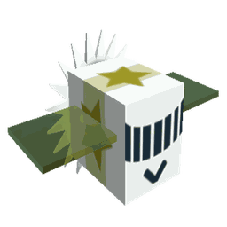

# Photon Bee

Photon Bee

<input type="radio" name="bee-infobox-tab" id="bee-tab-original" checked>
<label for="bee-tab-original">Original</label>
<input type="radio" name="bee-infobox-tab" id="bee-tab-gifted">
<label for="bee-tab-gifted">Gifted</label>

<i>"An entity made of pure light temporarily taking on the form of a bee."</i>

<b>Rarity</b>Event

<b>Color</b>Colorless

<b>Energy</b>∞

<b>Speed</b>21

<b>Attack</b>4

Color Scheme

<b>Skin</b><code>#e7ff2c</code><code>#f1f1f1</code><code>#e7ff2c</code>

**Photon Bee** is a Colorless [Event bee](bees-event.md) that hatches out of a [Photon Bee Egg](egg.md#Photon_Bee_Egg), which is available in the [Ticket Tent](ticket-tent.md) for 500 [Tickets](ticket.md).

Like all other Event bees, this bee does not have a favorite treat, the only way to make Photon Bee gifted is either with a [Star Treat](star-treat.md), [Gingerbread Bears](gingerbread-bear.md) or [Aged Gingerbread Bears](aged-gingerbread-bear.md).

Photon Bee likes the [Pineapple Patch](pineapple-patch.md) and the [Pumpkin Patch](pumpkin-patch.md). It dislikes the [Clover Field](clover-field.md).

## Stats

* Collects 20 [Pollen](pollen.md) in 2 seconds.
* Makes 240 [Honey](honey.md) in 2 seconds.
* +50% [Movespeed](stats.md#Speed), +50% gather and convert speed, +10 [Gather Amount](stats.md#Gather_Amount), +160 [Convert Amount](system-page.md#Convert_Amount), +20% [Instant Conversion](instant-conversion.md), +3 [Attack](stats.md#Attack). Doesn't require [Sleep](energy.md).
* 🌟 [Gifted Hive Bonus](gifted-bee.md): +5% [Instant Conversion](system-page.md#Instant_Conversion).

## Abilities

* **[Beamstorm](ability-tokens.md#Beamstorm)** Fires 25 (+2 per lvl) yellow (white if gifted) beams from the sky which collect and double ALL pollen from [Flowers](flowers.md) they hit. If Gifted, Beamstorm collects x1.5 more white pollen for a total of x3 white pollen and ALL pollen is instantly converted.
* **[Haste](ability-tokens.md#Haste)** Grants +10% [Player Movespeed](system-page.md#Movespeed) for 20 seconds. Stacks up to 10 times.

<table style="font-size:1.5vh; color:#000; width:100%; background:#fff; padding: 15px 0; border:none; color:#000; border-left:15px #000 solid">
<tbody><tr>
<td style="width:100%; text-align:center">

Photon Bee has a base pollen collection of <b>20 </b> in <b>2 seconds</b>. 

That's equivalent to 10  per second. 

(<b>40 </b> in <b>2 seconds</b> with x2 Bee Pollen gamepass)

</td></tr></tbody></table>

<table align="center" class="wikitable" style="text-align:center; width:80%;">
<tbody><tr>
<th colspan="5"> Pollen Collection
</th></tr>
<tr>
<td rowspan="2">Flower Tier
</td><td colspan="1" rowspan="2">Bee Pollen
</td><td colspan="2">with Critical Hit
</td></tr>
<tr>
<td>without Melody
</td><td>with Melody
</td></tr>
<tr>
<td>Single
</td><td>20
</td><td>40
</td><td>60
</td></tr>
<tr>
<td>Double
</td><td>40
</td><td>80
</td><td>120
</td></tr>
<tr>
<td>Triple
</td><td>60
</td><td>120
</td><td>180
</td></tr>
<tr>
<td>Large
</td><td>80
</td><td>160
</td><td>240
</td></tr>
<tr>
<td>Star
</td><td>100
</td><td>200
</td><td>300
</td></tr>
</tbody></table>

<table style="font-size:1.5vh; color:#000; width:100%; background:linear-gradient(to left, #FFB75E, #ED8F03); padding: 15px 0; border:none; color:#fff; border-left:15px #fff solid">
<tbody><tr>
<td style="width:100%; text-align:center">

Photon Bee can make <b>240 </b> in <b>2 seconds</b>!

That's equivalent to <b>120  per second</b>.

(<b>240  in 1 second</b> with x2 Honeymaking Speed)

</td></tr>
</tbody></table>

<table align="center" class="wikitable" style="text-align:center; width:75%">
<tbody><tr>
<th>Honey Collection with Science Enhancement
</th></tr>
<tr>
<td>
<h3>Levels 1-8</h3><table align="center" class="wikitable" style="text-align:center;">
<tbody><tr>
<th><i>Science Enhancement</i>
</th><th>Production Rate
</th><th>Number of Produced Honey
</th></tr>
<tr>
<td>1
</td><td>25%
</td><td>300
</td></tr>
<tr>
<td>2
</td><td>50%
</td><td>360
</td></tr>
<tr>
<td>3
</td><td>75%
</td><td>420
</td></tr>
<tr>
<td>4
</td><td>100%
</td><td>480
</td></tr>
<tr>
<td>5
</td><td>125%
</td><td>540
</td></tr>
<tr>
<td>6
</td><td>150%
</td><td>600
</td></tr>
<tr>
<td>7
</td><td>175%
</td><td>660
</td></tr>
<tr>
<td>8
</td><td>200%
</td><td>720
</td></tr>
</tbody></table><h3>Levels 9-16</h3><table align="center" class="wikitable" style="text-align:center;">
<tbody><tr>
<th><i>Science Enhancement</i>
</th><th>Production Rate
</th><th>Number of Produced Honey
</th></tr>
<tr>
<td>9
</td><td>225%
</td><td>780
</td></tr>
<tr>
<td>10
</td><td>250%
</td><td>840
</td></tr>
<tr>
<td>11
</td><td>275%
</td><td>900
</td></tr>
<tr>
<td>12
</td><td>300%
</td><td>960
</td></tr>
<tr>
<td>13
</td><td>325%
</td><td>1020
</td></tr>
<tr>
<td>14
</td><td>350%
</td><td>1080
</td></tr>
<tr>
<td>15
</td><td>375%
</td><td>1140
</td></tr>
<tr>
<td>16
</td><td>400%
</td><td>1200
</td></tr>
</tbody></table><h3>Levels 17-24</h3><table align="center" class="wikitable" style="text-align:center;">
<tbody><tr>
<th><i>Science Enhancement</i>
</th><th>Production Rate
</th><th>Number of Produced Honey
</th></tr>
<tr>
<td>17
</td><td>425%
</td><td>1260
</td></tr>
<tr>
<td>18
</td><td>450%
</td><td>1320
</td></tr>
<tr>
<td>19
</td><td>475%
</td><td>1380
</td></tr>
<tr>
<td>20
</td><td>500%
</td><td>1440
</td></tr>
<tr>
<td>21
</td><td>525%
</td><td>1500
</td></tr>
<tr>
<td>22
</td><td>550%
</td><td>1560
</td></tr>
<tr>
<td>23
</td><td>575%
</td><td>1620
</td></tr>
<tr>
<td>24
</td><td>600%
</td><td>1680
</td></tr>
</tbody></table><h3>Levels 25-31</h3><table align="center" class="wikitable" style="text-align:center;">
<tbody><tr>
<th><i>Science Enhancement</i>
</th><th>Production Rate
</th><th>Number of Produced Honey
</th></tr>
<tr>
<td>25
</td><td>625%
</td><td>1740
</td></tr>
<tr>
<td>26
</td><td>650%
</td><td>1800
</td></tr>
<tr>
<td>27
</td><td>675%
</td><td>1860
</td></tr>
<tr>
<td>28
</td><td>700%
</td><td>1920
</td></tr>
<tr>
<td>29
</td><td>725%
</td><td>1980
</td></tr>
<tr>
<td>30
</td><td>750%
</td><td>2040
</td></tr>
<tr>
<td>31
</td><td>775%
</td><td>2100
</td></tr>
</tbody></table>

</td></tr>
</tbody></table>

## Stickers

These are the stickers Photon Bee can find for you. Odds are from the game's code.

| | Sticker | How | Chance |
|---|---|---|---|
| { width=40 } | [Flying Photon Bee](sticker.md) | Gathering in a field it likes ([Pineapple Patch](pineapple-patch.md), [Pumpkin Patch](pumpkin-patch.md)) | 1 in 100,000 per flower gathered |

Like any bee, it can also find the stickers listed under [Bee sticker drops](sticker.md#bee-sticker-drops).

## Trivia

* Photon Bee's energy is set to 999,999,999,999,999.
* It was the first Event bee to be added in the Ticket Tent and the second Event bee added to the game, with [Bear Bee](bear-bee.md) being the first.
  * It was also the first Event bee that is purchased using tickets.
* This bee and the [Ninja Bee](ninja-bee.md) are tied as the fastest [Bees](bees.md) in the game, with a speed of 21.
* Photon and Exhausted Bee are the only bees that don't require sleep and have infinite energy. However, they still need to rest at the hive when you die.
* This bee, [Festive Bee](festive-bee.md) and [Vicious Bee](vicious-bee.md) are the only Event bees that have [Ability Tokens](ability-tokens.md) generated by non-Event bees.
* This bee, Ninja Bee, [Cobalt Bee](cobalt-bee.md), [Tadpole Bee](tadpole-bee.md), [Windy Bee](windy-bee.md), [Crimson Bee](crimson-bee.md), and [Precise Bee](precise-bee.md) are the only bees that create a trail behind them (not counting particle trails).
* This is the first event bee with a trail.
  * [Gummy Bee](gummy-bee.md) also creates a trail, but it can only be seen while the [Gummy Mask](gummy-mask.md) ability is active.
* This bee, Bear Bee, Festive Bee, Gummy Bee, [Tadpole Bee](tadpole-bee.md) and [Tabby Bee](tabby-bee.md) are the only bees to have a [Gifted Bonus](gifted-bee.md#List_of_Hive_Bonuses) that affects their signature ability.
  * If Photon Bee is gifted, its Beamstorm is white instead of yellow and instantly converts its collected pollen.
* The sun model on Photon Bee's rear has 20 spikes.
* Because Photon Bee has infinite energy, there is a glitch if a [Royal jelly](royal-jelly.md) is used on a Photon Bee, the transformed bee will have a ridiculous amount of energy.
  * This glitch is also shared when transforming an Exhausted Bee, since that has endless energy as well.
* All versions of the Ticket Tent have had this bee on top, except for the initial release.
* Although Photon Bee's energy is infinite, it is still possible to get an energy [mutation](mutation.md) on Photon Bee. However, the mutation will have no effect, similar to an attack mutation on a [Baby Bee](baby-bee.md).
* Photon Bee's Beamstorm ability is able to collect pollen from other fields. If the token was close enough to the other field, the range of the Beamstorm can possibly be able to reach it.

<table class="mw-collapsible mw-collapsed NavTable">
<tbody><tr>
<th class="NavTitle" colspan="2">Bees
</th></tr>
<tr>
<th class="NavCategory">Common &amp; Rare
</th>
<td class="NavLinks NavLinksRare"><b> <a href="basic-bee.html">Basic Bee</a> •  <a href="bomber-bee.html">Bomber Bee</a>  •  <a href="brave-bee.html">Brave Bee</a> •  <a href="bumble-bee.html">Bumble Bee</a> •  <a href="cool-bee.html">Cool Bee</a> •  <a href="hasty-bee.html">Hasty Bee</a> •  <a href="looker-bee.html">Looker Bee</a> •  <a href="rad-bee.html">Rad Bee</a> •  <a href="rascal-bee.html">Rascal Bee</a> •  <a href="stubborn-bee.html">Stubborn Bee</a></b>
</td></tr>
<tr>
<th class="NavCategory">Epic
</th>
<td class="NavLinks NavLinksEpic"><b> <a href="bubble-bee.html">Bubble Bee</a> •  <a href="bucko-bee.html">Bucko Bee</a> •  <a href="commander-bee.html">Commander Bee</a> •  <a href="demo-bee.html">Demo Bee</a> •  <a href="exhausted-bee.html">Exhausted Bee</a> •  <a href="fire-bee.html">Fire Bee</a> •  <a href="frosty-bee.html">Frosty Bee</a> •  <a href="honey-bee.html">Honey Bee</a> •  <a href="rage-bee.html">Rage Bee</a> •  <a href="riley-bee.html">Riley Bee</a> •  <a href="shocked-bee.html">Shocked Bee</a></b>
</td></tr>
<tr>
<th class="NavCategory">Legendary
</th>
<td class="NavLinks NavLinksLegend"><b> <a href="baby-bee.html">Baby Bee</a> •  <a href="carpenter-bee.html">Carpenter Bee</a> •  <a href="demon-bee.html">Demon Bee</a> •  <a href="diamond-bee.html">Diamond Bee</a> •  <a href="lion-bee.html">Lion Bee</a> •  <a href="music-bee.html">Music Bee</a> •  <a href="ninja-bee.html">Ninja Bee</a> •  <a href="shy-bee.html">Shy Bee</a></b>
</td></tr>
<tr>
<th class="NavCategory">Mythic
</th>
<td class="NavLinks NavLinksMythic"><b> <a href="buoyant-bee.html">Buoyant Bee</a> •  <a href="fuzzy-bee.html">Fuzzy Bee</a> •  <a href="precise-bee.html">Precise Bee</a> •  <a href="spicy-bee.html">Spicy Bee</a> •  <a href="tadpole-bee.html">Tadpole Bee</a> •  <a href="vector-bee.html">Vector Bee</a></b>
</td></tr>
<tr>
<th class="NavCategory">Event
</th>
<td class="NavLinks NavLinksEvent"><b> <a href="bear-bee.html">Bear Bee</a> •  <a href="cobalt-bee.html">Cobalt Bee</a> •  <a href="crimson-bee.html">Crimson Bee</a> •  <a href="digital-bee.html">Digital Bee</a> •  <a href="festive-bee.html">Festive Bee</a> •  <a href="gummy-bee.html">Gummy Bee</a> •  <strong class="mw-selflink selflink">Photon Bee</strong> •  <a href="puppy-bee.html">Puppy Bee</a> •  <a href="tabby-bee.html">Tabby Bee</a> •  <a href="vicious-bee.html">Vicious Bee</a> •  <a href="windy-bee.html">Windy Bee</a></b>
</td></tr></tbody></table>

## All bees

--8<-- "all-bees.md"
