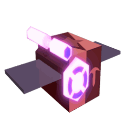

# Precise Bee

<table class="infobox templateBeeDefault templateBeeRedBackground">
<tbody><tr>
<td class="templateBeeTitle templateBeeMythicText" colspan="3"><b>Precise Bee</b>
</td></tr>
<tr>
<td class="templateBeeTabber" colspan="3">

<h3>Original</h3>

<h3>Gifted</h3>

</td></tr>
<tr>
<td class="templateBeeDesc" colspan="3"><i>"This sharpshooting bee is always on point and expects the same of you."</i>
</td></tr>
<tr>
<td class="templateBeeDefaultCell" colspan="3"><b>Rarity</b>   Mythic
</td></tr>
<tr>
<td class="templateBeeDefaultCell" colspan="3"><b>Color</b>   Red
</td></tr>
<tr>
<td class="templateBeeStatCell templateBeeGoodStat"><b>Energy</b>   40
</td>
<td class="templateBeeStatCell templateBeeBadStat"><b>Speed</b>   11.2
</td>
<td class="templateBeeStatCell templateBeeGoodStat"><b>Attack</b>   8
</td></tr>
<tr>
<td class="templateBeeHeader templateBeeMythicText" colspan="3">COLOR SCHEME
</td></tr>
<tr>
<td colspan="3"><table class="templateBeeDefaultStripeTable">
<tbody><tr>
<td>

 

 

 

 

Skin

#450302

#cb4144

#840909

</td></tr>
</tbody></table>
</td></tr></tbody></table>

**Precise Bee** is a Red [Mythic bee](bees-mythic.md).

Precise Bee's favorite [treat](treats.md) is [Sunflower Seeds](sunflower-seed.md).

Precise Bee likes the [Mountain Top Field](mountain-top-field.md) and [Rose Field](rose-field.md). It dislikes the [Bamboo Field](bamboo-field.md) and [Pine Tree Forest](pine-tree-forest.md).

## Stats

* Collects 20 [Pollen](pollen.md) in 4 seconds.
* Makes 80 [Honey](honey.md) in 4 seconds.
* +7 [Attack](stats.md#Attack), -20% Movespeed, +10 [Gather Amount](stats.md#Gather_Amount), +100% [Energy](energy.md), +5% [Critical Chance](critical-hits.md), +3% Super-Crit Chance.
* 🌟[Gifted Hive Bonus](gifted-bee.md): +3% Super-Crit Chance.

### Abilities

* **[[Target Practice]](ability-tokens.md#Target_Practice)** Causes the bee to fly into the air and project 3 targets on the field for a few seconds. Running on a target activates it.
  * When all 3 targets are activated, this collects all ability tokens and grants a stack of [Precision](buffs-debuffs.md#From_Ability_Tokens), which grants +2% Super-Crit Chance for 60s and stacks up to 10 times. Super-Crits can only occur for Critical hits and gain x2 power and 100% [Instant Conversion](instant-conversion.md).
  * After a few seconds, any target activated will generate a [Focus](ability-tokens.md#Focus) token and be shot, collecting pollen equal to double this bee's attack (+10% per [Level](bond.md)) from 29 [Flowers](flowers.md). With Flame Heat, the shots gain up to x4 Pollen and up to 50% instant conversion. Any unactivated target spawns a [Red Boost](ability-tokens.md#Boost) token instead.
  * If the player is shot while standing on a target, this collects all ability tokens and consumes your [Flame Heat](https://bee-swarm-simulator.fandom.com/wiki/Flame?so=search#Flame_Heat) to instantly convert Pollen in your bag, with half turning into Honey Tokens. The amount converted is equal to 50% of your Convert Total + 10x this bee's convert amount and scales up to x10 with the Flame Heat consumed and up to x3 with your current field's boost stacks.
  * If Gifted: When only the farthest target is activated, it will summon a Precise Mark which grants +7% [Critical Chance](system-page.md#Critical_Chance) and Super-Crit Chance and stacks up to 3 times.
  * If the player collects a Target Practice token that is outside the field, they will immediately be granted either the Precision or the Focus buff. The chances of getting Precision buff are 20%, and 80% for Focus buff.
* **[[Passive: Sniper]](passive-abilities.md#Sniper)** When fighting mobs, this bee uses slow, long ranged shots that are more accurate and deal x2 damage. The accuracy is calculated as if the bee was 1 level higher (2 if gifted), and it can never be below 5%. If the shot is a [Critical Hit](critical-hits.md), the reload time after shots is reduced by 50%. If it's a Super-Crit, it's reduced by 75%.

<table style="font-size:1.5vh; color:#000; width:100%; background:#fff; padding: 15px 0; border:none; color:#000; border-left:15px #af2136 solid">
<tbody><tr>
<td style="width:100%; text-align:center">

Precise Bee has a base pollen collection of <b>20 </b> in <b>4 seconds</b>. 

That's equivalent to 5  per second. 

(<b>40 </b> in <b>4 seconds</b> with x2 Bee Pollen gamepass)

</td></tr></tbody></table>

<table align="center" class="wikitable" style="text-align:center; width:80%;">
<tbody><tr>
<th colspan="5"> Pollen Collection
</th></tr>
<tr>
<td rowspan="2">Flower Tier
</td><td colspan="2">Bee Pollen
</td><td colspan="2">with Critical Hit
</td></tr>
<tr>
<td>Base Value
</td><td>Red Flower
</td><td>without Melody
</td><td>with Melody
</td></tr>
<tr>
<td>Single
</td><td>20
</td><td>30
</td><td>40
</td><td>60
</td></tr>
<tr>
<td>Double
</td><td>40
</td><td>60
</td><td>80
</td><td>120
</td></tr>
<tr>
<td>Triple
</td><td>60
</td><td>90
</td><td>120
</td><td>180
</td></tr>
<tr>
<td>Large
</td><td>80
</td><td>120
</td><td>160
</td><td>240
</td></tr>
<tr>
<td>Star
</td><td>100
</td><td>150
</td><td>200
</td><td>300
</td></tr>
</tbody></table>

<table align="center" class="wikitable" style="text-align:center; width:80%">
<tbody><tr>
<th colspan="3">Pollen Collection with Boost Tokens
</th></tr>
<tr>
<td>Boost Tokens ( or )
</td><td>Percentage Bonus
</td><td>Collected Pollen
</td></tr>
<tr>
<td>1
</td><td>15%
</td><td>23
</td></tr>
<tr>
<td>2
</td><td>30%
</td><td>26
</td></tr>
<tr>
<td>3
</td><td>45%
</td><td>29
</td></tr>
<tr>
<td>4
</td><td>60%
</td><td>32
</td></tr>
<tr>
<td>5
</td><td>75%
</td><td>35
</td></tr>
<tr>
<td>6
</td><td>90%
</td><td>38
</td></tr>
<tr>
<td>7
</td><td>105%
</td><td>41
</td></tr>
<tr>
<td>8
</td><td>120%
</td><td>44
</td></tr>
<tr>
<td>9
</td><td>135%
</td><td>47
</td></tr>
<tr>
<td>10
</td><td>150%
</td><td>50
</td></tr>
</tbody></table>

<table style="font-size:1.5vh; color:#000; width:100%; background:linear-gradient(to left, #FFB75E, #ED8F03); padding: 15px 0; border:none; color:#fff; border-left:15px #fff solid">
<tbody><tr>
<td style="width:100%; text-align:center">

Precise Bee can make <b>80 </b> in <b>4 seconds</b>!

That's equivalent to <b>20  per second</b>.

(<b>80  in 2 seconds</b> with x2 Honeymaking Speed)

</td></tr>
</tbody></table>

<table align="center" class="wikitable" style="text-align:center; width:75%">
<tbody><tr>
<th>Honey Collection with Science Enhancement
</th></tr>
<tr>
<td>
<h3>Levels 1-8</h3><table align="center" class="wikitable" style="text-align:center;">
<tbody><tr>
<th><i>Science Enhancement</i>
</th><th>Production Rate
</th><th>Number of Produced Honey
</th></tr>
<tr>
<td>1
</td><td>25%
</td><td>100
</td></tr>
<tr>
<td>2
</td><td>50%
</td><td>120
</td></tr>
<tr>
<td>3
</td><td>75%
</td><td>140
</td></tr>
<tr>
<td>4
</td><td>100%
</td><td>160
</td></tr>
<tr>
<td>5
</td><td>125%
</td><td>180
</td></tr>
<tr>
<td>6
</td><td>150%
</td><td>200
</td></tr>
<tr>
<td>7
</td><td>175%
</td><td>220
</td></tr>
<tr>
<td>8
</td><td>200%
</td><td>240
</td></tr>
</tbody></table><h3>Levels 9-16</h3><table align="center" class="wikitable" style="text-align:center;">
<tbody><tr>
<th><i>Science Enhancement</i>
</th><th>Production Rate
</th><th>Number of Produced Honey
</th></tr>
<tr>
<td>9
</td><td>225%
</td><td>260
</td></tr>
<tr>
<td>10
</td><td>250%
</td><td>280
</td></tr>
<tr>
<td>11
</td><td>275%
</td><td>300
</td></tr>
<tr>
<td>12
</td><td>300%
</td><td>320
</td></tr>
<tr>
<td>13
</td><td>325%
</td><td>340
</td></tr>
<tr>
<td>14
</td><td>350%
</td><td>360
</td></tr>
<tr>
<td>15
</td><td>375%
</td><td>380
</td></tr>
<tr>
<td>16
</td><td>400%
</td><td>400
</td></tr>
</tbody></table><h3>Levels 17-24</h3><table align="center" class="wikitable" style="text-align:center;">
<tbody><tr>
<th><i>Science Enhancement</i>
</th><th>Production Rate
</th><th>Number of Produced Honey
</th></tr>
<tr>
<td>17
</td><td>425%
</td><td>420
</td></tr>
<tr>
<td>18
</td><td>450%
</td><td>440
</td></tr>
<tr>
<td>19
</td><td>475%
</td><td>460
</td></tr>
<tr>
<td>20
</td><td>500%
</td><td>480
</td></tr>
<tr>
<td>21
</td><td>525%
</td><td>500
</td></tr>
<tr>
<td>22
</td><td>550%
</td><td>520
</td></tr>
<tr>
<td>23
</td><td>575%
</td><td>540
</td></tr>
<tr>
<td>24
</td><td>600%
</td><td>560
</td></tr>
</tbody></table><h3>Levels 25-31</h3><table align="center" class="wikitable" style="text-align:center;">
<tbody><tr>
<th><i>Science Enhancement</i>
</th><th>Production Rate
</th><th>Number of Produced Honey
</th></tr>
<tr>
<td>25
</td><td>625%
</td><td>580
</td></tr>
<tr>
<td>26
</td><td>650%
</td><td>600
</td></tr>
<tr>
<td>27
</td><td>675%
</td><td>620
</td></tr>
<tr>
<td>28
</td><td>700%
</td><td>640
</td></tr>
<tr>
<td>29
</td><td>725%
</td><td>660
</td></tr>
<tr>
<td>30
</td><td>750%
</td><td>680
</td></tr>
<tr>
<td>31
</td><td>775%
</td><td>700
</td></tr>
</tbody></table>

</td></tr>
</tbody></table>

<table align="center" class="wikitable" style="text-align:center; width:70%">
<tbody><tr>
<td colspan="3"> Egg and Jelly Probability 
</td></tr><tr>
<td>Item
</td><td>Base Probability
</td><td>Probability of getting a particular mythic bee.
</td></tr><tr>
<td style="text-align:left; padding:5px 0 5px 25px;"><a href="egg.html#Basic_Egg">Basic Egg</a>
</td><td>0%
</td><td>0%
</td></tr><tr>
<td style="text-align:left; padding:5px 0 5px 25px;"><a href="egg.html#Silver_Egg">Silver Egg</a>
</td><td>0.1%
</td><td>0.01667%
</td></tr><tr>
<td style="text-align:left; padding:5px 0 5px 25px;"><a href="egg.html#Gold_Egg">Gold Egg</a>
</td><td>1%
</td><td>0.16667%
</td></tr><tr>
<td style="text-align:left; padding:5px 0 5px 25px;"><a href="egg.html#Diamond_Egg">Diamond Egg</a>
</td><td>5%
</td><td>0.83333%
</td></tr><tr>
<td style="text-align:left; padding:5px 0 5px 25px;"><a href="egg.html#Mythic_Egg">Mythic Egg</a>
</td><td>100%
</td><td>16.66667%
</td></tr><tr>
<td style="text-align:left; padding:5px 0 5px 25px;"><a href="royal-jelly.html">Royal Jelly</a>
</td><td>0.004%
</td><td>0.00067%
</td></tr>
</tbody></table>

## Gallery

Precise Bee Face.png

Precise Bee's Face.

PreciseBeeFace2.PNG

Precise Bee's original face.

PreciseIcon.png

Precise Bee's icon.

Target Practice.png

Precise Bee's Target Practice ability.

Precise Bee Target Practice in action.png

Precise Bee's Target Practice in action.

NormalTarget.png

An unactivated Precise Target.

PurplePreciseTarget.png

A purple Precise Target, hitting only this target in a Target Practice summons a Precise Mark.

ActivatedPreciseTarget.png

An activated Precise Target.

PreciseBullet.png

The Bullet Precise Bee fires when the player reached a target in its Target Practice.

Precise Mark.png

A Precise Mark.

Beesmas 2021 Thumbnail.png

Precise Bee in the background with <a href="dapper-bear.html">Dapper Bear</a>, <a href="basic-bee.html">Basic Bee</a>, and <a href="buoyant-bee.html">Buoyant Bee</a>.

Precise Pack.png

Precise Bee's depiction in the Precise Pack.

GiftedPreciseSlot.png

A gifted Precise Bee slot.

Precise eye .png

A player getting a Precise Eye sticker from activating all 3 Target Practice targets on the Clover Field.

## Trivia

* Excluding Event bees, this bee, [Demon Bee](demon-bee.md) and [Fire Bee](fire-bee.md) are the only red bees currently in the game whose favorite treat is not strawberries.
  * This is the only red Mythic Bee who doesn't like strawberries.
* The Precise Bee is the only Mythic Bee that does not have a [gifted](gifted-bee.md) ability.
* Precise Bee's attack is based on a long-ranged weapon with a sharp scope, such as a sniper.
* This is the only bee that can attack [mobs](mobs.md) from outside the standard bee range, and likewise the only bee that shoots projectiles towards hostile mobs to deal damage.
* This bee's attack changes appearance when landing a Critical Hit or Super-Crit. It fires a bigger projectile when landing a Critical Hit, and fires a purple projectile when landing a Super-Crit. This makes Precise Bee the only bee to have a standard attack that changes depending on whether a Critical hit (Or Super-Crit) are rolled.
* This bee, [Buoyant Bee](buoyant-bee.md), and [Fuzzy Bee](fuzzy-bee.md) are the only mythic bees to be added since the release of the original three Mythic bees, which are [Vector Bee](vector-bee.md), [Tadpole Bee](tadpole-bee.md) and [Spicy Bee](spicy-bee.md).
  * Precise Bee and Buoyant Bee were both added in the [2021-12-26 update](updates.md#2021-12-26).
* This bee, Vector Bee, Spicy Bee and Buoyant Bee all have glowing parts when gifted.
  * This bee is the only bee that has a part of their body that glows even if it is not gifted.
* This, along with Tabby Bee, are the only bees that have an ability that grants Super-Critical chance.
* This bee is the only bee to always hit a level 26 mob (27 if gifted) when it is level 25. Its passive guarantees that it never misses against mobs one level higher (two if gifted.)
* Unlike Fuzz Bombs and Bubbles, players cannot activate each other's targets.
  * The Precise Bee target practice of other players is seen as gray to prevent confusion on which one is the player's.
  * If the "Hide Other Bees" option were activated, other player's targets will be invisible instead.
* This bee, [Cobalt Bee](cobalt-bee.md), [Crimson Bee](crimson-bee.md), [Photon Bee](photon-bee.md), [Windy Bee](windy-bee.md), [Tadpole Bee](tadpole-bee.md), and [Ninja Bee](ninja-bee.md) are the only bees that have a trail.
* There used to be a [glitch](glitches.md) with Gifted Precise Bee's Precise Mark, that even after the farthest target is activated, it was supposed to summon the mark, but it often wouldn't spawn.
  * Another glitch can occur where when a target is hit, it does not function which commonly occur due to server lag.
  * After giving [Gifted Riley Bee](gifted-riley-bee.md) a [Presents](present.md) during the Beesmas 2022 Event, [Gifted Riley Bee](gifted-riley-bee.md) explains how people would die for a Precise Mark, possibly referencing this specific bug.
* Precise Bee's attack can still be seen by other Players even if they have their Hide Other Bees option on.
* Factoring in the passive and the attack, this bee has the highest attack damage, only surpassed by [Gummy Bee](gummy-bee.md) when the Gummy Bear Morph ability is active.
* Although spawning Precise Marks is considered a mark ability, it is not affected by Mark Ability Pollen multipliers.
* Target Practice does not receive the 10% pollen buff per level.

<table class="mw-collapsible mw-collapsed NavTable">
<tbody><tr>
<th class="NavTitle" colspan="2">Bees
</th></tr>
<tr>
<th class="NavCategory">Common &amp; Rare
</th>
<td class="NavLinks NavLinksRare"><b> <a href="basic-bee.html">Basic Bee</a> •  <a href="bomber-bee.html">Bomber Bee</a>  •  <a href="brave-bee.html">Brave Bee</a> •  <a href="bumble-bee.html">Bumble Bee</a> •  <a href="cool-bee.html">Cool Bee</a> •  <a href="hasty-bee.html">Hasty Bee</a> •  <a href="looker-bee.html">Looker Bee</a> •  <a href="rad-bee.html">Rad Bee</a> •  <a href="rascal-bee.html">Rascal Bee</a> •  <a href="stubborn-bee.html">Stubborn Bee</a></b>
</td></tr>
<tr>
<th class="NavCategory">Epic
</th>
<td class="NavLinks NavLinksEpic"><b> <a href="bubble-bee.html">Bubble Bee</a> •  <a href="bucko-bee.html">Bucko Bee</a> •  <a href="commander-bee.html">Commander Bee</a> •  <a href="demo-bee.html">Demo Bee</a> •  <a href="exhausted-bee.html">Exhausted Bee</a> •  <a href="fire-bee.html">Fire Bee</a> •  <a href="frosty-bee.html">Frosty Bee</a> •  <a href="honey-bee.html">Honey Bee</a> •  <a href="rage-bee.html">Rage Bee</a> •  <a href="riley-bee.html">Riley Bee</a> •  <a href="shocked-bee.html">Shocked Bee</a></b>
</td></tr>
<tr>
<th class="NavCategory">Legendary
</th>
<td class="NavLinks NavLinksLegend"><b> <a href="baby-bee.html">Baby Bee</a> •  <a href="carpenter-bee.html">Carpenter Bee</a> •  <a href="demon-bee.html">Demon Bee</a> •  <a href="diamond-bee.html">Diamond Bee</a> •  <a href="lion-bee.html">Lion Bee</a> •  <a href="music-bee.html">Music Bee</a> •  <a href="ninja-bee.html">Ninja Bee</a> •  <a href="shy-bee.html">Shy Bee</a></b>
</td></tr>
<tr>
<th class="NavCategory">Mythic
</th>
<td class="NavLinks NavLinksMythic"><b> <a href="buoyant-bee.html">Buoyant Bee</a> •  <a href="fuzzy-bee.html">Fuzzy Bee</a> •  <strong class="mw-selflink selflink">Precise Bee</strong> •  <a href="spicy-bee.html">Spicy Bee</a> •  <a href="tadpole-bee.html">Tadpole Bee</a> •  <a href="vector-bee.html">Vector Bee</a></b>
</td></tr>
<tr>
<th class="NavCategory">Event
</th>
<td class="NavLinks NavLinksEvent"><b> <a href="bear-bee.html">Bear Bee</a> •  <a href="cobalt-bee.html">Cobalt Bee</a> •  <a href="crimson-bee.html">Crimson Bee</a> •  <a href="digital-bee.html">Digital Bee</a> •  <a href="festive-bee.html">Festive Bee</a> •  <a href="gummy-bee.html">Gummy Bee</a> •  <a href="photon-bee.html">Photon Bee</a> •  <a href="puppy-bee.html">Puppy Bee</a> •  <a href="tabby-bee.html">Tabby Bee</a> •  <a href="vicious-bee.html">Vicious Bee</a> •  <a href="windy-bee.html">Windy Bee</a></b>
</td></tr></tbody></table>

zh-tw:精準蜂
