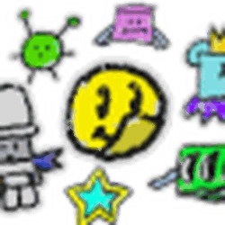

# Public Sticker Board

{ align=right width=150 }

The **Public Sticker Board** is located in the [Hive Hub](hive-hub.md), and allows players to add or take [stickers](sticker.md) from it. There is a 22-hour cooldown for taking a sticker from the board and a 10-minute cooldown for adding a sticker to the board. The [Sticker-Seeker Quest Machine](sticker-seeker-quest-machine.md) might occasionally require players to donate a sticker to the Public Sticker Board as well. It serves as a way of obtaining stickers or removing spare stickers.

Onett may decide to disable [trading](trading.md) for any number of reasons for a period of time. During this period, no player can request a trade or use the Public Sticker Board. For a list of times this has been observed, see the [Trading](trading.md#_Trading_trade_disabling) article.

## Trivia

* Play Button and Game Chat Icon stickers cannot typically be donated to the Public Sticker Board.
  * This restriction does not apply to people who can give out these stickers.
* During the Beesmas of Summer 2024, the [Fluorescent Gift Box](gift-boxes.md#2024_(Summer)) was located behind the Public Sticker Board.
