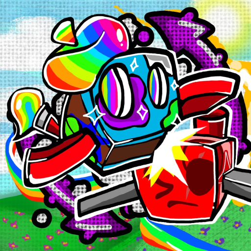
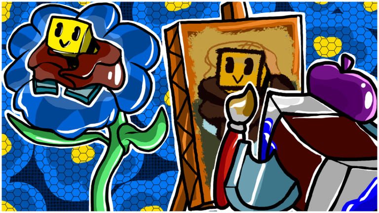

# Re://:Swarm

<figure class="thumb" style="width: 180px" typeof="mw:File/Thumb">  <figcaption class="thumbcaption"> 
The most used icon for Re://:Swarm.
 </figcaption> </figure>

<figure class="thumb" style="width: 180px" typeof="mw:File/Thumb">  <figcaption class="thumbcaption"> 
Re://:Swarm's logo.
 </figcaption> </figure>

**[Bee Swarm Simulator](https://www.roblox.com/games/1537690962/)** is an online multiplayer game made in **[Roblox](https://roblox.fandom.com/wiki/Roblox)** by **[Onett](onett-developer.md)**. The purpose of the game is to hatch [bees](bees.md) to make a swarm, collect [pollen](pollen.md), and make it into [honey](honey.md). The game was in development for about three months[1][2] until it was created on March 21, 2018, and was released to the public on March 23, 2018.

***Please note that this page does not need much expansion or information as this wiki is dedicated to the game. Please check out the other pages for more info.***

## Gameplay

The player starts off with the [Tutorial](tutorial.md), an optional 36-page slideshow which can be accessed again at any time from the “?” button on the top right corner of the screen. After that, they can claim any of the 6 unclaimed [hives](hive.md) by pressing 'E' or clicking on the large blue button on the top of the screen when you are near your hive. New players will automatically receive a [Basic Egg](egg.md#Basic_Egg), a [Pouch](pouch.md), and a [Scooper](scooper.md). The player can use their tool to collect pollen from any [Fields](fields.md) available. Their bag will store the pollen collected, and their bee(s) can convert the pollen into honey while the player is at their hive. The honey can be used to purchase new [tools](tools.md), Accessories, [Eggs](egg.md), and various other [Items](items.md) to progress further into the game.

The player can also receive [quests](quests.md) from NPCs, which mainly focus on collecting pollen and defeating [Mobs](mobs.md), but can also have other, more advanced objectives, like collecting [Ability tokens](ability-tokens.md) and [Goo](goo.md).

## Private Servers

Private servers cost 150 Robux per month. Owners of private servers have access to the following commands:

* "/kick PlayerName" - Kicks the given player. PlayerName must be their true Roblox username, the one that displays over their hive (not their Display Name).
* "/ban PlayerName" - Kicks the named player and automatically kicks them if they attempt to rejoin the server. This ban will remain until the server is closed or "/unban" is used.
* "/unban PlayerName" - Removes the named player from the ban list.

If a private server becomes inactive by not paying for it, banned players will be unbanned when the server becomes active again.

## Contributors

* [Onett](onett-developer.md) is the owner, main composer, builder, and sole programmer for the game.
* [IcedTeaLatte](https://www.roblox.com/users/540648336/profile) voiced the [Honeystorm](honeystorm.md) & [Mythic Meteor Shower](mythic-meteor-shower.md) voicelines, composed [StarHall](music.md), and helped with many of the sound effects in-game.[3][4]
* [Not\_Nert](https://www.roblox.com/users/87520897/profile) created all [planter](planter.md) models.[5]

## Game Milestones

<table border="1" cellpadding="1" cellspacing="2" class="article-table" style="width: 500px;">
<tbody><tr>
<th scope="col">Milestone
</th>
<th scope="col">Date Achieved
</th>
<th scope="col">Reward given
</th></tr>
<tr>
<td>4 Billion Visits
</td>
<td>2026-02-06
</td>
<td>Code: FOURtunate
</td></tr>
<tr>
<td>BSS Discord hit 1 million members
</td>
<td>2026-01-18
</td>
<td>Code: DiscordMillion
</td></tr>
<tr>
<td>3 Billion Visits
</td>
<td>2024-12-01
</td>
<td>Expired Code: ThreeBeeVee
</td></tr>
<tr>
<td><a href="bee-swarm-simulator-club.html">BSS Club</a> hit 15 million members
</td>
<td>2024-03-10
</td>
<td>Code: 15mMembers
</td></tr>
<tr>
<td>2 million likes
</td>
<td>2023-11-24
</td>
<td>Expired Code: 2MLikes
</td></tr>
<tr>
<td>2 billion visits
</td>
<td>2022-09-04
</td>
<td>Expired Code: 2Billion
</td></tr>
<tr>
<td>BSS Club hit 10 million members
</td>
<td>2021-11-28
</td>
<td>Expired Code: 10mMembers
</td></tr>
<tr>
<td>1 million likes
</td>
<td>2020-12-13
</td>
<td>Expired Code: 1MLikes
</td></tr>
<tr>
<td>1 billion visits
</td>
<td>2020-08-13
</td>
<td>Expired Code: BillionVisits
</td></tr>
<tr>
<td>BSS Club hit 5 million members
</td>
<td>2020-04-16
</td>
<td>Expired Code: 5MMembers
</td></tr>
<tr>
<td>BSS Club hit 4 million members
</td>
<td>2019-10-19
</td>
<td>Expired Code: 4MilMembers
</td></tr>
<tr>
<td>500 million visits
</td>
<td>2019-05-03
</td>
<td>Expired Code: 500mil
</td></tr>
<tr>
<td>Won Gameplay, Best Group, and Game of the Year
</td>
<td>2019-02-23
</td>
<td>Expired Code: BloxyCelebration
</td></tr>
<tr>
<td>Nominated in 4 Bloxy categories
</td>
<td>2018-11-17
</td>
<td>Expired Code: BloxyBoost
</td></tr>
<tr>
<td>2 million favorites
</td>
<td>2019-01-09
</td>
<td>Expired Code: 2MFavorites
</td></tr>
<tr>
<td>300 million visits
</td>
<td>2018-11-05
</td>
<td>Expired Code: 300MVisits
</td></tr>
<tr>
<td>1 million favorites
</td>
<td>2018-07-04
</td>
<td>Expired Code: 1Mfavorites
</td></tr>
<tr>
<td>BSS Club hit 1 million members
</td>
<td>2018-06-05
</td>
<td>Expired Code: MillionMembers
</td></tr>
<tr>
<td>100 million visits
</td>
<td>2018-06-04
</td>
<td>Expired Code: 100mvisits
</td></tr></tbody></table>

## Game Statistics

Re://:Swarm currently has 4.5B+ visits, 6.5M+ favorites, 3M+ likes, 139K dislikes and a 95% rating.

Re://:Swarm is the nineteenth game on Roblox to reach 1 billion visits.

Re://:Swarm is the third most visited simulator on Roblox.

## Thumbnails

BSSThumb1.png

BSSThumb2.png

(Removed)

BSSThumb3.png

(Removed)

BSSThumb4.png

BSSThumb42x.png

(Removed)

BSSThumb5.png

(Removed)

BSSThumb6.png

(Removed)

BSSThumb62x.png

(Removed)

BSSThumb7.png

(Current Thumbnail)

## Icons

BeeSwarmActualFirstIcon.png

Basic Bee OriginalIcon.png

Basic Bee FocusThumbnail.png

TabbyUpdateIcon.png

BSSGummyInvasionUpdate.png

CrimsonCobaltIcon.png

BSSMotherBearUpdate.png

NighttimeUpdateIcon.png

Basix updore.PNG

Beesmas2018.jpeg

2x event.PNG

BSSEggHunt2019Update.png

Windycover.png

Bssbeesmas2019cover.png

Beeswarmegghuntlogo.png

BeesmasThumbnail2020.png

Beesmas 2021 Thumbnail.png

BSSRoboBearUpdateThumb.png

(Current icon)

BSSRoboBearUpdate2xThumb.png

BSSClassicIcon.png

BSSStickerUpdateIcon.png

BSSStickerUpdate2xIcon.png

BSSGamesIcon.png

BSSWinterSpotlightIcon.png

BSSWinterSpotlight2xIcon.png

BSSBeesmas20252xEvent.png

BSSIconJan19.png

BSSHeMadeAStatementSoGoo-d.png

## References

1. ↑ [[1]](https://discord.com/channels/427553293862961153/427553293862961155/457220567825645590) Discord message from Onett in the Bee Swarm Simulator Discord server.
2. ↑ [[2]](https://roblox.fandom.com/wiki/User_blog:RBLXDeveloperInterviews/Onett:_Bee_Swarm_Simulator) Roblox Wiki Developer Connections Project interview with Onett.
3. ↑ [[3]](https://discord.com/channels/427553293862961153/427553293862961155/718991319086661772) Discord message from IcedTeaLatte.
4. ↑ [[4]](https://discord.com/channels/427553293862961153/427553293862961155/474440093369630730) Discord message from IcedTeaLatte.
5. ↑ [[5]](https://discord.com/channels/427553293862961153/676148494276362260/922664959027077130) Discord message from Onett.
