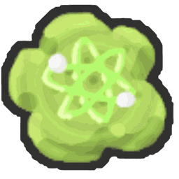
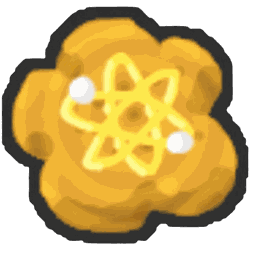
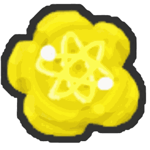

# Rebirths

{ align=right width=150 }

**Rebirths** are Re://:Swarm's main progression system. Rebirthing spends nothing but your current [honey](honey.md): it sets it back to 0 and in return gives you big permanent multipliers and a set of item rewards. There are **39 rebirths** in total.

## How to rebirth

* Use the **Rebirth** machine next to the Beequip Storage, near the [Royal Jelly Dispenser](royal-jelly-dispenser.md), the [Honey Dispenser](honey-dispenser.md) and the [Dandelion Field](dandelion-field.md). You can also click the Rebirth tile in your Boosts bar to open the Rebirth menu.
* You need to be holding that rebirth's honey requirement (see the table below).
* Every fifth rebirth also needs a **gate quest** finished. The quest is handed to you automatically when you reach the rebirth before it, so you don't have to find the NPC.
* Rebirths go in order, one at a time.

## What resets and what you keep

A rebirth **only resets your current honey to 0**. You keep everything else: pollen, bees and your [hive](hive.md), items, equipment, quests, [stickers](sticker.md), [badges](badges.md) and your totals.

After rebirthing, the game:

1. Raises your rebirth count and saves it to the **All-Time Rebirths** [leaderboard](leaderboards.md).
2. Gives that rebirth's item rewards. These ignore inventory caps.
3. Replaces your old rebirth buffs with the new rebirth's buffs. Buffs don't stack between rebirths: you always have the buffs of your current rebirth.
4. Starts the next gate quest, if there is one.

## Requirements and buffs

The buffs are what you have **while at** that rebirth. Bee Ability Rate goes up by +1.5% every 5 rebirths. Monster Respawn Time is shortened from Rebirth 14, and from Rebirth 30 your bees also get extra Bee Attack and Bee Ability Pollen.

Big numbers use the short scale: k (thousand), M (million), B (billion), T (trillion), Qa (quadrillion), Qi (quintillion), Sx (sextillion), Sp (septillion), Oc (octillion) and No (nonillion).

| Rebirth | Honey needed | Gate quest | Pollen / Capacity / Convert Rate | Loot | Ability Rate | Monster Respawn | Attack and Ability Pollen |
|---|---|---|---|---|---|---|---|
| 1 | 50k | – | x1.5 / x3 / x30 | – | +1.5% | – | – |
| 2 | 1M | – | x2.5 / x5 / x50 | – | +1.5% | – | – |
| 3 | 50M | – | x5 / x10 / x100 | – | +1.5% | – | – |
| 4 | 300M | – | x10 / x20 / x200 | – | +1.5% | – | – |
| 5 | 5B | [Royal Rebirth](#rebirth-5-royal-rebirth) | x20 / x40 / x400 | x2 | +3% | – | – |
| 6 | 100B | – | x50 / x100 / x1,000 | x2 | +3% | – | – |
| 7 | 2T | – | x100 / x200 / x2,000 | x2 | +3% | – | – |
| 8 | 50T | – | x150 / x300 / x3,000 | x2 | +3% | – | – |
| 9 | 1.5Qa | – | x250 / x500 / x5,000 | x2 | +3% | – | – |
| 10 | 40Qa | [It's Snack Time!](#rebirth-10-its-snack-time) | x500 / x1,000 / x10k | x3 | +4.5% | – | – |
| 11 | 300Qa | – | x1,000 / x2,000 / x20k | x3 | +4.5% | – | – |
| 12 | 1.5Qi | – | x2,500 / x5,000 / x50k | x4 | +4.5% | – | – |
| 13 | 12.5Qi | – | x5,000 / x10k / x100k | x5 | +4.5% | – | – |
| 14 | 62.5Qi | – | x10k / x20k / x200k | x5 | +4.5% | -12% | – |
| 15 | 300Qi | [A Nerdy Break](#rebirth-15-a-nerdy-break) | x25k / x50k / x500k | x10 | +6% | -15% | – |
| 16 | 1.5Sx | – | x50k / x100k / x1M | x12 | +6% | -18% | – |
| 17 | 7.5Sx | – | x100k / x200k / x2M | x15 | +6% | -21% | – |
| 18 | 40Sx | – | x250k / x500k / x5M | x20 | +6% | -24% | – |
| 19 | 200Sx | – | x500k / x1M / x10M | x25 | +6% | -27% | – |
| 20 | 1Sp | [Not a Time-Gate](#rebirth-20-not-a-time-gate) | x1M / x2M / x20M | x50 | +7.5% | -30% | – |
| 21 | 5Sp | – | x2.5M / x5M / x50M | x100 | +7.5% | -30% | – |
| 22 | 25Sp | – | x10M / x20M / x200M | x200 | +7.5% | -30% | – |
| 23 | 125Sp | – | x50M / x100M / x1B | x350 | +7.5% | -30% | – |
| 24 | 625Sp | – | x250M / x500M / x5B | x600 | +7.5% | -30% | – |
| 25 | 30Oc | [Windy Restart](#rebirth-25-windy-restart) | x1B / x2B / x20B | x1,000 | +9% | -30% | – |
| 26 | 150Oc | – | x5B / x10B / x100B | x2,000 | +9% | -30% | – |
| 27 | 750Oc | – | x25B / x50B / x500B | x4,000 | +9% | -30% | – |
| 28 | 3.75No | – | x100B / x200B / x2T | x8,000 | +9% | -30% | – |
| 29 | 5No | – | x500B / x1T / x10T | x15k | +9% | -30% | – |
| 30 | 100No | [Bubbling Beyond](#rebirth-30-bubbling-beyond) | x2.5T / x5T / x50T | x30k | +10.5% | -30% | x2 |
| 31 | 1 × 1036 | – | x12.5T / x25T / x250T | x45k | +10.5% | -30% | x2.5 |
| 32 | 5 × 1039 | – | x62.5T / x125T / x1.25Qa | x50k | +10.5% | -30% | x3 |
| 33 | 1 × 1044 | – | x312.5T / x625T / x6.25Qa | x50k | +10.5% | -30% | x4 |
| 34 | 5 × 1046 | – | x1.5625Qa / x3.125Qa / x31.25Qa | x50k | +10.5% | -30% | x5 |
| 35 | 1 × 1048 | [Premium Clientele](#rebirth-35-premium-clientele) | x7.8125Qa / x15.625Qa / x156.25Qa | x75k | +12% | -30% | x6 |
| 36 | 5 × 1049 | – | x15.625Qa / x31.25Qa / x312.5Qa | x90k | +12% | -30% | x6.2 |
| 37 | 6.25 × 1050 | – | x31.25Qa / x62.5Qa / x625Qa | x105k | +12% | -30% | x6.3 |
| 38 | 1.275 × 1051 | – | x62.5Qa / x125Qa / x1.25Qi | x120k | +12% | -30% | x6.4 |
| 39 | 5 × 1051 | – | x125Qa / x250Qa / x2.5Qi | x150k | +12% | -30% | x6.5 |

## Rewards

Each rebirth gives these items once, when you reach it.

| Rebirth | Rewards |
|---|---|
| 1 | { width=24 } 1 [Gold Egg](egg.md#gold-egg) |
| 2 | { width=24 } 1 [Diamond Egg](egg.md#diamond-egg) |
| 3 | { width=24 } 2 [Diamond Egg](egg.md#diamond-egg) { width=24 } 50 [Ticket](ticket.md) |
| 4 | { width=24 } 1 [Mythic Egg](egg.md#mythic-egg) { width=24 } 3 [Purple Potion](purple-potion.md) { width=24 } 1 [Box-O-Frogs](box-o-frogs.md) |
| 5 | { width=24 } 3 [Mythic Egg](egg.md#mythic-egg) { width=24 } 2 [Super Smoothie](super-smoothie.md) { width=24 } 200 [Ticket](ticket.md) |
| 6 | { width=24 } 1 [Bear Bee Egg](egg.md#bear-bee-egg) { width=24 } 1 [Festive Bean](festive-bean.md) |
| 7 | { width=24 } 1 [Comforting Vial](comforting-vial.md) { width=24 } 1 [Invigorating Vial](invigorating-vial.md) { width=24 } 1 [Motivating Vial](motivating-vial.md) { width=24 } 1 [Refreshing Vial](refreshing-vial.md) { width=24 } 1 [Satisfying Vial](satisfying-vial.md) |
| 8 | { width=24 } 10 [Super Smoothie](super-smoothie.md) { width=24 } 3 [Festive Bean](festive-bean.md) |
| 9 | { width=24 } 3 [Comforting Vial](comforting-vial.md) { width=24 } 3 [Invigorating Vial](invigorating-vial.md) { width=24 } 3 [Motivating Vial](motivating-vial.md) { width=24 } 3 [Refreshing Vial](refreshing-vial.md) { width=24 } 3 [Satisfying Vial](satisfying-vial.md) { width=24 } 1,000 [Ticket](ticket.md) |
| 10 | { width=24 } 5 [Night Bell](night-bell.md) { width=24 } 1 [Digital Bee Egg](egg.md#digital-bee-egg) { width=24 } 1 [Nectar Tester](nectar-tester.md) { width=24 } 1 [Debug Wax](debug-wax.md) Also unlocks the [Melittology](melittology.md) tree and its research quests. |
| 11 | { width=24 } 5 [Swift Atomic Treat](swift-atomic-treat.md) { width=24 } 1 [Nectar Tester](nectar-tester.md) |
| 12 | { width=24 } 1,000 [Ticket](ticket.md) { width=24 } 6 [Festive Bean](festive-bean.md) { width=24 } 200 [Stinger](stinger.md) |
| 13 | { width=24 } 1 [Pink Shades](pink-shades.md) { width=24 } 3 [Debug Wax](debug-wax.md) { width=24 } 1 [Basic Black Hive Skin](sticker.md#hive-skins) |
| 14 | { width=24 } 25 [Box-O-Frogs](box-o-frogs.md) { width=24 } 5 [Black Balloon](black-balloon.md) { width=24 } 5 [Red Balloon](red-balloon.md) { width=24 } 5 [White Balloon](white-balloon.md) { width=24 } 5 [Pink Balloon](pink-balloon.md) |
| 15 | { width=24 } 5 [Gifted Mythic Egg](egg.md#gifted-mythic-egg) { width=24 } 7 [Festive Bean](festive-bean.md) { width=24 } 1 [Turpentine](turpentine.md) |
| 16 | { width=24 } 10 [Gifted Mythic Egg](egg.md#gifted-mythic-egg) { width=24 } 10 [Festive Bean](festive-bean.md) { width=24 } 3 [Turpentine](turpentine.md) { width=24 } 25 [Super Smoothie](super-smoothie.md) |
| 17 | { width=24 } 5 [Gathering Atomic Treat](gathering-atomic-treat.md) { width=24 } 5 [Energized Atomic Treat](energized-atomic-treat.md) { width=24 } 5 [Critical Atomic Treat](critical-atomic-treat.md) { width=24 } 5 [Conversion Atomic Treat](conversion-atomic-treat.md) { width=24 } 5 [Swift Atomic Treat](swift-atomic-treat.md) { width=24 } 5 [Fierce Atomic Treat](fierce-atomic-treat.md) { width=24 } 5 [Ability Atomic Treat](ability-atomic-treat.md) { width=24 } 5 [IC Atomic Treat](ic-atomic-treat.md) { width=24 } 10 [Debug Wax](debug-wax.md) { width=24 } 5 [Nectar Tester](nectar-tester.md) |
| 18 | { width=24 } 25 [Gifted Mythic Egg](egg.md#gifted-mythic-egg) { width=24 } 15 [Festive Bean](festive-bean.md) { width=24 } 10 [Turpentine](turpentine.md) { width=24 } 50 [Super Smoothie](super-smoothie.md) |
| 19 | { width=24 } 10 [Gathering Atomic Treat](gathering-atomic-treat.md) { width=24 } 10 [Energized Atomic Treat](energized-atomic-treat.md) { width=24 } 10 [Critical Atomic Treat](critical-atomic-treat.md) { width=24 } 10 [Conversion Atomic Treat](conversion-atomic-treat.md) { width=24 } 10 [Swift Atomic Treat](swift-atomic-treat.md) { width=24 } 10 [Fierce Atomic Treat](fierce-atomic-treat.md) { width=24 } 10 [Ability Atomic Treat](ability-atomic-treat.md) { width=24 } 10 [IC Atomic Treat](ic-atomic-treat.md) { width=24 } 25 [Debug Wax](debug-wax.md) { width=24 } 10 [Nectar Tester](nectar-tester.md) { width=24 } 25 [Turpentine](turpentine.md) |
| 20 | { width=24 } 50 [Gifted Mythic Egg](egg.md#gifted-mythic-egg) { width=24 } 50 [Festive Bean](festive-bean.md) { width=24 } 50 [Turpentine](turpentine.md) { width=24 } 100 [Super Smoothie](super-smoothie.md) { width=24 } 25 [Gathering Atomic Treat](gathering-atomic-treat.md) { width=24 } 25 [Energized Atomic Treat](energized-atomic-treat.md) { width=24 } 25 [Critical Atomic Treat](critical-atomic-treat.md) { width=24 } 25 [Conversion Atomic Treat](conversion-atomic-treat.md) { width=24 } 25 [Swift Atomic Treat](swift-atomic-treat.md) { width=24 } 25 [Fierce Atomic Treat](fierce-atomic-treat.md) { width=24 } 25 [Ability Atomic Treat](ability-atomic-treat.md) { width=24 } 25 [IC Atomic Treat](ic-atomic-treat.md) { width=24 } 2 [Bear Bee Egg](egg.md#bear-bee-egg) |
| 21 | { width=24 } 100 [Purple Potion](purple-potion.md) { width=24 } 50 [Swirled Wax](swirled-wax.md) { width=24 } 25 [Caustic Wax](caustic-wax.md) { width=24 } 10 [Turpentine](turpentine.md) |
| 22 | { width=24 } 25 [Festive Planter](festive-planter.md) { width=24 } 25 [Ticket Planter](ticket-planter.md) { width=24 } 10 [Sticker Planter](sticker-planter.md) { width=24 } 10 [Nectar Shower Vial](nectar-shower-vial.md) { width=24 } 25 [Loaded Dice](loaded-dice.md) |
| 23 | { width=24 } 1 [Horn Ornament](toy-horn.md) { width=24 } 1 [Reindeer Antlers](reindeer-antlers.md) { width=24 } 1 [Festive Wreath](festive-wreath.md) { width=24 } 1 [Elf Cap](elf-cap.md) { width=24 } 50 [Hard Wax](hard-wax.md) { width=24 } 25 [Swirled Wax](swirled-wax.md) { width=24 } 10 [Caustic Wax](caustic-wax.md) |
| 24 | { width=24 } 10 [Digital Bee Egg](egg.md#digital-bee-egg) { width=24 } 10 [Bear Bee Egg](egg.md#bear-bee-egg) { width=24 } 10 [Windy Bee Egg](egg.md#windy-bee-egg) { width=24 } 10 [Vicious Bee Egg](egg.md#vicious-bee-egg) { width=24 } 25 [Star Egg](egg.md#star-egg) { width=24 } 100 [Star Treat](star-treat.md) |
| 25 | { width=24 } 10 [Windy Bee Egg](egg.md#windy-bee-egg) { width=24 } 100 [Cloud Vial](cloud-vial.md) { width=24 } 25 [Night Bell](night-bell.md) { width=24 } 25 [Festive Bean](festive-bean.md) { width=24 } 1 [Basic Red Hive Skin](sticker.md#hive-skins) { width=24 } 1 [Basic Blue Hive Skin](sticker.md#hive-skins) { width=24 } 1 [Basic Pink Hive Skin](sticker.md#hive-skins) { width=24 } 1 [Basic Green Hive Skin](sticker.md#hive-skins) { width=24 } 1 [Basic White Hive Skin](sticker.md#hive-skins) { width=24 } 1 [Basic Black Hive Skin](sticker.md#hive-skins) |
| 26 | { width=24 } 2,500 [Stinger](stinger.md) { width=24 } 250 [Box-O-Frogs](box-o-frogs.md) { width=24 } 100 [Night Bell](night-bell.md) { width=24 } 25 [Fierce Atomic Treat](fierce-atomic-treat.md) { width=24 } 25 [Critical Atomic Treat](critical-atomic-treat.md) { width=24 } 25 [Energized Atomic Treat](energized-atomic-treat.md) { width=24 } 25 [Festive Bean](festive-bean.md) |
| 27 | { width=24 } 100 [Comforting Vial](comforting-vial.md) { width=24 } 100 [Invigorating Vial](invigorating-vial.md) { width=24 } 100 [Motivating Vial](motivating-vial.md) { width=24 } 100 [Refreshing Vial](refreshing-vial.md) { width=24 } 100 [Satisfying Vial](satisfying-vial.md) { width=24 } 100 [Loaded Dice](loaded-dice.md) { width=24 } 50 [Nectar Shower Vial](nectar-shower-vial.md) { width=24 } 25 [Nectar Tester](nectar-tester.md) { width=24 } 50 [Festive Planter](festive-planter.md) { width=24 } 50 [Ticket Planter](ticket-planter.md) { width=24 } 25 [Sticker Planter](sticker-planter.md) { width=24 } 100 [Magic Bean](magic-bean.md) |
| 28 | { width=24 } 1 [Horn Ornament](toy-horn.md) { width=24 } 1 [Reindeer Antlers](reindeer-antlers.md) { width=24 } 1 [Festive Wreath](festive-wreath.md) { width=24 } 1 [Peppermint Antennas](peppermint-antennas.md) { width=24 } 1 [Snow Tiara](snow-tiara.md) { width=24 } 1 [Icicles](icicles.md) { width=24 } 1 [Paper Angel](paper-angel.md) { width=24 } 1 [Pinecone](pinecone.md) { width=24 } 250 [Hard Wax](hard-wax.md) { width=24 } 100 [Swirled Wax](swirled-wax.md) { width=24 } 50 [Caustic Wax](caustic-wax.md) { width=24 } 25 [Turpentine](turpentine.md) { width=24 } 50 [Debug Wax](debug-wax.md) |
| 29 | { width=24 } 25 [Digital Bee Egg](egg.md#digital-bee-egg) { width=24 } 25 [Bear Bee Egg](egg.md#bear-bee-egg) { width=24 } 25 [Windy Bee Egg](egg.md#windy-bee-egg) { width=24 } 25 [Vicious Bee Egg](egg.md#vicious-bee-egg) { width=24 } 100 [Gifted Mythic Egg](egg.md#gifted-mythic-egg) { width=24 } 100 [Star Egg](egg.md#star-egg) { width=24 } 250 [Star Treat](star-treat.md) { width=24 } 100 [Festive Bean](festive-bean.md) { width=24 } 1 [Wavy Yellow Hive Skin](sticker.md#hive-skins) { width=24 } 1 [Wavy Cyan Hive Skin](sticker.md#hive-skins) { width=24 } 1 [Wavy Purple Hive Skin](sticker.md#hive-skins) { width=24 } 1 [Wavy Festive Hive Skin](sticker.md#hive-skins) { width=24 } 1 [Wavy Doodle Hive Skin](sticker.md#hive-skins) |
| 30 | { width=24 } 100 [Gathering Atomic Treat](gathering-atomic-treat.md) { width=24 } 100 [Energized Atomic Treat](energized-atomic-treat.md) { width=24 } 100 [Critical Atomic Treat](critical-atomic-treat.md) { width=24 } 100 [Conversion Atomic Treat](conversion-atomic-treat.md) { width=24 } 100 [Swift Atomic Treat](swift-atomic-treat.md) { width=24 } 100 [Fierce Atomic Treat](fierce-atomic-treat.md) { width=24 } 100 [Ability Atomic Treat](ability-atomic-treat.md) { width=24 } 100 [IC Atomic Treat](ic-atomic-treat.md) { width=24 } 250 [Turpentine](turpentine.md) { width=24 } 100 [Debug Wax](debug-wax.md) { width=24 } 100 [Nectar Tester](nectar-tester.md) { width=24 } 1 [Black Cub Skin](sticker.md#cub-skins) { width=24 } 1 [Brown Cub Skin](sticker.md#cub-skins) { width=24 } 1 [Robo Cub Skin](sticker.md#cub-skins) { width=24 } 1 [Stick Cub Skin](sticker.md#cub-skins) { width=24 } 1 [Star Cub Skin](sticker.md#cub-skins) { width=24 } 1 [Noob Cub Skin](sticker.md#cub-skins) { width=24 } 1 [Bee Cub Skin](sticker.md#cub-skins) { width=24 } 1 [Gingerbread Cub Skin](sticker.md#cub-skins) { width=24 } 1 [Snow Cub Skin](sticker.md#cub-skins) { width=24 } 1 [Peppermint Robo Cub Skin](sticker.md#cub-skins) { width=24 } 1 [Doodle Cub Skin](sticker.md#cub-skins) { width=24 } 1 [Gloomy Cub Skin](sticker.md#cub-skins) { width=24 } 10,000 [Ticket](ticket.md) |
| 31 | { width=24 } 150 [Atomic Treat](atomic-treat.md) { width=24 } 350 [Turpentine](turpentine.md) { width=24 } 150 [Debug Wax](debug-wax.md) { width=24 } 150 [Nectar Tester](nectar-tester.md) { width=24 } 250 [Star Treat](star-treat.md) { width=24 } 25 [Gifted Mythic Egg](egg.md#gifted-mythic-egg) { width=24 } 100 [Festive Bean](festive-bean.md) { width=24 } 25 [Bloom Shaker](bloom-shaker.md) { width=24 } 10 [Box-O-Frogs](box-o-frogs.md) |
| 32 | { width=24 } 250 [Energized Atomic Treat](energized-atomic-treat.md) { width=24 } 250 [Gathering Atomic Treat](gathering-atomic-treat.md) { width=24 } 500 [Turpentine](turpentine.md) { width=24 } 250 [Debug Wax](debug-wax.md) { width=24 } 500 [Star Treat](star-treat.md) { width=24 } 50 [Gifted Mythic Egg](egg.md#gifted-mythic-egg) { width=24 } 50 [Star Egg](egg.md#star-egg) { width=24 } 150 [Festive Bean](festive-bean.md) { width=24 } 40 [Bloom Shaker](bloom-shaker.md) { width=24 } 15 [Box-O-Frogs](box-o-frogs.md) |
| 33 | { width=24 } 400 [Fierce Atomic Treat](fierce-atomic-treat.md) { width=24 } 400 [Ability Atomic Treat](ability-atomic-treat.md) { width=24 } 750 [Turpentine](turpentine.md) { width=24 } 400 [Debug Wax](debug-wax.md) { width=24 } 750 [Star Treat](star-treat.md) { width=24 } 100 [Gifted Mythic Egg](egg.md#gifted-mythic-egg) { width=24 } 100 [Star Egg](egg.md#star-egg) { width=24 } 250 [Festive Bean](festive-bean.md) { width=24 } 60 [Bloom Shaker](bloom-shaker.md) { width=24 } 20 [Box-O-Frogs](box-o-frogs.md) |
| 34 | { width=24 } 1 Crimbolt Bee Egg { width=24 } 750 [Critical Atomic Treat](critical-atomic-treat.md) { width=24 } 750 [Conversion Atomic Treat](conversion-atomic-treat.md) { width=24 } 1,000 [Turpentine](turpentine.md) { width=24 } 750 [Debug Wax](debug-wax.md) { width=24 } 1,000 [Star Treat](star-treat.md) { width=24 } 250 [Gifted Mythic Egg](egg.md#gifted-mythic-egg) { width=24 } 250 [Star Egg](egg.md#star-egg) { width=24 } 500 [Festive Bean](festive-bean.md) { width=24 } 100 [Bloom Shaker](bloom-shaker.md) { width=24 } 25 [Box-O-Frogs](box-o-frogs.md) |
| 35 | { width=24 } 1,000 [Critical Atomic Treat](critical-atomic-treat.md) { width=24 } 1,000 [Conversion Atomic Treat](conversion-atomic-treat.md) { width=24 } 1,000 [Fierce Atomic Treat](fierce-atomic-treat.md) { width=24 } 1,500 [Turpentine](turpentine.md) { width=24 } 1,000 [Debug Wax](debug-wax.md) { width=24 } 1,500 [Star Treat](star-treat.md) { width=24 } 400 [Gifted Mythic Egg](egg.md#gifted-mythic-egg) { width=24 } 400 [Star Egg](egg.md#star-egg) { width=24 } 750 [Festive Bean](festive-bean.md) { width=24 } 750 [Bloom Shaker](bloom-shaker.md) { width=24 } 150 [Box-O-Frogs](box-o-frogs.md) { width=24 } 1 [Painter Bee Egg](egg.md#painter-bee-egg) |
| 36 | { width=24 } 1,200 [Critical Atomic Treat](critical-atomic-treat.md) { width=24 } 1,200 [Conversion Atomic Treat](conversion-atomic-treat.md) { width=24 } 1,200 [Fierce Atomic Treat](fierce-atomic-treat.md) { width=24 } 1,750 [Turpentine](turpentine.md) { width=24 } 1,200 [Debug Wax](debug-wax.md) { width=24 } 1,750 [Star Treat](star-treat.md) { width=24 } 450 [Gifted Mythic Egg](egg.md#gifted-mythic-egg) { width=24 } 450 [Star Egg](egg.md#star-egg) { width=24 } 850 [Festive Bean](festive-bean.md) { width=24 } 850 [Bloom Shaker](bloom-shaker.md) { width=24 } 175 [Box-O-Frogs](box-o-frogs.md) |
| 37 | { width=24 } 1,400 [Critical Atomic Treat](critical-atomic-treat.md) { width=24 } 1,400 [Conversion Atomic Treat](conversion-atomic-treat.md) { width=24 } 1,400 [Fierce Atomic Treat](fierce-atomic-treat.md) { width=24 } 2,000 [Turpentine](turpentine.md) { width=24 } 1,400 [Debug Wax](debug-wax.md) { width=24 } 2,000 [Star Treat](star-treat.md) { width=24 } 500 [Gifted Mythic Egg](egg.md#gifted-mythic-egg) { width=24 } 500 [Star Egg](egg.md#star-egg) { width=24 } 950 [Festive Bean](festive-bean.md) { width=24 } 950 [Bloom Shaker](bloom-shaker.md) { width=24 } 200 [Box-O-Frogs](box-o-frogs.md) |
| 38 | { width=24 } 1,600 [Critical Atomic Treat](critical-atomic-treat.md) { width=24 } 1,600 [Conversion Atomic Treat](conversion-atomic-treat.md) { width=24 } 1,600 [Fierce Atomic Treat](fierce-atomic-treat.md) { width=24 } 2,250 [Turpentine](turpentine.md) { width=24 } 1,600 [Debug Wax](debug-wax.md) { width=24 } 2,250 [Star Treat](star-treat.md) { width=24 } 550 [Gifted Mythic Egg](egg.md#gifted-mythic-egg) { width=24 } 550 [Star Egg](egg.md#star-egg) { width=24 } 1,050 [Festive Bean](festive-bean.md) { width=24 } 1,050 [Bloom Shaker](bloom-shaker.md) { width=24 } 225 [Box-O-Frogs](box-o-frogs.md) |
| 39 | { width=24 } 1,800 [Critical Atomic Treat](critical-atomic-treat.md) { width=24 } 1,800 [Conversion Atomic Treat](conversion-atomic-treat.md) { width=24 } 1,800 [Fierce Atomic Treat](fierce-atomic-treat.md) { width=24 } 2,500 [Turpentine](turpentine.md) { width=24 } 1,800 [Debug Wax](debug-wax.md) { width=24 } 2,500 [Star Treat](star-treat.md) { width=24 } 600 [Gifted Mythic Egg](egg.md#gifted-mythic-egg) { width=24 } 600 [Star Egg](egg.md#star-egg) { width=24 } 1,200 [Festive Bean](festive-bean.md) { width=24 } 1,200 [Bloom Shaker](bloom-shaker.md) { width=24 } 250 [Box-O-Frogs](box-o-frogs.md) |

## Gate quests

Rebirths 5, 10, 15, 20, 25, 30 and 35 need a quest finished as well as the honey. You get each quest automatically at the rebirth before it. None of them give rewards of their own: the reward is being able to rebirth.

### Rebirth 5: Royal Rebirth

From [Black Bear](black-bear.md).

* Collect 500,000,000 red pollen.
* Collect 500,000,000 blue pollen.
* Collect 125,000,000 [goo](goo.md).
* Collect 10 [leaf](leaves.md) tokens.
* Defeat 1 [Spider](spider.md) and 5 [Ladybugs](ladybug.md).

### Rebirth 10: It's Snack Time!

From [Mother Bear](mother-bear.md).

* Collect pollen in each of the 17 [fields](fields.md).
* Collect [goo](goo.md).
* Feed 2T [treats](treat.md), plus 1,000 each of [Sunflower Seeds](sunflower-seed.md), [Strawberries](strawberry.md), [Blueberries](blueberry.md) and [Pineapples](pineapple.md) to your bees.
* Collect 2,000 [Sprout](sprout.md) tokens and 5 [leaf](leaves.md) tokens in the [Sunflower Field](sunflower-field.md).
* Have 5 bees at level 22.
* Defeat 2 [Werewolves](werewolf.md).

### Rebirth 15: A Nerdy Break

From [Science Bear](science-bear.md).

* Collect pollen in the [Coconut Field](coconut-field.md), [Pine Tree Forest](pine-tree-forest.md), [Pineapple Patch](pineapple-patch.md) and [Mountain Top Field](mountain-top-field.md).
* Defeat 7 [Spiders](spider.md), 3 [Werewolves](werewolf.md) and 1 [King Beetle](king-beetle.md).
* Find 5 hidden [stickers](sticker.md#hidden-stickers) around the map.
* Use the [Sticker Printer](sticker-printer.md) 5 times.
* Complete 500 honey conversion links.
* Collect 100 Honey Mark tokens and 100 [Mythic Meteor](mythic-meteor-shower.md) tokens.

### Rebirth 20: Not a Time-Gate

From [Onett](onett.md).

* Collect [goo](goo.md) in each of the 17 [fields](fields.md).
* Defeat 250 [Mechsquitos](mechsquito.md), 1 [Stump Snail](stump-snail.md), 2 [Tunnel Bears](tunnel-bear.md), 2 [King Beetles](king-beetle.md), 500 [Ants](ant.md) and 50 [Giant Ants](giant-ant.md).
* Complete 5 quests.
* Find 4 hidden [stickers](sticker.md#hidden-stickers) around the map.
* Use toys (five tasks, 2 to 5 uses each).

### Rebirth 25: Windy Restart

From [Spirit Bear](spirit-bear.md).

* Defeat 2 [Coconut Crabs](coconut-crab.md), 3 [Aphids](aphid.md), 30 [Ladybugs](ladybug.md), 10 [Spiders](spider.md) and 20 [Snowbears](snowbear.md).
* Collect 500 [Stick Nymph](stick-nymph.md) tokens, 100 [leaf](leaves.md) tokens, 300 [Windy Bee](windy-bee.md) tokens, 1,000 [Mythic Meteor](mythic-meteor-shower.md) tokens and 10,000 [Sprout](sprout.md) tokens.
* Get blown away by the [Wild Windy Bee](wild-windy-bee.md) 10 times.
* Collect pollen in the [Coconut Field](coconut-field.md), [Pepper Patch](pepper-patch.md) and [Stump Field](stump-field.md), and collect [goo](goo.md).
* Complete a [Robo Bear Challenge](robo-bear-challenge.md) round.
* Match 50 pairs in [Memory Match](memory-match.md).

### Rebirth 30: Bubbling Beyond

From [Bubble Bee Man](bubble-bee-man.md).

* Collect pollen and [goo](goo.md) in each of the 17 [fields](fields.md).
* Defeat 250 [Rhino Beetles](rhino-beetle.md), 250 [Ladybugs](ladybug.md), 25 [Vicious Bees](vicious-bee.md), 30 [Snowbears](snowbear.md), 10 [Werewolves](werewolf.md) and 2 [Stump Snails](stump-snail.md).
* Collect 676 stacks of Coconut Combo.
* Use 5,000 [Stingers](stinger.md) and 10 [Turpentine](turpentine.md).
* Find 25 hidden [stickers](sticker.md#hidden-stickers) around the map.
* Pop 200,000 [bubbles](bubble.md).
* Destroy 10 [beequips](beequip.md) with [Caustic Wax](caustic-wax.md).
* Collect 1,000 [Mythic Meteor](mythic-meteor-shower.md) tokens, 100 [leaf](leaves.md) tokens and 200,000 ability tokens.
* Catch 50,000 [Bloom](bloom.md) petals of any colour.
* Complete 10 quests.
* Donate 1,000,000,000 [Royal Jelly](royal-jelly.md) to the [Wind Shrine](wind-shrine.md).

### Rebirth 35: Premium Clientele

From [Dapper Bear](dapper-bear.md).

* Collect 604,800 of [nectar](nectar.md) five times (five tasks).
* Use 500 [Glitter](glitter.md).
* Equip 25 [beequips](beequip.md) and discard 100.
* Defeat 2,500 [Puffshrooms](puffshroom.md), plus 10 Mythic Puffshrooms in each of the 17 [fields](fields.md).
* Deal 100,000,000,000 damage to a single Puffshroom.
* Have 90 bees at level 50.
* Collect [goo](goo.md) in each of the 17 [fields](fields.md).
* Collect 3,000 [Mythic Meteor](mythic-meteor-shower.md) tokens and 2,500 [planter](planter.md) tokens.
* Complete a [Robo Bear Challenge](robo-bear-challenge.md) round.
* Defeat 75 [Snowbears](snowbear.md).

## Other rebirth unlocks

| Rebirth | Unlock |
|---|---|
| 10 | [Honeycomb Blueprint](honeycomb-blueprint.md) Level Up tool |
| 10 | The [Melittology](melittology.md) tree and the Melittology Research quests |
| 10 | Code `bssrb10`, which offers a free UGC item |
| 15 | [Honeycomb Blueprint](honeycomb-blueprint.md) Mutate tool |
| 20 | [Honeycomb Blueprint](honeycomb-blueprint.md) Royal Jelly tool |
| 35 | Anyone at Rebirth 35 or higher who missed the Rebirth 35 [Painter Bee](painter-bee.md) Egg gets it automatically |

## See also

* [Honey](honey.md)
* [Melittology](melittology.md)
* [Atomic Treat](atomic-treat.md)
* [Leaderboards](leaderboards.md)
