# Red Clay Planter

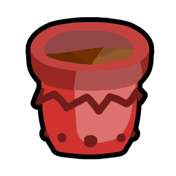{ align=right width=150 }

This piece of content contains information obtained through datamining.

Due to the nature of the information, details may be inaccurate or outdated.

Datamined information:

* Some of the planter's stats are corrected from the in-game description.
* The probability of the planter spawning a puffshroom, and the probability of that puffshroom being a certain rarity.
* How the planter generates its loot. — December 19th, 2024

This content contains assumptions.

Though the precise details may be inaccurate, most information comes from great testing and supported assumptions.

Assumptions made: How the planter generates its loot is unclear with only the datamined information. Some information has been verified (the number of tokens it spawns and the guaranteed items), but the rest are assumptions.

Red Clay Planter

*"Alone, grows in about 6 hours. Stores around 3 million Pollen. Grants bonus Red Extract and Waxes*"

REUSABLE?

Yes

COST

10,000,000 [Honey](honey.md), 5 [Magic Beans](magic-bean.md), 15 [Red Extract](red-extract.md), 20 [Soft Waxes](soft-wax.md).

GROW TIME

~6 hours

GROW TIME BONUS

+25% in fields with red flowers.

POLLEN CAPACITY

3,000,000 Pollen

POLLEN MULTIPLIER

+50% Red Pollen  

-50% Blue Pollen

NECTAR MULTIPLIER

+20% Invigorating  

+20% Satisfying

BONUS ITEMS

Red Extract

[Waxes](waxes.md)

The **Red Clay Planter** is a reusable [planter](planter.md) added in the 2021-12-26 update. Alone, it grows in about 6 hours and stores 3 million [pollen](pollen.md). It grants bonus [Red Extracts](red-extract.md) and [waxes](waxes.md). It can be purchased in the [Red HQ](red-hq.md).

<table class="article-table">
<tbody><tr>
<th>Crafting Ingredients
</th></tr>
<tr>
<td>10,000,000 <a href="honey.html">Honey</a> 

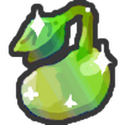5 <a href="magic-bean.html">Magic Beans</a> 
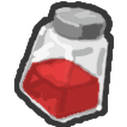15 <a href="red-extract.html">Red Extracts</a> 
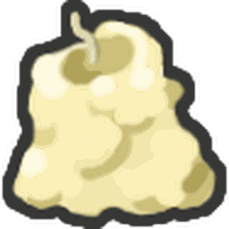20 <a href="soft-wax.html">Soft Waxes</a>

</td></tr></tbody></table>

The planter grows 25% faster in fields with red flowers and gives 50% bonus red pollen from harvests, but also 50% less blue pollen. Red bees are 25% more likely to sip [nectar](nectar.md) from it, but Blue bees avoid sipping nectar from it. It also grants 20% more Invigorating and Satisfying Nectar.

Harvesting a fully grown Red Clay Planter has a 1/6 chance to spawn a [Puffshroom](puffshroom.md). The spawned puffshroom is between levels 4–5, and has a:

* ~76.28% chance of being a Common Puffshroom,
* ~19.07% chance of being a Rare Puffshroom,
* ~4.58% chance of being an Epic Puffshroom,
* ~0.08% chance of being a Legendary Puffshroom.

## Drops

When claimed, the planter gives up to 16 tokens worth of items. If the planter was fully grown when claimed, 3 of the tokens are guaranteed to be 1 [Red Extract](red-extract.md), 2 [Soft Waxes](soft-wax.md) and 1 [Ticket](ticket.md). The others are picked randomly from the following, non-exhaustive list (note that the list does not include rewards based on the [field](fields.md) the planter is in):

### Bonus

<table class="article-table">
<tbody><tr>
<td><a href="red-extract.html">Red Extracts</a> 

<a href="soft-wax.html">Soft Waxes</a> 
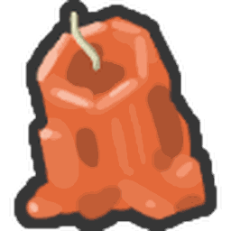<a href="hard-wax.html">Hard Waxes</a> 
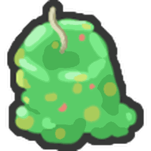<a href="caustic-wax.html">Caustic Wax</a> (Very Rare) 
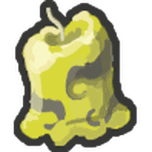<a href="swirled-wax.html">Swirled Wax</a> (Very Rare)

</td></tr></tbody></table>

### Other

<table class="article-table">
<tbody><tr>
<td>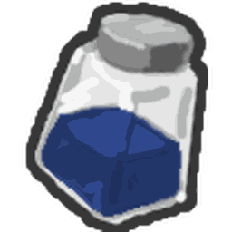<a href="blue-extract.html">Blue Extracts</a> 

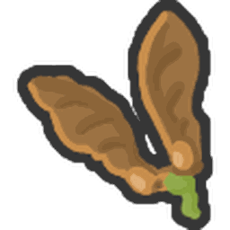<a href="whirligig.html">Whirligigs</a> 
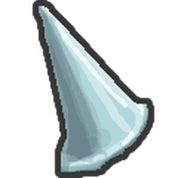<a href="stinger.html">Stingers</a> 
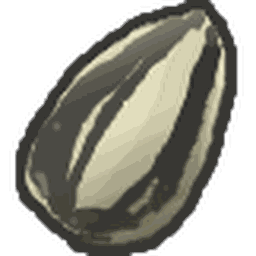<a href="sunflower-seed.html">Sunflower Seeds</a> 
<a href="strawberry.html">Strawberries</a> 
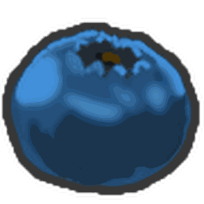<a href="blueberry.html">Blueberries</a> 
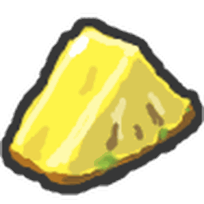<a href="pineapple.html">Pineapples</a> 
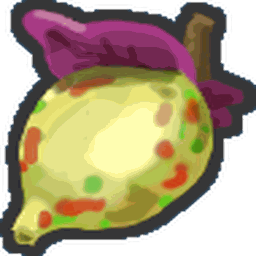<a href="bitterberry.html">Bitterberries</a> 
<a href="coconut.html">Coconuts</a> 
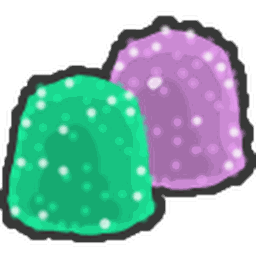<a href="gumdrops.html">Gumdrops</a> 
<a href="honeysuckle.html">Honeysuckles</a> 
<a href="treat.html">Treats</a> 
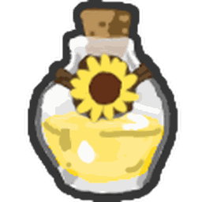<a href="oil.html">Oils</a> 
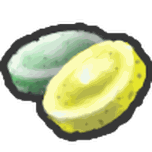<a href="enzymes.html">Enzymes</a> 
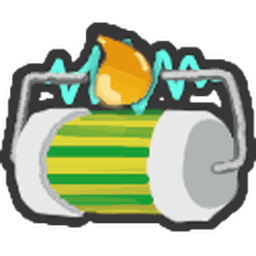<a href="micro-converter.html">Micro-Converters</a> 
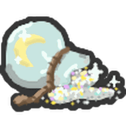<a href="glitter.html">Glitter</a> 
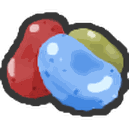<a href="jelly-beans.html">Jelly Beans</a> 
<a href="field-dice.html">Field Dice</a> 
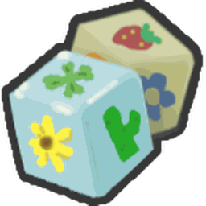<a href="smooth-dice.html">Smooth Dice</a> 
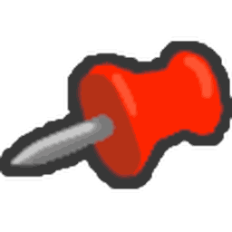<a href="thumbtack.html">Thumbtack</a> (Very Rare) 
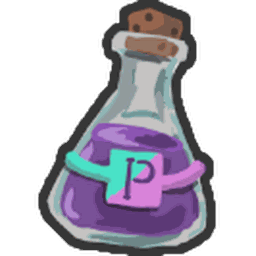<a href="purple-potion.html">Purple Potion</a> (Very Rare) 
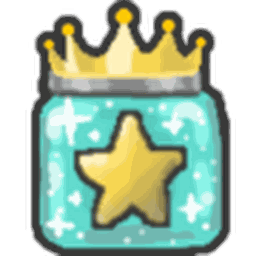<a href="royal-jelly.html#Star_Jelly">Star Jelly</a> (Very Rare) 
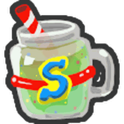<a href="super-smoothie.html">Super Smoothie</a> (Extremely Rare) 
<a href="egg.html#Gold_Egg">Gold Egg</a> (Extremely Rare) 
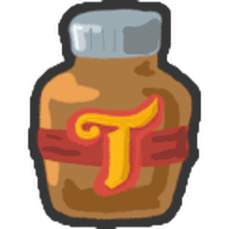<a href="turpentine.html">Turpentine</a> (Exceptionally Rare) 
<a href="sticker.html#Sticker_Index">Red Doodle Person Sticker</a> (Exceptionally Rare)

</td></tr></tbody></table>

### Special

<table class="article-table">
<tbody><tr>
<td>10 <a href="stinger.html">Stingers</a> (Requires to be harvested from <a href="clover-field.html">Clover Field</a>, <a href="spider-field.html">Spider Field</a> and <a href="cactus-field.html">Cactus Field</a> in stated order, 2 weeks cooldown) 

10 <a href="soft-wax.html">Soft Waxes</a> (Rare) 
1 <a href="swirled-wax.html">Swirled Wax</a> (When harvested from <a href="sunflower-field.html">Sunflower Field</a>, 1 month cooldown) 
1 <a href="swirled-wax.html">Swirled Wax</a> (When harvested from <a href="pine-tree-forest.html">Pine Tree Forest</a>, 1 week cooldown) 
1 <a href="caustic-wax.html">Caustic Wax</a> (When harvested from <a href="clover-field.html">Clover Field</a>, 1 month cooldown) 

</td></tr></tbody></table>

## Trivia

* Its blue counterpart is the [Blue Clay Planter](blue-clay-planter.md).
* This is one of the five reusable planters to reside outside of [Dapper Bear's Shop](dapper-bear-s-shop.md), the others being the Blue Clay Planter, [Petal Planter](petal-planter.md), [Hydroponic Planter](hydroponic-planter.md), and [Heat-Treated Planter](heat-treated-planter.md).
  * This and the Heat-Treated Planter are the only planters to be sold from the Red HQ.
* At some point the description in the inventory used to state that it grows in 4 hours, but it would actually grow in 6 hours ever since it was added.

<table class="mw-collapsible autocollapse" style="margin:auto; background:#000; font-size: 10pt; border:5px solid #56CB5A; width: 100%; border-radius: 20px; -moz-border-radius: 20px; -webkit-border-radius: 20px; -khtml-border-radius: 20px; -icab-border-radius: 20px; -o-border-radius: 20px;">
<tbody><tr>
<th colspan="2" style="padding-bottom: 1px; background:#FFEB7C; color:#000; border-radius: 15px; -moz-border-radius: 15px; -webkit-border-radius: 15px; -khtml-border-radius: 15px; -icab-border-radius: 15px; -o-border-radius: 15px; padding: 2px 15px;">Items
</th></tr>
<tr>
<td colspan="2">

<table class="mw-collapsible mw-collapsed NavTable">
<tbody><tr>
<th class="NavTitle" colspan="3">Inventory
</th></tr>
<tr>
<th class="NavCategory">Sub-Inventories
</th>
<td class="NavLinks NavLinksBasicOdd" colspan="2"><b> <a href="sticker.html">Sticker</a> •  <a href="beequip.html">Beequip Case</a></b>
</td></tr>
<tr>
<th class="NavCategory" rowspan="8">Regular
</th>
<td class="NavLinks NavLinksBasicEven" colspan="2"><b> <a href="sprinklers.html">Sprinkler Builder</a> •  <a href="gumdrops.html">Gumdrops</a> •  <a href="coconut.html">Coconut</a> •  <a href="stinger.html">Stinger</a> •  <a href="micro-converter.html">Micro-Converter</a> •  <a href="honeysuckle.html">Honeysuckle</a> •  <a href="whirligig.html">Whirligig</a> •  <a href="jelly-beans.html">Jelly Beans</a> •  <a href="magic-bean.html">Magic Bean</a> • 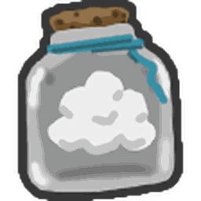 <a href="cloud-vial.html">Cloud Vial</a> • 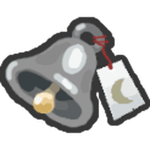 <a href="night-bell.html">Night Bell</a> •  <a href="ant-pass.html">Ant Pass</a> •  <a href="robo-pass.html">Robo Pass</a> • 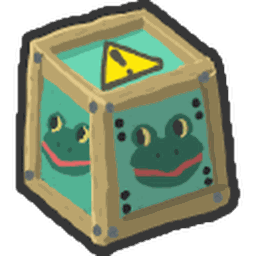 <a href="box-o-frogs.html">Box-O-Frogs</a> •   <a href="turpentine.html">Turpentine</a> •  <a href="egg.html">Eggs</a> •  <a href="royal-jelly.html">Royal Jelly</a> •  <a href="royal-jelly.html#Star_Jelly">Star Jelly</a></b> •  <a href="bloom-shaker.html">Bloom Shaker</a><b></b>
</td></tr>
<tr>
<th class="NavCategory">Crafting Materials
</th>
<td class="NavLinks NavLinksBasicOdd"><b> <a href="red-extract.html">Red Extract</a> •  <a href="blue-extract.html">Blue Extract</a> •  <a href="glitter.html">Glitter</a> • 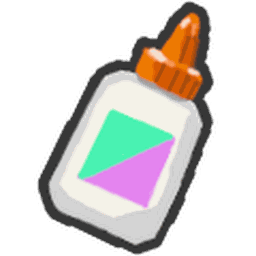 <a href="glue.html">Glue</a> •  <a href="oil.html">Oil</a> •  <a href="enzymes.html">Enzymes</a> • 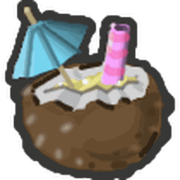 <a href="tropical-drink.html">Tropical Drink</a> •  <a href="purple-potion.html">Purple Potion</a> •  <a href="super-smoothie.html">Super Smoothie</a></b>
</td></tr>
<tr>
<th class="NavCategory">Dice
</th>
<td class="NavLinks NavLinksBasicEven"><b> <a href="field-dice.html">Field Dice</a> •  <a href="smooth-dice.html">Smooth Dice</a> • 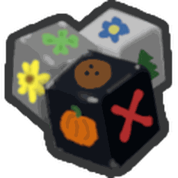 <a href="loaded-dice.html">Loaded Dice</a></b>
</td></tr>
<tr>
<th class="NavCategory">Treats
</th>
<td class="NavLinks NavLinksBasicOdd"><b> <a href="treat.html">Treat</a> • 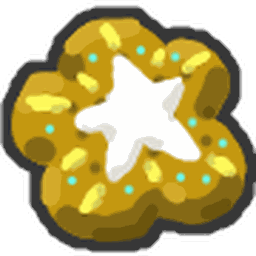 <a href="star-treat.html">Star Treat</a> •  <a href="atomic-treat.html">Atomic Treat</a> •  <a href="sunflower-seed.html">Sunflower Seed</a> •  <a href="strawberry.html">Strawberry</a> •  <a href="pineapple.html">Pineapple</a> •  <a href="blueberry.html">Blueberry</a> •  <a href="bitterberry.html">Bitterberry</a> • 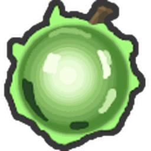 <a href="neonberry.html">Neonberry</a> •  <a href="moon-charm.html">Moon Charm</a></b>
</td></tr>
<tr>
<th class="NavCategory">Drives
</th>
<td class="NavLinks NavLinksBasicEven"><b> <a href="drives.html#White_Drive">White Drive</a> • 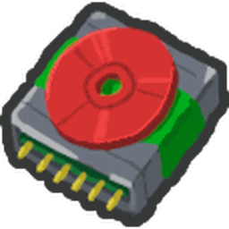 <a href="drives.html#Red_Drive">Red Drive</a> •  <a href="drives.html#Blue_Drive">Blue Drive</a> • 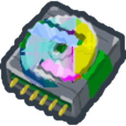 <a href="drives.html#Glitched_Drive">Glitched Drive</a> •  <a href="broken-drive.html">Broken Drive</a></b>
</td></tr>
<tr>
<th class="NavCategory">Nectar Vials
</th>
<td class="NavLinks NavLinksBasicOdd"><b> <a href="comforting-vial.html">Comforting Vial</a> • 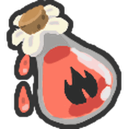 <a href="invigorating-vial.html">Invigorating Vial</a> • 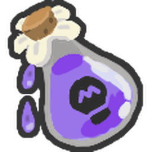 <a href="motivating-vial.html">Motivating Vial</a> • 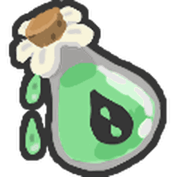 <a href="refreshing-vial.html">Refreshing Vial</a> • 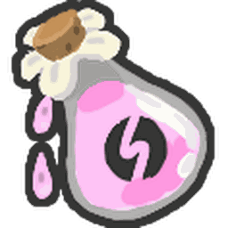 <a href="satisfying-vial.html">Satisfying Vial</a> • 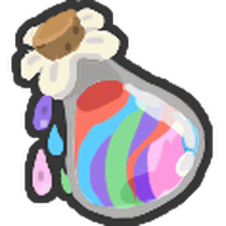 <a href="nectar-shower-vial.html">Nectar Shower Vial</a></b>
</td></tr>
<tr>
<th class="NavCategory">Balloons
</th>
<td class="NavLinks NavLinksBasicEven"><b> <a href="pink-balloon.html">Pink Balloon</a> •  <a href="red-balloon.html">Red Balloon</a> •  <a href="white-balloon.html">White Balloon</a> • 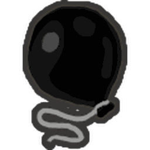 <a href="black-balloon.html">Black Balloon</a></b>
</td></tr>
<tr>
<th class="NavCategory">Waxes
</th>
<td class="NavLinks NavLinksBasicOdd"><b> <a href="soft-wax.html">Soft Wax</a> •  <a href="hard-wax.html">Hard Wax</a> •  <a href="caustic-wax.html">Caustic Wax</a> •  <a href="swirled-wax.html">Swirled Wax</a></b>
</td></tr>
<tr>
<th class="NavCategory" rowspan="5">Limited or Event
</th>
<th class="NavCategory">Quest Exclusive
</th>
<td class="NavLinks NavLinksBasicEven"><b> <a href="translator.html">Translator</a> • 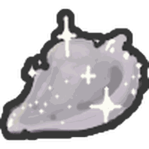 <a href="spirit-petal.html">Spirit Petal</a> • 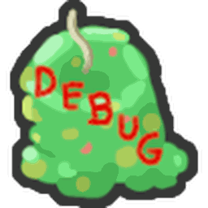 <a href="debug-wax.html">Debug Wax</a> • 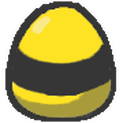 <a href="nectar-tester.html">Nectar Tester</a></b><b></b>
</td></tr>
<tr>
<th class="NavCategory">Beesmas
</th>
<td class="NavLinks NavLinksBasicOdd"><b> <a href="present.html">Present</a> •  <a href="festive-bean.html">Festive Bean</a> •  <a href="snowflake.html">Snowflake</a> •  <a href="gingerbread-bear.html">Gingerbread Bear</a> • 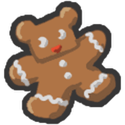 <a href="aged-gingerbread-bear.html">Aged Gingerbread Bear</a></b>
</td></tr>
<tr>
<th class="NavCategory">Removed
</th>
<td class="NavLinks NavLinksBasicEven"><b> <a href="eviction.html">Eviction</a> •  Plastic Egg</b>
</td></tr>
<tr>
<th class="NavCategory">Unobtainable
</th>
<td class="NavLinks NavLinksBasicOdd"><b> 7-Pronged Cog</b>
</td></tr>
<tr>
<th class="NavCategory">Other
</th>
<td class="NavLinks NavLinksBasicEven"><b> <a href="marshmallow-bee.html">Marshmallow Bee</a></b>
</td></tr>
<tr>
<th class="NavCategory">Currencies
</th>
<td class="NavLinks NavLinksBasicOdd" colspan="2"><b>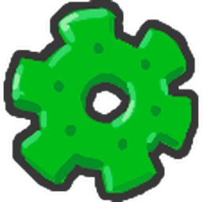 <a href="cog.html">Cog</a> •  <a href="ticket.html">Ticket</a></b>
</td></tr></tbody></table>
</td></tr>
<tr>
<td colspan="2">

<link href="mw-data:TemplateStyles:r348" rel="mw-deduplicated-inline-style"/>
<table class="mw-collapsible mw-collapsed NavTable">
<tbody><tr>
<th class="NavTitle" colspan="2">Tools
</th></tr>
<tr>
<th class="NavCategory">Pollen Collectors
</th>
<td class="NavLinks NavLinksBasicOdd"><b> <a href="scooper.html">Scooper</a> • 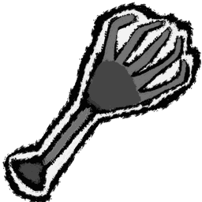 <a href="rake.html">Rake</a> •  <a href="clippers.html">Clippers</a> • 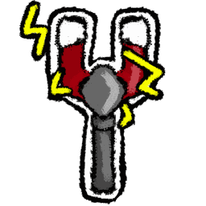 <a href="magnet.html">Magnet</a> • 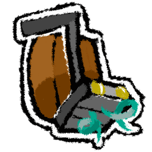 <a href="vacuum.html">Vacuum</a> •  <a href="super-scooper.html">Super-Scooper</a> •  <a href="pulsar.html">Pulsar</a> •  <a href="electro-magnet.html">Electro-Magnet</a> •  <a href="scissors.html">Scissors</a> •  <a href="honey-dipper.html">Honey Dipper</a> •  <a href="bubble-wand.html">Bubble Wand</a> •  <a href="scythe.html">Scythe</a> •  <a href="sticker-seeker.html">Sticker-Seeker</a> •  <a href="golden-rake.html">Golden Rake</a> •  <a href="spark-staff.html">Spark Staff</a> •  <a href="porcelain-dipper.html">Porcelain Dipper</a> •  <a href="petal-wand.html">Petal Wand</a> •  <a href="dark-scythe.html">Dark Scythe</a> •  <a href="tide-popper.html">Tide Popper</a> •  <a href="gummyballer.html">Gummyballer</a></b>
</td></tr>
<tr>
<th class="NavCategory">Sprinklers
</th>
<td class="NavLinks NavLinksBasicEven"><b> <a href="basic-sprinkler.html">Basic Sprinkler</a> •  <a href="silver-soakers.html">Silver Soakers</a> •  <a href="golden-gushers.html">Golden Gushers</a> •  <a href="diamond-drenchers.html">Diamond Drenchers</a> •  <a href="the-supreme-saturator.html">The Supreme Saturator</a></b>
</td></tr>
<tr>
<th class="NavCategory">Gliding Tools
</th>
<td class="NavLinks NavLinksBasicOdd"><b> <a href="parachute.html">Parachute</a> •  <a href="glider.html">Glider</a></b>
</td></tr></tbody></table>
</td></tr>
<tr>
<td colspan="2">

<link href="mw-data:TemplateStyles:r348" rel="mw-deduplicated-inline-style"/>
<table class="mw-collapsible mw-collapsed NavTable">
<tbody><tr>
<th class="NavTitle" colspan="2">Accessories
</th></tr>
<tr>
<th class="NavCategory">Bags
</th>
<td class="NavLinks NavLinksBasicOdd"><b> <a href="pouch.html">Pouch</a> •  <a href="jar.html">Jar</a> •  <a href="backpack.html">Backpack</a> •  <a href="canister.html">Canister</a> •  <a href="mega-jug.html">Mega-Jug</a> •  <a href="compressor.html">Compressor</a> •  <a href="elite-barrel.html">Elite Barrel</a> •  <a href="port-o-hive.html">Port-O-Hive</a> •  <a href="red-port-o-hive.html">Red Port-O-Hive</a> •  <a href="blue-port-o-hive.html">Blue Port-O-Hive</a> •  <a href="porcelain-port-o-hive.html">Porcelain Port-O-Hive</a> •  <a href="coconut-canister.html">Coconut Canister</a></b>
</td></tr>
<tr>
<th class="NavCategory">Guards
</th>
<td class="NavLinks NavLinksBasicEven"><b> <a href="brave-guard.html">Brave Guard</a> •  <a href="hasty-guard.html">Hasty Guard</a> •  <a href="bomber-guard.html">Bomber Guard</a> •  <a href="looker-guard.html">Looker Guard</a> •  <a href="blue-guard.html">Blue Guard</a> •  <a href="elite-blue-guard.html">Elite Blue Guard</a> •  <a href="bucko-guard.html">Bucko Guard</a> •  <a href="cobalt-guard.html">Cobalt Guard</a> •  <a href="red-guard.html">Red Guard</a> •  <a href="elite-red-guard.html">Elite Red Guard</a> •  <a href="riley-guard.html">Riley Guard</a> •  <a href="crimson-guard.html">Crimson Guard</a></b>
</td></tr>
<tr>
<th class="NavCategory">Hats
</th>
<td class="NavLinks NavLinksBasicOdd"><b> <a href="helmet.html">Helmet</a> •  Strange Goggles •  <a href="propeller-hat.html">Propeller Hat</a> •  <a href="beekeeper-s-mask.html">Beekeeper's Mask</a> •  <a href="honey-mask.html">Honey Mask</a> •  <a href="fire-mask.html">Fire Mask</a> •  <a href="bubble-mask.html">Bubble Mask</a> •  <a href="demon-mask.html">Demon Mask</a> •  <a href="diamond-mask.html">Diamond Mask</a> •  <a href="gummy-mask.html">Gummy Mask</a></b>
</td></tr>
<tr>
<th class="NavCategory">Belts
</th>
<td class="NavLinks NavLinksBasicEven"><b> <a href="belt-pocket.html">Belt Pocket</a> •  <a href="belt-bag.html">Belt Bag</a> •  <a href="mondo-belt-bag.html">Mondo Belt Bag</a> •  <a href="honeycomb-belt.html">Honeycomb Belt</a> •  <a href="petal-belt.html">Petal Belt</a> •  <a href="coconut-belt.html">Coconut Belt</a></b>
</td></tr>
<tr>
<th class="NavCategory">Boots
</th>
<td class="NavLinks NavLinksBasicOdd"><b> <a href="basic-boots.html">Basic Boots</a> •  <a href="hiking-boots.html">Hiking Boots</a> •  <a href="beekeeper-s-boots.html">Beekeeper's Boots</a>  •  <a href="coconut-clogs.html">Coconut Clogs</a> •  <a href="gummy-boots.html">Gummy Boots</a></b>
</td></tr>
<tr>
<th class="NavCategory">Amulets
</th>
<td class="NavLinks NavLinksBasicEven"><b> <a href="king-beetle-amulet.html">King Beetle Amulet</a> •  <a href="moon-amulet.html">Moon Amulet</a> •  <a href="ant-amulet.html">Ant Amulet</a> •  <a href="star-amulet.html">Star Amulet</a> •  <a href="shell-amulet.html">Shell Amulet</a> •  <a href="stick-bug-amulet.html">Stick Bug Amulet</a> •  <a href="cog-amulet.html">Cog Amulet</a></b>
</td></tr></tbody></table>
</td></tr>
<tr>
<td colspan="2">

<link href="mw-data:TemplateStyles:r348" rel="mw-deduplicated-inline-style"/>
<table class="mw-collapsible mw-collapsed NavTable">
<tbody><tr>
<th class="NavTitle" colspan="2">Beequips
</th></tr>
<tr>
<th class="NavCategory">Non-seasonal
</th>
<td class="NavLinks NavLinksBasicOdd"><b> <a href="thimble.html">Thimble</a> •  <a href="sweatband.html">Sweatband</a> •  <a href="bandage.html">Bandage</a> •  <a href="thumbtack.html">Thumbtack</a> •  <a href="camo-bandana.html">Camo Bandana</a> •  <a href="bottle-cap.html">Bottle Cap</a> •  <a href="kazoo.html">Kazoo</a> •  <a href="smiley-sticker.html">Smiley Sticker</a> •  <a href="whistle.html">Whistle</a> •  <a href="charm-bracelet.html">Charm Bracelet</a> •  <a href="paperclip.html">Paperclip</a> •  <a href="beret.html">Beret</a> •  <a href="bang-snap.html">Bang Snap</a> •  <a href="bead-lizard.html">Bead Lizard</a> •  <a href="pink-shades.html">Pink Shades</a> •  <a href="lei.html">Lei</a> •  <a href="demon-talisman.html">Demon Talisman</a> •  <a href="camphor-lip-balm.html">Camphor Lip Balm</a> •  <a href="autumn-sunhat.html">Autumn Sunhat</a> •  <a href="rose-headband.html">Rose Headband</a> •  <a href="pink-eraser.html">Pink Eraser</a> •  <a href="candy-ring.html">Candy Ring</a></b>
</td></tr>
<tr>
<th class="NavCategory">Beesmas
</th>
<td class="NavLinks NavLinksBasicEven"><b> <a href="elf-cap.html">Elf Cap</a> •  <a href="single-mitten.html">Single Mitten</a> •  <a href="warm-scarf.html">Warm Scarf</a> •  <a href="peppermint-antennas.html">Peppermint Antennas</a> •  <a href="beesmas-top.html">Beesmas Top</a> •  <a href="pinecone.html">Pinecone</a> •  <a href="icicles.html">Icicles</a>  •  <a href="beesmas-tree-hat.html">Beesmas Tree Hat</a> •  <a href="bubble-light.html">Bubble Light</a> •  <a href="snow-tiara.html">Snow Tiara</a> •  <a href="snowglobe.html">Snowglobe</a> •  <a href="reindeer-antlers.html">Reindeer Antlers</a> •  <a href="toy-horn.html">Toy Horn</a> •  <a href="paper-angel.html">Paper Angel</a> •  <a href="toy-drum.html">Toy Drum</a> •  <a href="lump-of-coal.html">Lump Of Coal</a> •  <a href="poinsettia.html">Poinsettia</a> •  <a href="electric-candle.html">Electric Candle</a> •  <a href="festive-wreath.html">Festive Wreath</a></b>
</td></tr></tbody></table>
</td></tr>
<tr>
<td colspan="2">

<link href="mw-data:TemplateStyles:r348" rel="mw-deduplicated-inline-style"/>
<table class="mw-collapsible mw-collapsed NavTable">
<tbody><tr>
<th class="NavTitle" colspan="2">Planters
</th></tr>
<tr>
<th class="NavCategory">One-time Use
</th>
<td class="NavLinks NavLinksBasicOdd"><b> <a href="paper-planter.html">Paper Planter</a> •  <a href="ticket-planter.html">Ticket Planter</a> •  <a href="sticker-planter.html">Sticker Planter</a> •  <a href="festive-planter.html">Festive Planter</a></b>
</td></tr>
<tr>
<th class="NavCategory">Permanent
</th>
<td class="NavLinks NavLinksBasicEven"><b> <a href="plastic-planter.html">Plastic Planter</a> •  <a href="candy-planter.html">Candy Planter</a> •  <strong class="mw-selflink selflink">Red Clay Planter</strong> •  <a href="blue-clay-planter.html">Blue Clay Planter</a> •  <a href="tacky-planter.html">Tacky Planter</a> •  <a href="pesticide-planter.html">Pesticide Planter</a> •  <a href="petal-planter.html">Petal Planter</a> •  <a href="heat-treated-planter.html">Heat-Treated Planter</a> •  <a href="hydroponic-planter.html">Hydroponic Planter</a> •  <a href="the-planter-of-plenty.html">The Planter Of Plenty</a></b>
</td></tr></tbody></table>
</td></tr></tbody></table>

