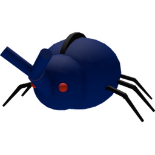

# Rhino Beetle

<aside class="portable-infobox pi-background pi-border-color pi-theme-wikia pi-layout-stacked" role="region">
<h2 class="pi-item pi-item-spacing pi-title pi-secondary-background" data-source="title">Rhino Beetle</h2>
<figure class="pi-item pi-image">

</figure>

<h3 class="pi-data-label pi-secondary-font">Location</h3>

<a href="clover-field.html">Clover Field</a>, <a href="blue-flower-field.html">Blue Flower Field</a>, <a href="bamboo-field.html">Bamboo Field</a>, and <a href="pineapple-patch.html">Pineapple Patch</a>

<h3 class="pi-data-label pi-secondary-font">Respawns Every</h3>

5 minutes (4 minutes 15 seconds with <a href="gifted-bee.html">Vicious Bee's</a> hive bonus)

</aside>

The **Rhino Beetle** is a mob that defends four different [fields](fields.md). It is the blue variant of the [Ladybug](ladybug.md).

This is one of the first mobs a player may encounter, as they are in 2 out of 5 of the [Starting Fields](starter-zone.md) (the others being [Ladybugs](ladybug.md) and the possibility of [Aphids](aphid.md), [Wild Windy Bee](wild-windy-bee.md), and [Rogue Vicious Bee](rogue-vicious-bee.md)).

It takes 5 minutes for a rhino beetle to respawn after being defeated (4 minutes 15 seconds with [Gifted](gifted-bee.md) [Vicious Bee](vicious-bee.md)). Defeating it gives 1 [Battle Point](battle-points.md) and about 75 [Honey](honey.md) spread across 4 honey tokens. Various other rewards are also possible with their probability increasing with [Loot Luck](loot-luck.md).

A Rhino Beetle's level can range from 1–5, depending on the Field that it spawns in.

## Locations

<table class="article-table">
<tbody><tr>
<th>Field
</th>
<th>Quantity
</th>
<th>Level
</th></tr>
<tr>
<td>Blue Flower Field
</td>
<td>1
</td>
<td>1
</td></tr>
<tr>
<td>Clover Field
</td>
<td>1 (with 1 Ladybug)
</td>
<td>2
</td></tr>
<tr>
<td>Bamboo Field
</td>
<td>2
</td>
<td>2 (on left)

3 (on right)

</td></tr>
<tr>
<td>Pineapple Patch
</td>
<td>1 (with 1 <a href="mantis.html">Mantis</a>)
</td>
<td>5
</td></tr></tbody></table>

## Drops

Guaranteed:

* 1 battle point
* [Snowflakes](snowflake.md) (Increments of 1, 5 or 25) (Beesmas only)
* ~75 [Honey](honey.md)

Possible:

* [Tickets](ticket.md) (2% chance) (Loot Luck: + drop rate) (Increments of 1, 5, or 15)
* [Blueberries](blueberry.md) (Loot Luck: + drop rate) (Increments of 1, 5, or 10)
* [Gumdrops](gumdrops.md) (Loot Luck: + drop rate) (Increments of 1, 5, 10, 25, or 50)
* [Treats](treat.md) (1-25)
* [Royal Jellies](royal-jelly.md) (Rare)
* [Blue Extracts](blue-extract.md) (Increments of 1 or 3 Rare)
* [Robo Pass](robo-pass.md)
* [Whirligig](whirligig.md) (Rare)
* [Magic Bean](magic-bean.md) (Rare)
* [Micro-Converter](micro-converter.md) (Rare)
* [Neonberry](neonberry.md) (Very rare)
* [Bumble Bee Egg](egg.md#Bumble_Bee_Egg) (Exceptionally rare)
* [Single Mitten](single-mitten.md) (Uncommon, Beesmas only)
* [Bubble Light](bubble-light.md) (Rare, Beesmas only)

## Strategies

* Rhino beetles behave similarly to most Mobs: it pauses to aim, then lunges. If the player stops to let them aim, then move, it will attack the spot where the Player used to be, not the Player's current location.
* Some fields have objects that the player can try hiding behind, such as the stalks of Bamboo in the Bamboo Field.
* The Frozen Field Defenders Glitch works very well against rhino beetles.

## Trivia

* The respawn timer for a rhino beetle currently counts down from 5 minutes. However, as with most mobs, a rhino beetle doesn't always respawn immediately after its timer runs out. (Usually a 5-10 second delay).
* Rhino beetles are the most common mob, having five distinct spawning points. It also guards the most fields; being four.
* There is a mob similar to the rhino beetle called the [King Beetle](king-beetle.md). In fact, King Beetle is a hybrid, made up of a Ladybug and a Rhino beetle, as stated by Onett on Discord.
* It has the lowest health out of all mobs, with merely 10 health at level 1.
* This is Onett's favorite mob. [1]

## References

1. ↑ [[1]](https://discord.com/channels/427553293862961153/427553293862961155/954273465161097227) Discord message from Onett.

<table class="mw-collapsible NavTable">
<tbody><tr>
<th class="NavTitle" colspan="3">Mobs
</th></tr>
<tr>
<th class="NavCategory" rowspan="2">Normal
</th>
<td class="NavLinks NavLinksBasicOdd" colspan="2"><b><a href="ladybug.html">Ladybug</a> • <strong class="mw-selflink selflink">Rhino Beetle</strong> • <a href="aphid.html">Aphid</a> • <a href="spider.html">Spider</a> • <a href="mantis.html">Mantis</a> • <a href="scorpion.html">Scorpion</a> • <a href="werewolf.html">Werewolf</a> • <a href="cave-monster.html">Cave Monster</a></b>
</td></tr>
<tr>
<th class="NavCategory"><a href="aphid.html">Aphids</a>
</th>
<td class="NavLinks NavLinksBasicEven"><b><a href="aphid.html#Normal_Aphid">Aphid</a> • <a href="aphid.html#Rage_Aphid">Rage Aphid</a> • <a href="aphid.html#Armored_Aphid">Armored Aphid</a> • <a href="aphid.html#Diamond_Aphid">Diamond Aphid</a></b>
</td></tr>
<tr>
<th class="NavCategory">Mini-Bosses
</th>
<td class="NavLinks NavLinksBasicOdd" colspan="2"><b><a href="rogue-vicious-bee.html">Rogue Vicious Bee</a> • <a href="wild-windy-bee.html">Wild Windy Bee</a> • <a href="stump-snail.html">Stump Snail</a> • <a href="chicks.html#Commando_Chick">Commando Chick</a> • <a href="snowbear.html">Snowbear</a></b>
</td></tr>
<tr>
<th class="NavCategory">Bosses
</th>
<td class="NavLinks NavLinksBasicEven" colspan="2"><b><a href="king-beetle.html">King Beetle</a> • <a href="tunnel-bear.html">Tunnel Bear</a> • <a href="coconut-crab.html">Coconut Crab</a> • <a href="chicks.html#Mondo_Chick">Mondo Chick</a></b>
</td></tr>
<tr>
<th class="NavCategory" rowspan="5">Challenges
</th>
<th class="NavCategory"><a href="ants.html">Ants</a>
</th>
<td class="NavLinks NavLinksBasicOdd"><b><a href="ant.html">Ant</a> • <a href="army-ant.html">Army Ant</a> • <a href="flying-ant.html">Flying Ant</a> • <a href="giant-ant.html">Giant Ant</a> • <a href="fire-ant.html">Fire Ant</a></b>
</td></tr>
<tr>
<th class="NavCategory"><a href="stick-bug-challenge.html">Stick Bug</a>
</th>
<td class="NavLinks NavLinksBasicEven"><b><a href="stick-bug.html">Stick Bug</a> • <a href="stick-nymph.html">Stick Nymph</a> • <a href="festive-nymph.html">Festive Nymph</a></b>
</td></tr>
<tr>
<th class="NavCategory"><a href="robo-bear-challenge.html">Robo Bear Challenge</a>
</th>
<td class="NavLinks NavLinksBasicEven"><b><a href="mechsquito.html">Mechsquito</a> • <a href="cogmower.html">Cogmower</a> • <a href="cogturret.html">Cogturret</a> • <a href="mega-mechsquito.html">Mega Mechsquito</a> • <a href="golden-cogmower.html">Golden Cogmower</a></b>
</td></tr>
<tr>
<th class="NavCategory"><a href="robo-party-cake.html#Robo_Party">Robo Party</a>
</th>
<td class="NavLinks NavLinksBasicOdd"><b><a href="party-mechsquito.html">Party Mechsquito</a> • <a href="party-cogmower.html">Party Cogmower</a> • <a href="party-cogturret.html">Party Cogturret</a> • <a href="party-mega-mechsquito.html">Party Mega Mechsquito</a></b>
</td></tr>
<tr>
<th class="NavCategory">Passive
</th>
<td class="NavLinks NavLinksBasicEven" colspan="2"><b><a href="fireflies.html">Firefly</a> • <a href="bean-bug.html">Bean Bug</a> • <a href="frog.html">Frog</a>  • <a href="puffshroom.html">Puffshroom</a> • <a href="bloom.html">Bloom</a></b>
</td></tr>
<tr>
<th class="NavCategory">Removed
</th>
<td class="NavLinks NavLinksBasicOdd" colspan="2"><b><a href="chicks.html#Chick">Chick</a> • <a href="chicks.html#Hostage_Chick">Hostage Chick</a> • <a href="chicks.html#Spotted_Chick">Spotted Chick</a></b>
</td></tr></tbody></table>
