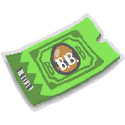

# Robux Shop

{ align=right width=150 }

<figure class="thumb" style="width: 85px" typeof="mw:File/Thumb">  <figcaption class="thumbcaption"> 
The icon for the Robux Shop.
 </figcaption> </figure>

The **Robux Shop** is a shop that requires robux to purchase items. It can be accessed through the Shop tab on the menu bar. It is directly next to the [System Tab](system-page.md).

This shop sells gamepasses, [Eggs](egg.md), [Royal Jelly](royal-jelly.md), [Honey](honey.md), [Night Bells](night-bell.md), [Sticker Planters](sticker-planter.md), [Magic Beans](magic-bean.md), and [Tickets](ticket.md). It sometimes sells limited-edition items, such as [Festive Beans](festive-bean.md), and limited-time packs.

## Items

### Vouchers

<table class="article-table">
<tbody><tr>
<th>Icon
</th>
<th>Item Name
</th>
<th>Robux
</th>
<th>Description
</th></tr>
<tr>
<td>
</td>
<td><a href="sticker.html#Sticker_Index">Bear Bee Voucher</a>
</td>
<td>800
</td>
<td>A tradable voucher that can be redeemed for a Bear Bee Egg! Only 1 Bear Bee Egg can be received per account. 

Bear Bee Periodically transforms you into a Bear, granting x2 Pollen!

</td></tr>
<tr>
<td>
</td>
<td><a href="sticker.html#Sticker_Index">Cub Buddy Voucher</a>
</td>
<td>600
</td>
<td>A tradable voucher that can be redeemed for a Cub Buddy, if you don't already have one. (Max 1 Cub Buddy per account) 

A baby bear that follows you around collecting Tokens and granting Gifts!

</td></tr>
<tr>
<td>
</td>
<td><a href="sticker.html#Sticker_Index">x2 Bee Gather Voucher</a>
</td>
<td>400
</td>
<td>A tradable voucher that can be redeemed once per account to permanently grant x2 Bee Gather Pollen! 

Bees collect twice as much pollen when collecting from flowers!

</td></tr>
<tr>
<td>
</td>
<td><a href="sticker.html#Sticker_Index">x2 Convert Speed Voucher</a>
</td>
<td>250
</td>
<td>A tradable voucher that can be redeemed once per account to permanently grant x2 Convert Speed! 

Bees convert Pollen into Honey in half the time!

</td></tr>
<tr>
<td>
</td>
<td><a href="sticker.html#Sticker_Index">Ticket Voucher</a>
</td>
<td>400
</td>
<td>Can be redeemed for 100 Tickets. Only one may be redeemed per day. (This is a tradable voucher.)
</td></tr></tbody></table>

### Eggs

<table class="article-table">
<tbody><tr>
<th>Icon
</th>
<th>Item Name
</th>
<th>Robux
</th>
<th>Description
</th></tr>
<tr>
<td>
</td>
<td><a href="egg.html#Silver_Egg">Silver Egg</a>
</td>
<td>100
</td>
<td>

Hatches into a special <a href="bees.html">bee</a>!
(64.9% Rare, 30% Epic, 5% Legendary, 0.1% Mythic) 

</td></tr>
<tr>
<td>
</td>
<td><a href="egg.html#Gold_Egg">Gold Egg</a>
</td>
<td>200
</td>
<td>

Always hatches into an <a href="bees-epic.html">Epic</a>, <a href="bees-legendary.html">Legendary</a>, or <a href="bees-mythic.html">Mythic bee</a>!
(79% Epic, 20% Legendary, 1% Mythic)

</td></tr>
<tr>
<td>
</td>
<td><a href="egg.html#Diamond_Egg">Diamond Egg</a>
</td>
<td>400
</td>
<td>

Always hatches into a Legendary or Mythic bee!
(95% Legendary, 5% Mythic)

</td></tr>
<tr>
<td>
</td>
<td><a href="egg.html#Star_Egg">Star Egg</a>
</td>
<td>800
</td>
<td>

Always hatches into a Gifted bee you don't already own! (Excludes <a href="bees-event.html">Event bees</a>. Limit 5 per player.)

</td></tr>
<tr>
<td>
</td>
<td><a href="egg.html#Mythic_Egg">Mythic Egg</a>
</td>
<td>1200
</td>
<td>

Always hatches into a random Mythic bee! (Limit 3 per player.)

</td></tr></tbody></table>

### Royal Jelly

<table class="article-table">
<tbody><tr>
<th>Icon
</th>
<th>Item Name
</th>
<th>Robux
</th>
<th>Description
</th></tr>
<tr>
<td>
</td>
<td><a href="royal-jelly.html">Royal Jelly</a>
</td>
<td>45
</td>
<td>Transforms a bee's type (70% Rare, 27% Epic and 3% Legendary).
</td></tr>
<tr>
<td>
</td>
<td>10 <a href="royal-jelly.html">Royal Jellies</a>
</td>
<td>300
</td>
<td>A value pack of Royal Jellies (33% Discount).
</td></tr></tbody></table>

### Tickets

<table class="article-table">
<tbody><tr>
<th>Icon
</th>
<th>Item Name
</th>
<th>Robux
</th>
<th>Description
</th></tr>
<tr>
<td>
</td>
<td><a href="ticket.html">Ticket</a>
</td>
<td>10
</td>
<td>Used to activate and purchase various things in the game.
</td></tr>
<tr>
<td>
</td>
<td>100 <a href="ticket.html">Tickets</a>
</td>
<td>400
</td>
<td>A value pack of tickets! (x2.5 Value. 4 Per Ticket.)
</td></tr>
<tr>
<td>
</td>
<td>510 <a href="ticket.html">Tickets</a>
</td>
<td>1700
</td>
<td>A value pack of tickets! (x3 Value. 3.33 Per Ticket.)
</td></tr>
<tr>
<td>
</td>
<td>1,800 <a href="ticket.html">Tickets</a>
</td>
<td>4500
</td>
<td>A value pack of tickets! (x4 Value. 2.5 Per Ticket.)
</td></tr></tbody></table>

### Other Items

<table class="article-table">
<tbody><tr>
<th>Icon
</th>
<th>Item Name
</th>
<th>Robux
</th>
<th>Description
</th></tr>
<tr>
<td>
</td>
<td><a href="magic-bean.html">Magic Bean</a>
</td>
<td>30
</td>
<td>Activate to plant a random <a href="sprout.html">Sprout</a> in a field. Collect pollen to make it grow.
</td></tr>
<tr>
<td>
</td>
<td>10 <a href="magic-bean.html">Magic Beans</a>
</td>
<td>200
</td>
<td>A value pack of 10 Magic Beans!
</td></tr>
<tr>
<td>
</td>
<td><a href="sticker-planter.html">Sticker Planter</a>
</td>
<td>100
</td>
<td>Grows in around 3 hours playtime. Grants <a href="nectar.html">Nectar</a>, <a href="sticker.html">Stickers</a> (at least 5), and more. Always spawns a <a href="puffshroom.html">Rare Puffshroom</a> (or better)! (Requires 20 Bees to purchase. Limit 10 per player.)
</td></tr>
<tr>
<td>
</td>
<td><a href="night-bell.html">Night Bell</a>
</td>
<td>80
</td>
<td>Summons <a href="day-night-cycle.html">Night time</a>. A Moon Sprout and a <a href="rogue-vicious-bee.html">Vicious Bee</a> are guaranteed to appear.
</td></tr></tbody></table>

### Honey

<table class="article-table">
<tbody><tr>
<th>Icon
</th>
<th>Name
</th>
<th>Robux
</th>
<th>Description
</th></tr>
<tr>
<td>
</td>
<td>Honey Pouch
</td>
<td>25
</td>
<td>Instantly gain 10,000 <a href="honey.html">Honey</a>.
</td></tr>
<tr>
<td>
</td>
<td>Honey Sack
</td>
<td>300
</td>
<td>Instantly gain 250,000 <a href="honey.html">Honey</a>.
</td></tr>
<tr>
<td>
</td>
<td>Honey Chest
</td>
<td>800
</td>
<td>Instantly gain 1,000,000 <a href="honey.html">Honey</a>.
</td></tr>
<tr>
<td>
</td>
<td>Honey Vault
</td>
<td>1,700
</td>
<td>Instantly gain 5,000,000 <a href="honey.html">Honey</a>.
</td></tr></tbody></table>

### Expired Limited Edition Items/Packs

<table class="sortable mw-collapsible mw-collapsed article-table" style="width: 100%">
<tbody><tr>
<th>Icon
</th>
<th>Item Name
</th>
<th>Robux
</th>
<th>Description
</th>
<th>Ended on
</th></tr>
<tr>
<td>
</td>
<td>Memorial Day Deal
</td>
<td>700
</td>
<td>1 <a href="egg.html#Diamond_Egg">Diamond Egg</a>, 100 <a href="ticket.html">Tickets</a>, 25,000 honey.
</td>
<td>May 26, 2018
</td></tr>
<tr>
<td>
</td>
<td>Summer Treat Pack
</td>
<td>300
</td>
<td>1 <a href="egg.html#Diamond_Egg">Diamond Egg</a>, 250 <a href="treats.html">Treats</a>, 10,000 honey and 25 of each special treat!
</td>
<td>August 1, 2018
</td></tr>
<tr>
<td>
</td>
<td>Summer Star Pack
</td>
<td>1500
</td>
<td>1 <a href="egg.html#Star_Egg">Star Egg</a>, 250 <a href="ticket.html">Tickets</a>, 10 <a href="ant-pass.html">Ant Passes</a>, 100,000 honey!
</td>
<td>August 1, 2018
</td></tr>
<tr>
<td>
</td>
<td>Super Summer Star Pack
</td>
<td>3500
</td>
<td>1 <a href="star-treat.html">Star Treat</a>, 1,000 <a href="ticket.html">Tickets</a>, 25 <a href="ant-pass.html">Ant Passes</a>, 1,000,000 honey!
</td>
<td>August 1, 2018
</td></tr>
<tr>
<td>
</td>
<td>Diamond Moon Pack
</td>
<td>300
</td>
<td>1 Diamond Egg, 25 <a href="moon-charm.html">Moon Charms</a>, 10 Tickets, 100 Treats, and 25,000 honey!
</td>
<td>Oct 8, 2018
</td></tr>
<tr>
<td>
</td>
<td>Stars And Spikes
</td>
<td>1500
</td>
<td>1 <a href="egg.html#Star_Egg">Star Egg</a>, 150 <a href="ticket.html">Tickets</a>, 100 <a href="stinger.html">Stingers</a>, 1 <a href="royal-jelly.html#Star_Jelly">Star Jelly</a>, and 250,000 honey!
</td>
<td>Oct 8, 2018
</td></tr>
<tr>
<td>
</td>
<td>September Star Special
</td>
<td>3500
</td>
<td>1 <a href="treats.html">Star Treat</a>, 600 <a href="ticket.html">Tickets</a>, 100 <a href="stinger.html">Stingers</a>, 50 <a href="treats.html">Moon Charms</a>, 1 <a href="royal-jelly.html">Star Jelly</a>, and 1,500,000 honey!
</td>
<td>Oct 8, 2018
</td></tr>
<tr>
<td>
</td>
<td>Sparkly Starter Pack
</td>
<td>400
</td>
<td>1 <a href="egg.html#Diamond_Egg">Diamond Egg</a>, 5 <a href="magic-bean.html">Magic Beans</a>, 5 <a href="royal-jelly.html">Royal Jellies</a>, 25 <a href="ticket.html">Tickets</a>, 25 <a href="treats.html">Moon Charms</a>, 150k honey
</td>
<td>Dec 16, 2018
</td></tr>
<tr>
<td>
</td>
<td>Extreme Extract Pack
</td>
<td>1200
</td>
<td>300 <a href="ticket.html">Tickets</a>, 100 <a href="stinger.html">Stingers</a>, 50 <a href="red-extract.html">Red Extracts</a>, 50 <a href="blue-extract.html">Blue Extracts</a>, 500 <a href="gumdrops.html">Gumdrops</a>, 500k honey
</td>
<td>Dec 16, 2018
</td></tr>
<tr>
<td>
</td>
<td>Shining Star Pack
</td>
<td>2000
</td>
<td>1 <a href="treats.html">Star Treat</a>, 50 <a href="glitter.html">Glitters</a>, 25 <a href="magic-bean.html">Magic Beans</a>, 100 <a href="treats.html">Moon Charms</a>, 1 <a href="royal-jelly.html">Star Jelly</a>, 1M honey.
</td>
<td>Dec 16, 2018
</td></tr>
<tr>
<td>
</td>
<td>Colossal Crafts Pack
</td>
<td>3400
</td>
<td>1200 <a href="ticket.html">Tickets</a>, 200 <a href="stinger.html">Stingers</a>, 50 <a href="glue.html">Glues</a>, 50 <a href="oil.html">Oils</a>, 50 <a href="enzymes.html">Enzymes</a>, 3 <a href="royal-jelly.html">Star Jellies</a>, 3M honey.
</td>
<td>Dec 16, 2018
</td></tr>
<tr>
<td>
</td>
<td>700 Ticket Offer
</td>
<td>1200
</td>
<td>A Discounted Pack of 700 <a href="ticket.html">Tickets</a>.
</td>
<td>Jan 2, 2019
</td></tr>
<tr>
<td>
</td>
<td>Bear Bee (35% Off)
</td>
<td>650
</td>
<td>Periodically transforms you into a bear, granting x2 pollen!
</td>
<td>Jan 2, 2019
</td></tr>
<tr>
<td>
</td>
<td>Festive Bean
</td>
<td>250
</td>
<td>Activate to plant a <a href="sprout.html">Festive Sprout</a> in a field. Grants <a href="ticket.html">Tickets</a>, rare ingredients, and powerful boosts! Limit 5.
</td>
<td>Jan 2, 2019
</td></tr>
<tr>
<td>
</td>
<td>Festive Bee Pack
</td>
<td>1600
</td>
<td>1st Edition <a href="festive-bee.html">Festive Bee</a> Egg, 30 <a href="red-extract.html">Red Extracts</a>, 30 <a href="oil.html">Oils</a>, 30 <a href="magic-bean.html">Magic Beans</a>, 1M honey.
</td>
<td>February 1, 2019
</td></tr>
<tr>
<td>
</td>
<td>Winter Wonder Pack
</td>
<td>3400
</td>
<td>1 <a href="treats.html">Star Treat</a>, 200 <a href="stinger.html">Stingers</a>, 60 <a href="glitter.html">Glitters</a>, 60 <a href="blue-extract.html">Blue Extracts</a>, 60 <a href="enzymes.html">Enzymes</a>, 800 <a href="ticket.html">Tickets</a>, 4M honey.
</td>
<td>February 1, 2019
</td></tr>
<tr>
<td>
</td>
<td>Stocking Stuffer Pack
</td>
<td>450
</td>
<td>1 <a href="egg.html#Diamond_Egg">Diamond Egg</a>, 100 <a href="ticket.html">Tickets</a>, 5 <a href="night-bell.html">Night Bells</a>, 5 <a href="magic-bean.html">Magic Beans</a>, 50 <a href="treats.html">Moon Charms</a>, 200k honey.
</td>
<td>February 1, 2019
</td></tr>
<tr>
<td>
</td>
<td>Happy Honeyday Pack
</td>
<td>900
</td>
<td>1 <a href="egg.html#Star_Egg">Star Egg</a>, 5 <a href="festive-bean.html">Festive Beans</a>, 10 <a href="night-bell.html">Night Bells</a>, 10 <a href="glitter.html">Glitters</a>, 500 <a href="gumdrops.html">Gumdrops</a>, 500k honey.
</td>
<td>February 1, 2019
</td></tr>
<tr>
<td>
</td>
<td>700 Ticket Offer
</td>
<td>1200
</td>
<td>A discounted pack of 700 <a href="ticket.html">Tickets</a>.
</td>
<td>May 12, 2019
</td></tr>
<tr>
<td>
</td>
<td>Dual-Diamond Basket
</td>
<td>700
</td>
<td>2 <a href="egg.html#Diamond_Egg">Diamond Eggs</a>, 500 <a href="gumdrops.html">Gumdrops</a>, 15 <a href="jelly-beans.html">Jelly Beans</a>, 15 <a href="field-dice.html">Field Dice</a>, 15 <a href="red-extract.html">Red Extracts</a>, <a href="blue-extract.html">15 Blue Extracts</a>, 250k honey.
</td>
<td>May 12, 2019
</td></tr>
<tr>
<td>
</td>
<td>Spikey Spring Basket
</td>
<td>2700
</td>
<td>1000 <a href="ticket.html">Tickets</a>, 250 <a href="stinger.html">Stingers</a>, 50 <a href="jelly-beans.html">Jelly Beans</a>, 15 <a href="micro-converter.html">Micro-Converters</a>, 75 <a href="glue.html">Glues</a>, 75 <a href="oil.html">Oils</a>, 5M honey.
</td>
<td>May 12, 2019
</td></tr>
<tr>
<td>
</td>
<td><a href="windy-bee.html">Windy Bee</a> (First Edition)
</td>
<td>800
</td>
<td>Summons <a href="ability-tokens.html#Tornado">Tornadoes</a> to Collect Pollen and Tokens!

Blows <a href="ability-tokens.html#Rain_Cloud">Rain Clouds</a> around the map to help others!
(Permanently obtainable for free as a rare prize from the <a href="wind-shrine.html">Wind Shrine</a>. Shop offer ends Oct 27.)

</td>
<td>Oct 27, 2019
</td></tr>
<tr>
<td>
</td>
<td>Beginner's Bean Bundle
</td>
<td>400
</td>
<td>1 <a href="egg.html#Diamond_Egg">Diamond Egg</a>, 100 <a href="ticket.html">Tickets</a>, 25 <a href="magic-bean.html">Magic Beans</a>, 25 <a href="jelly-beans.html">Jelly Beans</a>, 10 <a href="field-dice.html">Field Dice</a>, 5 <a href="cloud-vial.html">Cloud Vials</a>, 150k Honey

(Limit 1. Offer ends Oct 27.)

</td>
<td>Oct 27, 2019
</td></tr>
<tr>
<td>
</td>
<td>Gooey Goodies Pack
</td>
<td>800
</td>
<td>1 <a href="royal-jelly.html">Star Jelly</a>, 250 <a href="ticket.html">Tickets</a>, 1000 <a href="gumdrops.html">Gumdrops</a>, 100 <a href="coconut.html">Coconuts</a>, 100 <a href="stinger.html">Stingers</a>, 50 <a href="oil.html">Oils</a>, 500k Honey

(Limit 1. Offer ends Oct 27.)

</td>
<td>Oct 27, 2019
</td></tr>
<tr>
<td>
</td>
<td>Star Treat Special
</td>
<td>1700
</td>
<td>1 <a href="treats.html">Star Treat</a>, 100 <a href="glitter.html">Glitters</a>, 100 <a href="tropical-drink.html">Tropical Drinks</a>, 100 <a href="glue.html">Glues</a>, 50 <a href="jelly-beans.html">Jelly Beans</a>, 10 <a href="cloud-vial.html">Cloud Vials</a>, 2.5M Honey
</td>
<td>Oct 27, 2019
</td></tr>
<tr>
<td>
</td>
<td>Mythic Pack
</td>
<td>800
</td>
<td>Introducing the Mythic Bees!

<a href="tadpole-bee.html">Tadpole</a>, <a href="vector-bee.html">Vector</a>, and <a href="spicy-bee.html">Spicy Bee</a>!
Each possesses powerful and unique abilities!
Pack contains: 1 Mythic Egg, 250 Tickets, 25 Red Extracts, 25 Blue Extracts. (Contains 1 Mythic Egg, which always hatches into a random Mythic Bee. Offer ends Feb 9th.)

</td>
<td>Feb 9, 2020
</td></tr>
<tr>
<td>
</td>
<td>Cub Buddy Launch Pack
</td>
<td>800
</td>
<td>Cub Buddy follows you collecting tokens and occasionally granting random gifts!

Collect skins to customize your Cub Buddy!
Pack Contains: 1 Cub Buddy, 1 <a href="cub-buddy.html#Skins">Noob Cub Skin</a> (Limited Ed.),
500 Tickets and Noob Cub Skin (If player purchased pack after completing <a href="bee-bear.html">Bee Bear's</a> tenth quest)
(Cub Buddy is obtainable in game for free. Noob Cub Skin is a limited  exclusive. Offer ends Feb 9th.)

</td>
<td>Feb 9, 2020
</td></tr>
<tr>
<td>
</td>
<td>Stocking Stuffer Special
</td>
<td>400
</td>
<td>1 <a href="egg.html#Diamond_Egg">Diamond Egg</a>, 100 <a href="ticket.html">Tickets</a>, 10 <a href="box-o-frogs.html">Box-O-Frogs</a>, 500 <a href="gumdrops.html">Gumdrops</a>, 25 <a href="jelly-beans.html">Jelly Beans</a>, 25 <a href="coconut.html">Coconuts</a>, 5 <a href="magic-bean.html">Magic Beans</a>, 150k Honey (Limit 1. Offer ends Feb 9.)
</td>
<td>Feb 9, 2020
</td></tr>
<tr>
<td>
</td>
<td>Silent Night Special
</td>
<td>800
</td>
<td>1 <a href="egg.html#Star_Egg">Star Egg</a>, 100 <a href="stinger.html">Stingers</a>, 25 <a href="glitter.html">Glitters</a>, 5 <a href="night-bell.html">Night Bells</a>, 100 <a href="treats.html">Moon Charms</a>, 25 <a href="jelly-beans.html">Jelly Beans</a>, 500k Honey (Limit 1. Offer ends Feb 9.)
</td>
<td>Feb 9, 2020
</td></tr>
<tr>
<td>
</td>
<td>Merry Mutations Pack
</td>
<td>1700
</td>
<td>5 <a href="atomic-treat.html">Atomic Treats</a>, 500 <a href="ticket.html">Tickets</a>, 25 <a href="neonberry.html">Neonberries</a>, 250 <a href="bitterberry.html">Bitterberries</a>, 100 <a href="glue.html">Glues</a>, 100 <a href="enzymes.html">Enzymes</a>, 50 <a href="tropical-drink.html">Tropical Drinks</a>, 2.5m Honey (Limit 1. Offer ends Feb 9.)
</td>
<td>Feb 9, 2020
</td></tr>
<tr>
<td>
</td>
<td>Fuzzy Pack
</td>
<td>800
</td>
<td>Meet <a href="fuzzy-bee.html">Fuzzy</a>, the new Mythic Bee!

Pollinates flowers, upgrading them to the next level!
Pack Contains: 1 Fuzzy Bee Egg, 250 Tickets, 10 Glitters <i>[sic]</i> and 10 Glues <i>[sic]</i>
(Limit 1 pack per player. Offer ends May 17.)

</td>
<td>May 17, 2020
</td></tr>
<tr>
<td>
</td>
<td>Jumbo June Pack
</td>
<td>1700
</td>
<td>1 <a href="egg.html#Mythic_Egg">Mythic Egg</a>, 750 <a href="ticket.html">Tickets</a>, 10 <a href="super-smoothie.html">Super Smoothies</a>, 25 <a href="glitter.html">Glitters</a>, 25 <a href="magic-bean.html">Magic Beans</a>, 25 <a href="enzymes.html">Enzymes</a>, 2.5m Honey (Limit 1. Offer ends July 5.)
</td>
<td>July 5, 2020
</td></tr>
<tr>
<td>
</td>
<td>Black Friday Bundle
</td>
<td>800
</td>
<td>1 <a href="egg.html#Mythic_Egg">Mythic Egg</a>, 1 <a href="egg.html#Diamond_Egg">Diamond Egg</a>, 1 <a href="egg.html#Gold_Egg">Gold Egg</a>, 10 <a href="jelly-beans.html">Jelly Beans</a> (Limit 1. Offer ends December 13.)
</td>
<td>December 13, 2020
</td></tr>
<tr>
<td>
</td>
<td>Reindeer Puppy Pack
</td>
<td>800
</td>
<td><a href="puppy-bee.html">Puppy Bee</a> and exclusive <a href="reindeer-antlers.html">Reindeer Antlers</a> <a href="beequip.html">Beequip</a>!

Enhances Puppy Bee and adds a Festive Theming!
Pack Contains: Puppy Bee (500 tickets if the player already owns Puppy Bee), Reindeer Puppy Antlers (refund of cost in Bee Bear's Catalog if Reindeer Antlers are already owned), 50 <a href="gingerbread-bear.html">Gingerbread Bears</a>

</td>
<td>Feb 28, 2021
</td></tr>
<tr>
<td>
</td>
<td>Snowey <i>[sic]</i> Starter Pack
</td>
<td>400
</td>
<td>1 <a href="egg.html#Diamond_Egg">Diamond Egg</a>, 100 <a href="ticket.html">Tickets</a>, 1 <a href="snowglobe.html">Snowglobe</a>, 1 <a href="single-mitten.html">Single Mitten</a>, 500 <a href="snowflake.html">Snowflakes</a>, 10 <a href="glitter.html">Glitters</a>, 10 <a href="magic-bean.html">Magic Beans</a>, 200k Honey
</td>
<td>Feb 28, 2021
</td></tr>
<tr>
<td>
</td>
<td>Merry Mythic Pack
</td>
<td>800
</td>
<td>1 <a href="egg.html#Mythic_Egg">Mythic Egg</a>, 250 <a href="ticket.html">Tickets</a>, 1 <a href="toy-drum.html">Toy Drum</a>, 1 <a href="pinecone.html">Pinecone</a>, 25 <a href="glue.html">Glue</a>, 10 <a href="gingerbread-bear.html">Gingerbread Bears</a>, 5 <a href="treats.html">Atomic Treats</a>, 500k Honey
</td>
<td>Feb 28, 2021
</td></tr>
<tr>
<td>
</td>
<td>Jolly Jumbo Pack
</td>
<td>1700
</td>
<td>1 <a href="egg.html#Star_Egg">Star Egg</a>, 500 <a href="ticket.html">Tickets</a>, 1 <a href="toy-horn.html">Toy Horn</a>, 1 <a href="icicles.html">Icicles</a>, 5 <a href="festive-bean.html">Festive Beans</a>, 25 <a href="gingerbread-bear.html">Gingerbread Bears</a>, 50 <a href="enzymes.html">Enzymes</a>, 2500 <a href="gumdrops.html">Gumdrops</a>, 5m Honey
</td>
<td>Feb 28, 2021
</td></tr>
<tr>
<td>
</td>
<td>Honeyday Mega-Haul
</td>
<td>4500
</td>
<td>1 <a href="egg.html#Mythic_Egg">Gifted Mythic Egg</a>, 1500 <a href="ticket.html">Tickets</a>, 1 <a href="beesmas-tree-hat.html">Beesmas Tree Hat</a>, 1 <a href="paper-angel.html">Paper Angel</a>, 25 <a href="super-smoothie.html">Super Smoothies</a>, 500 <a href="stinger.html">Stingers</a>, 100 <a href="glitter.html">Glitters</a>, 50 <a href="gingerbread-bear.html">Gingerbread Bears</a>, 10m Honey
</td>
<td>Feb 28, 2021
</td></tr>
<tr>
<td>
</td>
<td>Cyber Monday Pack
</td>
<td>800
</td>
<td>1 <a href="egg.html#Mythic_Egg">Mythic Egg</a>, 1 <a href="treats.html">Atomic Treat</a>, 100 <a href="ticket.html">Tickets</a>, 10 <a href="magic-bean.html">Magic Beans</a>, 10 <a href="micro-converter.html">Micro-Converters</a>, 5 <a href="glue.html">Glues</a>, 5 <a href="night-bell.html">Night Bells</a>

(Limited 1 per player. Offer ends December 5.)

</td>
<td>Dec 5, 2021
</td></tr>
<tr>
<td>
</td>
<td>Buoyant Pack
</td>
<td>800
</td>
<td>Meet <a href="buoyant-bee.html">Buoyant Bee</a>, the Blue Mythic Bee

Spawns <a href="balloon.html">Balloons</a> to carry Pollen and inflate your bag!
Pack Contains: 1 Buoyant Bee Egg, 250 <a href="ticket.html">Tickets</a>, 25 <a href="glue.html">Glues</a>, 25 <a href="blue-extract.html">Blue Extracts</a>, 10 <a href="purple-potion.html">Purple Potions</a>, and 3 <a href="red-balloon.html">Red</a>, <a href="white-balloon.html">White</a>, and <a href="black-balloon.html">Black Balloons</a> (Limit 1 pack per player. Offer ends March 31.)

</td>
<td>March 31, 2022
</td></tr>
<tr>
<td>
</td>
<td>Precise Pack
</td>
<td>1700
</td>
<td>Meet <a href="precise-bee.html">Precise Bee</a>, the Red Mythic Bee

Shoots lasers and unleashes Super-Critical power!
Pack Contains: 1 Precise Bee Egg, 500 <a href="ticket.html">Tickets</a>, 50 <a href="red-extract.html">Red Extracts</a>, 50 <a href="hard-wax.html">Hard Wax</a>, 150 <a href="stinger.html">Stingers</a>, 250 <a href="treats.html">Neonberries</a>, and 10 <a href="loaded-dice.html">Loaded Dice</a>
(Limit 1 pack per player. Offer ends March 31.)

</td>
<td>March 31, 2022
</td></tr>
<tr>
<td>
</td>
<td>New Year Booster Bundle
</td>
<td>400
</td>
<td>1 <a href="egg.html#Diamond_Egg">Diamond Egg</a>, 100 <a href="ticket.html">Tickets</a>, 5 <a href="ticket-planter.html">Ticket Planters</a>, 10 <a href="magic-bean.html">Magic Beans</a>, 15 <a href="oil.html">Oils</a>, 15 <a href="enzymes.html">Enzymes</a>, 15 <a href="soft-wax.html">Soft Wax</a>, 250k Honey (Limit 1. Offer ends March 31.)
</td>
<td>March 31, 2022
</td></tr>
<tr>
<td>
</td>
<td>Festive Frenzy Haul
</td>
<td>4500
</td>
<td>1 <a href="egg.html#Mythic_Egg">Gifted Mythic Egg</a>, 1500 <a href="ticket.html">Tickets</a>, 25 <a href="swirled-wax.html">Swirled Wax</a>, 25 <a href="purple-potion.html">Purple Potions</a>, 25 <a href="glitter.html">Glitters</a>, 10 <a href="super-smoothie.html">Super Smoothies</a>, 5 <a href="festive-planter.html">Festive Planters</a>, 5 <a href="festive-bean.html">Festive Beans</a>, 1000 <a href="gumdrops.html">Gumdrops</a>, 10m Honey

(Limit 1 pack per player. Offer ends March 31.)

</td>
<td>March 31, 2022
</td></tr>
<tr>
<td>
</td>
<td>Cyber Mondo-Monday Pack
</td>
<td>800
</td>
<td>1 <a href="egg.html#Mythic_Egg">Mythic Egg</a>, 10 <a href="ticket-planter.html">Ticket Planters</a>, 10 <a href="loaded-dice.html">Loaded Dice</a>, 10 <a href="magic-bean.html">Magic Beans</a>, 500 <a href="gumdrops.html">Gumdrops</a>

(Limit 1 per player. Offer ends Dec 5th.)

</td>
<td>December 5, 2022
</td></tr>
<tr>
<td>
</td>
<td>250 <a href="ticket.html">Tickets</a>
</td>
<td>400
</td>
<td>Tickets discounted for Black Friday!

(Limit 1 per player. Offer ends Dec 5th.)

</td>
<td>December 5, 2022
</td></tr>
<tr>
<td>
</td>
<td><a href="digital-bee.html">Digital Bee Pack</a>
</td>
<td>2500
</td>
<td>Pack Contains: Digital Bee Egg (1st Edition)

10 <a href="robo-pass.html">Robo Passes</a>, 10 <a href="drives.html#Glitched_Drive">Glitched Drives</a>, 10 <a href="drives.html#White_Drive">White Drives</a>, 10 <a href="drives.html#Blue_Drive">Blue Drives</a>, 10 <a href="drives.html#Red_Drive">Red Drives</a>
Permanently obtainable in game as a reward from <a href="robo-bear-challenge.html">Robo Bear's Challenge</a>.

</td>
<td>May 7, 2023
</td></tr>
<tr>
<td>
</td>
<td>Nighttime Nectar Pack
</td>
<td>400
</td>
<td>

Pack Contains: 1 <a href="egg.html#Star_Egg">Star Egg</a>, 1 of each <a href="nectar-vial.html">Nectar Vial</a>, 20 <a href="glue.html">Glues</a>, 5 <a href="night-bell.html">Night Bells</a>, 100 <a href="ticket.html">Tickets</a>, 500 <a href="snowflake.html">Snowflakes</a>

</td>
<td>May 7, 2023
</td></tr>
<tr>
<td>
</td>
<td>Magical Mythic Pack
</td>
<td>800
</td>
<td>Pack Contains: 1 <a href="egg.html#Mythic_Egg">Mythic Egg</a>, 25 <a href="gingerbread-bear.html">Gingerbread Bears</a>, 25 <a href="glitter.html">Glitters</a>, 25 <a href="loaded-dice.html">Loaded Dice</a>, 5 <a href="festive-bean.html">Festive Beans</a>, 5 <a href="super-smoothie.html">Super Smoothies</a>, 25 <a href="red-extract.html">Red Extracts</a> and <a href="blue-extract.html">Blue Extracts</a>
</td>
<td>May 7, 2023
</td></tr>
<tr>
<td>
</td>
<td>Mondo Robo-Bundle
</td>
<td>4500
</td>
<td>Pack Contains: 1 <a href="egg.html#Mythic_Egg">Gifted Mythic Egg</a>, 25 <a href="robo-pass.html">Robo Passes</a>, 10 <a href="festive-planter.html">Festive Planters</a>, 500 <a href="stinger.html">Stingers</a>, 25 <a href="swirled-wax.html">Swirled Wax</a>, 25 <a href="caustic-wax.html">Caustic Wax</a>, 1 <a href="turpentine.html">Turpentine</a>, 10 <a href="drives.html#Glitched_Drive">Glitched Drives</a>, 1500 <a href="ticket.html">Tickets</a>
</td>
<td>May 7, 2023
</td></tr>
<tr>
<td>
</td>
<td>Cyber Monday Special
</td>
<td>800
</td>
<td>1 <a href="egg.html#Mythic_Egg">Mythic Egg</a>, 250 <a href="ticket.html">Tickets</a>, 50 <a href="stinger.html">Stingers</a>, 10 <a href="loaded-dice.html">Loaded Dice</a>, 10 <a href="glitter.html">Glitters</a>, 5 <a href="night-bell.html">Night Bells</a>, 1 <a href="black-balloon.html">Black Balloon</a>, 1 <a href="atomic-treat.html">Atomic Treat</a>

(Limit 1 per player. Offer ends December 5.)

</td>
<td>December 5, 2023
</td></tr>
<tr>
<td>
</td>
<td>15 Ticket Planters
</td>
<td>400
</td>
<td>Black Friday offer. Plant to collect rewards and Nectar buffs! At least 10 Tickets per planter.
</td>
<td>December 5, 2023
</td></tr>
<tr>
<td>
</td>
<td>Eggs-travagant Starter Pack
</td>
<td>400
</td>
<td>1 <a href="egg.html#Diamond_Egg">Diamond Egg</a>, 1 <a href="egg.html#Gifted_Silver_Egg">Gifted Silver Egg</a>, 1 <a href="egg.html#Gold_Egg">Gold Egg</a>, 1 <a href="super-smoothie.html">Super Smoothie</a>, 25 <a href="magic-bean.html">Magic Beans</a>, 500 <a href="snowflake.html">Snowflakes</a>, 100 <a href="ticket.html">Tickets</a>
</td>
<td>October 28, 2024
</td></tr>
<tr>
<td>
</td>
<td>Purple Planter Pack
</td>
<td>800
</td>
<td>1 Mythic Egg, 1 Critter In A Stocking Sticker, 2 Festive Planters, 3 Sticker Planter, 5 Ticket Planters, 25 Purple Potions, 25 Gingerbread Bears, 250 Tickets
</td>
<td>October 28, 2024
</td></tr>
<tr>
<td>
</td>
<td>Wavy Doodle Hive Bundle
</td>
<td>1700
</td>
<td>1 Wavy Doodle Hive Skin [Limited Edition], 5 Festive Beans, 15 Loaded Dices, 50 Tropical Drinks, 50 Red and Blue Extracts, 500 Tickets
</td>
<td>October 28, 2024
</td></tr>
<tr>
<td>
</td>
<td>Gifted Giga-Bundle
</td>
<td>4500
</td>
<td>1 Star Treat, 1 Gifted Mythic Egg, 1 Gifted Diamond Egg, 1 Gifted Gold Egg, 1 Flying Festive Bee Sticker, 1 Turpentine, 25 Swirled and Caustic Waxes, 100 Gingerbread Bears, 1500 Tickets
</td>
<td>October 28, 2024
</td></tr>
<tr>
<td>
</td>
<td>Cyber Monday Sampler
</td>
<td>1000
</td>
<td>1 Mythic Egg, 1 Star Egg, 5 Sticker Planters, 10 Glitters, 10 Glues, 10 Loaded Dice
</td>
<td>December 15, 2024
</td></tr>
<tr>
<td>
</td>
<td>500 Ticket Offer
</td>
<td>400
</td>
<td>Tickets discounted for Cyber Monday!
</td>
<td>December 15, 2024
</td></tr>
<tr>
<td>
</td>
<td>Choose-A-Mythic Egg
</td>
<td>800
</td>
<td>Always hatches into the Mythic Bee of your choice!
</td>
<td>May 1, 2025
</td></tr>
<tr>
<td>
</td>
<td>Royal Winter Wonder Haul
</td>
<td>4500
</td>
<td>1 Icy Crowned Hive Skin [Limited Edition], 1 <a href="turpentine.html">Turpentine</a>, 10 <a href="nectar-shower-vial.html">Nectar Shower Vials</a>, 10 <a href="festive-planter.html">Festive Planters</a>, 25 <a href="loaded-dice.html">Loaded Dice</a>, 25 <a href="caustic-wax.html">Caustic Wax</a>, 25 <a href="swirled-wax.html">Swirled Wax</a>, 100 <a href="gingerbread-bear.html">Gingerbread Bears</a>, 1500 <a href="ticket.html">Tickets</a>
</td>
<td>May 1, 2025
</td></tr>
<tr>
<td>
</td>
<td>Carpenter's Crafting Pack
</td>
<td>400
</td>
<td>1 <a href="egg.html#Gifted_Carpenter_Bee_Egg">Gifted Carpenter Bee Egg</a>, 25 <a href="red-extract.html">Red Extracts</a>, <a href="blue-extract.html">Blue Extracts</a>, <a href="glue.html">Glues</a>, <a href="purple-potion.html">Purple Potions</a>, and <a href="gingerbread-bear.html">Gingerbread Bears</a>, 250 <a href="ticket.html">Tickets</a>
</td>
<td>March 31, 2025
</td></tr>
<tr>
<td>
</td>
<td>Starry Night Special
</td>
<td>1700
</td>
<td>1 <a href="egg.html#Gifted_Diamond_Bee_Egg">Gifted Diamond Bee Egg</a>, 1 <a href="star-treat.html">Star Treat</a>, 1 <a href="paper-angel.html">Paper Angel</a>, 10 <a href="festive-bean.html">Festive Beans</a> and <a href="night-bell.html">Night Bells</a>, 100 <a href="glitter.html">Glitters</a> and <a href="tropical-drink.html">Tropical Drinks</a>, 750 <a href="snowflake.html">Snowflakes</a> and <a href="ticket.html">Tickets</a>
</td>
<td>May 1, 2025
</td></tr>
<tr>
<td>
</td>
<td>Cyber Monday Mythic Pack
</td>
<td>1000
</td>
<td>1 <a href="egg.html#Choose-A-Mythic_Egg">Choose-A-Mythic Egg</a>, 25 <a href="blue-extract.html">Blue Extracts</a>, 25 <a href="oil.html">Oils</a>, 5 <a href="nectar-shower-vial.html">Nectar Shower Vials</a>, 5 <a href="ticket-planter.html">Ticket Planters</a>, 1 <a href="black-balloon.html">Black Balloon</a>.
</td>
<td>Dec 15, 2025
</td></tr>
<tr>
<td>
</td>
<td>Merry Mythic Mondo-Haul
</td>
<td>4500
</td>
<td>1 <a href="egg.html#Choose-A-Mythic_Egg">Choose-A-Mythic Egg</a>, 1 <a href="star-treat.html">Star Treat</a>, 1 <a href="turpentine.html">Turpentine</a>, 1 <a href="toy-drum.html">Toy Drum</a>, 10 <a href="sticker.html#Sticker_Index">Ticket Vouchers</a>, 25 Bloom Shakers, 25 <a href="swirled-wax.html">Swirled</a> and <a href="caustic-wax.html">Caustic Waxes</a>, 100 <a href="gingerbread-bear.html">Gingerbread Bears</a>
</td>
<td>March 31, 2026
</td></tr>
<tr>
<td>
</td>
<td>Seasonal Slumber Special
</td>
<td>1700
</td>
<td>1 <a href="egg.html#Star_Egg">Star Egg</a>, 1 <a href="sticker.html#Sticker_Index">Offline Voucher</a>, 10 Black Balloon and <a href="night-bell.html">Night Bells</a>, 100 <a href="enzymes.html">Enzymes</a> and <a href="neonberry.html">Neonberries</a>, 1000 <a href="gumdrops.html">Gumdrops</a> and <a href="snowflake.html">Snowflakes</a>
</td>
<td>March 31, 2026 (Pack may not show for everyone due to country limitations and laws surrounding purchases of randomised items)
</td></tr>
<tr>
<td>
</td>
<td>Feelin' Festive Pack
</td>
<td>800
</td>
<td>1 <a href="egg.html#Gifted_Gold_Egg">Gifted Gold Egg</a>, 1 <a href="toy-horn.html">Toy Horn</a>, 5 <a href="festive-bean.html">Festive Beans</a>, 5 <a href="festive-planter.html">Festive Planters</a>, 5 <a href="nectar-shower-vial.html">Nectar Shower Vials</a>, 25 <a href="gingerbread-bear.html">Gingerbread Bears</a>, 500 <a href="ticket.html">Tickets</a>
</td>
<td>March 31, 2026 (Pack may not show for everyone due to country limitations and laws surrounding purchases of randomised items)
</td></tr>
<tr>
<td>
</td>
<td>Stocking-Stuffer Stuff
</td>
<td>400
</td>
<td>1 <a href="egg.html#Diamond_Egg">Diamond Egg</a>, 1 Critter In A Stocking Sticker, 1 <a href="atomic-treat.html">Atomic Treat</a>, 10 <a href="loaded-dice.html">Loaded Dice</a>, 25 <a href="glitter.html">Glitter</a>, 25 <a href="glue.html">Glues</a>, 500 <a href="snowflake.html">Snowflakes</a>
</td>
<td>March 31, 2026 (Pack may not show for everyone due to country limitations and laws surrounding purchases of randomised items)
</td></tr></tbody></table>

## Trivia

* Those who bought the x2 Ticket Chance Pass before it was removed got to keep it.
* Everything in the shop can be earned without spending Robux due to trading and other ways to obtain things like vouchers.
* The Robux Shop and [Bee Bear's Catalog](bee-bear-s-catalog.md) are the only shops that are in a menu area.
* The Robux Shop has more items than any other shop in-game.
  * The Festive Bee Pack, Fuzzy Bee Pack, Buoyant Pack, Precise Pack, Digital Bee Pack, Carpenter's crafting pack and Starry Night Special are the only packs in the Robux Shop that gave a [Bee Egg](egg.md#Specific_Bee_Eggs), as Bear Bee is not a pack, nor was the Windy Bee deal.
* The honey offers got increased at one point, as the Honey Vault used to only give 200,000 honey.
* Royal Jelly used to cost 50 robux each and the pack of 10 used to cost 400 robux each.
* Bear Bee used to cost 1000 robux before the 2019-09-28 update. It now costs 800 robux.
  * Similar to Bear Bee, Star Eggs are now 800 robux after being lowered from 1000 robux.
* Bear Bee was the only gamepass that was removed for a certain amount of time, then re-added.
* The Gifted Giga-Bundle, Mondo Robo-Bundle, Honeyday Megahaul, Festive Frenzy Haul and 1800 tickets are the most expensive items in the Robux Shop (4500 robux for each item) and 1 ticket is the cheapest item in the Robux Shop (10 robux for each ticket).
* The Mondo Robo-Bundle used to not contain 1500 tickets until in a later update Onett added the tickets in.
* There's an error where the Starry Night Special says offer ends Oct 28th, when it should be Feb 28th.

<table class="mw-collapsible mw-collapsed NavTable">
<tbody><tr>
<th class="NavTitle" colspan="2">Locations
</th></tr>
<tr>
<th class="NavCategory"><a href="fields.html">Fields</a>
</th>
<td class="NavLinks NavLinksBasicOdd"><b><a href="sunflower-field.html">Sunflower Field</a> • <a href="dandelion-field.html">Dandelion Field</a> • <a href="mushroom-field.html">Mushroom Field</a> • <a href="blue-flower-field.html">Blue Flower Field</a> • <a href="clover-field.html">Clover Field</a> • <a href="spider-field.html">Spider Field</a> • <a href="bamboo-field.html">Bamboo Field</a> • <a href="strawberry-field.html">Strawberry Field</a> • <a href="pineapple-patch.html">Pineapple Patch</a> • <a href="stump-field.html">Stump Field</a> • <a href="mixed-brick-field.html">Mixed Brick Field</a> • <a href="blue-brick-field.html">Blue Brick Field</a> • <a href="red-brick-field.html">Red Brick Field</a> • <a href="white-brick-field.html">White Brick Field</a> • <a href="cactus-field.html">Cactus Field</a> • <a href="pumpkin-patch.html">Pumpkin Patch</a> • <a href="pine-tree-forest.html">Pine Tree Forest</a> • <a href="rose-field.html">Rose Field</a> • <a href="ant-field.html">Ant Field</a> • <a href="hub-field.html">Hub Field</a> • <a href="mountain-top-field.html">Mountain Top Field</a> • <a href="coconut-field.html">Coconut Field</a> • <a href="pepper-patch.html">Pepper Patch</a></b>
</td></tr>
<tr>
<th class="NavCategory"><a href="shops.html">Shops</a>
</th>
<td class="NavLinks NavLinksBasicEven"><b><a href="basic-egg-shop.html">Basic Egg Shop</a> • <a href="boost-market.html">Boost Market</a> • <a href="treat-shop.html">Treat Shop</a> • <a href="gumdrop-shop.html">Gumdrop Shop</a> • <a href="royal-jelly-shop.html">Royal Jelly Shop</a> • <a href="ticket-shop.html">Ticket Shop</a> • <a href="noob-shop.html">Noob Shop</a> • <a href="pro-shop.html">Pro Shop</a> • <a href="magic-bean-shop.html">Magic Bean Shop</a> • <a href="badge-bearer-s-guild.html">Badge Bearer's Guild</a> • <a href="dapper-bear-s-shop.html">Dapper Bear's Shop</a> • <a href="stinger-shop.html">Stinger Shop</a> • <a href="mountain-top-shop.html">Mountain Top Shop</a> • <a href="blue-hq.html">Blue HQ</a> • <a href="red-hq.html">Red HQ</a> • <a href="hub-field-shop.html">Hub Field Shop</a> • <a href="robo-bear-s-shop.html">Robo Bear's Shop</a> • <a href="petal-shop.html">Petal Shop</a> • <a href="coconut-cave.html">Coconut Cave</a> • <a href="ticket-tent.html">Ticket Tent</a> • <strong class="mw-selflink selflink">Robux Shop</strong></b>
</td></tr>
<tr>
<th class="NavCategory">Gates
</th>
<td class="NavLinks NavLinksBasicOdd"><b><a href="basic-bee-gate.html">Basic Bee Gate</a> • <a href="brave-bee-gate.html">Brave Bee Gate</a> • <a href="honey-bee-gate.html">Honey Bee Gate</a> • <a href="ant-gate.html">Ant Gate</a> • <a href="lion-bee-gate.html">Lion Bee Gate</a> • <a href="bear-gate.html">Bear Gate</a> • <a href="windy-bee-gate.html">Windy Bee Gate</a></b>
</td></tr>
<tr>
<th class="NavCategory">Machines
</th>
<td class="NavLinks NavLinksBasicEven"><b><a href="honey-dispenser.html">Honey Dispenser</a> • <a href="royal-jelly-dispenser.html">Royal Jelly Dispenser</a> • <a href="treat-dispenser.html">Treat Dispenser</a> • <a href="instant-converter.html">Instant Converter</a> • <a href="wealth-clock.html">Wealth Clock</a> • <a href="moon-amulet-generator.html">Moon Amulet Generator</a> • <a href="memory-match.html">Memory Match</a> • <a href="blue-field-booster.html">Blue Field Booster</a> • <a href="red-field-booster.html">Red Field Booster</a> • <a href="field-booster.html">Field Booster</a> • <a href="blueberry-dispenser.html">Blueberry Dispenser</a> • <a href="strawberry-dispenser.html">Strawberry Dispenser</a> • <a href="honeystorm.html">Honeystorm</a> • <a href="special-sprout-summoner.html">Special Sprout Summoner</a> • <a href="free-ant-pass-dispenser.html">Free Ant Pass Dispenser</a> • <a href="ant-pass-dispenser.html">Ant Pass Dispenser</a> • <a href="glue-dispenser.html">Glue Dispenser</a> • <a href="blender.html">Blender</a> • <a href="coconut-dispenser.html">Coconut Dispenser</a> • <a href="mythic-meteor-shower.html">Mythic Meteor Shower</a> • <a href="free-robo-pass-dispenser.html">Free Robo Pass Dispenser</a> • <a href="robo-pass-dispenser.html">Robo Pass Dispenser</a> • <a href="sticker-stack.html">Sticker Stack</a> • <a href="sticker-printer.html">Sticker Printer</a> • <a href="nectar-condenser.html">Nectar Condenser</a></b>
</td></tr>
<tr>
<th class="NavCategory">Transportation
</th>
<td class="NavLinks NavLinksBasicOdd"><b><a href="slingshot.html">Slingshot</a> • <a href="yellow-cannon.html">Yellow Cannon</a> • <a href="blue-cannon.html">Blue Cannon</a> • <a href="red-cannon.html">Red Cannon</a> • <a href="blue-teleporter.html">Blue Teleporter</a> • <a href="red-teleporter.html">Red Teleporter</a></b>
</td></tr>
<tr>
<th class="NavCategory"><a href="leaderboards.html">Leaderboards</a>
</th>
<td class="NavLinks NavLinksBasicEven"><b><a href="daily-top-honeymakers.html">Daily Top Honeymakers</a> • <a href="all-time-top-honeymakers.html">All-Time Top Honeymakers</a> • <a href="all-time-top-battlers-most-battle-points.html">All-Time Top Battlers</a> • Top Ant Exterminators • Fastest Crab Slayers • Top Stick Bug Fighters • Top Bucko Bee Helpers • Top Riley Bee Helpers • <a href="most-commando-captures.html">Most Commando Captures</a> • Top Brown Bear Helpers • All-Time Top Red Collectors • All-Time Top Blue Collectors • All-Time Top White Collectors • Daily Top Red Collectors • Daily Top Blue Collectors • Daily Top White Collectors • Highest Damage to a Single Puffshroom • Tallest Sticker Stack • Highest Robo Bear Challenge Scores • <a href="highest-snowbear-level.html">Highest Snowbear Level</a> • <a href="highest-robo-party-cake-rank.html">Highest Robo Party Cake Rank</a></b>
</td></tr>
<tr>
<th class="NavCategory">Other Places
</th>
<td class="NavLinks NavLinksBasicOdd"><b><a href="hive.html">Hive</a> • <a href="obstacle-courses.html">Obstacle Courses</a> • King Beetle Lair • <a href="white-tunnel.html">White Tunnel</a> • <a href="werewolf-s-cave.html">Werewolf's Cave</a> • <a href="ant-challenge.html">Ant Challenge</a> • <a href="star-hall.html">Star Hall</a> • <a href="gummy-bear-s-lair.html">Gummy Bear's Lair</a> • <a href="ant-challenge-info.html">Ant Challenge Info</a> • <a href="vicious-bee-egg-claim.html">Vicious Bee Egg Claim</a> • <a href="gummy-bee-egg-claim.html">Gummy Bee Egg Claim</a> • <a href="wind-shrine.html">Wind Shrine</a> • <a href="mazes.html">Mazes</a> • <a href="hive-hub.html">Hive Hub</a> • <a href="sticker-seeker-quest-machine.html">Sticker-Seeker Quest Machine</a></b>
</td></tr>
<tr>
<th class="NavCategory">Event Locations
</th>
<td class="NavLinks NavLinksBasicEven"><b><a href="beesmas-tree.html">Beesmas Tree</a> • Computer • <a href="gift-boxes.html">Gift Boxes</a> • <a href="honey-wreath.html">Honey Wreath</a> • <a href="stockings.html">Stockings</a> • <a href="gingerbread-house.html">Gingerbread House</a> • <a href="snowbear-summoner.html">Snowbear Summoner</a> • <a href="beesmas-lights.html">Beesmas Lights</a> • <a href="samovar.html">Samovar</a> • <a href="beesmas-feast.html">Beesmas Feast</a> • <a href="onett-s-lid-art.html">Onett's Lid Art</a> • <a href="wind-shrine.html#Galentine_Shrine">Galentine Shrine</a> • <a href="memory-match.html#Winter_Memory_Match">Winter Memory Match</a> • <a href="snow-machine.html">Snow Machine</a> • <a href="honeyday-candles.html">Honeyday Candles</a> • <a href="robo-party-cake.html">Robo Party Cake</a> • <a href="gummy-beacon.html">Gummy Beacon</a> • <a href="naughty-list.html">Naughty List</a></b>
</td></tr></tbody></table>
