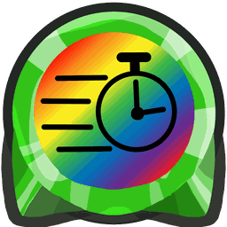
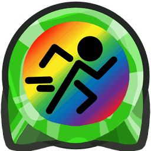
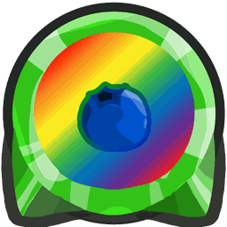
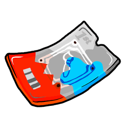
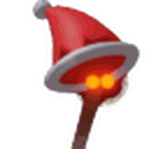

# Robux Shop

{ align=right width=150 }

<figure class="mw-halign-center" style="text-align:center"><figcaption>
The icon for the Robux Shop.
</figcaption></figure>

The **Robux Shop** is a shop that requires robux to purchase items. It can be accessed through the Shop tab on the menu bar. It is directly next to the [System Tab](system-page.md).

This shop sells gamepasses, limited-time packs, [Eggs](egg.md), [Magic Beans](magic-bean.md), [Festive Beans](festive-bean.md), vouchers, [Nectar Vials](nectar-vial.md) and blessing boosts. Prices below are the live Roblox prices.

## Items

### Gamepasses { #Gamepasses }

| Icon | Gamepass | Robux | Description |
|---|---|---|---|
| { width=50 } | Permanent [Wealth Clock](wealth-clock.md) | 9 | Always receive the max Wealth Clock buff and 5 tickets from the Wealth Clock. |
| { width=50 } | +50% Bee Ability Rate | 90 | Bees use their abilities 50% more often. |
| { width=50 } | Petal Magnet | 54 | Collect bloom petals from anywhere in the same field. |
| { width=50 } | Half Item Cooldown | 45 | Reduces usable item cooldowns by half. |
| { width=50 } | x1.5 [Digital Bee](digital-bee.md) Dupe Chance | 180 | Multiplies Digital Bee's ability duplication chance by 1.5 (0% becomes 1%, 20% becomes 30%). |
| { width=50 } | -50% Monster Respawn Time | 45 | Reduces monster respawn times by 50%. Stacks with other respawn bonuses. |
| { width=50 } | x2 Item Loot | 90 | Doubles eligible item loot. It doesn't affect Gifted Eggs, Mythic Eggs, Mythic Jelly, Choose-A-Mythic Eggs, Star Eggs, Star Treats or Festive Beans. |

### Limited-Time Packs

| Icon | Pack | Robux | Contents |
|---|---|---|---|
| { width=50 } | [Painter Bee's Colorful Haul](painter-bee-event.md#shop) | 495 | 1st Edition Painter Bee Voucher, Red, Blue and White Paint Splatter stickers, Painter Bee's Artistic Hive Skin, Painter Bee Painting, Gifted Painter Bee sticker and Painter's Doodle. Leaves on October 9, 2026. |
| { width=50 } | Meowl Pack | 180 | Custom Cub Skin, [Cub Buddy](cub-buddy.md) Voucher, x2 Convert Speed Voucher and Robo Comb Hive Skin. |

### Eggs and Beans

| Icon | Item | Robux | Description |
|---|---|---|---|
| { width=50 } | Choose-A-Mythic Egg | 180 | Hatches into the Mythic Bee of your choice. |
| { width=50 } | Diamond Egg | 45 | Hatches into a Legendary or Mythic bee. |
| { width=50 } | [Festive Bean](festive-bean.md) | 90 | Plants a Festive Sprout. |
| { width=50 } | [Magic Bean](magic-bean.md) | 9 | Plants a random Sprout. |

### Vouchers and Wax

| Icon | Item | Robux | Description |
|---|---|---|---|
| { width=50 } | [Bear Bee](bear-bee.md) Voucher | 180 | Redeem for a Bear Bee Egg. |
| { width=50 } | x2 Convert Speed Voucher | 36 | x2 Convert Speed. Once per account. |
| { width=50 } | x2 Bee Gather Voucher | 90 | x2 Bee Gather Pollen. Once per account. |
| { width=50 } | [Fluxite Wax](fluxite-wax.md) | 72 | Rerolls a [Beequip](beequip.md)'s potential from 1 to 5 stars without using a wax slot. |

### Vials

| Icon | Item | Robux | Description |
|---|---|---|---|
| { width=50 } | [Nectar Shower Vial](nectar-shower-vial.md) | 18 | Gives every player in the server 4 hours of every Nectar. |
| { width=50 } | [Satisfying Vial](satisfying-vial.md) | 9 | 4 hours of Satisfying Nectar. |
| { width=50 } | [Refreshing Vial](refreshing-vial.md) | 9 | 4 hours of Refreshing Nectar. |
| { width=50 } | [Motivating Vial](motivating-vial.md) | 9 | 4 hours of Motivating Nectar. |
| { width=50 } | [Invigorating Vial](invigorating-vial.md) | 9 | 4 hours of Invigorating Nectar. |
| { width=50 } | [Comforting Vial](comforting-vial.md) | 9 | 4 hours of Comforting Nectar. |

### Blessings

| Icon | Item | Robux | Description |
|---|---|---|---|
|  | Max [Puffshroom](puffshroom.md) Blessing | 5 | Max Puffshroom Blessing stacks for the full 3 hours. |
| { width=50 } | Max [Festive Nymph](festive-nymph.md) Blessing | 7 | Max Festive Nymph Blessing stacks for the full 8 hours. |
| { width=50 } | Max [Robo Party](robo-party-cake.md) Blessing | 9 | Max Robo Party Blessing stacks for the full 1 hour. |

### Expired Packs (2026)

| Icon | Pack | Robux | Contents | Ended |
|---|---|---|---|---|
| { width=50 } | Mortar Bee Pack | Unknown | Two 1st Edition [Mortar Bee](mortar-bee.md) Eggs, a Flying Mortar Bee sticker, a Happy Mortar Bee sticker and an Explosion sticker. | September 26, 2026 |

## Trivia

* Everything in the shop can be earned without spending Robux due to trading and other ways to obtain things like vouchers.
* The Robux Shop and [Bee Bear's Catalog](bee-bear-s-catalog.md) are the only shops that are in a menu area.
* Painter Bee's Colorful Haul is the most expensive item in the Robux Shop (495 Robux) and the Max Puffshroom Blessing is the cheapest (5 Robux).
* Gamepasses bought under earlier uploads of the game still work.
* The Mortar Bee Pack was the only way to get a 1st Edition Mortar Bee Egg.

<table class="mw-collapsible mw-collapsed NavTable">
<tbody><tr>
<th class="NavTitle" colspan="2">Locations
</th></tr>
<tr>
<th class="NavCategory"><a href="fields.html">Fields</a>
</th>
<td class="NavLinks NavLinksBasicOdd"><b><a href="sunflower-field.html">Sunflower Field</a> • <a href="dandelion-field.html">Dandelion Field</a> • <a href="mushroom-field.html">Mushroom Field</a> • <a href="blue-flower-field.html">Blue Flower Field</a> • <a href="clover-field.html">Clover Field</a> • <a href="spider-field.html">Spider Field</a> • <a href="bamboo-field.html">Bamboo Field</a> • <a href="strawberry-field.html">Strawberry Field</a> • <a href="pineapple-patch.html">Pineapple Patch</a> • <a href="stump-field.html">Stump Field</a> • <a href="cactus-field.html">Cactus Field</a> • <a href="pumpkin-patch.html">Pumpkin Patch</a> • <a href="pine-tree-forest.html">Pine Tree Forest</a> • <a href="rose-field.html">Rose Field</a> • <a href="ant-field.html">Ant Field</a> • <a href="hub-field.html">Hub Field</a> • <a href="mountain-top-field.html">Mountain Top Field</a> • <a href="coconut-field.html">Coconut Field</a> • <a href="pepper-patch.html">Pepper Patch</a></b>
</td></tr>
<tr>
<th class="NavCategory"><a href="shops.html">Shops</a>
</th>
<td class="NavLinks NavLinksBasicEven"><b><a href="basic-egg-shop.html">Basic Egg Shop</a> • <a href="boost-market.html">Boost Market</a> • <a href="treat-shop.html">Treat Shop</a> • <a href="gumdrop-shop.html">Gumdrop Shop</a> • <a href="royal-jelly-shop.html">Royal Jelly Shop</a> • <a href="ticket-shop.html">Ticket Shop</a> • <a href="noob-shop.html">Noob Shop</a> • <a href="pro-shop.html">Pro Shop</a> • <a href="magic-bean-shop.html">Magic Bean Shop</a> • <a href="badge-bearer-s-guild.html">Badge Bearer's Guild</a> • <a href="dapper-bear-s-shop.html">Dapper Bear's Shop</a> • <a href="stinger-shop.html">Stinger Shop</a> • <a href="mountain-top-shop.html">Mountain Top Shop</a> • <a href="blue-hq.html">Blue HQ</a> • <a href="red-hq.html">Red HQ</a> • <a href="hub-field-shop.html">Hub Field Shop</a> • <a href="robo-bear-s-shop.html">Robo Bear's Shop</a> • <a href="petal-shop.html">Petal Shop</a> • <a href="coconut-cave.html">Coconut Cave</a> • <a href="ticket-tent.html">Ticket Tent</a> • <strong class="mw-selflink selflink">Robux Shop</strong></b>
</td></tr>
<tr>
<th class="NavCategory">Gates
</th>
<td class="NavLinks NavLinksBasicOdd"><b><a href="basic-bee-gate.html">Basic Bee Gate</a> • <a href="brave-bee-gate.html">Brave Bee Gate</a> • <a href="honey-bee-gate.html">Honey Bee Gate</a> • <a href="ant-gate.html">Ant Gate</a> • <a href="lion-bee-gate.html">Lion Bee Gate</a> • <a href="bear-gate.html">Bear Gate</a> • <a href="windy-bee-gate.html">Windy Bee Gate</a></b>
</td></tr>
<tr>
<th class="NavCategory">Machines
</th>
<td class="NavLinks NavLinksBasicEven"><b><a href="honey-dispenser.html">Honey Dispenser</a> • <a href="royal-jelly-dispenser.html">Royal Jelly Dispenser</a> • <a href="treat-dispenser.html">Treat Dispenser</a> • <a href="instant-converter.html">Instant Converter</a> • <a href="wealth-clock.html">Wealth Clock</a> • <a href="moon-amulet-generator.html">Moon Amulet Generator</a> • <a href="memory-match.html">Memory Match</a> • <a href="blue-field-booster.html">Blue Field Booster</a> • <a href="red-field-booster.html">Red Field Booster</a> • <a href="field-booster.html">Field Booster</a> • <a href="blueberry-dispenser.html">Blueberry Dispenser</a> • <a href="strawberry-dispenser.html">Strawberry Dispenser</a> • <a href="blue-extract-dispenser.html">Blue Extract Dispenser</a> • <a href="red-extract-dispenser.html">Red Extract Dispenser</a> • <a href="honeystorm.html">Honeystorm</a> • <a href="special-sprout-summoner.html">Special Sprout Summoner</a> • <a href="free-ant-pass-dispenser.html">Free Ant Pass Dispenser</a> • <a href="ant-pass-dispenser.html">Ant Pass Dispenser</a> • <a href="glue-dispenser.html">Glue Dispenser</a> • <a href="blender.html">Blender</a> • <a href="coconut-dispenser.html">Coconut Dispenser</a> • <a href="mythic-meteor-shower.html">Mythic Meteor Shower</a> • <a href="free-robo-pass-dispenser.html">Free Robo Pass Dispenser</a> • <a href="robo-pass-dispenser.html">Robo Pass Dispenser</a> • <a href="sticker-stack.html">Sticker Stack</a> • <a href="sticker-printer.html">Sticker Printer</a> • <a href="nectar-condenser.html">Nectar Condenser</a></b>
</td></tr>
<tr>
<th class="NavCategory">Transportation
</th>
<td class="NavLinks NavLinksBasicOdd"><b><a href="slingshot.html">Slingshot</a> • <a href="yellow-cannon.html">Yellow Cannon</a> • <a href="blue-cannon.html">Blue Cannon</a> • <a href="red-cannon.html">Red Cannon</a> • <a href="blue-teleporter.html">Blue Teleporter</a> • <a href="red-teleporter.html">Red Teleporter</a></b>
</td></tr>
<tr>
<th class="NavCategory"><a href="leaderboards.html">Leaderboards</a>
</th>
<td class="NavLinks NavLinksBasicEven"><b><a href="daily-top-honeymakers.html">Daily Top Honeymakers</a> • <a href="all-time-top-honeymakers.html">All-Time Top Honeymakers</a> • <a href="all-time-top-battlers-most-battle-points.html">All-Time Top Battlers</a> • Top Ant Exterminators • Fastest Crab Slayers • Top Stick Bug Fighters • Top Bucko Bee Helpers • Top Riley Bee Helpers • <a href="most-commando-captures.html">Most Commando Captures</a> • Top Brown Bear Helpers • All-Time Top Red Collectors • All-Time Top Blue Collectors • All-Time Top White Collectors • Daily Top Red Collectors • Daily Top Blue Collectors • Daily Top White Collectors • Highest Damage to a Single Puffshroom • Tallest Sticker Stack • Highest Robo Bear Challenge Scores • <a href="highest-snowbear-level.html">Highest Snowbear Level</a> • <a href="highest-robo-party-cake-rank.html">Highest Robo Party Cake Rank</a></b>
</td></tr>
<tr>
<th class="NavCategory">Other Places
</th>
<td class="NavLinks NavLinksBasicOdd"><b><a href="hive.html">Hive</a> • <a href="obstacle-courses.html">Obstacle Courses</a> • King Beetle Lair • <a href="white-tunnel.html">White Tunnel</a> • <a href="werewolf-s-cave.html">Werewolf's Cave</a> • <a href="ant-challenge.html">Ant Challenge</a> • <a href="star-hall.html">Star Hall</a> • <a href="gummy-bear-s-lair.html">Gummy Bear's Lair</a> • <a href="ant-challenge-info.html">Ant Challenge Info</a> • <a href="vicious-bee-egg-claim.html">Vicious Bee Claimer</a> • <a href="gummy-bee-egg-claim.html">Gummy Bee Claimer</a> • <a href="wind-shrine.html">Wind Shrine</a> • <a href="mazes.html">Mazes</a> • <a href="hive-hub.html">Hive Hub</a> • <a href="sticker-seeker-quest-machine.html">Sticker-Seeker Quest Machine</a></b>
</td></tr>
<tr>
<th class="NavCategory">Event Locations
</th>
<td class="NavLinks NavLinksBasicEven"><b><a href="beesmas-tree.html">Beesmas Tree</a> • Computer • <a href="gift-boxes.html">Gift Boxes</a> • <a href="honey-wreath.html">Honey Wreath</a> • <a href="stockings.html">Stockings</a> • <a href="gingerbread-house.html">Gingerbread House</a> • <a href="snowbear-summoner.html">Snowbear Summoner</a> • <a href="beesmas-lights.html">Beesmas Lights</a> • <a href="samovar.html">Samovar</a> • <a href="beesmas-feast.html">Beesmas Feast</a> • <a href="onett-s-lid-art.html">Onett's Lid Art</a> • <a href="wind-shrine.html#Galentine_Shrine">Galentine Shrine</a> • <a href="memory-match.html#Winter_Memory_Match">Winter Memory Match</a> • <a href="snow-machine.html">Snow Machine</a> • <a href="honeyday-candles.html">Honeyday Candles</a> • <a href="robo-party-cake.html">Robo Party Cake</a> • <a href="gummy-beacon.html">Gummy Beacon</a> • <a href="naughty-list.html">Naughty List</a></b>
</td></tr></tbody></table>
