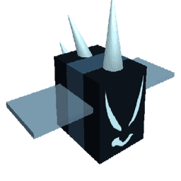

# Rogue Vicious Bee

{ align=right width=150 }

<aside class="portable-infobox pi-background pi-border-color pi-theme-wikia pi-layout-stacked" role="region">
<h2 class="pi-item pi-item-spacing pi-title pi-secondary-background" data-source="title">Rogue Vicious Bee</h2>

<h3 class="pi-data-label pi-secondary-font">Location</h3>

<a href="clover-field.html">Clover Field</a>, <a href="spider-field.html">Spider Field</a>, <a href="cactus-field.html">Cactus Field</a>, <a href="rose-field.html">Rose Field</a>, <a href="mountain-top-field.html">Mountain Top Field</a>, <a href="pepper-patch.html">Pepper Patch</a>

<h3 class="pi-data-label pi-secondary-font">Respawns Every</h3>

10-30 minutes

</aside>

> *This page is for the rogue version of Vicious Bee. For the tamed version, see [Vicious Bee](vicious-bee.md).*

**Rogue Vicious Bee** is a Mini-Boss that can spawn in the [Clover](clover-field.md), [Spider](spider-field.md), [Cactus](cactus-field.md), [Rose](rose-field.md), [Mountain Top Field](mountain-top-field.md), or the [Pepper Patch](pepper-patch.md). Rogue Vicious Bee has a high chance to spawn when it turns nighttime, or can be manually spawned with a [Night Bell](night-bell.md).

Rogue Vicious Bee has a small chance to spawn as a [gifted](gifted-bee.md) variant (roughly 1 in 30-40 chance, or 2.5-3.3% chance). When gifted, it has more health, higher attack rate, and more damage. In return, it rewards a much larger amount of [Stingers](stinger.md) and honey. During Beesmas 2020 and beyond, it also has a small chance to drop [Icicles](icicles.md). This, however, did not apply during Beesmas 2021.

When it is summoned, a spike sound is played along with a short tune, indicating its presence. The player will need to find it hiding in a field with a small gray spike (golden if gifted) sticking out; it will attack if a player touches or goes near its spike. While in [King Beetle's Lair](king-beetle-s-lair.md), a player can see a large spike if the Rogue Vicious Bee is in the Clover Field. Once the player walks close/onto this spike (whether silver or golden), the Rogue Vicious Bee will be summoned. This also damages the player if they walked onto the spike. Everyone in the server will receive a notification when a Rogue Vicious Bee attacks a player via a server-wide message:
⚠ [Gifted] Vicious Bee is attacking {Username} in the {Field Name}! ⚠

When it's defeated, a message announces: 
🎉 [Gifted] Vicious Bee has been defeated! 🎉

## Attack Pattern and Rewards

Rogue Vicious Bee attacks players by summoning spikes from the ground. It has two attack patterns - tracking and then attacking randomly. Rogue Vicious Bee sends out 3 spikes to each player in its range and faces the nearest player. After this, it sends out random spikes while spinning in a circle. After each volley of attacks, it moves to a different spot on the field. The higher the level the bee is, the greater the number of spikes summoned. Red circles indicate where a spike is about to appear. The spikes will do approximately 40 damage to players with no [Defense](system-page.md#Defense), and 50 if gifted.

Gifted Rogue Vicious Bee's spikes form quicker, allowing it to move more often. It also sends out 4 targeting spikes compared to 3.

Unlike other mobs, Rogue Vicious Bee's spikes are able to damage other entities and have no damage cap.

Upon defeat, Rogue Vicious Bee drops stingers and [Honey](honey.md). Bees gain 50 [Bond](bond.md) plus an additional 50 for every level of Rogue Vicious Bee above 2. The amount of honey rewarded is based on the total damage dealt to the bee. Stingers are awarded as long as the player deals any amount of damage to the bee, even if the player leaves the field before it is fully defeated and/or if they get killed. The higher the level of the Rogue Vicious Bee, the more stingers are yielded. A daily bonus of 5 Stingers is also given for the first Rogue Vicious Bee defeated that day, with a cooldown of 22 hours after the daily reward.

* Level 1-3: 1 stinger - Gifted: 6 stingers
* Level 4-6: 2 stingers - Gifted: 9 stingers
* Level 7-9: 3 stingers - Gifted: 12 stingers
* Level 10-12: 4 stingers - Gifted: 15 stingers
* Chance to give icicle beequip during Beesmas event

Note that the number of stingers given does **NOT** change based on how many people are fighting them.

Additionally, during Beesmas, Rogue Vicious Bee can drop the [Icicles](icicles.md) beequip when defeated. The chance of the beequip being obtained increases with the level of the Rogue Vicious Bee.

If Rogue Vicious Bee is in attack mode but there is nobody in its range, it will eventually despawn and a server-wide message will announce:
[Gifted] Vicious Bee left...

## Health per Level

<table class="article-table mw-collapsible mw-collapsed">
<tbody><tr>
<th>Level
</th>
<th>Health
</th>
<th>Health (Gifted)
</th></tr>
<tr>
<td>1
</td>
<td>1,000
</td>
<td>2,000
</td></tr>
<tr>
<td>2
</td>
<td>3,000
</td>
<td>6,000
</td></tr>
<tr>
<td>3
</td>
<td>6,000
</td>
<td>12,000
</td></tr>
<tr>
<td>4
</td>
<td>10,000
</td>
<td>20,000
</td></tr>
<tr>
<td>5
</td>
<td>15,000
</td>
<td>30,000
</td></tr>
<tr>
<td>6
</td>
<td>21,000
</td>
<td>42,000
</td></tr>
<tr>
<td>7
</td>
<td>27,000
</td>
<td>54,000
</td></tr>
<tr>
<td>8
</td>
<td>34,000
</td>
<td>68,000
</td></tr>
<tr>
<td>9
</td>
<td>41,000
</td>
<td>82,000
</td></tr>
<tr>
<td>10
</td>
<td>50,000
</td>
<td>100,000
</td></tr>
<tr>
<td>11
</td>
<td>58,000
</td>
<td>116,000
</td></tr>
<tr>
<td>12
</td>
<td>68,000
</td>
<td>136,000
</td></tr></tbody></table>

## Locations

<table class="article-table mw-collapsible mw-collapsed">
<tbody><tr>
<th>Fields
</th>
<th>Levels
</th></tr>
<tr>
<td>Clover Field
</td>
<td>1–3
</td></tr>
<tr>
<td>Spider Field
</td>
<td>2–4
</td></tr>
<tr>
<td>Cactus Field
</td>
<td>4-7
</td></tr>
<tr>
<td>Rose Field
</td>
<td>5-7
</td></tr>
<tr>
<td>Mountain Top Field
</td>
<td>6–8
</td></tr>
<tr>
<td>Pepper Patch
</td>
<td>9-12
</td></tr></tbody></table>

## Audio

The following audio plays when Rogue Vicious Bee has been summoned:

The following audio plays when Rogue Vicious Bee has been defeated:

## Tips

* When hunting for hidden Rogue Vicious Bees, angle the camera so that it is aligned with the side of the field to make it easier to see spikes sticking out.
* When it turns night, check all the fields Rogue Vicious Bee can spawn in, as night signals its possible appearance.
* When fighting Rogue Vicious Bees, the player can AFK the fight by standing on something higher than the spikes. For example, the player can stand on a cactus if fighting in the Cactus Field. This works on all fields as long as what the player is standing on is more elevated than the field Rogue Vicious Bee spawned in, and close enough to the field that the Rogue Vicious Bee does not despawn. Rogue Vicious Bee may go out of range temporarily but will often move back into range of the player's bees so they can defeat it.
* Spikes despawn after five minutes of appearance, allowing time for the player to get ready.
* When a Rogue Vicious Bee starts using tracking spikes, continue moving around the field. This will be indicated if it is looking at a player, and warning circles only appear underneath players.
* When it starts attacking randomly, stop moving. The player should only move when a warning circle is directly under the character. The attack is indicated if it starts spinning, and a multitude of warning circles appear all at once.
* The spike hitboxes are smaller than the warning circle radius. This means that not much movement is required to dodge the spikes.
* The spike hitboxes are only on the base of the spike, meaning that it's possible to jump over it and without taking damage.
* If a Rogue Vicious Bee is too difficult to defeat, other players that are in the server can help out. It may also be better to leave instead rather than just wasting time if you can't call out other players to help.
* If a Rogue Vicious Bee spawns nearby, the player might hear a stabbing sound, similar to the Vicious Bee spikes sound effect.

## Trivia

* [Vicious Bee](vicious-bee.md) and [Windy Bee](windy-bee.md) are the only mini-bosses and [Mobs](mobs.md) that are also [Bees](bees.md), Windy Bee's counterpart being [Wild Windy Bee](wild-windy-bee.md).
  * These are the only hostile mobs that have a bee counterpart.
* Rogue Vicious Bee is the third boss that was added to the game.
* Rogue Vicious Bee is the first "mob" in the game to not attack by colliding, as it uses a "special ability," being its spikes.
* It is the second mob to have varying levels, the first being [Ants](ants.md), and the third, fourth and fifth being [Stick Bug](stick-bug.md), Stick Nymphs and Wild Windy Bee, respectively.
* Rogue Vicious Bee and the [Frog](frog.md) are the only mobs that are guaranteed to spawn by using an item, the [Night Bells](night-bell.md) and [Box-o-Frogs](box-o-frogs.md) respectively.
* If the player exits the field while Rogue Vicious Bee is using its tracking attack, the base of the spike will be hovering in the air.
* When Rogue Vicious Bee is in tracking mode, it will face where its last spike was. If more than one player is fighting it, it will instead face a random spike.
* It will continue to attack the player even if they are outside of the field, but only if they are in close proximity to the field.
* If the player touches the initial spike that sticks out of the ground of the field, they will take damage as if they are one of the bee's attacking spikes. This spike does not activate the [Emergency Coconut Shield](passive-abilities.md#Emergency_Coconut_Shield).
* When it turns to night, even if Rogue Vicious Bee has recently spawned, there will still be a 1/3 chance of it spawning again.
* Rogue Vicious Bee is slightly larger than all hive bees, including tamed Vicious Bees.
* When Rogue Vicious Bee leaves, it makes the same puff of smoke as when other mobs do when they are defeated. The same occurs if its dormant spike is not triggered and despawns.
* Rogue Vicious Bee shines light directly under itself, unlike its tamed counterpart. The light is only visible at night.
* The player can angle their camera underneath the field in the location of a spike, where they can get a glimpse of Rogue Vicious Bee hiding beneath the field. It can also be made visible by clearing out the flower the spike is in.
* There seems to be a glitch where Rogue Vicious Bee's Gifted variant can spawn missing around 5% of its max health.
* If the player collides with Rogue Vicious Bee by jumping into its body, they will take some damage.
* [Sun Bear](sun-bear.md) mentions in his quest “Vicious Bee Begone” that he has had an encounter with a Rogue Vicious Bee.

<table class="mw-collapsible NavTable">
<tbody><tr>
<th class="NavTitle" colspan="3">Mobs
</th></tr>
<tr>
<th class="NavCategory" rowspan="2">Normal
</th>
<td class="NavLinks NavLinksBasicOdd" colspan="2"><b><a href="ladybug.html">Ladybug</a> • <a href="rhino-beetle.html">Rhino Beetle</a> • <a href="aphid.html">Aphid</a> • <a href="spider.html">Spider</a> • <a href="mantis.html">Mantis</a> • <a href="scorpion.html">Scorpion</a> • <a href="werewolf.html">Werewolf</a> • <a href="cave-monster.html">Cave Monster</a></b>
</td></tr>
<tr>
<th class="NavCategory"><a href="aphid.html">Aphids</a>
</th>
<td class="NavLinks NavLinksBasicEven"><b><a href="aphid.html#Normal_Aphid">Aphid</a> • <a href="aphid.html#Rage_Aphid">Rage Aphid</a> • <a href="aphid.html#Armored_Aphid">Armored Aphid</a> • <a href="aphid.html#Diamond_Aphid">Diamond Aphid</a></b>
</td></tr>
<tr>
<th class="NavCategory">Mini-Bosses
</th>
<td class="NavLinks NavLinksBasicOdd" colspan="2"><b><strong class="mw-selflink selflink">Rogue Vicious Bee</strong> • <a href="wild-windy-bee.html">Wild Windy Bee</a> • <a href="stump-snail.html">Stump Snail</a> • <a href="chicks.html#Commando_Chick">Commando Chick</a> • <a href="snowbear.html">Snowbear</a></b>
</td></tr>
<tr>
<th class="NavCategory">Bosses
</th>
<td class="NavLinks NavLinksBasicEven" colspan="2"><b><a href="king-beetle.html">King Beetle</a> • <a href="tunnel-bear.html">Tunnel Bear</a> • <a href="coconut-crab.html">Coconut Crab</a> • <a href="chicks.html#Mondo_Chick">Mondo Chick</a></b>
</td></tr>
<tr>
<th class="NavCategory" rowspan="5">Challenges
</th>
<th class="NavCategory"><a href="ants.html">Ants</a>
</th>
<td class="NavLinks NavLinksBasicOdd"><b><a href="ant.html">Ant</a> • <a href="army-ant.html">Army Ant</a> • <a href="flying-ant.html">Flying Ant</a> • <a href="giant-ant.html">Giant Ant</a> • <a href="fire-ant.html">Fire Ant</a></b>
</td></tr>
<tr>
<th class="NavCategory"><a href="stick-bug-challenge.html">Stick Bug</a>
</th>
<td class="NavLinks NavLinksBasicEven"><b><a href="stick-bug.html">Stick Bug</a> • <a href="stick-nymph.html">Stick Nymph</a> • <a href="festive-nymph.html">Festive Nymph</a></b>
</td></tr>
<tr>
<th class="NavCategory"><a href="robo-bear-challenge.html">Robo Bear Challenge</a>
</th>
<td class="NavLinks NavLinksBasicEven"><b><a href="mechsquito.html">Mechsquito</a> • <a href="cogmower.html">Cogmower</a> • <a href="cogturret.html">Cogturret</a> • <a href="mega-mechsquito.html">Mega Mechsquito</a> • <a href="golden-cogmower.html">Golden Cogmower</a></b>
</td></tr>
<tr>
<th class="NavCategory"><a href="robo-party-cake.html#Robo_Party">Robo Party</a>
</th>
<td class="NavLinks NavLinksBasicOdd"><b><a href="party-mechsquito.html">Party Mechsquito</a> • <a href="party-cogmower.html">Party Cogmower</a> • <a href="party-cogturret.html">Party Cogturret</a> • <a href="party-mega-mechsquito.html">Party Mega Mechsquito</a></b>
</td></tr>
<tr>
<th class="NavCategory">Passive
</th>
<td class="NavLinks NavLinksBasicEven" colspan="2"><b><a href="fireflies.html">Firefly</a> • <a href="bean-bug.html">Bean Bug</a> • <a href="frog.html">Frog</a>  • <a href="puffshroom.html">Puffshroom</a> • <a href="bloom.html">Bloom</a></b>
</td></tr>
<tr>
<th class="NavCategory">Removed
</th>
<td class="NavLinks NavLinksBasicOdd" colspan="2"><b><a href="chicks.html#Chick">Chick</a> • <a href="chicks.html#Hostage_Chick">Hostage Chick</a> • <a href="chicks.html#Spotted_Chick">Spotted Chick</a></b>
</td></tr></tbody></table>

