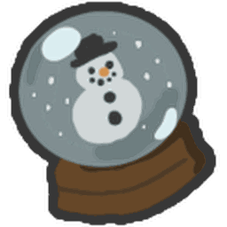
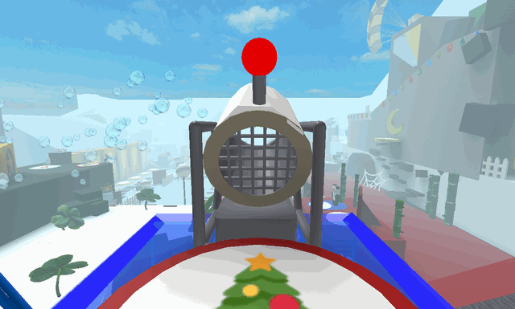

# Snow Machine

{ align=right width=150 }

The **Snow Machine** is a machine added in the Beesmas 2020 that appeared in every Beesmas event thereafter. It's usable after completing [Gifted Bucko Bee's](gifted-bucko-bee.md) Beesmas quest. The Snow Machine has only one primary purpose, which is to summon a [Snow Storm](snow-storm.md) across the map, lasting 30 seconds.

When a player uses the Snow Machine, the following message would appear:
❄ {Username} has activated the Snow Machine! ❄

This machine has a cooldown of 2 hours before the player can use it again.

If a player stepped on the pad before completing Gifted Bucko Bee's Beesmas Quest, a red text box would appear on top of the player's screen saying: "*The Snow Machine is missing some integral parts...*"

<figure class="mw-halign-center" style="text-align:center"><figcaption>The Snow Machine.</figcaption></figure>

## Appearance

The Snow Machine looks like a machine with a green light situated on top of the [Blue HQ](blue-hq.md). Before completing Gifted Bucko Bee's quest, the light would be red, the inside of the machine appearing empty and hollow, except for the wire netting on the back. After completing the quest, 2 fans will be installed in it. Activating it shoots out snowflake particles as well.

## Trivia

* The Snow Machine is the third machine to summon a server-wide event, the first being the [Honeystorm summoner](honeystorm.md) and the second being the [Mythic Meteor Shower summoner](mythic-meteor-shower.md).
