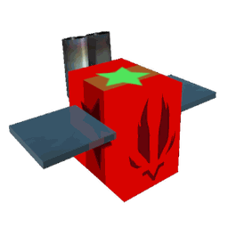

# Spicy Bee

Spicy Bee

<input type="radio" name="bee-infobox-tab" id="bee-tab-original" checked>
<label for="bee-tab-original">Original</label>
<input type="radio" name="bee-infobox-tab" id="bee-tab-gifted">
<label for="bee-tab-gifted">Gifted</label>

<i>"Some like it hot - this bee likes it scorching. Even the honey it makes is spicy."</i>

<b>Rarity</b>Mythic

<b>Color</b>Red

<b>Energy</b>20

<b>Speed</b>14

<b>Attack</b>5

Color Scheme

<b>Skin</b><code>#cf2013</code><code>#2e0600</code><code>#cf2013</code>

**Spicy Bee** is a Red [Mythic bee](bees-mythic.md).

Spicy Bee's favorite treat is [Strawberries](strawberry.md).

Spicy Bee likes the [Pepper Patch](pepper-patch.md). It dislikes the [Stump Field](stump-field.md).

## Stats

* Collects 14 [Pollen](pollen.md) in 4 seconds.
* Makes 300 [honey](honey.md) in 2 seconds.
* +220 [Convert Amount](system-page.md#Convert_Amount), +50% Convert Speed, +4 Gather Amount, +4 [Attack](system-page.md#Bee_Attack).
* 🌟 [Gifted Hive Bonus](gifted-bee.md): +25% [Flame Duration](flame.md#Flame_Duration).

### Abilities

*  **[Inferno](ability-tokens.md#Inferno)** Summons a ring of 6 [flames](flame.md), then [summons](bees.md#Summoned_Bees) 2 [Fire Bees](fire-bee.md) that last for 15s (+1s per Level) with levels equal to 2 less than this bee's level. If Gifted, each Fire Bee has a 10% (+1% per Level) chance of being Gifted as well. However, the gifted Fire Bees from inferno **DO NOT** grant their gifted hive bonus.
*  **[Rage](ability-tokens.md#Rage)** Grants your bees +1 attack for 45s. Stacks up to 4 times.
* [**[🌟Gifted Ability: Flame Fuel]**](ability-tokens.md#Flame_Fuel) For 15 seconds, Spicy Bee tosses oil into any flames that spawn, causing them to last 50% longer and instantly convert 50k pollen and (10 + 5 per Field Boost stack)% of your [Hive's](hive.md) [Convert Amount](system-page.md#Convert_Amount). Unless converted to a [dark flame](flame.md#Dark_Flames), Spicy Bee won't throw oil into flames currently on the field.
* **[Passive: Steam Engine](passive-abilities.md#Steam_Engine)** This bee's [Movespeed](stats.md#Speed) and gather speed drastically increases up to 100% with [Flame Heat](buffs-debuffs.md#Flame_Heat).

<table style="font-size:1.5vh; color:#000; width:100%; background:#fff; padding: 15px 0; border:none; color:#000; border-left:15px #af2136 solid">
<tbody><tr>
<td style="width:100%; text-align:center">

Spicy Bee has a base pollen collection of <b>14 </b> in <b>4 seconds</b>. 

That's equivalent to 3.5  per second. 

(<b>28 </b> in <b>4 seconds</b> with x2 Bee Pollen gamepass)

</td></tr></tbody></table>

<table align="center" class="wikitable" style="text-align:center; width:80%;">
<tbody><tr>
<th colspan="5"> Pollen Collection
</th></tr>
<tr>
<td rowspan="2">Flower Tier
</td><td colspan="2">Bee Pollen
</td><td colspan="2">with Critical Hit
</td></tr>
<tr>
<td>Base Value
</td><td>Red Flower
</td><td>without Melody
</td><td>with Melody
</td></tr>
<tr>
<td>Single
</td><td>14
</td><td>21
</td><td>28
</td><td>42
</td></tr>
<tr>
<td>Double
</td><td>28
</td><td>42
</td><td>56
</td><td>84
</td></tr>
<tr>
<td>Triple
</td><td>42
</td><td>63
</td><td>84
</td><td>126
</td></tr>
<tr>
<td>Large
</td><td>56
</td><td>84
</td><td>112
</td><td>168
</td></tr>
<tr>
<td>Star
</td><td>70
</td><td>105
</td><td>140
</td><td>210
</td></tr>
</tbody></table>

<table align="center" class="wikitable" style="text-align:center; width:80%">
<tbody><tr>
<th colspan="3">Pollen Collection with Boost Tokens
</th></tr>
<tr>
<td>Boost Tokens ( or )
</td><td>Percentage Bonus
</td><td>Collected Pollen
</td></tr>
<tr>
<td>1
</td><td>15%
</td><td>16.1
</td></tr>
<tr>
<td>2
</td><td>30%
</td><td>18.2
</td></tr>
<tr>
<td>3
</td><td>45%
</td><td>20.3
</td></tr>
<tr>
<td>4
</td><td>60%
</td><td>22.4
</td></tr>
<tr>
<td>5
</td><td>75%
</td><td>24.5
</td></tr>
<tr>
<td>6
</td><td>90%
</td><td>26.6
</td></tr>
<tr>
<td>7
</td><td>105%
</td><td>28.7
</td></tr>
<tr>
<td>8
</td><td>120%
</td><td>30.8
</td></tr>
<tr>
<td>9
</td><td>135%
</td><td>32.9
</td></tr>
<tr>
<td>10
</td><td>150%
</td><td>35
</td></tr>
</tbody></table>

<table style="font-size:1.5vh; color:#000; width:100%; background:linear-gradient(to left, #FFB75E, #ED8F03); padding: 15px 0; border:none; color:#fff; border-left:15px #fff solid">
<tbody><tr>
<td style="width:100%; text-align:center">

Spicy Bee can make <b>300 </b> in <b>2 seconds</b>!

That's equivalent to <b>150  per second</b>.

(<b>300  in 1 second</b> with x2 Honeymaking Speed)

</td></tr>
</tbody></table>

<table align="center" class="wikitable" style="text-align:center; width:75%">
<tbody><tr>
<th>Honey Collection with Science Enhancement
</th></tr>
<tr>
<td>
<h3>Levels 1-8</h3><table align="center" class="wikitable" style="text-align:center;">
<tbody><tr>
<th><i>Science Enhancement</i>
</th><th>Production Rate
</th><th>Number of Produced Honey
</th></tr>
<tr>
<td>1
</td><td>25%
</td><td>375
</td></tr>
<tr>
<td>2
</td><td>50%
</td><td>450
</td></tr>
<tr>
<td>3
</td><td>75%
</td><td>525
</td></tr>
<tr>
<td>4
</td><td>100%
</td><td>600
</td></tr>
<tr>
<td>5
</td><td>125%
</td><td>675
</td></tr>
<tr>
<td>6
</td><td>150%
</td><td>750
</td></tr>
<tr>
<td>7
</td><td>175%
</td><td>825
</td></tr>
<tr>
<td>8
</td><td>200%
</td><td>900
</td></tr>
</tbody></table><h3>Levels 9-16</h3><table align="center" class="wikitable" style="text-align:center;">
<tbody><tr>
<th><i>Science Enhancement</i>
</th><th>Production Rate
</th><th>Number of Produced Honey
</th></tr>
<tr>
<td>9
</td><td>225%
</td><td>975
</td></tr>
<tr>
<td>10
</td><td>250%
</td><td>1050
</td></tr>
<tr>
<td>11
</td><td>275%
</td><td>1125
</td></tr>
<tr>
<td>12
</td><td>300%
</td><td>1200
</td></tr>
<tr>
<td>13
</td><td>325%
</td><td>1275
</td></tr>
<tr>
<td>14
</td><td>350%
</td><td>1350
</td></tr>
<tr>
<td>15
</td><td>375%
</td><td>1425
</td></tr>
<tr>
<td>16
</td><td>400%
</td><td>1500
</td></tr>
</tbody></table><h3>Levels 17-24</h3><table align="center" class="wikitable" style="text-align:center;">
<tbody><tr>
<th><i>Science Enhancement</i>
</th><th>Production Rate
</th><th>Number of Produced Honey
</th></tr>
<tr>
<td>17
</td><td>425%
</td><td>1575
</td></tr>
<tr>
<td>18
</td><td>450%
</td><td>1650
</td></tr>
<tr>
<td>19
</td><td>475%
</td><td>1725
</td></tr>
<tr>
<td>20
</td><td>500%
</td><td>1800
</td></tr>
<tr>
<td>21
</td><td>525%
</td><td>1875
</td></tr>
<tr>
<td>22
</td><td>550%
</td><td>1950
</td></tr>
<tr>
<td>23
</td><td>575%
</td><td>2025
</td></tr>
<tr>
<td>24
</td><td>600%
</td><td>2100
</td></tr>
</tbody></table><h3>Levels 25-31</h3><table align="center" class="wikitable" style="text-align:center;">
<tbody><tr>
<th><i>Science Enhancement</i>
</th><th>Production Rate
</th><th>Number of Produced Honey
</th></tr>
<tr>
<td>25
</td><td>625%
</td><td>2175
</td></tr>
<tr>
<td>26
</td><td>650%
</td><td>2250
</td></tr>
<tr>
<td>27
</td><td>675%
</td><td>2325
</td></tr>
<tr>
<td>28
</td><td>700%
</td><td>2400
</td></tr>
<tr>
<td>29
</td><td>725%
</td><td>2475
</td></tr>
<tr>
<td>30
</td><td>750%
</td><td>2550
</td></tr>
<tr>
<td>31
</td><td>775%
</td><td>2625
</td></tr>
</tbody></table>

</td></tr>
</tbody></table>

<table align="center" class="wikitable" style="text-align:center; width:70%">
<tbody><tr>
<td colspan="3"> Egg and Jelly Probability 
</td></tr><tr>
<td>Item
</td><td>Base Probability
</td><td>Probability of getting a particular mythic bee.
</td></tr><tr>
<td style="text-align:left; padding:5px 0 5px 25px;"><a href="egg.html#Basic_Egg">Basic Egg</a>
</td><td>0%
</td><td>0%
</td></tr><tr>
<td style="text-align:left; padding:5px 0 5px 25px;"><a href="egg.html#Silver_Egg">Silver Egg</a>
</td><td>0.1%
</td><td>0.01667%
</td></tr><tr>
<td style="text-align:left; padding:5px 0 5px 25px;"><a href="egg.html#Gold_Egg">Gold Egg</a>
</td><td>1%
</td><td>0.16667%
</td></tr><tr>
<td style="text-align:left; padding:5px 0 5px 25px;"><a href="egg.html#Diamond_Egg">Diamond Egg</a>
</td><td>5%
</td><td>0.83333%
</td></tr><tr>
<td style="text-align:left; padding:5px 0 5px 25px;"><a href="egg.html#Mythic_Egg">Mythic Egg</a>
</td><td>100%
</td><td>16.66667%
</td></tr><tr>
<td style="text-align:left; padding:5px 0 5px 25px;"><a href="royal-jelly.html">Royal Jelly</a>
</td><td>0.004%
</td><td>0.00067%
</td></tr>
</tbody></table>

## Stickers

Spicy Bee has no sticker of its own.

Like any bee, it can also find the stickers listed under [Bee sticker drops](sticker.md#bee-sticker-drops).

## Trivia

* Spicy Bee, [Tadpole Bee](tadpole-bee.md), [Fuzzy Bee](fuzzy-bee.md), [Buoyant Bee](buoyant-bee.md) and [Digital Bee](digital-bee.md) all have four different [Abilities](ability-tokens.md), the most for any [bee](bees.md).
* This bee and [Rage Bee](rage-bee.md) are the only bees with the Rage Ability.
* Spicy Bee's gifted color scheme resembles Rage Bee's gifted and Rage Aphids' color scheme.
* This bee and Tadpole Bee are the only Bees who can summon other entities.
  * This is the only bee that can [summon](bees.md#Summoned_Bees) other bees.
* This bee was originally going to be themed like a train, hence the Steam Engine passive ability, train sounds the tokens make and exhaust pipes on the bee's body.[1]
* While Steam Engine is active, Spicy Bee will emit a continuous trail of steam.
* This bee, along with Vector Bee, Buoyant Bee, and Precise bee emits light when gifted.
* Unlike other gifted bees, the star on top of a gifted Spicy Bee is a different color to the star on its side, with a green star on the top and 2 black ones on the side.
* This is the only Mythic bee to have completely whole numbered base [stats](stats.md).
* The Fire Bees summoned by its Inferno ability cannot convert pollen in the player's hive.
* At launch, this bee was improperly balanced because of a typo. It was supposed to have each flame converting 1% of the player's total conversion, but instead it converted 1% of their capacity. X-Flame converted 29% of the player's capacity ([Demon Mask](demon-mask.md) was required). It was quickly noticed and nerfed to the regular stats it has.
* When gifted, Spicy Bee's exhaust pipes emit more steam.
* Spicy Bee is the only bee to like one field.
* If Spicy Bee is level 1 or 2, the Fire Bees will be level 1 instead of two levels below. This is because there are no levels that go below 1.

## References

1. ↑ [Discord message](https://discord.com/channels/427553293862961153/427573109600550919/654002596050239546) from Onett

<table class="mw-collapsible mw-collapsed NavTable">
<tbody><tr>
<th class="NavTitle" colspan="2">Bees
</th></tr>
<tr>
<th class="NavCategory">Common &amp; Rare
</th>
<td class="NavLinks NavLinksRare"><b> <a href="basic-bee.html">Basic Bee</a> •  <a href="bomber-bee.html">Bomber Bee</a>  •  <a href="brave-bee.html">Brave Bee</a> •  <a href="bumble-bee.html">Bumble Bee</a> •  <a href="cool-bee.html">Cool Bee</a> •  <a href="hasty-bee.html">Hasty Bee</a> •  <a href="looker-bee.html">Looker Bee</a> •  <a href="rad-bee.html">Rad Bee</a> •  <a href="rascal-bee.html">Rascal Bee</a> •  <a href="stubborn-bee.html">Stubborn Bee</a></b>
</td></tr>
<tr>
<th class="NavCategory">Epic
</th>
<td class="NavLinks NavLinksEpic"><b> <a href="bubble-bee.html">Bubble Bee</a> •  <a href="bucko-bee.html">Bucko Bee</a> •  <a href="commander-bee.html">Commander Bee</a> •  <a href="demo-bee.html">Demo Bee</a> •  <a href="exhausted-bee.html">Exhausted Bee</a> •  <a href="fire-bee.html">Fire Bee</a> •  <a href="frosty-bee.html">Frosty Bee</a> •  <a href="honey-bee.html">Honey Bee</a> •  <a href="rage-bee.html">Rage Bee</a> •  <a href="riley-bee.html">Riley Bee</a> •  <a href="shocked-bee.html">Shocked Bee</a></b>
</td></tr>
<tr>
<th class="NavCategory">Legendary
</th>
<td class="NavLinks NavLinksLegend"><b> <a href="baby-bee.html">Baby Bee</a> •  <a href="carpenter-bee.html">Carpenter Bee</a> •  <a href="demon-bee.html">Demon Bee</a> •  <a href="diamond-bee.html">Diamond Bee</a> •  <a href="lion-bee.html">Lion Bee</a> •  <a href="music-bee.html">Music Bee</a> •  <a href="ninja-bee.html">Ninja Bee</a> •  <a href="shy-bee.html">Shy Bee</a></b>
</td></tr>
<tr>
<th class="NavCategory">Mythic
</th>
<td class="NavLinks NavLinksMythic"><b> <a href="buoyant-bee.html">Buoyant Bee</a> •  <a href="fuzzy-bee.html">Fuzzy Bee</a> •  <a href="precise-bee.html">Precise Bee</a> •  <strong class="mw-selflink selflink">Spicy Bee</strong> •  <a href="tadpole-bee.html">Tadpole Bee</a> •  <a href="vector-bee.html">Vector Bee</a></b>
</td></tr>
<tr>
<th class="NavCategory">Event
</th>
<td class="NavLinks NavLinksEvent"><b> <a href="bear-bee.html">Bear Bee</a> •  <a href="cobalt-bee.html">Cobalt Bee</a> •  <a href="crimson-bee.html">Crimson Bee</a> •  <a href="digital-bee.html">Digital Bee</a> •  <a href="festive-bee.html">Festive Bee</a> •  <a href="gummy-bee.html">Gummy Bee</a> •  <a href="photon-bee.html">Photon Bee</a> •  <a href="puppy-bee.html">Puppy Bee</a> •  <a href="tabby-bee.html">Tabby Bee</a> •  <a href="vicious-bee.html">Vicious Bee</a> •  <a href="windy-bee.html">Windy Bee</a></b>
</td></tr></tbody></table>

## All bees

--8<-- "all-bees.md"
