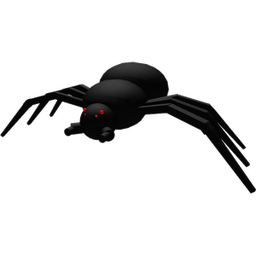

# Spider

<aside class="portable-infobox pi-background pi-border-color pi-theme-wikia pi-layout-stacked" role="region">
<h2 class="pi-item pi-item-spacing pi-title pi-secondary-background" data-source="title">Spider</h2>
<figure class="pi-item pi-image">

</figure>

<h3 class="pi-data-label pi-secondary-font">Location</h3>

<a href="spider-field.html">Spider Field</a>

<h3 class="pi-data-label pi-secondary-font">Respawns Every</h3>

30 minutes (25.5 minutes with Gifted <a href="vicious-bee.html">Vicious Bee</a>)

</aside>

*Not to be confused with [Cave Monster](cave-monster.md), a similar-looking mob.*

The **Spider** is a level 4 [mob](mobs.md) that can only be found in the [Spider Field](spider-field.md).

It takes 30 minutes for the spider to respawn after being defeated (25 minutes 30 seconds with a [Gifted](gifted-bee.md) [Vicious Bee](vicious-bee.md)). Defeating it gives 10 [Battle Points](battle-points.md) and 1,000 [Honey](honey.md) spread across as 5 [Honey](honey.md) tokens. Various other rewards are also possible with their probability increasing with [Loot Luck](loot-luck.md).

## Locations

<table class="article-table">
<tbody><tr>
<th>Field
</th>
<th>Quantity
</th>
<th>Level
</th></tr>
<tr>
<td>Spider Field and its surrounding area bordering the <a href="strawberry-field.html">Strawberry</a> and <a href="bamboo-field.html">Bamboo Fields</a> and the <a href="basic-bee-gate.html">Basic Bee Gate</a>.
</td>
<td>1
</td>
<td>4
</td></tr></tbody></table>

## Drops

Guaranteed:

* 10 battle points.
* 1000 honey (increased by [Honey From Tokens](system-page.md#Honey_From_Tokens)).

Possible:

* [Tickets](ticket.md) (25% chance, Loot Luck: + drop rate) (Increments of 1, 3, 5, 10, or 25).
* [Bitterberries](bitterberry.md) (Increments of 1, 3, 5, or 33).
* [Gumdrops](gumdrops.md) (Loot Luck: + drop rate).
* [Royal Jellies](royal-jelly.md) (Increments of 1 or 5).
* [Treats](treat.md) (Increments of 1, 5, or 25).
* [Pineapples](pineapple.md) (Increments of 1, 3, 33, or 333).
* [Field Dice](field-dice.md) (Increments of 1, or 5).
* [Glues](glue.md) (Common). (Increments of 1, 3, 5, or 10).
* [Enzymes](enzymes.md) (Common). (Increments of 1, 3, 5, 10 or 25).
* [Snowflakes](snowflake.md) (Increments of 3, 33, 333) (Beesmas only).
* [Magic Bean](magic-bean.md) (Common).
* [Robo Pass](robo-pass.md) (Rare).
* [Bubble Light](bubble-light.md) (Rare) (Beesmas only).
* [Stingers](stinger.md) (Very Rare) (Increments of 1, 3, or 5).
* [Star Jellies](royal-jelly.md#Star_Jelly) (Very Rare).
* [Forward Facing Spider Sticker](sticker.md#Sticker_Index) (Extremely Rare)
* [Snow Tiara](snow-tiara.md) (Extremely rare) (Beesmas only).
* [Diamond Egg](egg.md#Diamond_Egg) (Unfathomably Rare).
* [Gold Egg](egg.md#Gold_Egg) (Unfathomably Rare).
* [White Balloon](white-balloon.md) (Exceptionally Rare).
* [Black Balloon](black-balloon.md) (Nearly Impossible).

## Strategies

* One way to keep idle while defeating the spider is to stay on the first block in the [Bamboo Obby](obstacle-courses.md#Bamboo_Field_Obby) - the spider will try to lunge towards the player, but it will be stopped by the block. The player can also stand near the edge of the [Vicious Bee Egg Claim](vicious-bee-egg-claim.md).
* The Frozen Field Defenders Glitch can be used to kill the spider easily, just like any other normal mob.
* Another method is to charge at the spider, then jump and glide over the spider, though this will require the [Parachute](parachute.md) or [Glider](glider.md).

## Trivia

* This, the [Mantis](mantis.md) and the [Werewolf](werewolf.md) are the only mobs that can attack players outside of their designated fields.
* There is a [Ticket](ticket.md) token located within its residence (which is the Spider Cave).
* The Spider is tied with the Werewolf as the regular mobs with the least amount of spawn locations, as they both only have one.
* Unlike real-life spiders, who have eight legs and six/eight eyes, the spider only has six legs and four eyes. It also appears to have a head and thorax, despite spiders and other arachnids having a cephalothorax. This is joked about in the Forward Facing Spider [sticker](sticker.md)'s description, which reads: *"Not enough legs to technically be a spider."*
* Two creatures similar to the spider in appearance called [Cave Monsters](cave-monster.md) are found inside the [Werewolf's Cave](werewolf-s-cave.md). However, they have vastly different stats.
* Spiders have a faint red glow under their eyes, but it's mostly visible at night.

<table class="mw-collapsible NavTable">
<tbody><tr>
<th class="NavTitle" colspan="3">Mobs
</th></tr>
<tr>
<th class="NavCategory" rowspan="2">Normal
</th>
<td class="NavLinks NavLinksBasicOdd" colspan="2"><b><a href="ladybug.html">Ladybug</a> • <a href="rhino-beetle.html">Rhino Beetle</a> • <a href="aphid.html">Aphid</a> • <strong class="mw-selflink selflink">Spider</strong> • <a href="mantis.html">Mantis</a> • <a href="scorpion.html">Scorpion</a> • <a href="werewolf.html">Werewolf</a> • <a href="cave-monster.html">Cave Monster</a></b>
</td></tr>
<tr>
<th class="NavCategory"><a href="aphid.html">Aphids</a>
</th>
<td class="NavLinks NavLinksBasicEven"><b><a href="aphid.html#Normal_Aphid">Aphid</a> • <a href="aphid.html#Rage_Aphid">Rage Aphid</a> • <a href="aphid.html#Armored_Aphid">Armored Aphid</a> • <a href="aphid.html#Diamond_Aphid">Diamond Aphid</a></b>
</td></tr>
<tr>
<th class="NavCategory">Mini-Bosses
</th>
<td class="NavLinks NavLinksBasicOdd" colspan="2"><b><a href="rogue-vicious-bee.html">Rogue Vicious Bee</a> • <a href="wild-windy-bee.html">Wild Windy Bee</a> • <a href="stump-snail.html">Stump Snail</a> • <a href="chicks.html#Commando_Chick">Commando Chick</a> • <a href="snowbear.html">Snowbear</a></b>
</td></tr>
<tr>
<th class="NavCategory">Bosses
</th>
<td class="NavLinks NavLinksBasicEven" colspan="2"><b><a href="king-beetle.html">King Beetle</a> • <a href="tunnel-bear.html">Tunnel Bear</a> • <a href="coconut-crab.html">Coconut Crab</a> • <a href="chicks.html#Mondo_Chick">Mondo Chick</a></b>
</td></tr>
<tr>
<th class="NavCategory" rowspan="5">Challenges
</th>
<th class="NavCategory"><a href="ants.html">Ants</a>
</th>
<td class="NavLinks NavLinksBasicOdd"><b><a href="ant.html">Ant</a> • <a href="army-ant.html">Army Ant</a> • <a href="flying-ant.html">Flying Ant</a> • <a href="giant-ant.html">Giant Ant</a> • <a href="fire-ant.html">Fire Ant</a></b>
</td></tr>
<tr>
<th class="NavCategory"><a href="stick-bug-challenge.html">Stick Bug</a>
</th>
<td class="NavLinks NavLinksBasicEven"><b><a href="stick-bug.html">Stick Bug</a> • <a href="stick-nymph.html">Stick Nymph</a> • <a href="festive-nymph.html">Festive Nymph</a></b>
</td></tr>
<tr>
<th class="NavCategory"><a href="robo-bear-challenge.html">Robo Bear Challenge</a>
</th>
<td class="NavLinks NavLinksBasicEven"><b><a href="mechsquito.html">Mechsquito</a> • <a href="cogmower.html">Cogmower</a> • <a href="cogturret.html">Cogturret</a> • <a href="mega-mechsquito.html">Mega Mechsquito</a> • <a href="golden-cogmower.html">Golden Cogmower</a></b>
</td></tr>
<tr>
<th class="NavCategory"><a href="robo-party-cake.html#Robo_Party">Robo Party</a>
</th>
<td class="NavLinks NavLinksBasicOdd"><b><a href="party-mechsquito.html">Party Mechsquito</a> • <a href="party-cogmower.html">Party Cogmower</a> • <a href="party-cogturret.html">Party Cogturret</a> • <a href="party-mega-mechsquito.html">Party Mega Mechsquito</a></b>
</td></tr>
<tr>
<th class="NavCategory">Passive
</th>
<td class="NavLinks NavLinksBasicEven" colspan="2"><b><a href="fireflies.html">Firefly</a> • <a href="bean-bug.html">Bean Bug</a> • <a href="frog.html">Frog</a>  • <a href="puffshroom.html">Puffshroom</a> • <a href="bloom.html">Bloom</a></b>
</td></tr>
<tr>
<th class="NavCategory">Removed
</th>
<td class="NavLinks NavLinksBasicOdd" colspan="2"><b><a href="chicks.html#Chick">Chick</a> • <a href="chicks.html#Hostage_Chick">Hostage Chick</a> • <a href="chicks.html#Spotted_Chick">Spotted Chick</a></b>
</td></tr></tbody></table>

