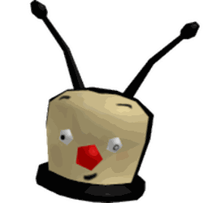
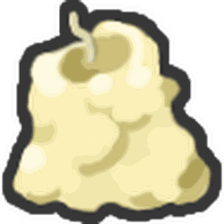

# Sprout

{ align=right width=150 }

*Were you looking for [Magic Bean](magic-bean.md)?*

A **sprout** is a plant that spawns in the center of a [field](fields.md). Sprouts emit a bright yellow beacon that reaches the sky, and have a counter at the base of it representing a [pollen](pollen.md) amount. When players collect pollen, or when a cloud is on the field (requires at least one player being in the field for the cloud give growth), the number counts down and it gradually grows taller. Once the pollen counter reaches 0, it sends out shockwave and scatters various tokens throughout the field. If no interaction with a sprout happens for more than 5 minutes, it will despawn.

## Spawning

Sprouts can spawn randomly around the map and can also be planted using [Magic Beans](magic-bean.md). They can also be summoned by using the [Special Sprout Summoner](special-sprout-summoner.md) near the [Red HQ](red-hq.md), by anyone who has discovered all eight [Legendary Bee](bees-legendary.md) types, once every sixteen hours.

When a sprout spawns, it will broadcast a server-wide message:   
🌱A (Rarity) Sprout has appeared...🌱

If a player has planted a sprout, the message would read:  

🌱 {Username} has planted a (Rarity) Sprout...🌱

If Sticker Sprouts are about to spawn in the [Hive Hub](hive-hub.md), the message will read:  

🌱Sticker Sprouts are about to spawn in the Hive Hub...🌱

* If the player were to be in a Private Server, the message will instead read:

🌱A Sticker Sprout is about to spawn in Public Server Hive Hubs...🌱

When the Sticker Sprout has spawned in the Hive Hub, the message will read:   

🌱 A Sticker Sprout has spawned in the Hive Hub...🌱

Sprouts cannot spawn or be planted in the [Ant Field](ant-field.md).

## Variants

There are ten different variants of sprouts:

* Sprout (Green) (Common)
* Rare Sprout (Silver) (Rare)
* Epic Sprout (Gold) (Very Rare)
* Legendary Sprout (Teal) (Extremely Rare)
* Supreme Sprout (Luminescent green) (Unfathomably Rare)
* Moon Sprout (Luminescent blue during both night and day, only available during nighttime (common))
* Gummy Sprout (Translucent pink) (Very Rare)
* Sticker Sprout (Rainbow, colors shifting) (Spawns only every 3 hours in the [Hub Field](hub-field.md), or an extremely rare chance when planting a magic bean in the Hub Field)
* Festive Sprout (White and Red stripes) (Planted by [Festive Beans](festive-bean.md) or Onett)
* Debug Sprout (Black) (Can only be planted by [Onett](onett.md))

The amount of pollen needed for the sprout for it to be harvested depends on the rarity of the sprout and the field it's in.

## Drops

### Location Specific Drops

Depending on where the sprout is planted, the drops spawned can vary in amounts or may drop certain items.

* A sprout in a red field yields 4 times more [Strawberries](strawberry.md) than in any other field. No [Blueberries](blueberry.md) will spawn.
  * A sprout in the [Strawberry Field](strawberry-field.md) will yield twice as many [Strawberries](strawberry.md) than sprouts in other red fields.
* A sprout in a Blue field yields 6 times more [Blueberries](blueberry.md) than in any other field. No [Strawberries](strawberry.md) will spawn.
* A sprout in the [Sunflower Field](sunflower-field.md) yields 7 times more [Sunflower Seeds](sunflower-seed.md) than in any other field.
* A sprout in the [Pineapple Patch](pineapple-patch.md) yields 7 times more [Pineapples](pineapple.md) than in any other field.
* A sprout in the [35 Bee Zone](windy-bee-gate.md) yields 20% more rewards than sprouts in other areas. It also requires significantly more pollen to pop.
* A sprout in the [Coconut Field](coconut-field.md) yields [Coconuts](coconut.md) and [Tropical Drinks](tropical-drink.md) in addition to other treats.
* Other fields may produce more regular [Treats](treat.md) than any other treats depending on the field.

### Drops Table

The higher tier the sprout is, the more tokens spawn when fully harvested. The possible drops and amount of pollen needed for the sprout for it to be harvested are listed in the table below.

(An **X** in a category means that the specified sprout doesn't spawn that item.)

<table class="article-table">
<caption>
</caption>
<tbody><tr>
<th>Sprout Type
</th>
<th style="width:23%">Special Drops
</th>
<th><a href="ticket.html">Tickets</a>
</th>
<th><a href="royal-jelly.html">Royal Jellies</a>
</th>
<th><a href="treat.html">Treats</a>
</th>
<th><a href="honey.html">Honey</a>
</th>
<th>Pollen
</th></tr>
<tr>
<td style="text-align:center;">Common (Green)
</td>
<td>Crafting Materials
</td>
<td style="text-align:center;">1
</td>
<td style="text-align:center;">1-3
</td>
<td style="text-align:center;">1
</td>
<td style="text-align:center;">400
</td>
<td style="text-align:center;">From 

50,000 
to 
2,500,000

</td></tr>
<tr>
<td style="text-align:center;">Rare (Silver)
</td>
<td><a href="egg.html#Silver_Egg">Silver Egg</a> 

<a href="royal-jelly.html#Star_Jelly">Star Jellies</a> 
Crafting Materials

</td>
<td style="text-align:center;">1
</td>
<td style="text-align:center;">1-3
</td>
<td style="text-align:center;">3
</td>
<td style="text-align:center;">2,000
</td>
<td style="text-align:center;">From 

250,000 
to 
12,500,000

</td></tr>
<tr>
<td style="text-align:center;">Epic (Gold)
</td>
<td><a href="egg.html#Gold_Egg">Gold Egg</a> 

<a href="royal-jelly.html#Star_Jelly">Star Jellies</a> 
Crafting Materials

</td>
<td style="text-align:center;">1
</td>
<td style="text-align:center;">1-3
</td>
<td style="text-align:center;">5
</td>
<td style="text-align:center;">7,500
</td>
<td style="text-align:center;">From 

2,500,000 
to 
125,000,000

</td></tr>
<tr>
<td style="text-align:center;">Legendary (Teal)
</td>
<td><a href="egg.html#Diamond_Egg">Diamond Egg</a> 

<a href="royal-jelly.html#Star_Jelly">Star Jellies</a> 
Crafting Materials

</td>
<td style="text-align:center;">
</td>
<td style="text-align:center;">1-5
</td>
<td style="text-align:center;">10
</td>
<td style="text-align:center;">10,000
</td>
<td style="text-align:center;">From 

10,000,000 
to 
500,000,000

</td></tr>
<tr>
<td style="text-align:center;">Gummy (Translucent Pink)
</td>
<td><a href="gumdrops.html">Gumdrops</a> 

<a href="glue.html">Glues</a> 
<a href="glitter.html">Glitter</a> 
<a href="neonberry.html">Neonberry</a>

</td>
<td style="text-align:center;"><b>x</b>
</td>
<td style="text-align:center;"><b>x</b>
</td>
<td style="text-align:center;"><b>x</b>
</td>
<td style="text-align:center;">4,500
</td>
<td style="text-align:center;">From 

1,000,000 
to 
50,000,000

</td></tr>
<tr>
<td style="text-align:center;">Moon (Luminescent Blue)
</td>
<td><a href="glitter.html">Glitter</a> 

<a href="moon-charm.html">Moon Charms</a> 
<a href="royal-jelly.html#Star_Jelly">Star Jelly</a> 
<a href="neonberry.html">Neonberry</a>

</td>
<td style="text-align:center;"><b>x</b>
</td>
<td style="text-align:center;"><b>x</b>
</td>
<td style="text-align:center;">1
</td>
<td style="text-align:center;">1,500
</td>
<td style="text-align:center;">From 

500,000 
to 
25,000,000

</td></tr>
<tr>
<td style="text-align:center;">Supreme (Luminescent Green)
</td>
<td><a href="egg.html#Diamond_Egg">Diamond Egg</a> 

<a href="royal-jelly.html#Star_Jelly">Star Jellies</a> 
Crafting Materials

</td>
<td style="text-align:center;">1
</td>
<td style="text-align:center;">1-10
</td>
<td style="text-align:center;">30
</td>
<td style="text-align:center;">10,000
</td>
<td style="text-align:center;">From 

15,000,000 
to 
750,000,000

</td></tr>
<tr>
<td style="text-align:center;">Debug (Black)
</td>
<td><a href="bitterberry.html">Bitterberries</a> 

<a href="neonberry.html">Neonberries</a> 
<a href="atomic-treat.html">Atomic Treats</a>

</td>
<td style="text-align:center;"><b>x</b>
</td>
<td style="text-align:center;"><b>x</b>
</td>
<td style="text-align:center;"><b>x</b>
</td>
<td style="text-align:center;"><b>x</b>
</td>
<td style="text-align:center;">From 

10,000,000 
to 
30,000,000

</td></tr>
<tr>
<td style="text-align:center;">Festive (White and Red Stripes)
</td>
<td><a href="ability-tokens.html#Festive_Blessing">Festive Blessing</a> 

<a href="ability-tokens.html#Beesmas_Cheer">Beesmas Cheer</a> 
<a href="gumdrops.html">Gumdrops</a> 
<a href="snowflake.html">Snowflakes</a> 
<a href="gingerbread-bear.html">Gingerbread Bears</a> 
Crafting Materials

</td>
<td style="text-align:center;">1
</td>
<td style="text-align:center;">1
</td>
<td style="text-align:center;">15
</td>
<td style="text-align:center;">15,000
</td>
<td style="text-align:center;">From 

1,000,000 
to 
50,000,000

</td></tr>
<tr>
<td style="text-align:center;">Sticker Sprout (Rainbow)
</td>
<td><a href="egg.html#Silver_Egg">Silver Egg</a> 

<a href="egg.html#Gifted_Silver_Egg">Gifted Silver Egg</a> 
<a href="egg.html#Diamond_Egg">Diamond Egg</a> 
<a href="egg.html#Gifted_Diamond_Egg">Gifted Diamond Egg</a> 
<a href="egg.html#Star_Egg">Star Egg</a> 
 <a href="sticker.html">Stickers</a> 
 <a href="waxes.html">Waxes</a> 
<a href="sticker-planter.html">Sticker Planters</a> 
<a href="royal-jelly.html#Star_Jelly">Star Jellies</a> 
Crafting Materials

</td>
<td style="text-align:center;">1-5
</td>
<td style="text-align:center;">1
</td>
<td style="text-align:center;">10
</td>
<td style="text-align:center;">5,000
</td>
<td style="text-align:center;">1,000,000,000
</td></tr></tbody></table>

* Crafting Materials include only [Red Extracts](red-extract.md), [Blue Extracts](blue-extract.md), [Oils](oil.md), [Enzymes](enzymes.md), and [Glitter](glitter.md).
* Gummy Sprouts give exactly 3 [Glues](glue.md) and at most 1 [Glitter](glitter.md).
* Supreme Sprouts are the only type of sprout to guarantee an egg as a drop.

## Tips

* Various items, abilities, and equipment can boost player movespeed, helping to collect tokens more efficiently before they despawn.
  * Using [Oils](oil.md) grants 1.2x player movespeed.
  * Equipping the [Hasty Guard](hasty-guard.md) grants 1.1x player movespeed.
  * Having [haste](buffs-debuffs.md#From_Ability_Tokens) can increase the player's [movespeed](system-page.md#Movespeed) up to 2x.
    * [Haste producing bees](ability-tokens.md#Haste) are the primary source of this buff.
    * The Honey, Treat, Strawberry, and Blueberry [Dispensers](dispensers.md) give 5 stacks of Haste.
    * The [Royal Jelly Dispenser](royal-jelly-dispenser.md) gives 10 stacks of Haste.
  * If the player and has either the [Coconut Clogs](coconut-clogs.md) or the [Gummy Boots](gummy-boots.md) equipped, they can have a coconut fall on them and grant the player a short burst of [Coconut Haste Surge](passive-abilities.md#Coconut_Haste).
  * [Bear Bee's](bear-bee.md) [Bear Morph](ability-tokens.md#Bear_Morph) [ability](ability-tokens.md) can significantly increase player movespeed as well.
  * The Free Royal Jelly Dispenser gives a stack of Haste+.
* [Tadpole Bee](tadpole-bee.md) and the [Boxes-O-Frogs](box-o-frogs.md) can summon [frogs](frog.md) that collect sprout tokens.
* The [Star Saw](passive-abilities.md#Star_Saw) can collect massive amounts of sprout tokens.
* [Windy Bee's](windy-bee.md) [Tornado](ability-tokens.md#Tornado) can also collect massive amounts of sprout tokens.
* [Cub Buddies](cub-buddy.md#Skins) can also collect sprout tokens.
* For Sticker Sprouts in particular, try to stick to one spot, and collect whatever loot spawns close to you. Loot that spawns too far from you will almost certainly be picked up by another player before you reach it, so stick to whatever's in reach.

## Gallery

Onett is able to plant sprouts server-wide throughout the game. Some of them have been planted under unique names.

### Festive

<table class="article-table">
<tbody><tr>
<td>
</td></tr></tbody></table>

### Debug

<table class="article-table">
<tbody><tr>
<td>
</td></tr></tbody></table>

### Gummy

<table class="article-table">
<tbody><tr>
<td>
</td></tr></tbody></table>

### Other

<table class="article-table">
<tbody><tr>
<td>
</td></tr></tbody></table>

## Audio

As a sprout grows, the following audio is played once the sprout has hit the next respective stage:

## Trivia

* If a [Festive Bean](festive-bean.md) is planted by a player, the [Festive Blessing](ability-tokens.md#Festive_Blessing) and [Beesmas Cheer](ability-tokens.md#Beesmas_Cheer) buffs are only obtainable by the player that planted it.
  * If the sprout is planted by Onett, anyone can collect the tokens.
* Gummy Sprouts are the only sprouts that are translucent.
* Most sprout notifications are displayed in gold, but a few have unique displays:
  * Gummy Sprouts have a light purple notification.
  * Supreme, Moon, and Debug Sprouts have gray notifications.
  * Festive Sprouts have a red notification.
  * Sticker Sprouts have a rainbow notification.
* Many of the treat drop statistics are mentioned in Spirit Bear's dialogue.
* Sprouts were originally called "Seedlings" when they were released and then the name got changed in the 2019-12-23 update. Its original message was "🌱A Seedling has sprouted...🌱"
* The Supreme Sprout previously required half the [pollen](pollen.md) that a Legendary Sprout would need. It now requires 50% more pollen than a Legendary Sprout.
* Since the 2019-23-12 update, Onett has been able to plant sprouts server-wide throughout the game. They can be planted under unique names.
* Supreme Sprouts were formerly named "Mythical Sprouts" before the 2019-12-23 update.
* If the player turned in [Stick Bug's Egg Hunt 2019 Quest](stick-bug.md#Egg_Hunt_2019_Quest), Stick Bug spawned an Epic, Legendary, and a Supreme Sprout.
* The "[Special Sprout Summoner](special-sprout-summoner.md)" was formerly called "Sprout Summoner", and it would plant any type of sprout randomly except for Debug, Festive and Sticker Sprouts.
* The Debug Sprout is the only sprout that does not drop honey tokens.
* If a sprout spawns before a player joins the server, the sprout and the sprout's pollen counter will be invisible to that player, however it can still be popped by the player.
* On mobile, there is a glitch where the sprouts in the server are invisible and can't be popped by the player.
* Sticker Sprouts are the only sprouts that grow on their own (without clouds). It loses about 1M pollen per second, even if no one is collecting in the Hub Field.
* If the player who spawned the sprout leaves before the sprout has popped, the sprout will not spawn anything.
* The Debug Sprout is the only type of sprout that cannot be planted by a player (besides Onett, who can plant them at will).
* Sprouts are mentioned by [Sun Bear](sun-bear.md) to only exist on the Mountain. As he mentions “I've been all around the world, and I've never seen ANYTHING like those before.”
* If the player is lagging, they may see the pollen number on the sprout become negative for a brief moment when they pop it.
* Supreme Sprouts and Moon Sprouts are the only sprouts that glow.
* The following [stickers](sticker.md) can spawn after popping a Sticker Sprout:
  * Happy Fish.
  * Green Plus Sign.
  * Green Check Mark.
  * Giraffe.
  * Tiny House.
  * Yellow Umbrella.
  * Pizza Delivery Man.
  * Coiled Snake (Uncommon).
  * Baseball Swing (Uncommon).
  * Launching Rocket (Uncommon).
  * Traffic Light (Uncommon).
  * Green Circle (Uncommon).
  * Window (Rare).
  * Simple Skyscraper (Rare).
  * Orphan Dog (Rare).
  * Interrobang Block (Rare).
  * Theatrical Intruder (Rare).
  * Desperate Booth (Rare).
  * Grey Shape Companion (Rare).
  * Evil Pig (Rare).
  * Waving Townsperson (Rare).
  * Tough Potato (Rare).
  * Uplooking Bear (Very Rare).
  * Alert Icon (Very Rare).
  * Thumbs Up Hand (Very Rare).
  * Peace Sign Hand (Very Rare).
  * Built Ship (Very Rare).
  * Sitting Green Shirt Bear (Extremely Rare).
  * Panicked Science Bear (Extremely Rare).
  * Yellow Sticky Hand (Extremely Rare).
  * AFK (Extremely Rare).
  * Shining Halo (Extremely Rare).
  * Robot Head (Extremely Rare).
  * Grey Diamond Logo (Extremely Rare).
  * Prism Painting (Extremely Rare).
  * Banana Painting (Extremely Rare).
  * Flying Rad Bee (Unbelievably Rare).
  * Flying Ninja Bee (Unbelievably Rare).
  * Flying Brave Bee (Unbelievably Rare).
  * Flying Photon Bee (Unbelievably Rare).
  * Bear Bee Offer (Unbelievably Rare).
  * Saturn (Unbelievably Rare).
  * Taunting Doodle Person (Unbelievably Rare).
  * Pearl Girl (Unfathomably Rare).
  * Abstract Color Painting (Unfathomably Rare).
