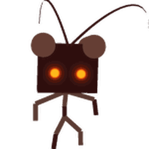

# Stick Bug Challenge

{ align=right width=150 }

The **Stick Bug Challenge** is a boss fight feature that lasts 10 minutes. It is primarily activated when a player talks to [Stick Bug](stick-bug.md) and starts the challenge but can also initiate when a player begins [Spirit Bear](spirit-bear.md)'s "Dancing With Stick Bug" [quest](quests.md), when Onett chooses to activate it globally, and during Beesmas when completing Stick Bug's Beesmas quest or giving him a present. Starting the challenge by yourself requires having given a [translator](translator.md) to Stick Bug, and either costs 50 [tickets](ticket.md) or can be started for free once every 36 hours/1.5 days. The option to pay 50 tickets will be unavailable if the challenge can be started for free. The challenge takes place across the entire server and can be participated in by anyone. Giving a [present](present.md) to Stick Bug or starting the Egg Hunt quest will also start the challenge (if a translator has been given to Stick Bug).

When the challenge starts, a message in the chat appears, saying:  
⚠️ {Username} has started the Stick Bug Challenge! ⚠️  
Then, Stick Bug spawns in the [Sunflower Field](sunflower-field.md). If Onett summons Stick Bug, it would say:  

⚠️ Onett has started the Stick Bug Challenge! ⚠️  
During the challenge, Stick Bug moves around to different fields and fights players using various attacks. After players deal enough damage to Stick Bug, it will go to a different field, leaving a circle of rewards behind. When Stick Bug moves to different fields, it gains more health, becomes faster, gets better attacks (e.g. more [Stick Nymphs](stick-nymph.md) will spawn) and gains a level. During the challenge, a brown window on the side of the screen shows how long the Stick Bug Challenge will be active, what level and which field Stick Bug is in, and how many points the player has obtained so far.

Stick Bug will only appear in the [Sunflower Field](sunflower-field.md), [Clover Field](clover-field.md), [Strawberry Field](strawberry-field.md), [Bamboo Field](bamboo-field.md), [Pineapple Patch](pineapple-patch.md), [Cactus Field](cactus-field.md), [Pumpkin Patch](pumpkin-patch.md) or [Mountain Top Field](mountain-top-field.md). Stick Bug always starts in the Sunflower Field. When Stick Bug moves to a different field, a message in the chat will appear, saying:  

⚠️ Stick Bug's headed to the {Field Name}! ⚠️

## Attacks

Stick Bug will attack in many different ways.

### Normal Behavior and Sequence

Stick Bug will run towards one of the players in the field regularly and before initiating an attack. Getting hit by him will deal damage to the player. Stick Bug's movement speed, his stick nymphs, and his speed in using his attacks increase with his level. He uses a fixed sequence of attacks, with the arrangement of:

* Splinter Trap
* Spinners
* Flailing Sticks
* Summon Stick Nymphs
* Stick Totem
* Flailing Sticks
* Hide
* Stick Flail

Stick Bug uses certain attacks when he reaches certain levels. But he will use the attack in the same pattern.

### Flailing Sticks

Stick Bug moves with the dance emote, and a large red warning circle appears around him with a radius of about 6 [flowers](flowers.md), after a few seconds, he will flail sticks and deal damage (Damage scales from his level). Flails only deal damage by one time and the player cannot be damaged by the same flail again. After a moment, he will summon a few [Stick Nymphs](stick-nymph.md) around himself. The number of Stick Nymphs deployed depends on the emote he used. He will either use:

* The dance emote
* The dance2 emote
* The point emote

### Stick Nymphs

Main article: [Stick Nymph](stick-nymph.md)

Stick Bug moves with the dance3 emote and a large red warning circle appears with a radius of about 6 flowers. After a few seconds, he will wave, and a horde of stick nymphs are summoned inside the red circle. The movement speed, amount of stick nymphs spawned, and the stick nymphs' level are based on Stick Bug's level, increasing as he has higher levels.

If the player had completed Stick Bug's beesmas quest past 2020, there is a chance that he will instead summon a special variant called [Festive Nymphs](festive-nymph.md). They have the same attributes as normal stick nymphs but drop better loot.

### Spinners

3 or 4 (depending on Stick Bug's level) red warning circles appear on the field, they will always be located near the corners of the field, and the spinners have a radius of about 3 flowers. After a while, he will deploy rotating one-bladed flails on the red circles, the speed of the rotations gradually increases as Stick Bug levels up. As Stick Bug reaches higher levels, he will initiate this attack more than once, stacking more than a single blade in a single spot at once. The deployed flails disappear after a while.

### Hiding

After his attack sequence is finished, he will stand still and hide in the field. He becomes 2 dimensional and can be seen by shadows in the flowers. Stick Bug cannot be targetable in this phase; to get him out of the 2d form, players must collect pollen in the affected flowers on his 2d forms. The requirement increases by his level. After putting it down to 0, he will become 3d again and stand still before restarting his attack sequence. Splinter trap will activate after this ability is executed.

### Splinter Trap

Upon hiding, Stick Bug leveling up, or during a level 12+ Stick Bug. Stick Bug stands still for a short time and uses the point emote, after that. Players who contributed to attacking Stick Bug during the current level will become targeted by this attack and get put on by a splinter trap on top of their head/s. The Splinter trap decreases the players' movespeed and jump power by 25% and damages the player by 3 per second.

When a player is trapped in twigs, they will receive a message in the chat, saying:  

You've been trapped in twigs! Collect pollen to remove them.
Note that the splinter trap icon is the same as the [Haste+](ability-tokens.md#Haste) icon.

### Defense Totem

When Stick Bug reaches level 6 and above, Stick Bug will build a defense totem based on a nearby field. When the totem is active, Stick Bug receives 25% defense, decreasing the damage he receives by the same amount. Stick Bug can stack them up to 3 times (75% defense) and will not use this attack when there are 3 consecutive totems active. To destroy the totem, the player/s must collect pollen in the field of the defense totem. Upon destroying a totem, the totem will drop rewards.

<table class="article-table" style="max-width:100%; white-space:nowrap">
<caption>Drop table of Defense Totems
</caption>
<tbody><tr>
<td><a href="honey.html">Honey</a> 

<a href="treat.html">Treats</a> 
<a href="royal-jelly.html">Royal Jellies</a> 
<a href="gumdrops.html">Gumdrops</a> 
<a href="pineapple.html">Pineapples</a> 
<a href="sunflower-seed.html">Sunflower Seeds</a> 
<a href="oil.html">Oils</a> 
<a href="enzymes.html">Enzymes</a>

</td></tr></tbody></table>

Stick Bug builds a totem in the following fields. Note that the fields he summons the totems are based on the field he is currently standing in:

* **Lua error in Module:Item\_image at line 88: Template error! There's no such file named File:Mushroom Field Icon.png for Template:I.**[Mushroom Field](mushroom-field.md)
* **Lua error in Module:Item\_image at line 88: Template error! There's no such file named File:Dandelion Field Icon.png for Template:I.**[Dandelion Field](dandelion-field.md)
* **Lua error in Module:Item\_image at line 88: Template error! There's no such file named File:Blue Flower Field Icon.png for Template:I.**[Blue Flower Field](blue-flower-field.md)
* **Lua error in Module:Item\_image at line 88: Template error! There's no such file named File:Spider Field Icon.png for Template:I.**[Spider Field](spider-field.md)
* **Lua error in Module:Item\_image at line 88: Template error! There's no such file named File:Stump Field Icon.png for Template:I.**[Stump Field](stump-field.md)
* **Lua error in Module:Item\_image at line 88: Template error! There's no such file named File:Pine Tree Forest Icon.png for Template:I.**[Pine Tree Forest](pine-tree-forest.md)
* **Lua error in Module:Item\_image at line 88: Template error! There's no such file named File:Rose Field Icon.png for Template:I.**[Rose Field](rose-field.md)

A server-wide message is sent when he uses this attack, saying:
⚠️ Stick Bug has built a Defense Totem in the {Field Name}! ⚠️

## Path

After Stick Bug's health is depleted, it will drop loot and then move to another field. The field that Stick Bug moves on to next depends on the field it is currently in. These are all the possible outcomes.

<table class="mw-collapsible mw-collapsed wikitable">
<tbody><tr>
<th>Current Field
</th>
<th>Possible Fields to go
</th></tr>
<tr>
<td>Sunflower Field
</td>
<td>Clover Field 

Strawberry Field

</td></tr>
<tr>
<td>Clover Field
</td>
<td>Sunflower Field 

Bamboo Field

</td></tr>
<tr>
<td>Strawberry Field
</td>
<td>Sunflower Field 

Bamboo Field 
Cactus Field 
Pumpkin Patch

</td></tr>
<tr>
<td>Bamboo Field
</td>
<td>Clover Field 

Pineapple Patch

</td></tr>
<tr>
<td>Pineapple Patch
</td>
<td>Bamboo Field 

Mountain Top Field

</td></tr>
<tr>
<td>Cactus Field
</td>
<td>Strawberry Field 

Pumpkin Patch 
Mountain Top Field

</td></tr>
<tr>
<td>Pumpkin Patch
</td>
<td>Strawberry Field 

Cactus Field 
Mountain Top Field

</td></tr>
<tr>
<td>Mountain Top Field
</td>
<td>Sunflower Field 

Clover Field 
Bamboo Field 
Strawberry Field 
Pineapple Patch 
Cactus Field 
Pumpkin Patch

</td></tr></tbody></table>

## Tips

In this section, there will be some tips to progress further in the Stick Bug Challenge.

* Make sure there are no mobs to distract the players' bees, like the [Mondo Chick](chicks.md#Mondo_Chick), before starting the challenge.
* Level up your bees. Bees with a lower level than Stick Bug would most likely miss its attacks.
* Try to get as many strong players on the server as possible. A way of communicating with other players, like voice chat, can be used. The more players that are doing the challenge, the faster Stick Bug will level up.
* Stickbug has a pattern after landing on a field, which is Flailing sticks then attacking the player.
* Level 12+ Stickbug has a different pattern than Level 1-11, doing 2 Spinner attacks first then attacking the player.
* Try to use most optimal paths to save time traveling between fields.
* The Bamboo Glitch can help stun the stickbug. To do this, go to the stairs in Bamboo.
* Certain equipment can be very useful in the challenge.
  * Many gears boost bee attack in some way.
  * The [Fire](fire-mask.md) and [Demon Masks](demon-mask.md) boost multiple helpful stats, like bee attack and defense, as well as spawning many flames with their passives.
  * The [Gummy Mask](gummy-mask.md)'s Gummy Morph passive greatly boosts [Gummy Bee](gummy-bee.md)'s stats, including attack.
  * The [Dark Scythe](dark-scythe.md) can create Dark Flames, which boost Super-Crit Power. The flames themselves also deal more damage.
  * The [Coconut Canister](coconut-canister.md) has two useful passives, being Inspire Coconuts and Emergency Coconut Shield.
    * When activating the Emergency Coconut Shield, it grants 100% defense and x1.25 bee attack for a few seconds. Try to make the most of these boosts, like using the invincibility to escape or using the increased attack to do lots of damage.
      * It should be activated later on in the challenge. Activating it early would be a waste. Before the Stick Bug Challenge, the shield should be intentionally activated so that there is no risk of it activating early.
  * The [Glider](glider.md) and boots can help with navigating the map or escaping tough situations.
    * The [Coconut Clogs](coconut-clogs.md)/[Gummy Boots](gummy-boots.md)' Coconut Haste Surge can prove useful in a pinch.
* There are many bees that are recommended for the Stick Bug Challenge.
  * Some bees, like [Lion Bee](lion-bee.md), [Precise Bee](precise-bee.md), [Spicy Bee](spicy-bee.md), [Vicious Bee](vicious-bee.md) and [Windy Bee](windy-bee.md) have high attack stats, passive or abilities that do lots of damage.
    * Vicious Bee, Windy Bee and Spicy Bee abilities are helpful for dealing with both Stick Bug and Stick Nymphs as they deal damage to every mob within their range.
      * [Impale](ability-tokens.md#Impale) ability can be used the moment Stick Nymphs are summoned to increase it's efficiency.
      * [Tornado](ability-tokens.md#Tornado) pathing can't be controlled, but you still can lure Sticks Nymphs into it.
  * Bees with helpful gifted hive bonuses like [Brave Bee](brave-bee.md), [Looker Bee](looker-bee.md), [Commander Bee](commander-bee.md), [Rage Bee](rage-bee.md) or [Precise Bee](precise-bee.md) will increase damage output.
  * Certain abilities from bees can grant useful buffs.
    * Precise Bee's Target Practice can boost Super-Crit Chance.
    * Multiple bees have Focus, which boosts Critical Chance.
    * Music Bee's Melody boosts Critical Power.
    * Rage Bee and Spicy Bee have Rage, which boosts attack.
    * Haste-producing bees are also helpful in traversing the map and dodging attacks.
    * Flame Heat gives additional +5% to +25% Bee Attack
    * Digital Bee's [Mind Hack](ability-tokens.md) can stun the Nymphs and Stick Bug.
  * All [gifted bees](gifted-bee.md) have x1.5 attack over their non-gifted counterparts.
  * Certain mutations can grant attack or ability rate bonuses.
  * Certain beequips can grant useful bonuses or abilities.
* Many items can be used to further enhance helpful stats.
  * Using [Stingers](stinger.md) will boost bee attack by 1.5x for 30 seconds.
    * Using stingers activates Star Saw, which can deal lots of damage to both Stick Bug and the Stick Nymphs. (Note that you will need the Supreme Star Amulet with the Star Saw passive in order to use it)
  * The player can use [Oils](oil.md) to increase movespeed, and [Tropical Drinks](tropical-drink.md) to increase the chance for critical hits, each for 10 minutes.
    * [Super Smoothies](super-smoothie.md) can also be used for both improved buffs and an additional +1% Super-Crit Chance.
  * [Coconuts](coconut.md) will deal lots of damage when landing on Stick Bug or any Stick Nymphs.
    * Besides using the coconut item, the two Coconut Canister passives can also summon coconuts.
* Try to save **Lua error in Module:Item\_image at line 88: Template error! There's no such file named File:Invigorating Nectar.png for Template:I.**[Invigorating Nectar](nectar.md) for an additional x1.01 to x1.10 bee attack. The bee attack depends on how much time the nectar has left.
* When Stick Bug builds a defense totem on a nearby field, send the teammate(s) who can deal with it the fastest. For example, if a totem is built in the Blue Flower Field, the player with the best blue pollen collection should be sent to take the totem down.
  * If the defense totem is in the [Stump Field](stump-field.md), send somebody who has taken down the [Stump Snail](stump-snail.md) recently instead of somebody with a Stump Snail still in the field.
  * Stick bug totems can be safely dealt with when Stick Bug hides into flowers, as in this state it's not able to build more and Stick Nymphs are very likely to despawn by player's return to field.
* One teammate can try to lure the Stick Nymphs away from the other players so that their bees will not be distracted by them.
* Place [sprinklers](sprinklers.md) in the field in which Stick Bug is currently in. Since flowers (especially in low-level fields) tend to "drain" quickly, this puts players at risk of dying from the Splinter Trap or losing time when Stick Bug is hiding in flower patches.
  * Clouds can also help with flower regeneration.
* Lag may be an issue for players, so making optimizations, like reducing the graphic settings, could help in the challenge.
* Stand at higher areas like the ramp at the [Pumpkin Patch](pumpkin-patch.md). Stick Nymphs will not be able to reach these places, and most of Stick Bug's attacks will not hit.
* [Sticker Stack](sticker-stack.md) may be useful for the challenge, if it has Bee Movespeed, Critical Power, Super Crit Power or Bee Attack buffs.
* Vector Bee and Precise Bee can help a lot with pollen collection when Stick Bug is hiding in the field.

## Points and Health per Level

Points earned are equal to the amount of damage dealt to Stick Bug multiplied by its level squared (for example, 2,000 damage against a level 6 Stick Bug would be worth 2,000 \* 6 \* 6 = 72,000 points). Sometimes the player may gain a few extra points.

<table class="wikitable">
<tbody><tr>
<th>Level</th>
<th>Health</th>
<th>Points Possible</th>
<th>Total Points Possible
</th></tr>
<tr>
<td>1</td>
<td>1,250</td>
<td>1,250</td>
<td>1,250
</td></tr>
<tr>
<td>2</td>
<td>4,250</td>
<td>17,000</td>
<td>18,250
</td></tr>
<tr>
<td>3</td>
<td>11,750</td>
<td>105,750</td>
<td>124,000
</td></tr>
<tr>
<td>4</td>
<td>24,500</td>
<td>392,000</td>
<td>516,000
</td></tr>
<tr>
<td>5</td>
<td>41,750</td>
<td>1,043,750</td>
<td>1,559,750
</td></tr>
<tr>
<td>6</td>
<td>66,500</td>
<td>2,394,000</td>
<td>3,953,750
</td></tr>
<tr>
<td>7</td>
<td>97,250</td>
<td>4,765,250</td>
<td>8,719,000
</td></tr>
<tr>
<td>8</td>
<td>136,250</td>
<td>8,720,000</td>
<td>17,439,000
</td></tr>
<tr>
<td>9</td>
<td>182,750</td>
<td>14,802,750</td>
<td>32,241,750
</td></tr>
<tr>
<td>10</td>
<td>237,500</td>
<td>23,750,000</td>
<td>55,991,750
</td></tr>
<tr>
<td>11</td>
<td>301,250</td>
<td>36,451,250</td>
<td>92,443,000
</td></tr>
<tr>
<td>12</td>
<td>374,000</td>
<td>53,856,000</td>
<td>146,299,000
</td></tr>
<tr>
<td>13</td>
<td>457,250</td>
<td>77,275,250</td>
<td>223,574,250
</td></tr>
<tr>
<td>14</td>
<td>550,250</td>
<td>107,849,000</td>
<td>331,423,250
</td></tr>
<tr>
<td>15</td>
<td>653,750</td>
<td>147,093,750</td>
<td>478,517,000
</td></tr>
<tr>
<td>16</td>
<td>768,500</td>
<td>196,736,000</td>
<td>675,253,000
</td></tr>
<tr>
<td>17</td>
<td>893,750</td>
<td>258,293,750</td>
<td>933,546,750
</td></tr>
<tr>
<td>18</td>
<td>1,031,000</td>
<td>334,044,000</td>
<td>1,267,590,750
</td></tr>
<tr>
<td>19</td>
<td>1,180,250</td>
<td>426,070,250</td>
<td>1,693,661,000
</td></tr>
<tr>
<td>20</td>
<td>1,341,500</td>
<td>536,600,000</td>
<td>2,230,261,000
</td></tr>
<tr>
<td>21
</td>
<td>1,515,500
</td>
<td>668,335,500
</td>
<td>2,898,596,500
</td></tr>
<tr>
<td>22
</td>
<td>1,703,000
</td>
<td>824,252,000
</td>
<td>3,722,848,500
</td></tr>
<tr>
<td>23
</td>
<td>1,902,500
</td>
<td>1,006,422,500
</td>
<td>4,729,271,000
</td></tr>
<tr>
<td>24
</td>
<td>2,116,250
</td>
<td>1,218,960,000
</td>
<td>5,948,231,000
</td></tr>
<tr>
<td>25
</td>
<td>2,334,250
</td>
<td>1,458,906,250
</td>
<td>7,407,137,250
</td></tr>
<tr>
<td>26
</td>
<td>2,585,000
</td>
<td>1,747,460,000
</td>
<td>9,154,597,250
</td></tr></tbody></table>

## Rewards

### Regular Rewards

All regular rewards are also available in token form.

<table class="article-table">
<tbody><tr>
<td><a href="honey.html">Honey</a> 

<a href="treat.html">Treats</a> 
<a href="royal-jelly.html">Royal Jellies</a> 
<a href="gumdrops.html">Gumdrops</a> 
<a href="magic-bean.html">Magic Beans</a> 
<a href="enzymes.html">Enzymes</a> 
<a href="oil.html">Oils</a> 
<a href="royal-jelly.html#Star_Jelly">Star Jellies</a> (at least 10,000,000 score) 
<a href="smiley-sticker.html">Smiley Sticker</a> (Rare) 
<a href="kazoo.html">Kazoo</a> (Rare) 
<a href="thumbtack.html">Thumbtack</a> (Rare) 
<a href="camo-bandana.html">Camo Bandana</a> (Rare) 
<a href="autumn-sunhat.html">Autumn Sunhat</a> (Extremely Rare) 
<a href="cub-buddy.html#Skins">Stick Cub</a> (Unbelievably Rare) 
<a href="pink-shades.html">Pink Shades</a> (Unbelievably Rare) 
<a href="sticker.html#Sticker_Index">Offline Voucher</a> (Unfathomably Rare) 
<a href="paper-angel.html">Paper Angel</a> (Only During Beesmas) 
<a href="pinecone.html">Pinecone</a> (Only During Beesmas)

</td></tr></tbody></table>

### Amulets

*Main article: [Stick Bug Amulet](stick-bug-amulet.md)*

<table class="sortable fandom-table">
<tbody><tr>
<th>Requirement(s)
</th>
<th>Amulet
</th></tr>
<tr>
<td>At least 1M score, must be at least a level 5 <a href="stick-bug.html">Stick Bug</a>
</td>
<td> Bronze Stick Amulet
</td></tr>
<tr>
<td>At least 8M score, must be at least a level 8 <a href="stick-bug.html">Stick Bug</a>
</td>
<td> Silver Stick Amulet
</td></tr>
<tr>
<td>At least 20M score, must be at least a level 11 <a href="stick-bug.html">Stick Bug</a>
</td>
<td> Gold Stick Amulet
</td></tr>
<tr>
<td>At least 50M score, must be at least a level 13 <a href="stick-bug.html">Stick Bug</a>
</td>
<td> Diamond Stick Amulet
</td></tr></tbody></table>

## Audio

The following music "Stickbug" plays during the challenge.

Upon depleting Stick Bug's health, it will play one of the following audios at random:

## Trivia

* One of the legs on Stick Bug's Defense Totem is slightly lighter than the rest of the totem.
* There is a glitch that when Stick Bug runs into the walls of the ramp next to the Bamboo Field, he will get stuck and not be able to move, then teleport back into the field after a few seconds. Players can use this to their advantage and deal extra damage to Stick Bug without risk of dying.
* There is another, similar glitch where Stick Bug will hit the boundary right up against the [Clover Field](clover-field.md) and fall over for a couple seconds.
* If the challenge ends during the [night](day-night-cycle.md), normal [music](music.md) will start to play instead of the night music.
* When beginning the quest "Dancing With Stick Bug" a Stick Bug Challenge will begin saying "⚠ {Username} has started the Stick Bug Challenge! ⚠", opposed to saying that Stick Bug began the challenge.
  * Even when the player beginning the quest "Dancing With Stick Bug" has completed Stick Bug's Beesmas Quest, Festive Nymphs will not spawn.
* The second in-game message that played before the first Stick Bug Challenge was "Stick Bug will spawn in the Sunflower Field. Work together to defeat him and level him up. The higher the level, the better the rewards."
* If players join a server that has already started the challenge, the stat file will say Stick Bug is level 1, but when Stick Bug is defeated again, the level in the stat file will return to normal.
* Giving [Stick Bug](stick-bug.md) a present will start a Stick Bug Challenge.
* Completing Stick Bug's Beesmas 2020/2021/2024 Summer and Winter/2025 quests will also start a Stick Bug Challenge.
* There is a glitch where if the player dies while having the splinter trap activated, it will still keep the effect and damage the player until they die again.
  * The pollen counter is still there though, and you can remove them by collecting pollen, it is just invisible.
* Stick Bug can walk out of the field to attack the player before retracting back to the field and continuing it's usual attack pattern, this attack is inconsistent, but have persisted ever since the challenge was released.
* When Stick Bug jumps to another field, it maintains its hitbox and can still damage players.
* This is the only permanent challenge in the game that applies to everyone in the server.
