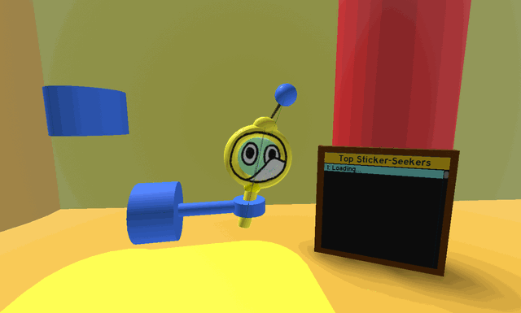

# Sticker-Seeker Quest Machine

{ align=right width=150 }

This piece of content contains information obtained through datamining.

Due to the nature of the information, details may be inaccurate or outdated.

> *This article is about the quest giver. For the tool, see [Sticker-Seeker](sticker-seeker.md).*

The **Sticker-Seeker Quest Machine** is a [quest giver](quest-givers.md) in the [Hive Hub](hive-hub.md). To interact with it, the player must own and have the [Sticker-Seeker](sticker-seeker.md) equipped. The player must also have a total of 15 bees hatched to interact with the machine.

Similar to [Brown Bear](brown-bear.md), [Polar Bear](polar-bear.md), [Honey Bee](honey-bee-npc.md), [Gifted Riley Bee](gifted-riley-bee.md), and [Gifted Bucko Bee](gifted-bucko-bee.md), it can give infinite quests, with extra rewards at certain milestones, up to the 1000th quest.

<figure class="mw-halign-center" style="text-align:center"><figcaption>The Sticker-Seeker Quest Machine and its leaderboard.</figcaption></figure>

## Ranks

A player's rank is the amount of Sticker-Seeker Quest Machine's quests they have completed. Ranks are also the way the Top Sticker-Seekers leaderboard is measured, and increases every time a player completes a quest. The higher the rank, the better the rewards. For example, a player is more likely to get Sticker Planters when they have achieved further ranks than players with a Rank of 5. Quest requirement amounts also scale to the ranks.

## Quests

Obtaining and turning in [quests](quests.md) from this quest giver require the player to have the Sticker-Seeker equipped.

The only quest it can give is **🔎 Sticker-Seeker: Rank *X***, where *X* represents the quest's rank.

2 requirements will always show up in this quest, along with many other requirements:

* finding a number of [Seeker Stickers](sticker.md#Seeker_Stickers) hidden around the map,
* and collecting pollen with the [Sticker-Seeker](sticker-seeker.md).

### Seeker Stickers requirement

The game will always generate 2 more Seeker Stickers than is required to complete the quest, and Seeker Stickers that have not yet been found by the player will change their positions every 2 days.

The first 26 ranks' Seeker Sticker locations are predetermined, shown in the table below:

<table class="article-table mw-collapsible mw-collapsed">
<tbody><tr>
<th>Rank
</th>
<th>Requirements
</th></tr>
<tr>
<td>Rank <b>1</b>
</td>
<td>Find 2 Seeker Stickers Hidden in the 5 Bee Zone.
</td></tr>
<tr>
<td>Rank <b>2</b>
</td>
<td>Find 2 Seeker Stickers Hidden in the 10 Bee Zone.
</td></tr>
<tr>
<td>Rank <b>3</b>
</td>
<td>Find 2 Seeker Stickers Hidden in the Starter Zone.
</td></tr>
<tr>
<td>Rank <b>4</b>
</td>
<td>Find 2 Seeker Stickers Hidden in the 20 Bee Zone or the 5 Bee Zone.
</td></tr>
<tr>
<td>Rank <b>5</b>
</td>
<td>Find 3 Seeker Stickers Hidden in the 10 Bee Zone or the Starter Zone.
</td></tr>
<tr>
<td>Rank <b>6</b>
</td>
<td>Find 3 Seeker Stickers Hidden in the 5 Bee Zone or the 10 Bee Zone.
</td></tr>
<tr>
<td>Rank <b>7</b>
</td>
<td>Find 3 Seeker Stickers Hidden in HQs.
</td></tr>
<tr>
<td>Rank <b>8</b>
</td>
<td>Find 3 Seeker Stickers Hidden in the 5 Bee Zone or the 20 Bee Zone.
</td></tr>
<tr>
<td>Rank <b>9</b>
</td>
<td>Find 3 Seeker Stickers Hidden in the Starter Zone or 10 Bee Zone.
</td></tr>
<tr>
<td>Rank <b>10</b>
</td>
<td>Find 3 Seeker Stickers Hidden in Zones that require 10 Bees or less. 

This includes:

<ul><li>the Starter Zone</li>
<li>the 5 Bee Zone</li>
<li>the 10 Bee Zone</li></ul>
</td></tr>
<tr>
<td>Rank <b>11</b>
</td>
<td>Find 4 Seeker Stickers Hidden in the 25 Bee Zone.
</td></tr>
<tr>
<td>Rank <b>12</b>
</td>
<td>Find 4 Seeker Stickers Hidden in the 10 Bee Zone or the 15 Bee Zone.
</td></tr>
<tr>
<td>Rank <b>13</b>
</td>
<td>Find 4 Seeker Stickers Hidden in Shops.
</td></tr>
<tr>
<td>Rank <b>14</b>
</td>
<td>Find 4 Seeker Stickers Hidden in the 15 Bee Zone or the 20 Bee Zone.
</td></tr>
<tr>
<td>Rank <b>15</b>
</td>
<td>Find 4 Seeker Stickers Hidden in Zones that require 15 Bees or less. 

This includes:

<ul><li>the Starter Zone</li>
<li>the 5 Bee Zone</li>
<li>the 10 Bee Zone</li>
<li>the 15 Bee Zone</li></ul>
</td></tr>
<tr>
<td>Rank <b>16</b>
</td>
<td>Find 4 Seeker Stickers Hidden in the Starter Zone or the 25 Bee Zone.
</td></tr>
<tr>
<td>Rank <b>17</b>
</td>
<td>Find 4 Seeker Stickers Hidden in the 15 Bee Zone or HQs.
</td></tr>
<tr>
<td>Rank <b>18</b>
</td>
<td>Find 4 Seeker Stickers Hidden in the 5 Bee Zone, the 10 Bee Zone, or the 25 Bee Zone.
</td></tr>
<tr>
<td>Rank <b>19</b>
</td>
<td>Find 4 Seeker Stickers Hidden in the Starter Zone or the 20 Bee Zone.
</td></tr>
<tr>
<td>Rank <b>20</b>
</td>
<td>Find 4 Seeker Stickers Hidden in Zones that require up to 20 Bees. 

This includes:

<ul><li>the Starter Zone</li>
<li>the 5 Bee Zone</li>
<li>the 10 Bee Zone</li>
<li>the 15 Bee Zone</li>
<li>the 20 Bee Zone</li></ul>
</td></tr>
<tr>
<td>Rank <b>21</b>
</td>
<td>Find 5 Seeker Stickers Hidden in the 25 Bee Zone or the 30 Bee Zone.
</td></tr>
<tr>
<td>Rank <b>22</b>
</td>
<td>Find 4 Seeker Stickers Hidden in Zones that require 15 Bees or less. 

This includes:

<ul><li>the Starter Zone</li>
<li>the 5 Bee Zone</li>
<li>the 10 Bee Zone</li>
<li>the 15 Bee Zone</li></ul>
</td></tr>
<tr>
<td>Rank <b>23</b>
</td>
<td>Find 4 Seeker Stickers Hidden in the 20 Bee Zone, the 25 Bee Zone, or HQs.
</td></tr>
<tr>
<td>Rank <b>24</b>
</td>
<td>Find 5 Seeker Stickers Hidden in the Starter Zone.
</td></tr>
<tr>
<td>Rank <b>25</b>
</td>
<td>Find 5 Seeker Stickers Hidden in the 5 Bee Zone or the 10 Bee Zone.
</td></tr>
<tr>
<td>Rank <b>26</b>
</td>
<td>Find 5 Seeker Stickers Hidden in Zones that require up to 30 Bees. 

This includes:

<ul><li>the Starter Zone</li>
<li>the 5 Bee Zone</li>
<li>the 10 Bee Zone</li>
<li>the 15 Bee Zone</li>
<li>the 20 Bee Zone</li>
<li>the 25 Bee Zone</li>
<li>the 30 Bee Zone</li></ul>
</td></tr></tbody></table>

Past the 26th quests, the requirement is randomly generated.

<table class="article-table">
<tbody><tr>
<td>
<ul><li>Find 5 (6 if the quest's rank is higher than or equal to 500) Seeker Stickers Hidden in [pick 3 zones from the following pool]:
<ul><li>the Starter Zone</li>
<li>the 5 Bee Zone</li>
<li>the 10 Bee Zone</li>
<li>the 15 Bee Zone</li>
<li>the 20 Bee Zone</li>
<li>the 25 Bee Zone</li>
<li>Shops</li>
<li>HQs</li>
<li>30 Bee Zone (On rank 40 and onwards)</li>
<li>35 Bee Zone (On rank 80 and onwards)</li></ul></li></ul>
</td></tr></tbody></table>

### Pollen requirement

The amount of pollen required is equal to \(P(X)=100000+99900000\times {Q(X)}^{2.25}+25000\times (X-1)+\Delta (X)\), floored to the nearest \(S(P(X))\)
.

* *X* represents the quest's rank, or the player's rank plus 1.
* \(Q(X)\) is equal to \({\frac {X-1}{499}}\), clamped between 0 and 1.
* \(\Delta(X)\) is equal to:
  * *0* if \(X\leq 500\)
  * \(1000000\times (X-500)\) otherwise
* \(S(P(X))\) is equal to:
  * *50000* if \(P(X)\geq 1,000,000\)
  * *25000* if \(500,000\leq P(X)<1,000,000\)
  * *10000* if \(100,000\leq P(X)<500,000\)
  * *5000* if \(25,000\leq P(X)<100,000\)
  * *1000* if \(P(X)<25,000\)

### Other requirements

The remaining requirements are randomly picked from a pool. The number of extra requirements given starts at 1, increases to 2 at quest 100, and finally to 3 at quest 250. The same requirement cannot appear 2 quest ranks in a row.

The requirements are chosen using the following steps:

* All possible requirements are added to a pool, if they:
  * have not appeared in the last quest,
  * and the player has reached the minimum rank requirement for it to appear.
* Each requirement is then given a weight, and the game picks out one requirement using said weights. The probability of a quest being picked is equal to its weight divided by the sum of all requirements' weights in the pool.
* After a requirement is picked, it is removed from the pool, and another one is picked until it has reached its limit of requirements.

Below is a list of all possible requirements, along with its minimum rank requirement and its weight. For requirements with two given values, use the first value for any rank between 1 and 149, and the second value for any rank from 150 onwards.

<table class="article-table mw-collapsible mw-collapsed">
<tbody><tr>
<th>Requirement
</th>
<th>Minimum rank requirement
</th>
<th>Weight
</th></tr>
<tr>
<td>Collect 6 or 20 Stickers (without Trading).</td>
<td>0</td>
<td>7
</td></tr>
<tr>
<td>Donate 1 or 7 Stickers to the Public Sticker Board.</td>
<td>0</td>
<td>10
</td></tr>
<tr>
<td>Collect 3 or 12 <a href="sticker.html">Sticker Tokens.</a></td>
<td>0</td>
<td>6
</td></tr>
<tr>
<td>Collect 1 or 3 Stickers from <a href="sprout.html">Sprouts</a>.</td>
<td>8</td>
<td>3
</td></tr>
<tr>
<td>Find 7 or 8 Hidden Stickers on Surfaces around the Map.</td>
<td>10</td>
<td>8
</td></tr>
<tr>
<td>Collect 1 or 5 Stickers spawned by your <a href="tools.html">Tool</a> while Gathering.</td>
<td>10</td>
<td>6
</td></tr>
<tr>
<td>Collect a Sticker from <a href="leaves.html">Leaves</a>.</td>
<td>15</td>
<td>6
</td></tr>
<tr>
<td>Collect 1 or 3 Stickers found by your <a href="bees.html">Bees</a> while Gathering.</td>
<td>20</td>
<td>5
</td></tr>
<tr>
<td>Print 1 or 3 Stickers with the <a href="sticker-printer.html">Sticker Printer</a>.</td>
<td>25</td>
<td>7
</td></tr>
<tr>
<td>Collect 1 or 2 Stickers from <a href="puffshroom.html">Puffshrooms</a>.</td>
<td>30</td>
<td>4
</td></tr>
<tr>
<td>Collect a Sticker from <a href="wild-windy-bee.html">Wild Windy Bee</a>.</td>
<td>35</td>
<td>4
</td></tr>
<tr>
<td>Discard 5 or 25 Stickers.</td>
<td>40</td>
<td>10
</td></tr>
<tr>
<td>Collect 1 or 3 Stickers from <a href="planter.html">Planters</a>.</td>
<td>45</td>
<td>3
</td></tr>
<tr>
<td>Collect a Sticker from <a href="fireflies.html">Fireflies</a>.</td>
<td>50</td>
<td>4
</td></tr>
<tr>
<td>Collect a Sticker from the <a href="public-sticker-board.html">Public Sticker Board</a>.</td>
<td>100</td>
<td>4
</td></tr></tbody></table>

On every 10th quest, there is also an extra requirement:

<table class="article-table">
<tbody><tr>
<td>
<ul><li>Add \(\left\lfloor {\frac {X+1}{2}}\right\rfloor\) Stickers to the <a href="sticker-stack.html">Sticker Stack</a>.</li></ul>
</td></tr></tbody></table>

## Rewards

Every quest reward always includes (assuming X is the quest's rank, clamped between 1 and 100000):

* \(\left\lfloor {\frac {P(X)\times 2}{50000}}\right\rfloor \times 50000\) [Honey](honey.md), where \(P(X)\) is the amount of pollen the player collected to finish the quest
* \(\min(1+\left\lfloor {\frac {X}{100}}\right\rfloor ,5)\) [Tickets](ticket.md)
* \(\max(\left\lfloor {\frac {X}{4}}\right\rfloor ,1)\) [Royal Jellies](royal-jelly.md)
* One of:
  * 1 [Soft Wax](soft-wax.md)
  * 1 [Neonberry](neonberry.md)
  * 1 [Micro-Converter](micro-converter.md)
  * 1 [Field Dice](field-dice.md)
  * 3 [Whirligigs](whirligig.md)
* A random [Sticker](sticker.md)

There are also multiple quest milestones, which gives extra rewards like certain Stickers, [Eggs](egg.md) and [Sticker Planters](sticker-planter.md) for completing them.

If a [Sticker Planter](sticker-planter.md) is not guaranteed from reaching a quest milestone, the player also has a 2 to 5% chance to receive a [Sticker Planter](sticker-planter.md) from the quest. The chance increases quadratically from rank 1 to 500, where it maxes out at 5%. More specifically, the formula for determining the probability of a quest giving the player a [Sticker Planter](sticker-planter.md) is \(2\%+3\%\times {({\frac {X-1}{499}})}^{2}\), where X is the quest's rank.

### Sticker reward

The sticker reward is chosen based on the following process:

* Every attainable sticker is added to a pool. Then, stickers are removed from the pool if:
  * the player has not satisfied the sticker's minimum quest rank requirement,
  * the sticker is guaranteed because the player has reached a milestone,
  * or the sticker cannot be obtained because of [the player's spread ID](sticker.md#Player_Spread).
* Every sticker remaining in the pool is given a range of weight values. The weight values are given below:

*Note: If multiple stickers are listed, only 1 of them can be attained at a time based on the player's spread ID.*   
Show/hide table

<table class="article-table mw-collapsible mw-collapsed" id="mw-customcollapsible-StickerSeeker-BoundsTable" style="text-align:center">
<tbody><tr>
<th>Sticker
</th>
<th>Minimum quest requirement
</th>
<th>Weight lower bound
</th>
<th>Weight upper bound
</th></tr>
<tr>
<td>Yellow Umbrella
</td>
<td>0
</td>
<td>1
</td>
<td>0.25
</td></tr>
<tr>
<td>Green Check Mark
</td>
<td>0
</td>
<td>0.6
</td>
<td>0.3
</td></tr>
<tr>
<td>Green Plus Sign
</td>
<td>0
</td>
<td>0.6
</td>
<td>0.3
</td></tr>
<tr>
<td>Yellow Left Arrow OR Yellow Right Arrow
</td>
<td>0
</td>
<td>1.5
</td>
<td>1
</td></tr>
<tr>
<td>Thumbs Up Hand OR Peace Sign Hand
</td>
<td>5
</td>
<td>1.5
</td>
<td>1
</td></tr>
<tr>
<td>Simple Cloud
</td>
<td>10
</td>
<td>1
</td>
<td>0.5
</td></tr>
<tr>
<td>Tough Potato
</td>
<td>10
</td>
<td colspan="2">0.4
</td></tr>
<tr>
<td>Standing Bean Bug
</td>
<td>10
</td>
<td colspan="2">0.02
</td></tr>
<tr>
<td>Coiled Snake
</td>
<td>15
</td>
<td colspan="2">0.2
</td></tr>
<tr>
<td>Pink Chair
</td>
<td>15
</td>
<td colspan="2">0.1
</td></tr>
<tr>
<td>Nessie
</td>
<td>18
</td>
<td colspan="2">0.001
</td></tr>
<tr>
<td>Lightning
</td>
<td>20
</td>
<td>1
</td>
<td>0.5
</td></tr>
<tr>
<td>Grey Diamond Logo
</td>
<td>20
</td>
<td colspan="2">0.2
</td></tr>
<tr>
<td>Basic Red Hive Skin
</td>
<td>20
</td>
<td colspan="2">0.03
</td></tr>
<tr>
<td>Basic Blue Hive Skin
</td>
<td>20
</td>
<td colspan="2">0.03
</td></tr>
<tr>
<td>Blue And Green Marble OR Orange Swirled Marble OR Yellow Swirled Marble
</td>
<td>25
</td>
<td>0.1
</td>
<td>0.2
</td></tr>
<tr>
<td>Doodle S
</td>
<td>30
</td>
<td colspan="2">0.4
</td></tr>
<tr>
<td>4-Pronged Vector Bee
</td>
<td>30
</td>
<td colspan="2">0.02
</td></tr>
<tr>
<td>Taunting Doodle Person
</td>
<td>35
</td>
<td colspan="2">0.02
</td></tr>
<tr>
<td>Orange Step Array OR Orange Green Tri Deco
</td>
<td>40
</td>
<td>0.1
</td>
<td>0.2
</td></tr>
<tr>
<td>Squashed Head Bear
</td>
<td>40
</td>
<td colspan="2">0.02
</td></tr>
<tr>
<td>Stretched Head Bear
</td>
<td>40
</td>
<td colspan="2">0.02
</td></tr>
<tr>
<td>Shining Halo
</td>
<td>50
</td>
<td colspan="2">0.1
</td></tr>
<tr>
<td>Wall Crack
</td>
<td>50
</td>
<td colspan="2">0.02
</td></tr>
<tr>
<td>Auryn
</td>
<td>50
</td>
<td colspan="2">0.005
</td></tr>
<tr>
<td>Black Star
</td>
<td>70
</td>
<td colspan="2">0.02
</td></tr>
<tr>
<td>Prism Painting OR Banana Painting
</td>
<td>75
</td>
<td colspan="2">0.1
</td></tr>
<tr>
<td>Prehistoric Hand OR Prehistoric Boar
</td>
<td>80
</td>
<td colspan="2">0.02
</td></tr>
<tr>
<td>Basic Pink Hive Skin
</td>
<td>80
</td>
<td colspan="2">0.015
</td></tr>
<tr>
<td>Basic Green Hive Skin
</td>
<td>80
</td>
<td colspan="2">0.015
</td></tr>
<tr>
<td>Abstract Color Painting
</td>
<td>90
</td>
<td colspan="2">0.02
</td></tr>
<tr>
<td>Ionic Column Middle
</td>
<td>100
</td>
<td colspan="2">0.3
</td></tr>
<tr>
<td>Ionic Column Top OR Ionic Column Base
</td>
<td>100
</td>
<td colspan="2">0.2
</td></tr>
<tr>
<td>Dapper From Above
</td>
<td>100
</td>
<td colspan="2">0.005
</td></tr>
<tr>
<td>Pearl Girl
</td>
<td>150
</td>
<td colspan="2">0.02
</td></tr>
<tr>
<td>Royal Bear
</td>
<td>160
</td>
<td colspan="2">0.02
</td></tr>
<tr>
<td>Basic White Hive Skin
</td>
<td>200
</td>
<td colspan="2">0.007
</td></tr>
<tr>
<td>Basic Black Hive Skin
</td>
<td>200
</td>
<td colspan="2">0.007
</td></tr></tbody></table>

* To calculate a sticker's true weight, the following formula is used: \(weight=leftBound+(rightBound-leftBound)\times \min({\frac {X-1}{499}},1)\), where X is the quest's rank.
* The probability of getting a sticker can now be found by dividing the sticker's true weight by the sum of the true weight of every sticker in the pool.

Below is a table containing the probability of getting a certain sticker at some quest milestones, ignoring guaranteed sticker milestones. For a more detailed table, see the [linked subarticle](sticker-seeker-quest-machine-probability.md).

Show/hide table

<table class="article-table mw-collapsible mw-collapsed" id="mw-customcollapsible-StickerSeeker-ProbabilityTable">
<tbody><tr>
<th rowspan="2">Sticker
</th>
<th colspan="6">
 Rarity 

</th></tr>
<tr>
<th>Rank 0
</th>
<th>Rank 100
</th>
<th>Rank 200
</th>
<th>Rank 300
</th>
<th>Rank 400
</th>
<th>Rank 500
</th></tr>
<tr>
<td>Yellow Umbrella
</td>
<td>10.28%
</td>
<td>9.34%
</td>
<td>8.27%
</td>
<td>7.016%
</td>
<td>5.55%
</td>
<td>3.8%
</td></tr>
<tr>
<td>Green Check Mark
</td>
<td>6.17%
</td>
<td>5.93%
</td>
<td>5.67%
</td>
<td>5.36%
</td>
<td>4.99%
</td>
<td>4.56%
</td></tr>
<tr>
<td>Green Plus Sign
</td>
<td>6.17%
</td>
<td>5.93%
</td>
<td>5.67%
</td>
<td>5.36%
</td>
<td>4.99%
</td>
<td>4.56%
</td></tr>
<tr>
<td>Yellow Left Arrow OR Yellow Right Arrow
</td>
<td>15.41%
</td>
<td>15.38%
</td>
<td>15.34%
</td>
<td>15.3%
</td>
<td>15.25%
</td>
<td>15.19%
</td></tr>
<tr>
<td>Thumbs Up Hand OR Peace Sign Hand
</td>
<td>-
</td>
<td>15.38%
</td>
<td>15.34%
</td>
<td>15.3%
</td>
<td>15.25%
</td>
<td>15.19%
</td></tr>
<tr>
<td>Simple Cloud
</td>
<td>-
</td>
<td>9.89%
</td>
<td>9.44%
</td>
<td>8.93%
</td>
<td>8.32%
</td>
<td>7.59%
</td></tr>
<tr>
<td>Tough Potato
</td>
<td>-
</td>
<td>4.39%
</td>
<td>4.72%
</td>
<td>5.097%
</td>
<td>5.54%
</td>
<td>6.074%
</td></tr>
<tr>
<td>Standing Bean Bug
</td>
<td>-
</td>
<td>0.22%
</td>
<td>0.24%
</td>
<td>0.25%
</td>
<td>0.28%
</td>
<td>0.3%
</td></tr>
<tr>
<td>Coiled Snake
</td>
<td>-
</td>
<td>2.2%
</td>
<td>2.36%
</td>
<td>2.55%
</td>
<td>2.77%
</td>
<td>3.037%
</td></tr>
<tr>
<td>Pink Chair
</td>
<td>-
</td>
<td>1.098%
</td>
<td>1.18%
</td>
<td>1.27%
</td>
<td>1.39%
</td>
<td>1.52%
</td></tr>
<tr>
<td>Nessie
</td>
<td>-
</td>
<td>0.011%
</td>
<td>0.012%
</td>
<td>0.013%
</td>
<td>0.014%
</td>
<td>0.015%
</td></tr>
<tr>
<td>Lightning
</td>
<td>-
</td>
<td>9.89%
</td>
<td>9.44%
</td>
<td>8.93%
</td>
<td>8.32%
</td>
<td>7.59%
</td></tr>
<tr>
<td>Grey Diamond Logo
</td>
<td>-
</td>
<td>2.2%
</td>
<td>2.36%
</td>
<td>2.55%
</td>
<td>2.77%
</td>
<td>3.037%
</td></tr>
<tr>
<td>Basic Red Hive Skin
</td>
<td>-
</td>
<td>0.33%
</td>
<td>0.35%
</td>
<td>0.38%
</td>
<td>0.42%
</td>
<td>0.46%
</td></tr>
<tr>
<td>Basic Blue Hive Skin
</td>
<td>-
</td>
<td>0.33%
</td>
<td>0.35%
</td>
<td>0.38%
</td>
<td>0.42%
</td>
<td>0.46%
</td></tr>
<tr>
<td>Blue And Green Marble OR Orange Swirled Marble OR Yellow Swirled Marble
</td>
<td>-
</td>
<td>1.32%
</td>
<td>1.65%
</td>
<td>2.038%
</td>
<td>2.49%
</td>
<td>3.037%
</td></tr>
<tr>
<td>Doodle S
</td>
<td>-
</td>
<td>4.39%
</td>
<td>4.72%
</td>
<td>5.097%
</td>
<td>5.54%
</td>
<td>6.074%
</td></tr>
<tr>
<td>4-Pronged Vector Bee
</td>
<td>-
</td>
<td>0.22%
</td>
<td>0.24%
</td>
<td>0.25%
</td>
<td>0.28%
</td>
<td>0.3%
</td></tr>
<tr>
<td>Taunting Doodle Person
</td>
<td>-
</td>
<td>0.22%
</td>
<td>0.24%
</td>
<td>0.25%
</td>
<td>0.28%
</td>
<td>0.3%
</td></tr>
<tr>
<td>Orange Step Array OR Orange Green Tri Deco
</td>
<td>-
</td>
<td>1.32%
</td>
<td>1.65%
</td>
<td>2.038%
</td>
<td>2.49%
</td>
<td>3.037%
</td></tr>
<tr>
<td>Squashed Head Bear
</td>
<td>-
</td>
<td>0.22%
</td>
<td>0.24%
</td>
<td>0.25%
</td>
<td>0.28%
</td>
<td>0.3%
</td></tr>
<tr>
<td>Stretched Head Bear
</td>
<td>-
</td>
<td>0.22%
</td>
<td>0.24%
</td>
<td>0.25%
</td>
<td>0.28%
</td>
<td>0.3%
</td></tr>
<tr>
<td>Shining Halo
</td>
<td>-
</td>
<td>1.098%
</td>
<td>1.18%
</td>
<td>1.27%
</td>
<td>1.39%
</td>
<td>1.52%
</td></tr>
<tr>
<td>Wall Crack
</td>
<td>-
</td>
<td>0.22%
</td>
<td>0.24%
</td>
<td>0.25%
</td>
<td>0.28%
</td>
<td>0.3%
</td></tr>
<tr>
<td>Auryn
</td>
<td>-
</td>
<td>0.055%
</td>
<td>0.059%
</td>
<td>0.064%
</td>
<td>0.069%
</td>
<td>0.076%
</td></tr>
<tr>
<td>Black Star
</td>
<td>-
</td>
<td>0.22%
</td>
<td>0.24%
</td>
<td>0.25%
</td>
<td>0.28%
</td>
<td>0.3%
</td></tr>
<tr>
<td>Prism Painting OR Banana Painting
</td>
<td>-
</td>
<td>1.098%
</td>
<td>1.18%
</td>
<td>1.27%
</td>
<td>1.39%
</td>
<td>1.52%
</td></tr>
<tr>
<td>Prehistoric Hand OR Prehistoric Boar
</td>
<td>-
</td>
<td>0.22%
</td>
<td>0.24%
</td>
<td>0.25%
</td>
<td>0.28%
</td>
<td>0.3%
</td></tr>
<tr>
<td>Basic Pink Hive Skin
</td>
<td>-
</td>
<td>0.16%
</td>
<td>0.18%
</td>
<td>0.19%
</td>
<td>0.21%
</td>
<td>0.23%
</td></tr>
<tr>
<td>Basic Green Hive Skin
</td>
<td>-
</td>
<td>0.16%
</td>
<td>0.18%
</td>
<td>0.19%
</td>
<td>0.21%
</td>
<td>0.23%
</td></tr>
<tr>
<td>Abstract Color Painting
</td>
<td>-
</td>
<td>0.22%
</td>
<td>0.24%
</td>
<td>0.25%
</td>
<td>0.28%
</td>
<td>0.3%
</td></tr>
<tr>
<td>Ionic Column Middle
</td>
<td>-
</td>
<td>3.29%
</td>
<td>3.54%
</td>
<td>3.82%
</td>
<td>4.16%
</td>
<td>4.56%
</td></tr>
<tr>
<td>Ionic Column Top OR Ionic Column Base
</td>
<td>-
</td>
<td>2.2%
</td>
<td>2.36%
</td>
<td>2.55%
</td>
<td>2.77%
</td>
<td>3.037%
</td></tr>
<tr>
<td>Dapper From Above
</td>
<td>-
</td>
<td>0.055%
</td>
<td>0.059%
</td>
<td>0.064%
</td>
<td>0.069%
</td>
<td>0.076%
</td></tr>
<tr>
<td>Pearl Girl
</td>
<td>-
</td>
<td>-
</td>
<td>0.24%
</td>
<td>0.25%
</td>
<td>0.28%
</td>
<td>0.3%
</td></tr>
<tr>
<td>Royal Bear
</td>
<td>-
</td>
<td>-
</td>
<td>0.24%
</td>
<td>0.25%
</td>
<td>0.28%
</td>
<td>0.3%
</td></tr>
<tr>
<td>Basic White Hive Skin
</td>
<td>-
</td>
<td>-
</td>
<td>0.083%
</td>
<td>0.089%
</td>
<td>0.097%
</td>
<td>0.11%
</td></tr>
<tr>
<td>Basic Black Hive Skin
</td>
<td>-
</td>
<td>-
</td>
<td>0.083%
</td>
<td>0.089%
</td>
<td>0.097%
</td>
<td>0.11%
</td></tr></tbody></table>

### Milestones

All known quest milestones are shown in the tables below.

*Note: It is currently impossible to progress past Rank 589 because there are only 291 different stickers in-game and Rank 590 requires 295 stickers stacked, making it impossible to complete.*

### Item Milestones

<table class="article-table mw-collapsible mw-collapsed">
<tbody><tr>
<th>Rank
</th>
<th>Reward
</th></tr>
<tr>
<td>10
</td>
<td><a href="pink-balloon.html">Pink Balloon</a>
</td></tr>
<tr>
<td>25
</td>
<td><a href="egg.html#Silver_Egg">Silver Egg</a>
</td></tr>
<tr>
<td>50
</td>
<td><a href="egg.html#Gold_Egg">Gold Egg</a>
</td></tr>
<tr>
<td>75
</td>
<td><a href="egg.html#Diamond_Egg">Diamond Egg</a>
</td></tr>
<tr>
<td>100
</td>
<td><a href="egg.html#Gifted_Silver_Egg">Gifted Silver Egg</a>
</td></tr>
<tr>
<td>110
</td>
<td><a href="red-balloon.html">Red Balloon</a>
</td></tr>
<tr>
<td>150
</td>
<td><a href="egg.html#Gifted_Gold_Egg">Gifted Gold Egg</a>
</td></tr>
<tr>
<td>200
</td>
<td><a href="egg.html#Gifted_Diamond_Egg">Gifted Diamond Egg</a>
</td></tr>
<tr>
<td>210
</td>
<td><a href="white-balloon.html">White Balloon</a>
</td></tr>
<tr>
<td>300
</td>
<td><a href="egg.html#Mythic_Egg">Mythic Egg</a>
</td></tr>
<tr>
<td>310
</td>
<td><a href="black-balloon.html">Black Balloon</a>
</td></tr>
<tr>
<td>400
</td>
<td><a href="egg.html#Star_Egg">Star Egg</a>
</td></tr>
<tr>
<td>410
</td>
<td>3 <a href="pink-balloon.html">Pink Balloons</a>
</td></tr>
<tr>
<td>500
</td>
<td><a href="egg.html#Gifted_Mythic_Egg">Gifted Mythic Egg</a>
</td></tr>
<tr>
<td>510
</td>
<td>3 <a href="white-balloon.html">White Balloons</a>
</td></tr>
<tr>
<td>600
</td>
<td>3 <a href="egg.html#Gifted_Silver_Egg">Gifted Silver Eggs</a>
</td></tr>
<tr>
<td>610
</td>
<td>3 <a href="white-balloon.html">White Balloons</a>
</td></tr>
<tr>
<td>700
</td>
<td>3 <a href="egg.html#Gifted_Gold_Egg">Gifted Gold Eggs</a>
</td></tr>
<tr>
<td>800
</td>
<td>3 <a href="egg.html#Gifted_Diamond_Egg">Gifted Diamond Eggs</a>
</td></tr>
<tr>
<td>900
</td>
<td>3 <a href="egg.html#Mythic_Egg">Mythic Eggs</a>
</td></tr>
<tr>
<td>1000
</td>
<td>3 <a href="egg.html#Gifted_Mythic_Egg">Gifted Mythic Eggs</a>
</td></tr></tbody></table>

### Sticker Planter Milestones

<table class="article-table mw-collapsible mw-collapsed">
<tbody><tr>
<th>Rank
</th>
<th>Amount
</th></tr>
<tr>
<td>11
</td>
<td>1 <a href="sticker-planter.html">Sticker Planter</a>
</td></tr>
<tr>
<td>33
</td>
<td>1 <a href="sticker-planter.html">Sticker Planter</a>
</td></tr>
<tr>
<td>55
</td>
<td>1 <a href="sticker-planter.html">Sticker Planter</a>
</td></tr>
<tr>
<td>77
</td>
<td>1 <a href="sticker-planter.html">Sticker Planter</a>
</td></tr>
<tr>
<td>99
</td>
<td>1 <a href="sticker-planter.html">Sticker Planter</a>
</td></tr>
<tr>
<td>111
</td>
<td>1 <a href="sticker-planter.html">Sticker Planter</a>
</td></tr>
<tr>
<td>133
</td>
<td>1 <a href="sticker-planter.html">Sticker Planter</a>
</td></tr>
<tr>
<td>144
</td>
<td>1 <a href="sticker-planter.html">Sticker Planter</a>
</td></tr>
<tr>
<td>155
</td>
<td>1 <a href="sticker-planter.html">Sticker Planter</a>
</td></tr>
<tr>
<td>166
</td>
<td>1 <a href="sticker-planter.html">Sticker Planter</a>
</td></tr>
<tr>
<td>199
</td>
<td>1 <a href="sticker-planter.html">Sticker Planter</a>
</td></tr>
<tr>
<td>222
</td>
<td>2 <a href="sticker-planter.html">Sticker Planters</a>
</td></tr>
<tr>
<td>244
</td>
<td>1 <a href="sticker-planter.html">Sticker Planter</a>
</td></tr>
<tr>
<td>255
</td>
<td>1 <a href="sticker-planter.html">Sticker Planter</a>
</td></tr>
<tr>
<td>266
</td>
<td>1 <a href="sticker-planter.html">Sticker Planter</a>
</td></tr>
<tr>
<td>277
</td>
<td>1 <a href="sticker-planter.html">Sticker Planter</a>
</td></tr>
<tr>
<td>333
</td>
<td>3 <a href="sticker-planter.html">Sticker Planters</a>
</td></tr>
<tr>
<td>411
</td>
<td>1 <a href="sticker-planter.html">Sticker Planter</a>
</td></tr>
<tr>
<td>422
</td>
<td>2 <a href="sticker-planter.html">Sticker Planters</a>
</td></tr>
<tr>
<td>444
</td>
<td>4 <a href="sticker-planter.html">Sticker Planters</a>
</td></tr>
<tr>
<td>555
</td>
<td>5 <a href="sticker-planter.html">Sticker Planters</a>
</td></tr></tbody></table>

### Sticker Milestones

*The game chooses which sticker to give the player based on their spread ID. For more information, visit the [linked section](sticker.md#Player_Spread).*

<table class="article-table mw-collapsible mw-collapsed">
<tbody><tr>
<th>Rank
</th>
<th>Reward
</th></tr>
<tr>
<td>20
</td>
<td><a href="sticker.html#Sticker_Index">Doodle S Sticker</a> OR <a href="sticker.html#Sticker_Index">Tough Potato Sticker</a>
</td></tr>
<tr>
<td>40
</td>
<td>Orange Swirled Marble Sticker, Yellow Swirled Marble Sticker OR Blue And Green Marble Sticker
</td></tr>
<tr>
<td>60
</td>
<td>Coiled Snake Sticker OR Grey Diamond Logo Sticker
</td></tr>
<tr>
<td>90
</td>
<td>Orange Step Array Sticker OR Orange Green Tri Deco Sticker
</td></tr>
<tr>
<td>120
</td>
<td>Ionic Column Top Sticker OR Ionic Column Base Sticker
</td></tr>
<tr>
<td>140
</td>
<td>Prism Painting Sticker OR Banana Painting Sticker
</td></tr>
<tr>
<td>180
</td>
<td>Prehistoric Hand Sticker OR Prehistoric Boar Sticker
</td></tr>
<tr>
<td>220
</td>
<td>Ionic Column Middle Sticker
</td></tr>
<tr>
<td>250
</td>
<td>1 <a href="sticker.html#Sticker_Index">Ticket Voucher</a>
</td></tr>
<tr>
<td>350
</td>
<td><a href="sticker.html#Sticker_Index">Basic Green Hive Skin</a> OR <a href="sticker.html#Sticker_Index">Basic Pink Hive Skin</a>
</td></tr>
<tr>
<td>450
</td>
<td><a href="sticker.html#Sticker_Index">Basic White Hive Skin</a> OR <a href="sticker.html#Sticker_Index">Basic Black Hive Skin</a>
</td></tr></tbody></table>

## Trivia

* It is the only [Quest Giver](quest-givers.md) that does not have any dialogue and does not notify to talk to the Machine again after quest completion.
* The Sticker Quest Giver is the fourth randomized [Quest Giver](quest-givers.md) to give [eggs](egg.md) at certain milestones, the other three being [Gifted Riley Bee](gifted-riley-bee.md), [Gifted Bucko Bee](gifted-bucko-bee.md), and [Brown Bear](brown-bear.md).
* The quests it gives always includes the requirements "Collect {amount} of Pollen using [Sticker-Seeker](sticker-seeker.md)," and "Find 2-7 Seeker-Stickers hidden in {zones}."
* Sometimes, a quest requirement can get so long you can’t see part of it.
  * Progressing in the requirement a bit may fix this problem.
* When having the Sticker-Seeker equipped and standing on the pad with the machine in front of it, normally there is a message saying

Your Sticker-Seeker quest is in progress… (if you have not yet completed the quest). However, after standing on the pad for a few seconds, it changes to the next egg reward, and at what rank you will obtain it.

* The Sticker-Seeker Quest Machine has 8 Stickers on it.
* The difficulty of the quests it gives is supposed to scale linearly with the player's rank, up to rank 150. However, due to an oversight, the difficulty instead stays the same until rank 150, where it takes a massive leap.

<table class="mw-collapsible mw-collapsed NavTable">
<tbody><tr>
<th class="NavTitle" colspan="2">Locations
</th></tr>
<tr>
<th class="NavCategory"><a href="fields.html">Fields</a>
</th>
<td class="NavLinks NavLinksBasicOdd"><b><a href="sunflower-field.html">Sunflower Field</a> • <a href="dandelion-field.html">Dandelion Field</a> • <a href="mushroom-field.html">Mushroom Field</a> • <a href="blue-flower-field.html">Blue Flower Field</a> • <a href="clover-field.html">Clover Field</a> • <a href="spider-field.html">Spider Field</a> • <a href="bamboo-field.html">Bamboo Field</a> • <a href="strawberry-field.html">Strawberry Field</a> • <a href="pineapple-patch.html">Pineapple Patch</a> • <a href="stump-field.html">Stump Field</a> • <a href="cactus-field.html">Cactus Field</a> • <a href="pumpkin-patch.html">Pumpkin Patch</a> • <a href="pine-tree-forest.html">Pine Tree Forest</a> • <a href="rose-field.html">Rose Field</a> • <a href="ant-field.html">Ant Field</a> • <a href="hub-field.html">Hub Field</a> • <a href="mountain-top-field.html">Mountain Top Field</a> • <a href="coconut-field.html">Coconut Field</a> • <a href="pepper-patch.html">Pepper Patch</a></b>
</td></tr>
<tr>
<th class="NavCategory"><a href="shops.html">Shops</a>
</th>
<td class="NavLinks NavLinksBasicEven"><b><a href="basic-egg-shop.html">Basic Egg Shop</a> • <a href="boost-market.html">Boost Market</a> • <a href="treat-shop.html">Treat Shop</a> • <a href="gumdrop-shop.html">Gumdrop Shop</a> • <a href="royal-jelly-shop.html">Royal Jelly Shop</a> • <a href="ticket-shop.html">Ticket Shop</a> • <a href="noob-shop.html">Noob Shop</a> • <a href="pro-shop.html">Pro Shop</a> • <a href="magic-bean-shop.html">Magic Bean Shop</a> • <a href="badge-bearer-s-guild.html">Badge Bearer's Guild</a> • <a href="dapper-bear-s-shop.html">Dapper Bear's Shop</a> • <a href="stinger-shop.html">Stinger Shop</a> • <a href="mountain-top-shop.html">Mountain Top Shop</a> • <a href="blue-hq.html">Blue HQ</a> • <a href="red-hq.html">Red HQ</a> • <a href="hub-field-shop.html">Hub Field Shop</a> • <a href="robo-bear-s-shop.html">Robo Bear's Shop</a> • <a href="petal-shop.html">Petal Shop</a> • <a href="coconut-cave.html">Coconut Cave</a> • <a href="ticket-tent.html">Ticket Tent</a> • <a href="robux-shop.html">Robux Shop</a></b>
</td></tr>
<tr>
<th class="NavCategory">Gates
</th>
<td class="NavLinks NavLinksBasicOdd"><b><a href="basic-bee-gate.html">Basic Bee Gate</a> • <a href="brave-bee-gate.html">Brave Bee Gate</a> • <a href="honey-bee-gate.html">Honey Bee Gate</a> • <a href="ant-gate.html">Ant Gate</a> • <a href="lion-bee-gate.html">Lion Bee Gate</a> • <a href="bear-gate.html">Bear Gate</a> • <a href="windy-bee-gate.html">Windy Bee Gate</a></b>
</td></tr>
<tr>
<th class="NavCategory">Machines
</th>
<td class="NavLinks NavLinksBasicEven"><b><a href="honey-dispenser.html">Honey Dispenser</a> • <a href="royal-jelly-dispenser.html">Royal Jelly Dispenser</a> • <a href="treat-dispenser.html">Treat Dispenser</a> • <a href="instant-converter.html">Instant Converter</a> • <a href="wealth-clock.html">Wealth Clock</a> • <a href="moon-amulet-generator.html">Moon Amulet Generator</a> • <a href="memory-match.html">Memory Match</a> • <a href="blue-field-booster.html">Blue Field Booster</a> • <a href="red-field-booster.html">Red Field Booster</a> • <a href="field-booster.html">Field Booster</a> • <a href="blueberry-dispenser.html">Blueberry Dispenser</a> • <a href="strawberry-dispenser.html">Strawberry Dispenser</a> • <a href="blue-extract-dispenser.html">Blue Extract Dispenser</a> • <a href="red-extract-dispenser.html">Red Extract Dispenser</a> • <a href="honeystorm.html">Honeystorm</a> • <a href="special-sprout-summoner.html">Special Sprout Summoner</a> • <a href="free-ant-pass-dispenser.html">Free Ant Pass Dispenser</a> • <a href="ant-pass-dispenser.html">Ant Pass Dispenser</a> • <a href="glue-dispenser.html">Glue Dispenser</a> • <a href="blender.html">Blender</a> • <a href="coconut-dispenser.html">Coconut Dispenser</a> • <a href="mythic-meteor-shower.html">Mythic Meteor Shower</a> • <a href="free-robo-pass-dispenser.html">Free Robo Pass Dispenser</a> • <a href="robo-pass-dispenser.html">Robo Pass Dispenser</a> • <a href="sticker-stack.html">Sticker Stack</a> • <a href="sticker-printer.html">Sticker Printer</a> • <a href="nectar-condenser.html">Nectar Condenser</a></b>
</td></tr>
<tr>
<th class="NavCategory">Transportation
</th>
<td class="NavLinks NavLinksBasicOdd"><b><a href="slingshot.html">Slingshot</a> • <a href="yellow-cannon.html">Yellow Cannon</a> • <a href="blue-cannon.html">Blue Cannon</a> • <a href="red-cannon.html">Red Cannon</a> • <a href="blue-teleporter.html">Blue Teleporter</a> • <a href="red-teleporter.html">Red Teleporter</a></b>
</td></tr>
<tr>
<th class="NavCategory"><a href="leaderboards.html">Leaderboards</a>
</th>
<td class="NavLinks NavLinksBasicEven"><b><a href="daily-top-honeymakers.html">Daily Top Honeymakers</a> • <a href="all-time-top-honeymakers.html">All-Time Top Honeymakers</a> • <a href="all-time-top-battlers-most-battle-points.html">All-Time Top Battlers</a> • Top Ant Exterminators • Fastest Crab Slayers • Top Stick Bug Fighters • Top Bucko Bee Helpers • Top Riley Bee Helpers • <a href="most-commando-captures.html">Most Commando Captures</a> • Top Brown Bear Helpers • All-Time Top Red Collectors • All-Time Top Blue Collectors • All-Time Top White Collectors • Daily Top Red Collectors • Daily Top Blue Collectors • Daily Top White Collectors • Highest Damage to a Single Puffshroom • Tallest Sticker Stack • Highest Robo Bear Challenge Scores • <a href="highest-snowbear-level.html">Highest Snowbear Level</a> • <a href="highest-robo-party-cake-rank.html">Highest Robo Party Cake Rank</a></b>
</td></tr>
<tr>
<th class="NavCategory">Other Places
</th>
<td class="NavLinks NavLinksBasicOdd"><b><a href="hive.html">Hive</a> • <a href="obstacle-courses.html">Obstacle Courses</a> • King Beetle Lair • <a href="white-tunnel.html">White Tunnel</a> • <a href="werewolf-s-cave.html">Werewolf's Cave</a> • <a href="ant-challenge.html">Ant Challenge</a> • <a href="star-hall.html">Star Hall</a> • <a href="gummy-bear-s-lair.html">Gummy Bear's Lair</a> • <a href="ant-challenge-info.html">Ant Challenge Info</a> • <a href="vicious-bee-egg-claim.html">Vicious Bee Claimer</a> • <a href="gummy-bee-egg-claim.html">Gummy Bee Claimer</a> • <a href="wind-shrine.html">Wind Shrine</a> • <a href="mazes.html">Mazes</a> • <a href="hive-hub.html">Hive Hub</a> • <strong class="mw-selflink selflink">Sticker-Seeker Quest Machine</strong></b>
</td></tr>
<tr>
<th class="NavCategory">Event Locations
</th>
<td class="NavLinks NavLinksBasicEven"><b><a href="beesmas-tree.html">Beesmas Tree</a> • <a href="gift-boxes.html">Gift Boxes</a> • <a href="honey-wreath.html">Honey Wreath</a> • <a href="stockings.html">Stockings</a> • <a href="gingerbread-house.html">Gingerbread House</a> • <a href="snowbear-summoner.html">Snowbear Summoner</a> • <a href="beesmas-lights.html">Beesmas Lights</a> • <a href="samovar.html">Samovar</a> • <a href="beesmas-feast.html">Beesmas Feast</a> • <a href="onett-s-lid-art.html">Onett's Lid Art</a> • <a href="wind-shrine.html#Galentine_Shrine">Galentine Shrine</a> • <a href="memory-match.html#Winter_Memory_Match">Winter Memory Match</a> • <a href="snow-machine.html">Snow Machine</a> • <a href="honeyday-candles.html">Honeyday Candles</a> • <a href="robo-party-cake.html">Robo Party Cake</a> • <a href="gummy-beacon.html">Gummy Beacon</a> • <a href="naughty-list.html">Naughty List</a></b>
</td></tr></tbody></table>
