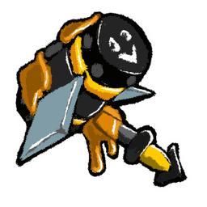
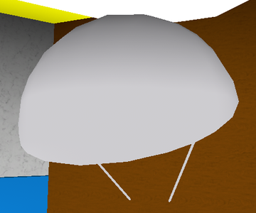
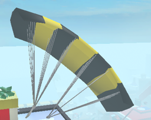

# Sticker-Seeker

> *This article is about the tool. For the quest giver, see [Sticker-Seeker Quest Machine](sticker-seeker-quest-machine.md).*

<table class="infobox templateToolDefault">
<tbody><tr>
<td class="templateToolTitle" colspan="2"><b>Sticker-Seeker</b>
</td></tr>
<tr>
<td colspan="2"><center> <span typeof="mw:Error mw:File"></span></center>
</td></tr>
<tr>
<td class="templateToolHeader" colspan="2">Overview
</td></tr>
<tr>
<td class="templateToolDefaultCell"><b>Price</b>
</td>
<td>1 <a href="glue.html">Glue</a>, 1 <a href="oil.html">Oil</a>, 5 <a href="soft-wax.html">Soft Wax</a>, 5 <a href="neonberry.html">Neonberries</a>, 10 <a href="micro-converter.html">Micro-Converters</a>, 7,000,000 Honey
</td></tr>
<tr>
<td class="templateToolDefaultCell"><b><span style="border-bottom:1px dotted gray;cursor:help;" title="Location where tool can be purchased.">Shop</span></b>
</td>
<td><a href="hub-field-shop.html">Hub Field Shop</a>
</td></tr>
<tr>
<td class="templateToolHeader" colspan="2">Pollen Collection
</td></tr>
<tr>
<td class="templateToolDefaultCell"><b><span style="border-bottom:1px dotted gray;cursor:help;" title="Number of flowers covered">Range</span></b>
</td>
<td>13 Flowers
</td></tr>
<tr>
<td class="templateToolDefaultCell"><b>Collecting Pattern</b>
</td>
<td>Diamond
</td></tr>
<tr>
<td>
</td>
<td>
</td></tr>
<tr>
<td colspan="2">
```tool-pattern
..#..
.###.
##@##
.###.
..#..
```

</td></tr>
<tr>
<td style="templateToolDefaultCell"><b>Collecting Time</b>
</td>
<td>1 second
</td></tr>
<tr>
<td style="templateToolDefaultCell"><b><span style="border-bottom:1px dotted gray;cursor:help;" title="Number of pollen it can collect per flower">Base Collection</span></b>
</td>
<td>10
</td></tr>
<tr>
<td colspan="2"><table align="center" border="0" cellpadding="1" cellspacing="1" class="wikitable templateToolStatsTable" id="collector" style="">
<tbody><tr>
<th><span style="border-bottom:1px dotted gray;cursor:help;" title="amount of pollen collected per flower">Flowers</span></th>
<td>Single</td>
<td>Double</td>
<td>Triple</td>
<td>Large</td>
<td>Star</td>
</tr>
<tr>
<td>White</td>
<td>10</td>
<td>20</td>
<td>30</td>
<td>40</td>
<td>50</td>
</tr>
<tr>
<td>Red</td>
<td>10</td>
<td>20</td>
<td>30</td>
<td>40</td>
<td>50</td>
</tr>
<tr>
<td>Blue</td>
<td>10</td>
<td>20</td>
<td>30</td>
<td>40</td>
<td>50</td>
</tr>
<tr>
<td colspan="7"><i>Special Multiplier(s): Grants the ability to use the Sticker-Seeker Quest Machine, dig up Stickers, and find Seeker-Stickers</i></td>
</tr>
</tbody></table>
</td></tr>
</tbody></table>

The **Sticker-Seeker** is a [tool](tools.md) that was released on the 2024-01-12 update and can be crafted in the [Hub Field Shop](hub-field-shop.md).

<table class="article-table">
<tbody><tr>
<th>Crafting Ingredients
</th></tr>
<tr>
<td>7,000,000 <a href="honey.html"><span class="color-template color-template-honey">Honey</span></a><br/>
<p>1 <a href="glue.html"><span class="color-template color-template-glue color-template-background-clip">Glue</span></a><br/>
1 <a href="oil.html"><span class="color-template color-template-oil color-template-background-clip">Oil</span></a><br/>
5 <a href="soft-wax.html"><span class="color-template color-template-soft-wax">Soft Waxes</span></a><br/>
5 <a href="neonberry.html"><span class="color-template color-template-neonberry color-template-background-clip">Neonberries</span></a><br/>
10 <a href="micro-converter.html"><span class="color-template color-template-micro-converter color-template-background-clip">Micro-Converters</span></a>
</p>
</td></tr></tbody></table>

The **Sticker-Seeker** collects 10 pollen from 13 patches in 1 second. It has a chance to find [Stickers](sticker.md) in fields and unlocks the Sticker-Seeker quest. When you equip the Sticker-Seeker, you have the ability to find [Seeker-Stickers](sticker.md#Seeker_Stickers). Once you click on a Seeker-Sticker, there will be a message on the bottom-right hand corner saying:  
🔎You found a Seeker-Sticker! ({amount} to go)

The Sticker-Seeker has a chance to dig up a sticker in the field you are in. Once you dig it up, like the Seeker-Sticker, it will say: 
Oh! Your **Sticker-Seeker** dug something weird up

The sticker appears as a rainbow token on a random flower on the field you're in.

## Stickers Obtainable from Sticker-Seeker

### Any Field

<table class="mw-collapsible article-table">
<tbody><tr>
<th>Any Field
</th></tr>
<tr>
<td>
<div style="clear:both"></div><span typeof="mw:Error mw:File"></span> Green Plus Sign
<div style="clear:both"></div><span typeof="mw:Error mw:File"></span> Green Check Mark
<div style="clear:both"></div><span typeof="mw:Error mw:File"></span> Yellow Right Arrow
<div style="clear:both"></div><span typeof="mw:Error mw:File"></span> Yellow Left Arrow
<div style="clear:both"></div><span typeof="mw:Error mw:File"></span> Simple Sun
<div style="clear:both"></div><span typeof="mw:Error mw:File"></span> Rubber Duck
<div style="clear:both"></div><span typeof="mw:Error mw:File"></span> Yellow Coffee Mug
<div style="clear:both"></div><span typeof="mw:Error mw:File"></span> Orphan Dog
<div style="clear:both"></div><span typeof="mw:Error mw:File"></span> Interrobang Block
<div style="clear:both"></div><span typeof="mw:Error mw:File"></span> Evil Pig
<div style="clear:both"></div><span typeof="mw:Error mw:File"></span> Red X (uncommon)
<div style="clear:both"></div><span typeof="mw:Error mw:File"></span> Yellow Hi (uncommon)
<div style="clear:both"></div><span typeof="mw:Error mw:File"></span> Alert Icon (rare)
<div style="clear:both"></div><span typeof="mw:Error mw:File"></span> Pizza Delivery Man (rare)
<div style="clear:both"></div><span typeof="mw:Error mw:File"></span> Theatrical Intruder (rare)
<div style="clear:both"></div><span typeof="mw:Error mw:File"></span> Desperate Booth (rare)
<div style="clear:both"></div><span typeof="mw:Error mw:File"></span> Built Ship (rare)
<div style="clear:both"></div><span typeof="mw:Error mw:File"></span> Grey Shape Companion (rare)
<div style="clear:both"></div><span typeof="mw:Error mw:File"></span> Waving Townsperson (rare)
<div style="clear:both"></div><span typeof="mw:Error mw:File"></span> Cop and Robber (rare)
<div style="clear:both"></div><span typeof="mw:Error mw:File"></span> Uplooking Bear (very rare)
<div style="clear:both"></div><span typeof="mw:Error mw:File"></span> Happy Fish (very rare)
<div style="clear:both"></div><span typeof="mw:Error mw:File"></span> Red Palm Hand (extremely rare)
<div style="clear:both"></div><span typeof="mw:Error mw:File"></span> Yellow Sticky Hand (unbelievably rare)
<div style="clear:both"></div><span typeof="mw:Error mw:File"></span> Orange Swirled Marble (unbelievably rare, extremely rare in Hub Field)
<div style="clear:both"></div><span typeof="mw:Error mw:File"></span> Blue And Green Marble (unbelievably rare, extremely rare in Hub Field)
<div style="clear:both"></div><span typeof="mw:Error mw:File"></span> Yellow Swirled Marble (unbelievably rare, extremely rare in Hub Field)
<div style="clear:both"></div><span typeof="mw:Error mw:File"></span> Squashed Head Bear (nearly impossible)
<div style="clear:both"></div><span typeof="mw:Error mw:File"></span> Stretched Head Bear (nearly impossible)
</td></tr></tbody></table>

### Zone Specific

<table class="mw-collapsible article-table">
<tbody><tr>
<th><a href="starter-zone.html">Starter Zone</a>
</th></tr>
<tr>
<td>
<div style="clear:both"></div><span typeof="mw:Error mw:File"></span> Tiny House
<div style="clear:both"></div><span typeof="mw:Error mw:File"></span> Baseball Swing (uncommon)
<div style="clear:both"></div><span typeof="mw:Error mw:File"></span> Green SELL (rare)
</td></tr>
<tr>
<th>5 Bee Zone
</th></tr>
<tr>
<td>
<div style="clear:both"></div><span typeof="mw:Error mw:File"></span> Barcode (rare)
</td></tr>
<tr>
<th>15 Bee Zone
</th></tr>
<tr>
<td>
<div style="clear:both"></div><span typeof="mw:Error mw:File"></span> Giraffe
<div style="clear:both"></div><span typeof="mw:Error mw:File"></span> Taunting Doodle Person (unbelievably rare)
</td></tr>
<tr>
<th>35 Bee Zone
</th></tr>
<tr>
<td>
<div style="clear:both"></div><span typeof="mw:Error mw:File"></span> Prehistoric Hand (very rare)
<div style="clear:both"></div><span typeof="mw:Error mw:File"></span> Prehistoric Boar (very rare)
</td></tr></tbody></table>

### Field Specific

<table class="mw-collapsible article-table">
<tbody><tr>
<th><a href="sunflower-field.html">Sunflower Field</a>
</th></tr>
<tr>
<td>
<div style="clear:both"></div><span typeof="mw:Error mw:File"></span> Sitting Mother Bear (extremely rare)
<div style="clear:both"></div><span typeof="mw:Error mw:File"></span> Orange Step Array (extremely rare)
<div style="clear:both"></div><span typeof="mw:Error mw:File"></span> Leo Star Sign (during nighttime, unfathomably rare)
<div style="clear:both"></div><span typeof="mw:Error mw:File"></span> Sunflower Field Stamp (unfathomably rare)
</td></tr>
<tr>
<th><a href="dandelion-field.html">Dandelion Field</a>
</th></tr>
<tr>
<td>
<div style="clear:both"></div><span typeof="mw:Error mw:File"></span> Flying Magenta Critter (very rare)
<div style="clear:both"></div><span typeof="mw:Error mw:File"></span> Orange Green Tri Deco (extremely rare)
<div style="clear:both"></div><span typeof="mw:Error mw:File"></span> Gemini Star Sign (during nighttime, unfathomably rare)
<div style="clear:both"></div><span typeof="mw:Error mw:File"></span> Dandelion Field Stamp (unfathomably rare)
</td></tr>
<tr>
<th><a href="mushroom-field.html">Mushroom Field</a>
</th></tr>
<tr>
<td>
<div style="clear:both"></div><span typeof="mw:Error mw:File"></span> Aquarius Star Sign (during nighttime, unfathomably rare)
<div style="clear:both"></div><span typeof="mw:Error mw:File"></span> Mushroom Field Stamp (unfathomably rare)
</td></tr>
<tr>
<th><a href="blue-flower-field.html">Blue Flower Field</a>
</th></tr>
<tr>
<td>
<div style="clear:both"></div><span typeof="mw:Error mw:File"></span> Blue Triangle Critter
<div style="clear:both"></div><span typeof="mw:Error mw:File"></span> Libra Star Sign (during nighttime, unfathomably rare)
<div style="clear:both"></div><span typeof="mw:Error mw:File"></span> Blue Flower Field Stamp (unfathomably rare)
</td></tr>
<tr>
<th><a href="clover-field.html">Clover Field</a>
</th></tr>
<tr>
<td>
<div style="clear:both"></div><span typeof="mw:Error mw:File"></span> Round Green Critter (very rare)
<div style="clear:both"></div><span typeof="mw:Error mw:File"></span> Clover Field Stamp (unfathomably rare)
</td></tr>
<tr>
<th><a href="strawberry-field.html">Strawberry Field</a>
</th></tr>
<tr>
<td>
<div style="clear:both"></div><span typeof="mw:Error mw:File"></span> Pink Cupcake (extremely rare)
<div style="clear:both"></div><span typeof="mw:Error mw:File"></span> Strawberry Field Stamp (unfathomably rare)
</td></tr>
<tr>
<th><a href="spider-field.html">Spider Field</a>
</th></tr>
<tr>
<td>
<div style="clear:both"></div><span typeof="mw:Error mw:File"></span> Doodle S (rare)
<div style="clear:both"></div><span typeof="mw:Error mw:File"></span> Forward Facing Spider (extremely rare)
<div style="clear:both"></div><span typeof="mw:Error mw:File"></span> Scorpio Star Sign (during nighttime, unfathomably rare)
<div style="clear:both"></div><span typeof="mw:Error mw:File"></span> Spider Field Stamp (unfathomably rare)
</td></tr>
<tr>
<th><a href="bamboo-field.html">Bamboo Field</a>
</th></tr>
<tr>
<td>
<div style="clear:both"></div><span typeof="mw:Error mw:File"></span> Virgo Star Sign (during nighttime, unfathomably rare)
<div style="clear:both"></div><span typeof="mw:Error mw:File"></span> Bamboo Field Stamp (unfathomably rare)
</td></tr>
<tr>
<th><a href="pineapple-patch.html">Pineapple Patch</a>
</th></tr>
<tr>
<td>
<div style="clear:both"></div><span typeof="mw:Error mw:File"></span> Pisces Star Sign (during nighttime, unfathomably rare)
<div style="clear:both"></div><span typeof="mw:Error mw:File"></span> Pineapple Patch Stamp (unfathomably rare)
</td></tr>
<tr>
<th><a href="stump-field.html">Stump Field</a>
</th></tr>
<tr>
<td>
<div style="clear:both"></div><span typeof="mw:Error mw:File"></span> Capricorn Star Sign (during nighttime, unfathomably rare)
<div style="clear:both"></div><span typeof="mw:Error mw:File"></span> Cancer Star Sign (during nighttime, unfathomably rare)
<div style="clear:both"></div><span typeof="mw:Error mw:File"></span> Stump Field Stamp (unfathomably rare)
</td></tr>
<tr>
<th><a href="cactus-field.html">Cactus Field</a>
</th></tr>
<tr>
<td>
<div style="clear:both"></div><span typeof="mw:Error mw:File"></span> Purple Pointed Critter
<div style="clear:both"></div><span typeof="mw:Error mw:File"></span> Young Elf (very rare)
<div style="clear:both"></div><span typeof="mw:Error mw:File"></span> Cactus Field Stamp (unfathomably rare)
</td></tr>
<tr>
<th><a href="pumpkin-patch.html">Pumpkin Patch</a>
</th></tr>
<tr>
<td>
<div style="clear:both"></div><span typeof="mw:Error mw:File"></span> Jack-O-Lantern (extremely rare)
<div style="clear:both"></div><span typeof="mw:Error mw:File"></span> Orange Step Array (extremely rare)
<div style="clear:both"></div><span typeof="mw:Error mw:File"></span> Orange Green Tri Deco (extremely rare)
<div style="clear:both"></div><span typeof="mw:Error mw:File"></span> Pumpkin Patch Stamp (unfathomably rare)
</td></tr>
<tr>
<th><a href="pine-tree-forest.html">Pine Tree Forest</a>
</th></tr>
<tr>
<td>
<div style="clear:both"></div><span typeof="mw:Error mw:File"></span> Pine Tree Forest Stamp (unfathomably rare)
</td></tr>
<tr>
<th><a href="rose-field.html">Rose Field</a>
</th></tr>
<tr>
<td>
<div style="clear:both"></div><span typeof="mw:Error mw:File"></span> Shrugging Heart (very rare)
<div style="clear:both"></div><span typeof="mw:Error mw:File"></span> Taurus Star Sign (during nighttime, unfathomably rare)
<div style="clear:both"></div><span typeof="mw:Error mw:File"></span> Rose Field Stamp (unfathomably rare)
</td></tr>
<tr>
<th><a href="mountain-top-field.html">Mountain Top Field</a>
</th></tr>
<tr>
<td>
<div style="clear:both"></div><span typeof="mw:Error mw:File"></span> Simple Skyscraper (rare)
<div style="clear:both"></div><span typeof="mw:Error mw:File"></span> Simple Mountain (rare)
<div style="clear:both"></div><span typeof="mw:Error mw:File"></span> Sagittarius Star Sign (during nighttime, unfathomably rare)
<div style="clear:both"></div><span typeof="mw:Error mw:File"></span> Mountain Top Field Stamp (unfathomably rare)
</td></tr>
<tr>
<th><a href="hub-field.html">Hub Field</a>
</th></tr>
<tr>
<td>
<div style="clear:both"></div><span typeof="mw:Error mw:File"></span> Green SELL (rare)
<div style="clear:both"></div><span typeof="mw:Error mw:File"></span> Abstract Color Painting (unbelievably rare)
<div style="clear:both"></div><span typeof="mw:Error mw:File"></span> Hub Field Stamp (unfathomably rare)
</td></tr>
<tr>
<th><a href="pepper-patch.html">Pepper Patch</a>
</th></tr>
<tr>
<td>
<div style="clear:both"></div><span typeof="mw:Error mw:File"></span> Aries Star Sign (unfathomably rare)
<div style="clear:both"></div><span typeof="mw:Error mw:File"></span> Pepper Patch Stamp (unfathomably rare)
</td></tr>
<tr>
<th><a href="coconut-field.html">Coconut Field</a>
</th></tr>
<tr>
<td>
<div style="clear:both"></div><span typeof="mw:Error mw:File"></span> Palm Tree (very rare)
<div style="clear:both"></div><span typeof="mw:Error mw:File"></span> Coconut Field Stamp (unfathomably rare)
</td></tr></tbody></table>

## Trivia

* The Sticker-Seeker is the only tool you can use to spot and obtain Seeker-Stickers as a quest requirement in the [Sticker-Seeker Quest Machine](sticker-seeker-quest-machine.md).
* Not counting the Seeker-Stickers that appear when equipping this tool, the Sticker-Seeker is the only tool in the game with no associated tool sticker. This is ironic considering that the secondary function of this tool revolves around locating stickers.
* This tool bears a striking resemblance to a [magnifying glass](https://en.wikipedia.org/wiki/Magnifying_glass).
* This is tied with the [Pulsar](pulsar.md) and the [Gummyballer](gummyballer.md) for the slowest tool in the game (in terms of how long the cooldown lasts).
* The Sticker-Seeker's raw ingredients cost:
  * 7,000,000 [Honey](honey.md)
  * 150 [Strawberries](strawberry.md)
  * 300 [Sunflower Seeds](sunflower-seed.md)
  * 25 [Honeysuckles](honeysuckle.md)
  * 400 [Pineapples](pineapple.md)
  * 170 [Royal Jellies](royal-jelly.md)
  * 5 [Neonberries](neonberry.md)
  * 150 [Blueberries](blueberry.md)
  * 10 [Micro-Converters](micro-converter.md)

<table class="mw-collapsible mw-collapsed NavTable">
<tbody><tr>
<th class="NavTitle" colspan="2">Tools
</th></tr>
<tr>
<th class="NavCategory">Pollen<br/>Collectors
</th>
<td class="NavLinks NavLinksBasicOdd"><b> <a href="scooper.html">Scooper</a> •  <a href="rake.html">Rake</a> •  <a href="clippers.html">Clippers</a> •  <a href="magnet.html">Magnet</a> •  <a href="vacuum.html">Vacuum</a> •  <a href="super-scooper.html">Super-Scooper</a> •  <a href="pulsar.html">Pulsar</a> •  <a href="electro-magnet.html">Electro-Magnet</a> •  <a href="scissors.html">Scissors</a> •  <a href="honey-dipper.html">Honey Dipper</a> •  <a href="bubble-wand.html">Bubble Wand</a> •  <a href="scythe.html">Scythe</a> •  <strong class="mw-selflink selflink">Sticker-Seeker</strong> •  <a href="golden-rake.html">Golden Rake</a> •  <a href="spark-staff.html">Spark Staff</a> •  <a href="porcelain-dipper.html">Porcelain Dipper</a> •  <a href="petal-wand.html">Petal Wand</a> •  <a href="dark-scythe.html">Dark Scythe</a> •  <a href="tide-popper.html">Tide Popper</a> •  <a href="gummyballer.html">Gummyballer</a> •  <a href="honey-hammer.html">Honey Hammer</a></b>
</td></tr>
<tr>
<th class="NavCategory">Sprinklers
</th>
<td class="NavLinks NavLinksBasicEven"><b><span typeof="mw:Error mw:File"></span> <a href="basic-sprinkler.html">Basic Sprinkler</a> • <span typeof="mw:Error mw:File"></span> <a href="silver-soakers.html">Silver Soakers</a> • <span typeof="mw:Error mw:File"></span> <a href="golden-gushers.html">Golden Gushers</a> • <span typeof="mw:Error mw:File"></span> <a href="diamond-drenchers.html">Diamond Drenchers</a> • <span typeof="mw:Error mw:File"></span> <a href="the-supreme-saturator.html">The Supreme Saturator</a></b>
</td></tr>
<tr>
<th class="NavCategory">Gliding<br/>Tools
</th>
<td class="NavLinks NavLinksBasicOdd"><b> <a href="parachute.html">Parachute</a> •  <a href="glider.html">Glider</a></b>
</td></tr></tbody></table>
