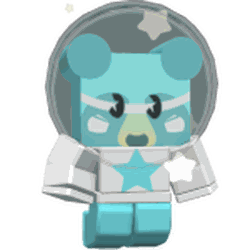

# Sticker Stack

{ align=right width=150 }

<figure class="thumb" style="width: 180px" typeof="mw:File/Thumb">  <figcaption class="thumbcaption"> 
The Sticker Stack while activated
 </figcaption> </figure>

<figure class="thumb" style="width: 180px" typeof="mw:File/Thumb">  <figcaption class="thumbcaption"> 
The icon located on top of the Sticker Stack.
 </figcaption> </figure>

The **Sticker Stack** is located in the [15 Bee Zone](honey-bee-gate.md) next to the [Pine Tree Forest](pine-tree-forest.md) and the [Honey Bee](honey-bee-npc.md). It allows players to donate a [sticker](sticker.md), hive skin, [cub skin](cub-buddy.md) or voucher and receive a boost and item depending on the sticker you donated. The boost lasts for 15 minutes (+10 seconds for every sticker donated, maximum 1 hour). Each type of sticker can only be donated once.

## Usage

To use the Sticker Stack, step into the podium in front of it and open the menu. The player can then choose to either pay 25 [Tickets](ticket.md) or use a sticker that hasn't been stacked yet to activate the stack. Both ways lead to activating the sticker stack, granting the sticker stack [buff](buffs-debuffs.md) with the duration and buffs depending on the past stacked stickers (15-minute base duration with an extra 10 seconds for each sticker stacked, 1-hour maximum duration). Stacking an unused sticker for activating the machine will grant a new buff depending on the stacked sticker and an extra 10 seconds duration to the buff permanently for future activations and the sticker that was stacked cannot be used to stack again. Upon stacking a sticker, the player will be granted rewards also depending on the sticker stacked. Once a player has applied all available stickers to the stack, the boost can only be activated by paying 25 tickets.

<table style="width:100%;">
<tbody><tr style="vertical-align:top;">
<td style="width:50%;">
<table class="article-table mw-collapsible mw-collapsed" data-collapsetext="Hide" data-expandtext="Expand" style="text-align:center">
<tbody><tr>
<th>Max Sticker Stack Buff
</th></tr>
<tr>
<td>+325,000 Capacity 

+10% Blue Bee Convert Rate 
+10% Colorless Bee Convert Rate 
+20% Red Bee Convert Rate 
+175% Convert Rate 
+30% Convert Rate At Hive 
+56% Capacity 
+5% White Field Capacity 
+4% Red Field Capacity 
+2% Blue Field Capacity 
+19% Cactus Field Capacity 
+10% Coconut Field Capacity 
+19% Mountain Top Field Capacity 
+5% Pumpkin Patch Capacity 
+10% Spider Field Capacity 
x1.01 Pollen 
+7.5% Pollen 
+11% White Pollen 
+8% Red Pollen 
+10% Blue Pollen 
+2.5% Gifted Bee Pollen 
+2% Mythic Bee Pollen 
+15% Legendary Bee Pollen 
+2% Ungifted Bee Pollen 
+35% Rare Bee Pollen 
x3 Common Bee Pollen 
+25% Common Bee Pollen 
+20% Epic Bee Pollen 
+8% Event Bee Pollen 
+21% Bee Gather Pollen 
+44% Tool Pollen 
+5% Movement Collection Pollen 
+7% Bomb Pollen 
+10% Buzz Bomb Pollen 
+10% Red Bomb Pollen 
+5% Blue Bomb Pollen 
+0.5% Bee Ability Pollen 
+3% Duped Ability Pollen 
+2% Mark Ability Pollen 
+9% Flame Pollen 
+6% Bubble Pollen 
+10% Scratch Pollen 
+5% Tornado Pollen 
+10% Bamboo Field Pollen 
+10% Blue Flower Field Pollen 
+10% Cactus Field Pollen 
+10% Clover Field Pollen 
+10% Coconut Field Pollen 
+15% Dandelion Field Pollen 
+10% Hub Field Pollen 
+10% Mountain Top Field Pollen 
+15% Mushroom Field Pollen 
+10% Pepper Patch Pollen 
+10% Pine Tree Forest Pollen 
+15% Pineapple Patch Pollen 
+10% Pumpkin Patch Pollen 
+15% Rose Field Pollen 
+10% Spider Field Pollen 
+10% Strawberry Field Pollen 
+15% Stump Field Pollen 
+15% Sunflower Field Pollen 
+4.5% Honey Per Pollen 
+12% Honey At Hive 
+15% Critical Power 
+7% Super-Crit Power 
+10% Honey From Tokens 
+1% Ability Token Lifespan 
+0.5% Bee Movespeed 
+9% Bee Attack 
+1% Gifted Bee Attack 
+0.5% Dodge Chance 
+1 Legendary Bee Attack 
+1% Tool Swing Speed 
+10% Instant Rare Bee Conversion 
+0.5 Blue Bee Attack 
+10 Convert Amount 
+1% Unique Instant Conversion 
+5% Instant Event Bee Conversion 
+5% Instant Colorless Bee Conversion 
+1% Honey Per Goo 
+3% Instant Gifted Bee Conversion 
+20% Instant Bee Gather Conversion 
+2 Epic Bee Attack 
+5% Instant Bomb Conversion 
+2 Rare Bee Attack 
+2% Instant Red Bee Conversion 
+10% Instant Tool Conversion 
+1% Ticket Chance 
+0.25% Bee Ability Rate

</td></tr></tbody></table>
</td>
<td style="width:50%;">
<table class="article-table mw-collapsible mw-collapsed" data-collapsetext="Hide" data-expandtext="Expand">
<tbody><tr>
<th>Max loot a player can obtain from the Sticker Stack
</th></tr>
<tr>
<td>876 <a href="ticket.html">Tickets</a> 

75 <a href="gumdrops.html">Gumdrops</a> 
10 <a href="coconut.html">Coconuts</a> 
30 <a href="stinger.html">Stingers</a> 
18 <a href="micro-converter.html">Micro-Converters</a> 
40 <a href="honeysuckle.html">Honeysuckles</a> 
20 <a href="whirligig.html">Whirligigs</a> 
5 <a href="field-dice.html">Field Dice</a> 
9 <a href="smooth-dice.html">Smooth Dice</a> 
2 <a href="loaded-dice.html">Loaded Dice</a> 
25 <a href="jelly-beans.html">Jelly Beans</a> 
11 <a href="red-extract.html">Red Extracts</a> 
8 <a href="blue-extract.html">Blue Extracts</a> 
15 <a href="glitter.html">Glitter</a> 
4 <a href="glue.html">Glues</a> 
6 <a href="oil.html">Oils</a> 
9 <a href="enzymes.html">Enzymes</a> 
4 <a href="purple-potion.html">Purple Potions</a> 
9 <a href="magic-bean.html">Magic Beans</a> 
11 <a href="cloud-vial.html">Cloud Vials</a> 
1 <a href="box-o-frogs.html">Box-O-Frogs</a> 
1 <a href="ant-pass.html">Ant Pass</a> 
2 <a href="robo-pass.html">Robo Passes</a> 
500 <a href="treat.html">Treats</a> 
50 <a href="sunflower-seed.html">Sunflower Seeds</a> 
100 <a href="strawberry.html">Strawberries</a> 
100 <a href="pineapple.html">Pineapples</a> 
50 <a href="bitterberry.html">Bitterberries</a> 
26 <a href="neonberry.html">Neonberries</a> 
20 <a href="moon-charm.html">Moon Charms</a> 
1 <a href="comforting-vial.html">Comforting Vial</a> 
1 <a href="invigorating-vial.html">Invigorating Vial</a> 
1 <a href="motivating-vial.html">Motivating Vial</a> 
1 <a href="refreshing-vial.html">Refreshing Vial</a> 
1 <a href="satisfying-vial.html">Satisfying Vial</a> 
1 <a href="nectar-shower-vial.html">Nectar Shower Vial</a> 
1 <a href="black-balloon.html">Black Balloon</a> 
36 <a href="soft-wax.html">Soft Waxes</a> 
11 <a href="hard-wax.html">Hard Waxes</a> 
2 <a href="caustic-wax.html">Caustic Waxes</a> 
2 <a href="swirled-wax.html">Swirled Waxes</a> 
5 <a href="paper-planter.html">Paper Planters</a> 
2 <a href="ticket-planter.html">Ticket Planters</a> 
1 <a href="egg.html#Basic_Egg">Basic Egg</a> 
5 <a href="royal-jelly.html">Royal Jellies</a>

</td></tr></tbody></table>
</td></tr></tbody></table>

## Stack Combos

Stack Combos are completed upon adding a certain set of stickers to the Sticker Stack. There are currently two Stack Combos that can be achieved.

<table class="article-table mw-collapsible mw-collapsed" data-collapsetext="Hide" data-expandtext="Expand">
<tbody><tr>
<th>Stickers required
</th>
<th>Reward
</th></tr>
<tr>
<td>Capricorn Star Sign 

Aquarius Star Sign 
Pisces Star Sign 
Aries Star Sign 
Taurus Star Sign 
Gemini Star Sign 
Cancer Star Sign 
Leo Star Sign 
Virgo Star Sign 
Libra Star Sign 
Scorpio Star Sign 
Sagittarius Star Sign

</td>
<td><a href="cub-buddy.html#Skins">Star Cub</a>
</td></tr>
<tr>
<td>White Button Mushroom 

Fly Agaric Mushroom 
Porcini Mushroom 
Oiler Mushroom 
Morel Mushroom 
Chanterelle Mushroom 
Shiitake Mushroom 
Black Truffle Mushroom

</td>
<td><a href="sticker.html#Sticker_Index">Prismatic Mushroom Sticker</a>
</td></tr></tbody></table>

An audio example of multiple stickers being stacked:

## Trivia

* The sticker stack was added in the January 12, 2024 update, along with [stickers](sticker.md) and the [Hive Hub](hub-field.md).
* The Sticker Stack buff ends a few seconds before you can use the Sticker Stack again
* If you get a reward from the sticker stack that contains a limit (like the [Micro-Converter](micro-converter.md)), the capacity limit is ignored and the reward is still given even if the player has the maximum amount.
* The machine is used for the 5 sticker stack badges, but its Grandmaster variant is impossible because it requires 500 different stickers stacked, whereas only 291 stickers currently exist in the game.
* Stacking certain stickers requires extra confirmation to stack them, which includes all vouchers, cub skins, and hive skins.
* A voucher must previously have been redeemed in order to add it to the Sticker Stack.

<table class="mw-collapsible mw-collapsed NavTable">
<tbody><tr>
<th class="NavTitle" colspan="2">Locations
</th></tr>
<tr>
<th class="NavCategory"><a href="fields.html">Fields</a>
</th>
<td class="NavLinks NavLinksBasicOdd"><b><a href="sunflower-field.html">Sunflower Field</a> • <a href="dandelion-field.html">Dandelion Field</a> • <a href="mushroom-field.html">Mushroom Field</a> • <a href="blue-flower-field.html">Blue Flower Field</a> • <a href="clover-field.html">Clover Field</a> • <a href="spider-field.html">Spider Field</a> • <a href="bamboo-field.html">Bamboo Field</a> • <a href="strawberry-field.html">Strawberry Field</a> • <a href="pineapple-patch.html">Pineapple Patch</a> • <a href="stump-field.html">Stump Field</a> • <a href="mixed-brick-field.html">Mixed Brick Field</a> • <a href="blue-brick-field.html">Blue Brick Field</a> • <a href="red-brick-field.html">Red Brick Field</a> • <a href="white-brick-field.html">White Brick Field</a> • <a href="cactus-field.html">Cactus Field</a> • <a href="pumpkin-patch.html">Pumpkin Patch</a> • <a href="pine-tree-forest.html">Pine Tree Forest</a> • <a href="rose-field.html">Rose Field</a> • <a href="ant-field.html">Ant Field</a> • <a href="hub-field.html">Hub Field</a> • <a href="mountain-top-field.html">Mountain Top Field</a> • <a href="coconut-field.html">Coconut Field</a> • <a href="pepper-patch.html">Pepper Patch</a></b>
</td></tr>
<tr>
<th class="NavCategory"><a href="shops.html">Shops</a>
</th>
<td class="NavLinks NavLinksBasicEven"><b><a href="basic-egg-shop.html">Basic Egg Shop</a> • <a href="boost-market.html">Boost Market</a> • <a href="treat-shop.html">Treat Shop</a> • <a href="gumdrop-shop.html">Gumdrop Shop</a> • <a href="royal-jelly-shop.html">Royal Jelly Shop</a> • <a href="ticket-shop.html">Ticket Shop</a> • <a href="noob-shop.html">Noob Shop</a> • <a href="pro-shop.html">Pro Shop</a> • <a href="magic-bean-shop.html">Magic Bean Shop</a> • <a href="badge-bearer-s-guild.html">Badge Bearer's Guild</a> • <a href="dapper-bear-s-shop.html">Dapper Bear's Shop</a> • <a href="stinger-shop.html">Stinger Shop</a> • <a href="mountain-top-shop.html">Mountain Top Shop</a> • <a href="blue-hq.html">Blue HQ</a> • <a href="red-hq.html">Red HQ</a> • <a href="hub-field-shop.html">Hub Field Shop</a> • <a href="robo-bear-s-shop.html">Robo Bear's Shop</a> • <a href="petal-shop.html">Petal Shop</a> • <a href="coconut-cave.html">Coconut Cave</a> • <a href="ticket-tent.html">Ticket Tent</a> • <a href="robux-shop.html">Robux Shop</a></b>
</td></tr>
<tr>
<th class="NavCategory">Gates
</th>
<td class="NavLinks NavLinksBasicOdd"><b><a href="basic-bee-gate.html">Basic Bee Gate</a> • <a href="brave-bee-gate.html">Brave Bee Gate</a> • <a href="honey-bee-gate.html">Honey Bee Gate</a> • <a href="ant-gate.html">Ant Gate</a> • <a href="lion-bee-gate.html">Lion Bee Gate</a> • <a href="bear-gate.html">Bear Gate</a> • <a href="windy-bee-gate.html">Windy Bee Gate</a></b>
</td></tr>
<tr>
<th class="NavCategory">Machines
</th>
<td class="NavLinks NavLinksBasicEven"><b><a href="honey-dispenser.html">Honey Dispenser</a> • <a href="royal-jelly-dispenser.html">Royal Jelly Dispenser</a> • <a href="treat-dispenser.html">Treat Dispenser</a> • <a href="instant-converter.html">Instant Converter</a> • <a href="wealth-clock.html">Wealth Clock</a> • <a href="moon-amulet-generator.html">Moon Amulet Generator</a> • <a href="memory-match.html">Memory Match</a> • <a href="blue-field-booster.html">Blue Field Booster</a> • <a href="red-field-booster.html">Red Field Booster</a> • <a href="field-booster.html">Field Booster</a> • <a href="blueberry-dispenser.html">Blueberry Dispenser</a> • <a href="strawberry-dispenser.html">Strawberry Dispenser</a> • <a href="honeystorm.html">Honeystorm</a> • <a href="special-sprout-summoner.html">Special Sprout Summoner</a> • <a href="free-ant-pass-dispenser.html">Free Ant Pass Dispenser</a> • <a href="ant-pass-dispenser.html">Ant Pass Dispenser</a> • <a href="glue-dispenser.html">Glue Dispenser</a> • <a href="blender.html">Blender</a> • <a href="coconut-dispenser.html">Coconut Dispenser</a> • <a href="mythic-meteor-shower.html">Mythic Meteor Shower</a> • <a href="free-robo-pass-dispenser.html">Free Robo Pass Dispenser</a> • <a href="robo-pass-dispenser.html">Robo Pass Dispenser</a> • <strong class="mw-selflink selflink">Sticker Stack</strong> • <a href="sticker-printer.html">Sticker Printer</a> • <a href="nectar-condenser.html">Nectar Condenser</a></b>
</td></tr>
<tr>
<th class="NavCategory">Transportation
</th>
<td class="NavLinks NavLinksBasicOdd"><b><a href="slingshot.html">Slingshot</a> • <a href="yellow-cannon.html">Yellow Cannon</a> • <a href="blue-cannon.html">Blue Cannon</a> • <a href="red-cannon.html">Red Cannon</a> • <a href="blue-teleporter.html">Blue Teleporter</a> • <a href="red-teleporter.html">Red Teleporter</a></b>
</td></tr>
<tr>
<th class="NavCategory"><a href="leaderboards.html">Leaderboards</a>
</th>
<td class="NavLinks NavLinksBasicEven"><b><a href="daily-top-honeymakers.html">Daily Top Honeymakers</a> • <a href="all-time-top-honeymakers.html">All-Time Top Honeymakers</a> • <a href="all-time-top-battlers-most-battle-points.html">All-Time Top Battlers</a> • Top Ant Exterminators • Fastest Crab Slayers • Top Stick Bug Fighters • Top Bucko Bee Helpers • Top Riley Bee Helpers • <a href="most-commando-captures.html">Most Commando Captures</a> • Top Brown Bear Helpers • All-Time Top Red Collectors • All-Time Top Blue Collectors • All-Time Top White Collectors • Daily Top Red Collectors • Daily Top Blue Collectors • Daily Top White Collectors • Highest Damage to a Single Puffshroom • Tallest Sticker Stack • Highest Robo Bear Challenge Scores • <a href="highest-snowbear-level.html">Highest Snowbear Level</a> • <a href="highest-robo-party-cake-rank.html">Highest Robo Party Cake Rank</a></b>
</td></tr>
<tr>
<th class="NavCategory">Other Places
</th>
<td class="NavLinks NavLinksBasicOdd"><b><a href="hive.html">Hive</a> • <a href="obstacle-courses.html">Obstacle Courses</a> • King Beetle Lair • <a href="white-tunnel.html">White Tunnel</a> • <a href="werewolf-s-cave.html">Werewolf's Cave</a> • <a href="ant-challenge.html">Ant Challenge</a> • <a href="star-hall.html">Star Hall</a> • <a href="gummy-bear-s-lair.html">Gummy Bear's Lair</a> • <a href="ant-challenge-info.html">Ant Challenge Info</a> • <a href="vicious-bee-egg-claim.html">Vicious Bee Egg Claim</a> • <a href="gummy-bee-egg-claim.html">Gummy Bee Egg Claim</a> • <a href="wind-shrine.html">Wind Shrine</a> • <a href="mazes.html">Mazes</a> • <a href="hive-hub.html">Hive Hub</a> • <a href="sticker-seeker-quest-machine.html">Sticker-Seeker Quest Machine</a></b>
</td></tr>
<tr>
<th class="NavCategory">Event Locations
</th>
<td class="NavLinks NavLinksBasicEven"><b><a href="beesmas-tree.html">Beesmas Tree</a> • Computer • <a href="gift-boxes.html">Gift Boxes</a> • <a href="honey-wreath.html">Honey Wreath</a> • <a href="stockings.html">Stockings</a> • <a href="gingerbread-house.html">Gingerbread House</a> • <a href="snowbear-summoner.html">Snowbear Summoner</a> • <a href="beesmas-lights.html">Beesmas Lights</a> • <a href="samovar.html">Samovar</a> • <a href="beesmas-feast.html">Beesmas Feast</a> • <a href="onett-s-lid-art.html">Onett's Lid Art</a> • <a href="wind-shrine.html#Galentine_Shrine">Galentine Shrine</a> • <a href="memory-match.html#Winter_Memory_Match">Winter Memory Match</a> • <a href="snow-machine.html">Snow Machine</a> • <a href="honeyday-candles.html">Honeyday Candles</a> • <a href="robo-party-cake.html">Robo Party Cake</a> • <a href="gummy-beacon.html">Gummy Beacon</a> • <a href="naughty-list.html">Naughty List</a></b>
</td></tr></tbody></table>
