# Sticker

A **Sticker** is a collectible item added in the 2024-01-12 update. They can be placed on the player's [hive](hive.md) by dragging them from the Sticker Book as cosmetics; stacked on the [Sticker Stack](sticker-stack.md); [traded](trading.md) for other stickers, [Beequips](beequip.md), or hive skins; or turned in for [quests](quests.md).

Each sticker has a unique method of obtainment; certain stickers are awarded from achievements, which can only be accomplished once per player, while others spawn on walls around the map, are obtained by the [Sticker Printer](sticker-printer.md), and many other ways.

Stickers will not activate their stack boosts when placed on a hive and only one copy of a sticker can be added to the Sticker Stack.

There is a limit of 50 stickers on a hive at once, and you cannot place stickers on the spawn pad or bee section of your hive.

## Sticker Book

The Sticker Book can be found at the top of the inventory, and holds every sticker the player obtains. On the top right, you can view either the inbox or index. Below this, there are options to upgrade capacity, "Peel All" (peels all hive stickers on the player's hive), and "Sort" (sorts out the stickers by the order they appear in the Sticker Index).

Each slot can hold one sticker. Clicking on a sticker reveals a popup to the right of the book containing details about the sticker. This includes the name, sticker type, total number of that type of sticker in the book, if it's in the [Sticker Stack](sticker-stack.md), the description, the Stack Boost, and the Stack Reward. From there, you can also choose to discard the sticker, which removes it from the Sticker Book permanently, or you can choose to peel if off of your [Hive](hive.md). The peel button will be disabled if the sticker is not on the player's hive. The popup can be closed with the exit button or by clicking the sticker again, but the sticker will still be selected. When a sticker is selected, an X appears in the top left corner of the sticker icon, giving the player another method to discard the sticker. Stickers can be moved by dragging a sticker to another slot. If there is already a sticker in that slot, the two stickers will be swapped.

### Storage

Every player starts off with 16 slots to fill and can obtain additional slots by purchasing/upgrading them with [tickets](ticket.md), giving an additional 8 slots each upgrade. The slots can be increased to up to 400 slots.

Each time upgrading also increases the upgrade cost. Starting from 20 tickets on the first upgrade, and keep increasing until reaching the cost limit: 1,000 tickets (at which point player is currently at 112 slots or higher).

Obtaining extra slots grant this message:
"+ [Amount] Sticker Book Slots"

This table below lists the cost (in tickets) for each storage upgrade and each with the total/cumulated costs from all previous upgrades. ***Do note that this table only lists up until 120 slots, in which every upgrade after that cost 1,000 tickets. If you want to find the total cost for the upgrades beyond, you can use the following formula:*** \(([slots-112]\times 125)+4420\)
 ***(number of slots must not be less than 112)***

<table class="mw-collapsible mw-collapsed article-table">
<caption style="white-space:nowrap;">Extra Slots Costs
</caption>
<tbody><tr>
<th><a href="ticket.html">Tickets</a>
</th>
<th>Total Cost
</th>
<th>Total Storage
</th></tr>
<tr>
<td>20
</td>
<td>20
</td>
<td>24
</td></tr>
<tr>
<td>50
</td>
<td>70
</td>
<td>32
</td></tr>
<tr>
<td>90
</td>
<td>160
</td>
<td>40
</td></tr>
<tr>
<td>140
</td>
<td>300
</td>
<td>48
</td></tr>
<tr>
<td>200
</td>
<td>500
</td>
<td>56
</td></tr>
<tr>
<td>270
</td>
<td>770
</td>
<td>64
</td></tr>
<tr>
<td>350
</td>
<td>1,120
</td>
<td>72
</td></tr>
<tr>
<td>440
</td>
<td>1,560
</td>
<td>80
</td></tr>
<tr>
<td>540
</td>
<td>2,100
</td>
<td>88
</td></tr>
<tr>
<td>650
</td>
<td>2,750
</td>
<td>96
</td></tr>
<tr>
<td>770
</td>
<td>3,520
</td>
<td>104
</td></tr>
<tr>
<td>900
</td>
<td>4,420
</td>
<td>112
</td></tr>
<tr>
<td>1,000
</td>
<td>5,420
</td>
<td>120+
</td></tr>
</tbody></table>

### Sticker Inbox

If all the slots are filled up, every sticker obtained will instead be added to the inbox. Stickers in the inbox *cannot* be placed on the hive and public sticker board, donated to the Sticker Stack, or traded. The inbox contains 200 slots, and this number *cannot* be changed. The inbox works the same as the [Beequip](beequip.md) inbox, allowing for players to store their 200 most recent stickers for a 48-hour time period before they are discarded automatically and permanently. If a player does not want a certain sticker to be deleted, they have to remove a sticker from their sticker book in order to keep the sticker or upgrade their slots to hold more. Stickers on the hive *do not* count toward an empty slot. To remove a sticker from your sticker book or sticker inbox, click on the box the sticker is in and click the discard button.

### Sticker Index

The Sticker Index contains nearly every sticker, Cub Skin, and Hive Skin in the game, and documents whether or not one is in the [Sticker Stack](sticker-stack.md). If a sticker has been placed in the Sticker Stack, it will have a green checkmark (✅) at the bottom right of its icon, and in the sticker's popup its "In Stack" status will be changed to "Yes". If you discard a stacked sticker from your sticker book, it will still remain stacked in the index.

The tables below list every sticker, Cub Skin, Hive Skin and voucher.

### Cub Skins

Main article: [Cub Buddy](cub-buddy.md)

**Cub Skins** were added on December 23, 2019, and can be obtained in many ways.

<table class="datatable article-table mw-collapsible mw-collapsed striped" data-column-defs='[{"orderable": false, "targets": [0, 2, 5]}]' data-paging="false" style="width: 100%">
<tbody><tr>
<th class="forceWidth unsortable">
</th>
<th>Name
</th>
<th class="unsortable">Description
</th>
<th>Stack Boost
</th>
<th>Stack Reward
</th>
<th class="unsortable">Where it's from:
</th></tr>
<tr>
<td>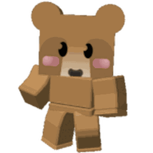
</td>
<td>Brown Cub Skin
</td>
<td>"A slightly chubby cub that got into the Royal Jelly."
</td>
<td>​+1% Pollen
</td>
<td>10 Tickets
</td>
<td>

<ul><li>Rewarded after completing 300 Brown Bear Quests</li></ul>

</td></tr>
<tr>
<td>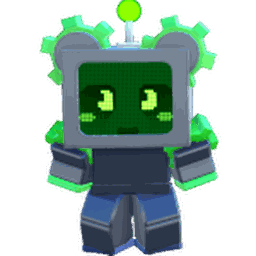
</td>
<td>Robo Cub Skin
</td>
<td>"They forgot a few drives when constructing this Robo Bear."
</td>
<td>​+1% Duped Ability Pollen
</td>
<td>10 Tickets
</td>
<td>

<ul><li>Reward from finishing in the top 10 of the Daily Robo Bear Challenge Leaderboard</li>
<li>Reward for winning round 25 of Robo Bear's Challenge for the first time...</li>
<li>Or: Rewarded after collecting 250,000 Cogs</li></ul>

</td></tr>
<tr>
<td>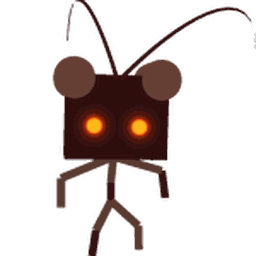
</td>
<td>Stick Cub Skin
</td>
<td>"This stick nymph evolved to camouflage itself as a bear."
</td>
<td>​+1% Bee Attack
</td>
<td>10 Tickets
</td>
<td>

<ul><li>Reward from finishing in the top 25 of the Daily Stick Bug Challenge Leaderboard</li>
<li>Dropped by Stick Bug (Unbelievably Rare)</li>
<li>Stick Bug Challenge Reward (Unbelievably Rare)</li></ul>

</td></tr>
<tr>
<td>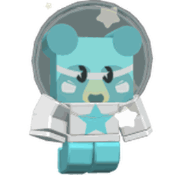
</td>
<td>Star Cub Skin
</td>
<td>"A cosmic cub visiting from another galaxy."
</td>
<td>​+1% Gifted Bee Pollen
</td>
<td>10 Tickets
</td>
<td>

<ul><li>Awarded after sticking all 12 Star Signs to the Sticker Stack</li>
<li>Using the Diamond Star Amulet Generator (1 in a million chance)</li>
<li>Sticker Printer (Star Egg, All Gifted Eggs)</li></ul>

</td></tr>
<tr>
<td>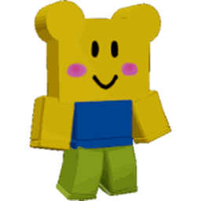
</td>
<td>Noob Cub Skin
</td>
<td>"This little noob doesn't know the first thing about running a shop."
</td>
<td>​+10,000 Capacity
</td>
<td>10 Tickets
</td>
<td>

<ul><li>This was included in the Cub Buddy Launch Pack</li></ul>

</td></tr>
<tr>
<td>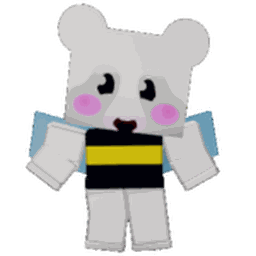
</td>
<td>Bee Cub Skin
</td>
<td>"A young polar bear going through an identity crisis."
</td>
<td>​+10,000 Capacity
</td>
<td>10 Tickets
</td>
<td>

<ul><li>This was the final reward of Bee Bear's 2019 quests</li></ul>

</td></tr>
<tr>
<td>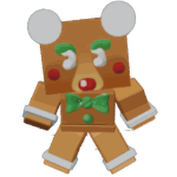
</td>
<td>Gingerbread Cub Skin
</td>
<td>"A cub made of cookies, brought to life by Honeyday Magic!"
</td>
<td>​+10,000 Capacity
</td>
<td>10 Tickets
</td>
<td>

<ul><li>Purchased in Bee Bear's 2020 Catalog for 250 Gingerbread Bears</li></ul>

</td></tr>
<tr>
<td>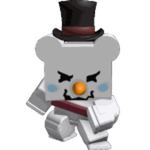
</td>
<td>Snow Cub Skin
</td>
<td>"This cruel cub was carved from a Lvl 20 Snowbear's snowball."
</td>
<td>​+10,000 Capacity
</td>
<td>10 Tickets
</td>
<td>

<ul><li>This was the final reward of Bee Bear's March 2022 quests</li></ul>

</td></tr>
<tr>
<td>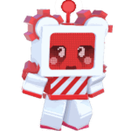
</td>
<td>Peppermint Robo Cub Skin
</td>
<td>"A clockwork cub composed of cogs and candycanes."
</td>
<td>​+10,000 Capacity
</td>
<td>10 Tickets
</td>
<td>

<ul><li>This was the final reward of Bee Bear's April 2023 quests</li></ul>

</td></tr>
<tr>
<td>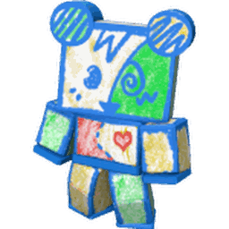
</td>
<td>Doodle Cub Skin
</td>
<td>"Cut from cardboard and scribbled up with magic crayons."
</td>
<td>​+10,000 Capacity
</td>
<td>10 Tickets
</td>
<td>

<ul><li>This was the final reward of Bee Bear's Summer 2024 quests</li></ul>

</td></tr>
<tr>
<td>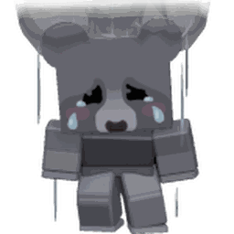
</td>
<td>Gloomy Cub Skin
</td>
<td>"This crybaby's pessimism is reified as a permanent cloud."
</td>
<td>​+10,000 Capacity
</td>
<td>10 Tickets
</td>
<td>

<ul><li>This was the final reward of Bee Bear's March 2025 quests</li></ul>

</td></tr>
<tr>
<td>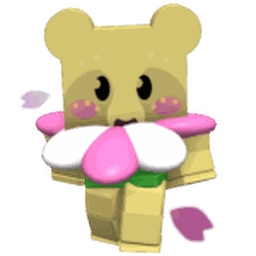
</td>
<td>Petal Cub Skin
</td>
<td>"A delicate floral cub who's blooming with beauty."
</td>
<td>​+10,000 Capacity
</td>
<td>10 Tickets
</td>
<td>

<ul><li>This is the final reward of Bee Bear's April 2026 quests</li></ul>

</td></tr></tbody></table>

### Hive Skins

**Hive Skins** were added on January 12, 2024, and can be obtained in many ways.

<table class="datatable article-table mw-collapsible mw-collapsed striped" data-column-defs='[{"orderable": false, "targets": [0, 2, 5]}]' data-paging="false" style="width: 100%">
<tbody><tr>
<th class="forceWidth unsortable">
</th>
<th>Name
</th>
<th class="unsortable">Description
</th>
<th>Stack Boost
</th>
<th>Stack Reward
</th>
<th class="unsortable">Where it's from:
</th></tr>
<tr>
<td>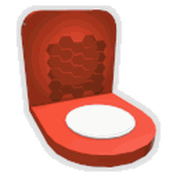
</td>
<td>Basic Red Hive Skin
</td>
<td>"A recolored version of your everyday hive."
</td>
<td>​+1% Honey At Hive
</td>
<td>5 Tickets
</td>
<td>

<ul><li>Completing 64 Riley Bee Quests</li>
<li>Dropped by King Beetle (Unbelievably Rare)</li>
<li>Sticker-Seeker Quest Reward (Very Rare)</li>
<li>Sticker Planter in the Rose Field or Pepper Patch (Extremely Rare)</li>
<li>Sticker Printer (Basic, Silver, Gold, and Diamond Egg)</li></ul>

</td></tr>
<tr>
<td>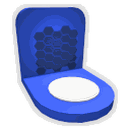
</td>
<td>Basic Blue Hive Skin
</td>
<td>"A recolored version of your everyday hive."
</td>
<td>​+1% Honey At Hive
</td>
<td>5 Tickets
</td>
<td>

<ul><li>Completing 64 Bucko Bee Quests</li>
<li>Dropped by King Beetle (Unbelievably Rare)</li>
<li>Sticker-Seeker Quest Reward (Very Rare)</li>
<li>Sticker Planter in the Blue Flower Field or Bamboo Field (Extremely Rare)</li>
<li>Sticker Printer (Basic, Silver, Gold, and Diamond Egg)</li></ul>

</td></tr>
<tr>
<td>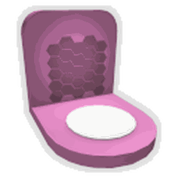
</td>
<td>Basic Pink Hive Skin
</td>
<td>"A recolored version of your everyday hive."
</td>
<td>​+1% Honey At Hive
</td>
<td>5 Tickets
</td>
<td>

<ul><li>Reward for finishing in the top 100 of the Daily Haste Tokens Leaderboard</li>
<li>Dropped by Mondo Chick (Extremely Rare)</li>
<li>Sticker-Seeker Quest Reward (Extremely Rare)</li>
<li>Sticker Planter in the Strawberry Field or Pineapple Patch (Extremely Rare)</li>
<li>Sticker Printer (Basic, Silver, Gold, and Diamond Egg)</li></ul>

</td></tr>
<tr>
<td>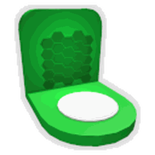
</td>
<td>Basic Green Hive Skin
</td>
<td>"A recolored version of your everyday hive."
</td>
<td>​+1% Honey At Hive
</td>
<td>5 Tickets
</td>
<td>

<ul><li>Reward for finishing in the top 100 of the Daily Sprout Tokens Leaderboard</li>
<li>Dropped by Stump Snail (Extremely Rare)</li>
<li>Sticker-Seeker Quest Reward (Extremely Rare)</li>
<li>Sticker Planter in the Clover Field or Cactus Field (Extremely Rare)</li>
<li>Sticker Printer (Basic, Silver, Gold, and Diamond Egg)</li></ul>

</td></tr>
<tr>
<td>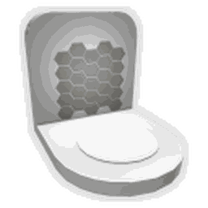
</td>
<td>Basic White Hive Skin
</td>
<td>"A recolored version of your everyday hive."
</td>
<td>​+1% Honey At Hive
</td>
<td>5 Tickets
</td>
<td>

<ul><li>Reward for finishing in the top 25 of the Daily White Pollen Leaderboard</li>
<li>Dropped by Coconut Crab (Extremely Rare)</li>
<li>Sticker-Seeker Quest Reward (Extremely Rare)</li>
<li>Sticker Planter in the Dandelion Field or Coconut Field (Unbelievably Rare)</li>
<li>Sticker Printer (Basic, Gold, Diamond, Star, Gifted Silver, and Gifted Diamond Eggs)</li></ul>

</td></tr>
<tr>
<td>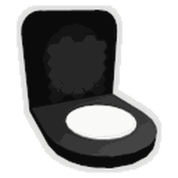
</td>
<td>Basic Black Hive Skin
</td>
<td>"A recolored version of your everyday hive."
</td>
<td>​+1% Honey At Hive
</td>
<td>5 Tickets
</td>
<td>

<ul><li>Reward for finishing in the top 25 of the Daily Buzz Bomb Pollen Leaderboard</li>
<li>Dropped by Tunnel Bear (Extremely Rare)</li>
<li>Sticker-Seeker Quest Reward (Extremely Rare)</li>
<li>Sticker Planter in the Sunflower Field or Stump Field (Unbelievably Rare)</li>
<li>Sticker Printer (Basic, Gold, Diamond, Mythic, Gifted Gold, Gifted Mythic)</li></ul>

</td></tr>
<tr>
<td>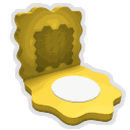
</td>
<td>Wavy Yellow Hive Skin
</td>
<td>"A hive with curvy, undulating edges."
</td>
<td>​+1% Honey At Hive
</td>
<td>5 Tickets
</td>
<td>

<ul><li>Dropped by Golden Cogmower (Unbelievably Rare)</li>
<li>Epic Puffshrooms+ in the Sunflower Field or Pineapple Path (Unfathomably Rare)</li>
<li>Sticker Printer (Gold Egg, Gifted Gold Egg)</li></ul>

</td></tr>
<tr>
<td>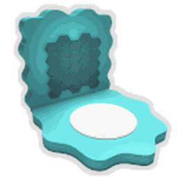
</td>
<td>Wavy Cyan Hive Skin
</td>
<td>"A hive with curvy, undulating edges."
</td>
<td>​+1% Honey At Hive
</td>
<td>5 Tickets
</td>
<td>

<ul><li>Dropped by Diamond Aphid (Unbelievably Rare)</li>
<li>Reward for finishing in the top 5 of the Daily Aphid Exterminators Leaderboard</li>
<li>Legendary+ Puffshrooms in Blue fields (Unfathomably Rare)</li>
<li>Sticker Printer (Diamond Egg, Gifted Diamond Egg)</li></ul>

</td></tr>
<tr>
<td>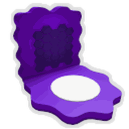
</td>
<td>Wavy Purple Hive Skin
</td>
<td>"A hive with curvy, undulating edges."
</td>
<td>​+1% Honey At Hive
</td>
<td>5 Tickets
</td>
<td>

<ul><li>Mythic Puffshrooms (Unfathomably Rare)</li>
<li>Sticker Printer (Mythic Egg, Gifted Mythic Egg)</li></ul>

</td></tr>
<tr>
<td>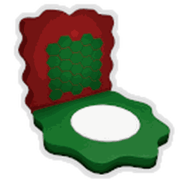
</td>
<td>Wavy Festive Hive Skin
</td>
<td>"A hive with undulating edges in the color scheme of Festive Bee."
</td>
<td>​+1% Honey At Hive
</td>
<td>5 Tickets
</td>
<td>

<ul><li>Purchased in Bee Bear's Catalog</li>
<li>Was a reward for completing Bee Bear's 10th quest of Summer 2024</li></ul>

</td></tr>
<tr>
<td>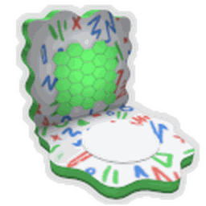
</td>
<td>Wavy Doodle Hive Skin
</td>
<td>"A hive with undulating edges that's been drawn on in crayon."
</td>
<td>​+10,000 Capacity
</td>
<td>5 Tickets
</td>
<td>

<ul><li>Exclusive to the Wavy Doodle Hive Bundle of Summer 2024</li></ul>

</td></tr>
<tr>
<td>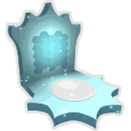
</td>
<td>Icy Crowned Hive Skin
</td>
<td>"A hive adorned with curved ascending peaks carved from ice."
</td>
<td>​+10,000 Capacity
</td>
<td>5 Tickets
</td>
<td>

<ul><li>Exclusive to the Royal Winter Wonder Haul of Winter 2024/25</li></ul>

</td></tr></tbody></table>

### Vouchers

**Vouchers** were added on May 23, 2024, and can be obtained in many ways. Vouchers can be "redeemed" by clicking the green "Use" button in the Sticker Book.

<table class="datatable article-table mw-collapsible mw-collapsed striped" data-column-defs='[{"orderable": false, "targets": [0, 2, 5]}]' data-paging="false" style="width: 100%">
<tbody><tr>
<th class="forceWidth unsortable">
</th>
<th>Name
</th>
<th class="unsortable">Description
</th>
<th>Stack Boost
</th>
<th>Stack Reward
</th>
<th class="unsortable">Where it's from:
</th></tr>
<tr>
<td>
</td>
<td>Bear Bee Voucher
</td>
<td>"Can be redeemed for a Bear Bee Egg (once per account)."
</td>
<td>​+0.5% Pollen
</td>
<td>10 Tickets
</td>
<td>

<ul><li>Purchased for 800 Robux</li>
<li>Dropped by Tunnel Bear (Nearly Impossible)</li></ul>

</td></tr>
<tr>
<td>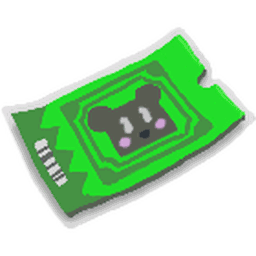
</td>
<td>Cub Buddy Voucher
</td>
<td>"Can be redeemed for a Cub Buddy (if you don't already have one)."
</td>
<td>​+2% Honey From Tokens
</td>
<td>3 Micro-Converters
</td>
<td>

<ul><li>Rewarded from Bee Bear's 15th Quest (if you already own a Cub Buddy)</li>
<li>Purchased for 600 Robux (if you already own a Cub Buddy)</li>
<li>Reward from Robo Bear Challenge (Unfathomably Rare)</li></ul>

</td></tr>
<tr>
<td>
</td>
<td>x2 Bee Gather Voucher
</td>
<td>"Redeem to activate x2 Bee Gather (once per account)."
</td>
<td>​+2% Bee Gather Pollen
</td>
<td>1 Glue
</td>
<td>

<ul><li>Purchased for 400 Robux</li>
<li>Dropped by Wild Windy Bee (Nearly Impossible)</li></ul>

</td></tr>
<tr>
<td>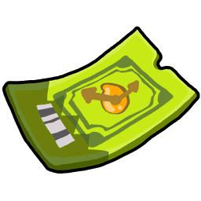
</td>
<td>x2 Convert Speed Voucher
</td>
<td>"Redeem to activate x2 Convert Speed (once per account)."
</td>
<td>​+10% Convert Rate
</td>
<td>1 Enzymes
</td>
<td>

<ul><li>Purchased for 250 Robux</li>
<li>Reward from Ant Challenge (Nearly Impossible)</li>
<li>(Not listed) Reward for completing Bubble Bee Man's Beesmas 2024 quest</li></ul>

</td></tr>
<tr>
<td>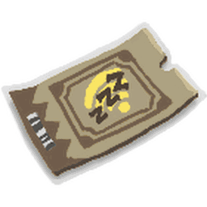
</td>
<td>Offline Voucher
</td>
<td>"Permanently allows Planters and Blender to progress offline (up to 24 hours at a time)."
</td>
<td>​+5% Epic Bee Pollen
</td>
<td>1 Nectar Shower Vial
</td>
<td>

<ul><li>Included in the Seasonal Slumber Special</li>
<li>Included in the Restful Gift Box</li>
<li>Reward from Stick Bug Challenge (Unfathomably Rare)</li>
<li>Reward from Robo Bear Challenge (Unfathomably Rare)</li>
<li>Sticker Planter (Unfathomably Rare)</li></ul>

</td></tr>
<tr>
<td>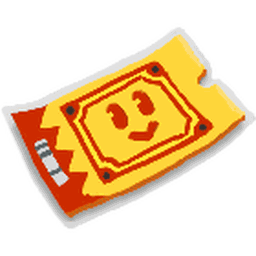
</td>
<td>Ticket Voucher
</td>
<td>"Can be redeemed for 100 Tickets (max 1 redeemed per day)."
</td>
<td>​+1% Ticket Chance
</td>
<td>1 Ticket Planter
</td>
<td>

<ul><li>Purchased for 400 Robux</li>
<li>Included in various Beemsas bundles and quest rewards</li>
<li>Reward for completing 250 Sticker-Seeker quests</li>
<li>Reward for finishing in the top 100 of the following Daily Leaderboards: Ant Challenge, Stick Bug Challenge, Robo Bear Challenge, Damage to a Single Puffshroom</li>
<li>Ticket Planter (Unfathomably Rare)</li></ul>

</td></tr></tbody></table>

### Stickers

**Stickers** were added on January 12, 2024, and can be obtained in many ways.

They can be placed on your hive or added to the Sticker Stack.

<table class="datatable article-table mw-collapsible mw-collapsed striped" data-column-defs='[{"orderable": false, "targets": [0, 2, 5]}]' data-paging="false" style="width: 100%">
<tbody><tr>
<th class="forceWidth unsortable">
</th>
<th>Name
</th>
<th class="unsortable">Description
</th>
<th>Stack Boost
</th>
<th>Stack Reward
</th>
<th class="unsortable">Where it's from:
</th></tr>
<tr>
<td>
</td>
<td>Play Button
</td>
<td>"For being a loyal viewer."
</td>
<td>​+10,000 Capacity
</td>
<td>10 Tickets
</td>
<td>

<ul><li>Can be given out by certain video content creators</li></ul>

</td></tr>
<tr>
<td>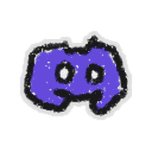
</td>
<td>Gamer Chat Icon
</td>
<td>"For positively contributing to BSS discorse."
</td>
<td>​+10,000 Capacity
</td>
<td>10 Tickets
</td>
<td>

<ul><li>Can be given out by official Bee Swarm Simulator Discord staff</li></ul>

</td></tr>
<tr>
<td>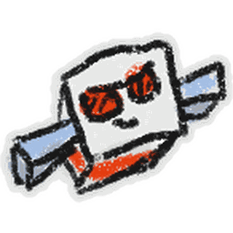
</td>
<td>Flying Rad Bee
</td>
<td>"The sun can't stop this bee from soaring."
</td>
<td>​+2% Red Pollen
</td>
<td>1 Red Extract
</td>
<td>

<ul><li>Found by Rad Bee when gathering while very happy (Extremely Rare)</li>
<li>Sticker Printer (Silver Egg)</li>
<li>Sticker Planter (Extremely Rare)</li>
<li>Sticker Sprout (Unbelievably Rare)</li></ul>

</td></tr>
<tr>
<td>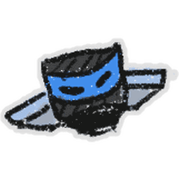
</td>
<td>Flying Ninja Bee
</td>
<td>"A rare sight. Ninja Bee sticks to the shadows."
</td>
<td>​+0.25% Bee Movespeed
</td>
<td>1 Blue Extract
</td>
<td>

<ul><li>Found by Ninja Bee when gathering while very happy (Extremely Rare)</li>
<li>Sticker Printer (Diamond Egg)</li>
<li>Sticker Planter (Extremely Rare)</li>
<li>Sticker Sprout (Unbelievably Rare)</li></ul>

</td></tr>
<tr>
<td>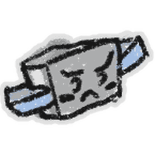
</td>
<td>Flying Brave Bee
</td>
<td>"What monsters see before they go away forever."
</td>
<td>​+2 Rare Bee Attack
</td>
<td>3 Stingers
</td>
<td>

<ul><li>Found by Brave Bee when gathering while very happy (Extremely Rare)</li>
<li>Sticker Printer (Silver Egg)</li>
<li>Sticker Planter (Extremely Rare)</li>
<li>Sticker Sprout (Unbelievably Rare)</li></ul>

</td></tr>
<tr>
<td>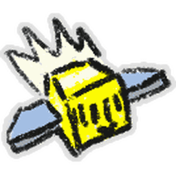
</td>
<td>Flying Photon Bee
</td>
<td>"Doing what it does best."
</td>
<td>​+5% Instant Event Bee Conversion
</td>
<td>1 Oil
</td>
<td>

<ul><li>Found by Photon Bee when gathering while very happy (Extremely Rare)</li>
<li>Sticker Sprout (Unbelievably Rare)</li>
<li>Sticker Planter (Unbelievably Rare)</li></ul>

</td></tr>
<tr>
<td>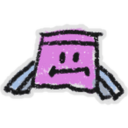
</td>
<td>Drooping Stubborn Bee
</td>
<td>"It was forced to go where it didn't want to go."
</td>
<td>​+1% Ability Token Lifespan
</td>
<td>1 Oil
</td>
<td>

<ul><li>Found by Stubborn Bee when gathering while upset (Extremely Rare)</li>
<li>Feeding a Neonberry to a Stubborn Bee (1 in 1,000 chance)</li>
<li>Sticker Planter (Extremely Rare)</li></ul>

</td></tr>
<tr>
<td>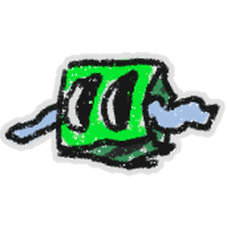
</td>
<td>Wobbly Looker Bee
</td>
<td>"It looked a little too closely."
</td>
<td>​+1% Critical Power
</td>
<td>3 Neonberry
</td>
<td>

<ul><li>Found by Looker Bee when gathering while very happy (Extremely Rare)</li>
<li>Feeding a Neonberry to a Looker Bee (1 in 1,000 chance)</li></ul>

</td></tr>
<tr>
<td>
</td>
<td>Blob Bumble Bee
</td>
<td>"This fellow is getting a little too mellow."
</td>
<td>​+5% Blue Bomb Pollen
</td>
<td>1 Blue Extract
</td>
<td>

<ul><li>Found by Mutated Bumble Bees in the Sunflower Field (Very Rare)</li>
<li>Feeding a Neonberry to a Bumble Bee (1 in 1,000 chance)</li>
<li>Sticker Printer (Silver Egg, Gifted Silver Egg)</li>
<li>Sticker Planter (Unbelievably Rare)</li>
<li>Purchased in Bee Bear's Catalog for 2500 Snowflakes</li></ul>

</td></tr>
<tr>
<td>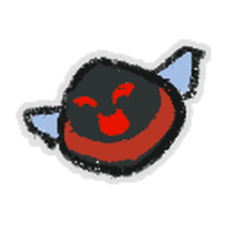
</td>
<td>Round Rascal Bee
</td>
<td>"Built for rolling in laughter."
</td>
<td>​+5% Red Bomb Pollen
</td>
<td>1 Red Extract
</td>
<td>

<ul><li>Found by Mutated Rascal Bees in the Sunflower Field (Very Rare)</li>
<li>Feeding a Neonberry to a Rascal Bee (1 in 1,000 chance)</li>
<li>Sticker Printer (Silver Egg, Gifted Silver Egg)</li>
<li>Sticker Planter (Unbelievably Rare)</li></ul>

</td></tr>
<tr>
<td>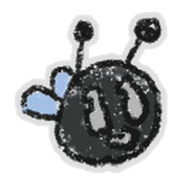
</td>
<td>Round Basic Bee
</td>
<td>"An unnaturally rotund sight."
</td>
<td>x3 Common Bee Pollen
</td>
<td>1 Basic Egg
</td>
<td>

<ul><li>Found by Mutated Basic Bee in the Pumpkin Patch (Nearly Impossible)</li>
<li>Feeding a Neonberry to a Basic Bee (Odds increase with level from 1 in 250,000 to 1 in 25,000)</li>
<li>Sticker Planter (Unfathomably Rare)</li>
<li>Sticker Printer (Basic Egg)</li></ul>

</td></tr>
<tr>
<td>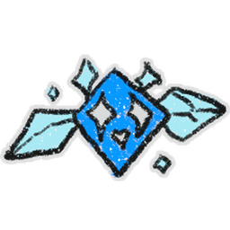
</td>
<td>Diamond Diamond Bee
</td>
<td>"It took its name too literally."
</td>
<td>​+5% Mutated Bee Convert Rate
</td>
<td>10 Tickets
</td>
<td>

<ul><li>Found by Gifted Diamond Bee on the Mountain Top Field (Unbelievably Rare)</li>
<li>Feeding a Neonberry to a Diamond Bee (1 in 2,500 chance)</li>
<li>Sticker Planter (Unbelievably Rare)</li>
<li>Sticker Printer (Gifted Diamond Egg)</li></ul>

</td></tr>
<tr>
<td>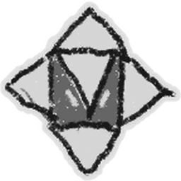
</td>
<td>4-Pronged Vector Bee
</td>
<td>"When the Mythic Egg gets the math wrong."
</td>
<td>​+1% Mark Ability Pollen
</td>
<td>10 Tickets
</td>
<td>

<ul><li>Sticker-Seeker Quest Reward (Extremely Rare)</li>
<li>Feeding a Neonberry to a Vector Bee (1 in 2,500 chance)</li>
<li>Sticker Printer (Mythic Egg, Gifted Mythic Egg)</li>
<li>(Not listed) Potential reward from the Mythic Gift Box</li></ul>

</td></tr>
<tr>
<td>
</td>
<td>Shocked Hive Slot
</td>
<td>"It's totally real. The bee is lvl 1."
</td>
<td>​+1% White Pollen
</td>
<td>50 Pineapples
</td>
<td>

<ul><li>Found by Shocked Bee in the Mushroom Field (Very Rare)</li>
<li>Feeding a Neonberry to a Shocked Bee (1 in 1,000 chance)</li>
<li>Sticker Planter (Extremely Rare)</li></ul>

</td></tr>
<tr>
<td>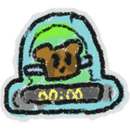
</td>
<td>Bear Bee Offer
</td>
<td>"Only available for a limited time! (your lifespan)."
</td>
<td>​+2% Event Bee Pollen
</td>
<td>10 Tickets
</td>
<td>

<ul><li>Found by Gifted Bear Bee in the Pineapple Patch (Extremely Rare)</li>
<li>Feeding a Star Treat to an already Gifted Bear Bee (1 in 3 chance)</li>
<li>Sticker Planter (Unbelievably Rare)</li>
<li>Sticker Sprout (Unbelievably Rare)</li></ul>

</td></tr>
<tr>
<td>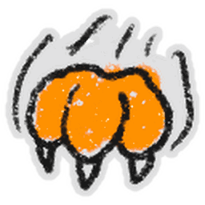
</td>
<td>Tabby Scratch
</td>
<td>"A demonstration of feline ferocity."
</td>
<td>​+10% Scratch Pollen
</td>
<td>10 Tickets
</td>
<td>

<ul><li>Collecting Tabby Love after max stacks while a Stinger is active (Extremely Rare). The chance increases with Tabby Bee's level (From 1 in 10,000 to 1 in 100).</li></ul>

</td></tr>
<tr>
<td>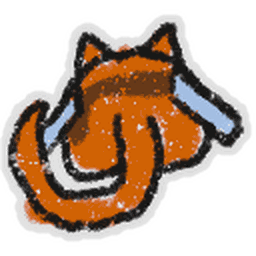
</td>
<td>Tabby From Behind
</td>
<td>"The first thing you see when you wake up."
</td>
<td>​+1% Critical Power
</td>
<td>10 Tickets
</td>
<td>

<ul><li>Feeding a Moon Charm to a Tabby Bee at max Tabby Love. Odds increase with Tabby Bee's level (from 1 in 100,000 to 1 in 10,000).</li>
<li>Sticker Printer (Gold Egg, Gifted Gold Egg)</li>
<li>Sticker Planter (Unbelievably Rare)</li></ul>

</td></tr>
<tr>
<td>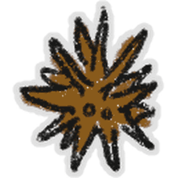
</td>
<td>Fuzz Bomb
</td>
<td>"They look sharp and spikey, but it's just an illusion."
</td>
<td>​+5% Buzz Bomb Pollen
</td>
<td>1 Oil
</td>
<td>

<ul><li>Found by Fuzzy Bee in the Bamboo Field (Extremely Rare)</li>
<li>Popping Fuzz Bombs on the Bamboo Field (1 in 10,000 chance)</li>
<li>Sticker Printer (Mythic Egg)</li></ul>

</td></tr>
<tr>
<td>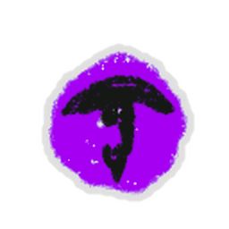
</td>
<td>Precise Eye
</td>
<td>"An extremely judgemental glare."
</td>
<td>​+1% Super Crit Power
</td>
<td>1 Hard Wax
</td>
<td>

<ul><li>Spawned after activating all 3 Target Practice targets on the Clover Field (1 in 3,333 chance)</li>
<li>Sticker Printer (Mythic Egg)</li>
<li>(Not listed) Potential reward from the Mythic Gift Box</li></ul>

</td></tr>
<tr>
<td>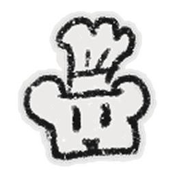
</td>
<td>Chef Hat Polar Bear
</td>
<td>"The hat, a Toque, dates back to the 16th century."
</td>
<td>​+5% Instant Colorless Bee Conversion
</td>
<td>10 Tickets
</td>
<td>

<ul><li>Reward from Polar Bear Quests (1 in 100 chance)</li></ul>

</td></tr>
<tr>
<td>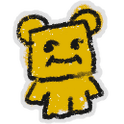
</td>
<td>Honey Bee Bear
</td>
<td>"Its looks are as large as its appetite."
</td>
<td>​+2% Honey From Tokens
</td>
<td>1 Enzymes
</td>
<td>

<ul><li>Found by Honey Bee in the Mountain Top Field (Extremely Rare)</li>
<li>Sticker Planter (Extremely Rare)</li>
<li>Sticker Printer (Gold Egg, Gifted Gold Egg)</li></ul>

</td></tr>
<tr>
<td>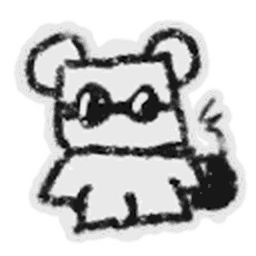
</td>
<td>Bomber Bee Bear
</td>
<td>"The Hero Bakudan Kuma."
</td>
<td>​+5% Buzz Bomb Pollen
</td>
<td>1 Loaded Dice
</td>
<td>

<ul><li>Found by Bomber Bee in the Mountain Top Field (Extremely Rare)</li>
<li>Sticker Planter (Extremely Rare)</li>
<li>Sticker Printer (Silver Egg)</li></ul>

</td></tr>
<tr>
<td>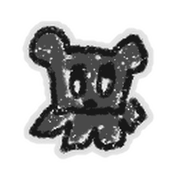
</td>
<td>Uplooking Bear
</td>
<td>"Rolling its eyes? Or stuck in the clouds?"
</td>
<td>​+1% Critical Power
</td>
<td>5 Tickets
</td>
<td>

<ul><li>Using the Sticker-Seeker in any field (Very Rare)</li>
<li>Sticker Sprout (Very Rare)</li>
<li>Sticker Printer (Gold Egg)</li></ul>

</td></tr>
<tr>
<td>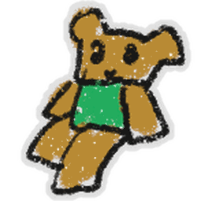
</td>
<td>Sitting Green Shirt Bear
</td>
<td>"Nothing interesting about this bear, apart from its shirt."
</td>
<td>​+10,000 Capacity
</td>
<td>5 Tickets
</td>
<td>

<ul><li>Found by Bubble Bee in the Clover Field (Uncommon)</li>
<li>Tacky Planter in the Clover Field (Very Rare)</li>
<li>Sticker Printer (Gold Egg)</li>
<li>Sticker Sprout (Extremely Rare)</li></ul>

</td></tr>
<tr>
<td>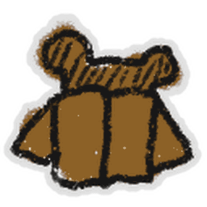
</td>
<td>Shy Brown Bear
</td>
<td>"He doesn't do well in crowds."
</td>
<td>​+0.25% Bee Ability Pollen
</td>
<td>5 Royal Jellies
</td>
<td>

<ul><li>Completing 123 Brown Bear Quests</li>
<li>Sticker Printer (Gold Egg)</li></ul>

</td></tr>
<tr>
<td>
</td>
<td>Sitting Mother Bear
</td>
<td>"She needs a rest from all that parenting."
</td>
<td>​+0.5% Gifted Bee Pollen
</td>
<td>10 Tickets
</td>
<td>

<ul><li>Using the Sticker-Seeker in the Sunflower Field (Extremely Rare)</li>
<li>Hydroponic Planter in the Sunflower Field (Extremely Rare)</li>
<li>Sticker Printer (Gold Egg)</li></ul>

</td></tr>
<tr>
<td>
</td>
<td>Squashed Head Bear
</td>
<td>"It got hit by a Mythic Meteor. It'll never be the same."
</td>
<td>​+1% Super Critical Power
</td>
<td>25 Bitterberries
</td>
<td>

<ul><li>Mythic Meteors (Extremely Rare)</li>
<li>Sticker-Seeker Quest Reward (Extremely Rare)</li>
<li>Sticker Planter (Extremely Rare)</li>
<li>Using the Sticker-Seeker in any field (Nearly Impossible)</li></ul>

</td></tr>
<tr>
<td>
</td>
<td>Stretched Head Bear
</td>
<td>"Its head was nearly blown off by a Windy Bee. It'll never be the same."
</td>
<td>​+1% Super Crit Power
</td>
<td>25 Bitterberries
</td>
<td>

<ul><li>Dropped by Wild Windy Bee (Extremely Rare)</li>
<li>Sticker-Seeker Quest Reward (Extremely rare)</li>
<li>Sticker Planter (Extremely Rare)</li>
<li>Using the Sticker-Seeker in any field (Nearly Impossible)</li></ul>

</td></tr>
<tr>
<td>
</td>
<td>Panicked Science Bear
</td>
<td>"There was a miscalculation."
</td>
<td>​+5% Mutated Bee Convert Rate
</td>
<td>1 Enzymes
</td>
<td>

<ul><li>Found by Radioactive Bees in the Pineapple Patch</li>
<li>Using a Micro-Converter in the Hive Hub (1 in 500 chance)</li>
<li>Sticker Sprout (Extremely Rare)</li></ul>

</td></tr>
<tr>
<td>
</td>
<td>Dapper From Above
</td>
<td>"What most others see when talking to him."
</td>
<td>​+0.5% Pollen
</td>
<td>1 Ticket Planter
</td>
<td>

<ul><li>Achievement: Tacky Planter chain involving 5 different fields... (Clover → Coconut → Stump → Pepper → Mountain Top, in that order, must be at 100% harvest)</li>
<li>Awarded to the daily top 5 Nectar Collectors</li>
<li>Sticker-Seeker Quest Reward (Unbelievably Rare)</li></ul>

</td></tr>
<tr>
<td>
</td>
<td>Sideways Spirit Bear
</td>
<td>"She's just sleeping, I promise."
</td>
<td>​+10% Instant Tool Conversion
</td>
<td>1 Glitter
</td>
<td>

<ul><li>Extreme Memory Match (Extremely Rare)</li>
<li>Using the Petal Wand in the Hub Field (Unbelievably Rare)</li>
<li>Using a Glitter on the Hub Field (1 in 500 chance)</li></ul>

</td></tr>
<tr>
<td>
</td>
<td>Glowering Gummy Bear
</td>
<td>"He oozes an aura of pure determination for conquest."
</td>
<td>​+1% Honey Per Goo
</td>
<td>1 Glue
</td>
<td>

<ul><li>Awarded to the #1 Daily Top Gummy Soldier</li>
<li>Was rewarded for completing Gummy Bear's Beesmas Quest of Summer 2024 (Not rewarded during Beesmas Winter 2024)</li></ul>

</td></tr>
<tr>
<td>
</td>
<td>Stranded Sun Bear
</td>
<td>"No gas, signal, or search party..."
</td>
<td>​+10,000 Capacity
</td>
<td>10 Jelly Beans
</td>
<td>

<ul><li>Reward for completing all 6 "Waiting With Sun Bear" quests of Fall 2024</li></ul>

</td></tr>
<tr>
<td>
</td>
<td>Menacing Mantis
</td>
<td>"It's praying for your doom."
</td>
<td>​+5% Pineapple Patch Pollen
</td>
<td>1 Blue Extract
</td>
<td>

<ul><li>Dropped by Mantis (Extremely Rare)</li>
<li>Found by Rage Bee in the Pine Tree Forest (Very Rare)</li></ul>

</td></tr>
<tr>
<td>
</td>
<td>Little Scorpion
</td>
<td>"Sort of looks like a lobster."
</td>
<td>​+5% Rose Field Pollen
</td>
<td>1 Red Extract
</td>
<td>

<ul><li>Dropped by Scorpion (Extremely Rare)</li>
<li>Found by Basic Bee in the Rose Field (Very Rare)</li></ul>

</td></tr>
<tr>
<td>
</td>
<td>Left Facing Ant
</td>
<td>"The bain[sic] of picnics."
</td>
<td>​+1 Legendary Bee Attack
</td>
<td>1 Ant Pass
</td>
<td>

<ul><li>Rewarded from Ant Challenge (Very Rare)</li>
<li>Found by Lion Bee in the Ant Field</li></ul>

</td></tr>
<tr>
<td>
</td>
<td>Walking Stick Nymph
</td>
<td>"It was just born and it's coming for you."
</td>
<td>​+1% Bee Attack
</td>
<td>3 Stingers
</td>
<td>

<ul><li>Dropped by Stick Nymphs (Extremely Rare)</li></ul>

</td></tr>
<tr>
<td>
</td>
<td>Forward Facing Spider
</td>
<td>"Not enough legs to technically be a spider."
</td>
<td>​+10% Spider Field Capacity
</td>
<td>1 Enzymes
</td>
<td>

<ul><li>Dropped from Spider (Extremely Rare)</li>
<li>Using the Sticker-Seeker in the Spider Field (Extremely Rare)</li>
<li>Found by Demon Bee when gathering in the Spider Field (Very Rare)</li></ul>

</td></tr>
<tr>
<td>
</td>
<td>Forward Facing Aphid
</td>
<td>"A tiny sapelievipping bug staring you down."
</td>
<td>​+1% Bee Attack
</td>
<td>1 Magic Bean
</td>
<td>

<ul><li>Dropped by Aphids (Rare)</li></ul>

</td></tr>
<tr>
<td>
</td>
<td>Right Facing Stump Snail
</td>
<td>"It scoots clockwise forever."
</td>
<td>​+5% Stump Field Pollen
</td>
<td>1 Glue
</td>
<td>

<ul><li>Dropped by Stump Snail (Rare)</li></ul>

</td></tr>
<tr>
<td>
</td>
<td>Standing Bean Bug
</td>
<td>"It's done with jumping."
</td>
<td>​+2% Pollen From Tools
</td>
<td>5 Jelly Beans
</td>
<td>

<ul><li>Bean Bugs (Very Rare)</li>
<li>Sticker-Seeker Quest Reward (Extremely Rare)</li></ul>

</td></tr>
<tr>
<td>
</td>
<td>Small Blue Chick
</td>
<td>"It hatched, yet it's still an egg."
</td>
<td>​+2% Blue Pollen
</td>
<td>1 Blue Extract
</td>
<td>

<ul><li>Dropped from Mondo Chick (Very Rare)</li>
<li>Sticker Planter (Extremely Rare)</li>
<li>Sticker Printer (Gold Egg)</li></ul>

</td></tr>
<tr>
<td>
</td>
<td>Tadpole
</td>
<td>"A strange Tadpole Bee without wings."
</td>
<td>​+3% Bubble Pollen
</td>
<td>1 Blue Extract
</td>
<td>

<ul><li>1 in a million chance to spawn when a bubble is popped</li>
<li>Found by Tadpole Bee in the Mushroom Field (Very Rare)</li></ul>

</td></tr>
<tr>
<td>
</td>
<td>Happy Fish
</td>
<td>"When you smile at it, it smiles at you."
</td>
<td>​+3% Bubble Pollen
</td>
<td>3 Tickets
</td>
<td>

<ul><li>Using the Sticker-Seeker in any field (Very Rare)</li>
<li>Sticker Planter (Very Rare)</li>
<li>Sticker Sprout</li>
<li>Sticker Printer (Gold Egg)</li></ul>

</td></tr>
<tr>
<td>
</td>
<td>Coiled Snake
</td>
<td>"Don't tread on this."
</td>
<td>​+1 Epic Bee Attack
</td>
<td>3 Stingers
</td>
<td>

<ul><li>Sticker-Seeker Quest Reward (Rare)</li>
<li>Sticker Planter (Very Rare)</li>
<li>Sticker Sprout (Uncommon)</li>
<li>(Not listed) Potential reward from the Sweet-n-Sour Gift Box</li></ul>

</td></tr>
<tr>
<td>
</td>
<td>Standing Caterpillar
</td>
<td>"Wiggling it's way up in life."
</td>
<td>​+10% Rare Bee Pollen
</td>
<td>1 Enzymes
</td>
<td>

<ul><li>Using Super-Scooper in the Pineapple Patch (Uncommon)</li>
<li>Sticker Planter on the Pineapple Patch</li>
<li>Hidden Sticker</li>
<li>(Not listed) Potential reward from the Sweet-n-Sour Gift Box</li></ul>

</td></tr>
<tr>
<td>
</td>
<td>Round Green Critter
</td>
<td>"A little creature that lives on Sprouts."
</td>
<td>​+2% Bee Gathering Pollen
</td>
<td>1 Magic Bean
</td>
<td>

<ul><li>Sprouts in the Clover Field (Very Rare)</li>
<li>Using the Sticker-Seeker in the Clover Field (Very Rare)</li>
<li>(Not listed) Potential reward from the Woodland Gift Box</li></ul>

</td></tr>
<tr>
<td>
</td>
<td>Flying Magenta Critter
</td>
<td>"A little creature that lives on Sprouts."
</td>
<td>​+2% Bee Gathering Pollen
</td>
<td>1 Magic Bean
</td>
<td>

<ul><li>Sprouts in the Dandelion Field (Very Rare)</li>
<li>Using the Sticker-Seeker in the Dandelion Field (Very Rare)</li>
<li>(Not listed) Potential reward from the Woodland Gift Box</li></ul>

</td></tr>
<tr>
<td>
</td>
<td>Blue Triangle Critter
</td>
<td>"A little creature that lives on Sprouts."
</td>
<td>​+2% Bee Gathering Pollen
</td>
<td>1 Magic Bean
</td>
<td>

<ul><li>Sprouts in the Blue Flower Field (Very Rare)</li>
<li>Using the Sticker-Seeker in the Blue Flower Field (Very Rare)</li>
<li>(Not listed) Potential reward from the Woodland Gift Box</li></ul>

</td></tr>
<tr>
<td>
</td>
<td>Purple Pointed Critter
</td>
<td>"A little creature that lives on Sprouts."
</td>
<td>​+2% Bee Gathering Pollen
</td>
<td>1 Magic Bean
</td>
<td>

<ul><li>Sprouts in the Cactus Field (Very Rare)</li>
<li>Using the Sticker-Seeker in the Cactus Field (Very Rare)</li>
<li>(Not listed) Potential reward from the Woodland Gift Box</li></ul>

</td></tr>
<tr>
<td>
</td>
<td>Orange Leg Critter
</td>
<td>"A little creature that lives on Sprouts."
</td>
<td>​+2% Bee Gathering Pollen
</td>
<td>1 Magic Bean
</td>
<td>

<ul><li>Sprouts in the Pumpkin Patch (Very Rare)</li>
<li>Using the Sticker-Seeker in the Pumpkin Patch (Very Rare)</li>
<li>(Not listed) Potential reward from the Woodland Gift Box</li></ul>

</td></tr>
<tr>
<td>
</td>
<td>Green Plus Sign
</td>
<td>"May indicate addition or a pharmacy."
</td>
<td>​+10,000 Capacity
</td>
<td>3 Tickets
</td>
<td>

<ul><li>Using the Sticker-Seeker in any field</li>
<li>Sticker-Seeker Quest Reward</li>
<li>Sticker Planter</li>
<li>Hidden Sticker</li>
<li>Sticker Sprout</li>
<li>Sticker Printer (Basic Egg)</li>
<li>(Not listed) Potential reward from the Chartreuse Gift Box</li></ul>

</td></tr>
<tr>
<td>
</td>
<td>Green Check Mark
</td>
<td>"A standard seal of approval."
</td>
<td>​+10,000 Capacity
</td>
<td>3 Tickets
</td>
<td>

<ul><li>Using the Sticker-Seeker in any field</li>
<li>Sticker-Seeker Quest Reward</li>
<li>Sticker Planter</li>
<li>Hidden Sticker</li>
<li>Sticker Sprout</li>
<li>Sticker Printer (Basic Egg)</li>
<li>(Not listed) Potential reward from the Chartreuse Gift Box</li></ul>

</td></tr>
<tr>
<td>
</td>
<td>Red X
</td>
<td>"Demonstrates disdain or a desire for removal."
</td>
<td>​+10% Convert Rate
</td>
<td>1 Red Extract
</td>
<td>

<ul><li>Using the Sticker-Seeker on any field (Uncommon)</li>
<li>Sticker Planter (Rare)</li>
<li>Hidden Sticker (Uncommon)</li>
<li>Sticker Printer (Basic Egg)</li></ul>

</td></tr>
<tr>
<td>
</td>
<td>Alert Icon
</td>
<td>"Let's[sic] you know something's up."
</td>
<td>​+5% Red Bomb Pollen
</td>
<td>3 Micro-Converters
</td>
<td>

<ul><li>Using the Sticker-Seeker in any field (Rare)</li>
<li>Sticker Planter (Extremely Rare)</li>
<li>Sticker Sprout (Very Rare)</li>
<li>Sticker Printer (Gold Egg)</li></ul>

</td></tr>
<tr>
<td>
</td>
<td>Yellow Right Arrow
</td>
<td>"A directional indicator."
</td>
<td>​+5% Instant Bee Gather Conversion
</td>
<td>3 Tickets
</td>
<td>

<ul><li>Sticker-Seeker Quest Reward</li>
<li>Using the Sticker-Seeker in any field</li>
<li>(Not listed) Potential reward from the Marigold Gift Box</li></ul>

</td></tr>
<tr>
<td>
</td>
<td>Yellow Left Arrow
</td>
<td>"A directional indicator."
</td>
<td>​+5% Instant Bee Gather Conversion
</td>
<td>3 Tickets
</td>
<td>

<ul><li>Sticker-Seeker Quest Reward</li>
<li>Using the Sticker-Seeker in any field</li>
<li>(Not listed) Potential reward from the Marigold Gift Box</li></ul>

</td></tr>
<tr>
<td>
</td>
<td>Simple Sun
</td>
<td>"It sustains almost all life on Earth."
</td>
<td>​+10% Convert Rate
</td>
<td>5 Tickets
</td>
<td>

<ul><li>Using the Sticker-Seeker in any field</li>
<li>Hidden Sticker</li>
<li>Sticker Planter</li>
<li>Sticker Printer (Basic Egg, Gold Egg)</li>
<li>Purchased in Bee Bear's Catalog for 100 Snowflakes</li>
<li>(Not listed) Potential reward from the Marigold Gift Box</li></ul>

</td></tr>
<tr>
<td>
</td>
<td>Pink Cupcake
</td>
<td>"There's strawberry jam inside."
</td>
<td>​+0.5% Honey Per Goo
</td>
<td>50 Strawberries
</td>
<td>

<ul><li>Found by Gifted Stubborn Bee in the Strawberry Field (Rare)</li>
<li>Using the Sticker-Seeker in the Strawberry Field (Extremely Rare)</li>
<li>Candy Planter in the Strawberry Field (Extremely Rare)</li>
<li>Sticker Printer (Gold Egg)</li>
<li>Purchases in Bee Bear's Catalog for 600 Snowflakes</li>
<li>(Not listed) Potential reward from the Sweet-n-Sour Gift Box</li></ul>

</td></tr>
<tr>
<td>
</td>
<td>Rubber Duck
</td>
<td>"Squeeks(sic) instead of quacks."
</td>
<td>​+10% Rare Bee Pollen
</td>
<td>3 Tickets
</td>
<td>

<ul><li>Using the Sticker-Seeker in any field</li>
<li>Hidden Sticker</li>
<li>Sticker Planter</li>
<li>Sticker Printer (Basic Egg)</li>
<li>Purchased in Bee Bear's Catalog for 30 Snowflakes</li>
<li>(Not listed) Potential reward from the Marigold Gift Box</li></ul>

</td></tr>
<tr>
<td>
</td>
<td>Baseball Swing
</td>
<td>"Hit it out of the park."
</td>
<td>​+2% Pollen From Tools
</td>
<td>5 Jelly Beans
</td>
<td>

<ul><li>Using the Sticker-Seeker on fields in the starter zone (Uncommon)</li>
<li>Sticker Planter</li>
<li>Sticker Sprout (Uncommon)</li>
<li>Sticker Printer (Basic Egg)</li>
<li>(Not listed) Potential reward from the Marigold Gift Box</li></ul>

</td></tr>
<tr>
<td>
</td>
<td>Yellow Coffee Mug
</td>
<td>"The best part of waking up."
</td>
<td>​+10% Convert Rate
</td>
<td>1 Oil
</td>
<td>

<ul><li>Using the Sticker-Seeker in any field</li>
<li>Hidden Sticker</li>
<li>Sticker Planter</li>
<li>Sticker Printer (Basic Egg)</li></ul>

</td></tr>
<tr>
<td>
</td>
<td>Launching Rocket
</td>
<td>"The sky is not the limit."
</td>
<td>​+15,000 Capacity
</td>
<td>10 Whirligigs
</td>
<td>

<ul><li>Found by Gummy Bee in the Clover Field</li>
<li>Sticker Planter</li>
<li>Hidden Sticker (Uncommon)</li>
<li>Sticker Sprout (Uncommon)</li>
<li>Sticker Printer (Basic Egg)</li></ul>

</td></tr>
<tr>
<td>
</td>
<td>Thumbs Up Hand
</td>
<td>"Good job!"
</td>
<td>​+10,000 Capacity
</td>
<td>5 Tickets
</td>
<td>

<ul><li>Sticker-Seeker Quest Reward</li>
<li>Found by Gifted Cool Bee in the Stump Field (Rare)</li>
<li>Sticker Sprout (Very Rare)</li></ul>

</td></tr>
<tr>
<td>
</td>
<td>Peace Sign Hand
</td>
<td>"Could also mean Victory."
</td>
<td>​+10% Convert Rate
</td>
<td>5 Tickets
</td>
<td>

<ul><li>Sticker-Seeker Quest Reward</li>
<li>Found by Gifted Cool Bee in the Pepper Patch (Rare)</li>
<li>Sticker Sprout (Very Rare)</li></ul>

</td></tr>
<tr>
<td>
</td>
<td>Traffic Light
</td>
<td>"It's sending mixed messages."
</td>
<td>​+10,000 Capacity
</td>
<td>3 Neonberries
</td>
<td>

<ul><li>Found by Shocked Bee while gathering when very happy</li>
<li>Sticker Sprout (Uncommon)</li>
<li>Purchased in Bee Bear's Catalog for 300 Snowflakes</li></ul>

</td></tr>
<tr>
<td>
</td>
<td>Window
</td>
<td>"Turn your hive into a home."
</td>
<td>​+1% Honey At Hive
</td>
<td>3 Soft Waxes
</td>
<td>

<ul><li>Sticker Planter (Uncommon)</li>
<li>Sticker Printer (Basic Egg, Gold Egg)</li>
<li>Sticker Sprout (Rare)</li></ul>

</td></tr>
<tr>
<td>
</td>
<td>Simple Skyscraper
</td>
<td>"High density living."
</td>
<td>​+1% Honey At Hive
</td>
<td>3 Micro-Converters
</td>
<td>

<ul><li>Using the Sticker-Seeker on the Mountain Top Field (Rare)</li>
<li>Sticker Planter (Uncommon)</li>
<li>Sticker Printer (Basic Egg)</li>
<li>Sticker Sprout (Rare)</li></ul>

</td></tr>
<tr>
<td>
</td>
<td>Simple Mountain
</td>
<td>"It simply dominates the landscape."
</td>
<td>​+19% Mountain Top Field Capacity (Listed as 10% in-game)
</td>
<td>10 Whirligigs
</td>
<td>

<ul><li>Found by Basic Bee in the Mountain Top Field (Rare)</li>
<li>Puffshrooms on the Mountain Top Field (Rare)</li>
<li>Sticker Planter on the Mountain Top Field (Rare)</li>
<li>Using the Sticker-Seeker on the Mountain Top Field (Rare)</li>
<li>Purchased in Bee Bear's Catalog for 250 Snowflakes</li></ul>

</td></tr>
<tr>
<td>
</td>
<td>Pale Heart
</td>
<td>"A subtle hint of love."
</td>
<td>​+2% Bee Gathering Pollen
</td>
<td>50 Strawberries
</td>
<td>

<ul><li>Found by Gifted Baby Bee when gathering while very happy (Very Rare)</li>
<li>Found by Puppy Bee when gathering while very happy (Uncommon)</li>
<li>Petal Planter in the Strawberry Field (Very Rare)</li>
<li>Purchased in Bee Bear's Catalog for 300 Snowflakes</li></ul>

</td></tr>
<tr>
<td>
</td>
<td>Colorful Buttons
</td>
<td>"Resembles a famous gamepad layout."
</td>
<td>​+10% Convert Rate
</td>
<td>5 Jelly Beans
</td>
<td>

<ul><li>Sticker Planter</li>
<li>Tacky Planter (Rare)</li>
<li>Hidden Sticker (Uncommon)</li>
<li>Sticker Printer (Basic Egg)</li></ul>

</td></tr>
<tr>
<td>
</td>
<td>Giraffe
</td>
<td>"It's neck is long so that it can see over horses standing in front of it."
</td>
<td>​+10% Convert Rate
</td>
<td>5 Tickets
</td>
<td>

<ul><li>Using the Sticker-Seeker in the 15 Bee Zone</li>
<li>Hidden Sticker (Uncommon)</li>
<li>Sticker Planter (Uncommon)</li>
<li>Sticker Printer (Basic Egg, Gold Egg)</li>
<li>Sticker Sprout</li></ul>

</td></tr>
<tr>
<td>
</td>
<td>Silly Tongue
</td>
<td>"An irreverent gesture."
</td>
<td>​+2% Honey From Tokens
</td>
<td>25 Gumdrops
</td>
<td>

<ul><li>Found by Rascal Bee in the Pineapple Patch (Uncommon)</li>
<li>Candy Planter in the Pineapple Patch (Very Rare)</li>
<li>(Not listed) Potential reward from the Sweet-n-Sour Gift Box</li></ul>

</td></tr>
<tr>
<td>
</td>
<td>White Flag
</td>
<td>"Let the world know you've given up."
</td>
<td>​+2% White Pollen
</td>
<td>1 Oil
</td>
<td>

<ul><li>Using the Rake in the Spider Field (Rare)</li>
<li>Sticker Planter on the Spider Field (Rare)</li>
<li>Hidden Sticker</li></ul>

</td></tr>
<tr>
<td>
</td>
<td>Pyramid
</td>
<td>"This tomb withstands the test of time."
</td>
<td>​+19% Cactus Field Capacity (Listed at 10% in-game)
</td>
<td>5 Tickets
</td>
<td>

<ul><li>Found by Lion Bee in the Cactus Field (Rare)</li>
<li>Hidden Sticker (Very Rare)</li>
<li>Sticker Printer (Gold Egg)</li></ul>

</td></tr>
<tr>
<td>
</td>
<td>Tiny House
</td>
<td>"Demands a minimalist lifestyle."
</td>
<td>​+10% Convert Rate At Hive
</td>
<td>50 Sunflower Seeds
</td>
<td>

<ul><li>Using the Sticker-Seeker in the starter zone</li>
<li>Sticker Sprout</li></ul>

</td></tr>
<tr>
<td>
</td>
<td>TNT
</td>
<td>"Trinitrotoluene."
</td>
<td>​+2% Bomb Pollen
</td>
<td>3 Soft Waxes
</td>
<td>

<ul><li>Found by Demo Bee when gathering while very happy (Uncommon)</li>
<li>Using any Cannon (1 in 25,000 chance)</li></ul>

</td></tr>
<tr>
<td>
</td>
<td>Wishbone
</td>
<td>"Snap it for a 50% chance at good luck."
</td>
<td>​+1% Critical Power
</td>
<td>5 Field Dice
</td>
<td>

<ul><li>Using the Scythe in the Cactus Field (Very Rare)</li>
<li>Hidden Sticker (Uncommon)</li>
<li>Sticker Planter (Uncommon)</li>
<li>Sticker Printer (Basic Egg)</li></ul>

</td></tr>
<tr>
<td>
</td>
<td>Yellow Umbrella
</td>
<td>"Make your own sun on a rainy day."
</td>
<td>​+10% Instant Rare Bee Conversion
</td>
<td>1 Cloud Vial
</td>
<td>

<ul><li>Sticker-Seeker Quest Reward</li>
<li>Sticker Sprout</li>
<li>Sticker Planter</li></ul>

</td></tr>
<tr>
<td>
</td>
<td>Red Palm Hand
</td>
<td>"This means it's time to stop."
</td>
<td>​+2% Red Field Capacity
</td>
<td>1 Hard Wax
</td>
<td>

<ul><li>Found by Rage Bee on the Stump Field (Uncommon)</li>
<li>Using the Sticker-Seeker in any field (Extremely Rare)</li>
<li>Sticker Planter (Extremely Rare)</li>
<li>Sticker Printer (Basic Egg, Gifted Gold Egg)</li></ul>

</td></tr>
<tr>
<td>
</td>
<td>Yellow Sticky Hand
</td>
<td>"Lets you grab things from afar maybe a couple times."
</td>
<td>​+0.5 Honey Per Goo
</td>
<td>1 Glue
</td>
<td>

<ul><li>Found by Gummy Bee in the Sunflower Field (Very Rare)</li>
<li>Using Glue in the Hive Hub (1 in 100 chance)</li>
<li>Sticker Sprout (Extremely Rare)</li>
<li>Using the Sticker-Seeker in any field (Unbelievably Rare)</li>
<li>Sticker Printer (Basic Egg, Gold Egg)</li></ul>

</td></tr>
<tr>
<td>
</td>
<td>Yellow Walking Wiggly Person
</td>
<td>"It struts around without a care in the world."
</td>
<td>​+5% Movement Collection Pollen
</td>
<td>25 Gumdrops
</td>
<td>

<ul><li>Achievement: Walk on a specific flower in the Starter Zone (except the Mushroom Field), 5 Bee Zone, or 10 Bee Zone with the Basic Boots (different flower for each player)</li></ul>

</td></tr>
<tr>
<td>
</td>
<td>Green SELL
</td>
<td>"Perfect for setting up your own sticker shop."
</td>
<td>​+10% Convert Rate At Hive
</td>
<td>5 Tickets
</td>
<td>

<ul><li>Using the Sticker-Seeker in the starter zone or Hub Field (Rare)</li>
<li>Sticker Planter (Very Rare)</li>
<li>Sticker Printer (Basic Egg)</li>
<li>(Not listed) Potential reward from the Chartreuse Gift Box</li></ul>

</td></tr>
<tr>
<td>
</td>
<td>Yellow Hi
</td>
<td>"English greeting."
</td>
<td>​+10% Convert Rate
</td>
<td>1 Enzymes
</td>
<td>

<ul><li>Using the Sticker-Seeker on any field (Uncommon)</li>
<li>Hidden Sticker (Rare)</li>
<li>Sticker Planter (Rare)</li>
<li>Sticker Printer (Basic Egg)</li>
<li>(Not listed) Reward for completing Bubble Bee Man's Beesmas 2024 quest</li></ul>

</td></tr>
<tr>
<td>
</td>
<td>AFK
</td>
<td>"Away From Keyboard."
</td>
<td>​+10% Convert Rate At Hive
</td>
<td>1 Red Extract
</td>
<td>

<ul><li>Awarded after every 24 hours spent in the Hive Hub</li>
<li>Sticker Sprout (Extremely Rare)</li>
<li>Sticker Planter (Unbelievably Rare)</li></ul>

</td></tr>
<tr>
<td>
</td>
<td>Auryn
</td>
<td>"A weary and neverending cycle, automated."
</td>
<td>​+3% Capacity
</td>
<td>1 Swirled Wax
</td>
<td>

<ul><li>Achievement: Remain in game for 7 days straight (15 minute grace period between sessions)</li>
<li>Sticker-Seeker Quest Reward (Unbelievably Rare)</li>
<li>Sticker Planter (Unfathomably Rare)</li></ul>

</td></tr>
<tr>
<td>
</td>
<td>Pink Chair
</td>
<td>"Vibrant and functional."
</td>
<td>​+0.25% Bee Ability Pollen
</td>
<td>10 Tickets
</td>
<td>

<ul><li>Sticker-Seeker Quest Reward (Very Rare)</li>
<li>Found by Shy Bee when gathering while very happy (Extremely Rare)</li>
<li>Sticker Planter (Extremely Rare)</li>
<li>Sticker Printer (Basic Egg, Silver Egg)</li></ul>

</td></tr>
<tr>
<td>
</td>
<td>Doodle S
</td>
<td>"A really neat geometric shape that only cool people can draw."
</td>
<td>​+10,000 Capacity
</td>
<td>5 Tickets
</td>
<td>

<ul><li>Sticker-Seeker Quest Reward (Uncommon)</li>
<li>Using the Sticker-Seeker on the Spider Field (Rare)</li>
<li>Hidden Sticker (Uncommon)</li></ul>

</td></tr>
<tr>
<td>
</td>
<td>Triple Exclamation
</td>
<td>"When one just doesn't get the point across."
</td>
<td>​+1% Critical Power
</td>
<td>1 Loaded Dice
</td>
<td>

<ul><li>Rolling the same field 3 times in a row with Field Dice</li>
<li>Sticker Planter (Unbelievably Rare)</li></ul>

</td></tr>
<tr>
<td>
</td>
<td>Eighth Note
</td>
<td>"Also known as a quaver."
</td>
<td>​+1% Critical Power
</td>
<td>5 Tickets
</td>
<td>

<ul><li>Found by Music Bee when gathering while very happy (Very Rare)</li>
<li>Sticker Printer (Basic Egg)</li>
<li>Sticker Planter (Unbelievably Rare)</li></ul>

</td></tr>
<tr>
<td>
</td>
<td>Eviction
</td>
<td>"Given to bees when their time is up."
</td>
<td>​+20,000 Capacity
</td>
<td>1 Hard Wax
</td>
<td>

<ul><li>Discarding a Sticker (1 in 5,000 Chance)</li>
<li>Discarding a Beequip (1 in 2,500 Chance)</li></ul>

</td></tr>
<tr>
<td>
</td>
<td>Fork And Knife
</td>
<td>"The dynamic duo of dining."
</td>
<td>​+2% White Field Capacity
</td>
<td>500 Treats
</td>
<td>

<ul><li>Rewarded from Polar Bear Quests (1 in 500 Chance)</li>
<li>Sticker Printer (Silver Egg)</li></ul>

</td></tr>
<tr>
<td>
</td>
<td>Shining Halo
</td>
<td>"Bestowed upon the divine."
</td>
<td>​+0.5% Pollen
</td>
<td>1 Glitter
</td>
<td>

<ul><li>Sticker-Seeker Quest Reward (Very Rare)</li>
<li>Sticker Planter (Extremely Rare)</li>
<li>Sticker Sprout (Extremely Rare)</li></ul>

</td></tr>
<tr>
<td>
</td>
<td>Rhubarb
</td>
<td>"Good for pies and cobblers."
</td>
<td>​+2% Bee Gathering Pollen
</td>
<td>50 Pineapples
</td>
<td>

<ul><li>Using the Petal Wand in Pineapple Patch (Rare)</li>
<li>Gathering Leaves in the Pineapple Patch (Extremely Rare)</li>
<li>Sticker Printer (Basic Egg, Gold Egg)</li>
<li>(Not listed) Potential reward from the Sweet-n-Sour Gift Box</li></ul>

</td></tr>
<tr>
<td>
</td>
<td>Sprout
</td>
<td>"Not all sprouts are magical giants."
</td>
<td>​+1% Capacity
</td>
<td>1 Magic Bean
</td>
<td>

<ul><li>Sprout (Very Rare)</li>
<li>(Not listed) Potential reward from the Chartreuse Gift Box</li></ul>

</td></tr>
<tr>
<td>
</td>
<td>Palm Tree
</td>
<td>"The fronds can weight <i>[sic]</i> over 100 pounds."
</td>
<td>​+19% Coconut Field Capacity (listed as 10% in-game)
</td>
<td>10 Coconuts
</td>
<td>

<ul><li>Using the Sticker-Seeker in the Coconut Field (Very Rare)</li>
<li>Planters in the Coconut Field (Very Rare)</li>
<li>Included in the Tropical Bundle in Bee Bear's Catalog</li></ul>

</td></tr>
<tr>
<td>
</td>
<td>Jack-O-Lantern
</td>
<td>"A pumpkin carved for a rarely mentioned Honeyday."
</td>
<td>​+19% Pumpkin Patch Capacity (listed as 10% in-game)
</td>
<td>3 Soft Waxes
</td>
<td>

<ul><li>Found by Rascal Bee in the Pumpkin Patch (Extremely Rare)</li>
<li>Using the Sticker-Seeker in the Pumpkin Patch (Very Rare)</li>
<li>Heat-Treated Planter in the Pumpkin Patch (Rare)</li></ul>

</td></tr>
<tr>
<td>
</td>
<td>Lightning
</td>
<td>"A bolt from the heavens."
</td>
<td>​+1% Tool Swing Speed
</td>
<td>3 Micro-Converters
</td>
<td>

<ul><li>Sticker-Seeker Quest Reward</li>
<li>Using the Spark Staff in any field (Rare)</li>
<li>Sticker Planter (Very Rare)</li></ul>

</td></tr>
<tr>
<td>
</td>
<td>Simple Cloud
</td>
<td>"Doing its best to lower the UV Index."
</td>
<td>​+1% White Pollen
</td>
<td>1 Cloud Vial
</td>
<td>

<ul><li>Sticker-Seeker Quest Reward</li>
<li>Dropped by Wild Windy Bee</li>
<li>Sticker Printer (Basic Egg)</li></ul>

</td></tr>
<tr>
<td>
</td>
<td>Grey Raining Cloud
</td>
<td>"A storm's a-brewing."
</td>
<td>​+2% Blue Pollen
</td>
<td>3 Cloud Vials
</td>
<td>

<ul><li>Using a Cloud Vial on the Clover Field (1 in 250 Chance)</li>
<li>Dropped by Wild Windy Bee (Very Rare)</li></ul>

</td></tr>
<tr>
<td>
</td>
<td>Tornado
</td>
<td>"A destructive force of nature."
</td>
<td>​+10% Tornado Pollen
</td>
<td>3 Cloud Vials
</td>
<td>

<ul><li>Dropped by Wild Windy Bee (Extremely Rare)</li>
<li>(Not listed) Reward for finishing in the top 5 of the Daily Top Wild Windy Token Collectors Leaderboard</li></ul>

</td></tr>
<tr>
<td>
</td>
<td>Small Flame
</td>
<td>"Heat up your hive."
</td>
<td>​+3% Flame Pollen
</td>
<td>1 Red Extract
</td>
<td>

<ul><li>Found by Fire Bee when gathering while upset (Uncommon)</li>
<li>Using the Scythe in the Blue Flower Field (Very Rare)</li></ul>

</td></tr>
<tr>
<td>
</td>
<td>Dark Flame
</td>
<td>"Someone's burning some cream of tartar."
</td>
<td>​+3% Flame Pollen
</td>
<td>5 Stingers
</td>
<td>

<ul><li>Found by Demon Bee when gathering while upset (Extremely Rare)</li>
<li>Heat-Treated Planter in the Pine Tree Forest (Rare)</li>
<li>(Not listed) Heat-Treater Planter in any field (Exceptionally Rare)</li>
<li>(Not listed) Potential reward from the Mythic Gift Box</li></ul>

</td></tr>
<tr>
<td>
</td>
<td>Small Shield
</td>
<td>"Could deflect a pebble or two."
</td>
<td>​+0.5% Dodge Chance
</td>
<td>1 Hard Wax
</td>
<td>

<ul><li>Dropped by Armored Aphid (Extremely Rare)</li>
<li>Reward from Robo Bear Challenge (Very Rare)</li></ul>

</td></tr>
<tr>
<td>
</td>
<td>Robot Head
</td>
<td>"Beeps and boops."
</td>
<td>​+1% Duped Ability Pollen
</td>
<td>1 Robo Pass
</td>
<td>

<ul><li>Reward from Robo Bear Challenge (Extremely Rare)</li>
<li>Using a Micro-Converter in the Hive Hub (1 in 2500 chance)</li>
<li>Sticker Sprout (Extremely Rare)</li></ul>

</td></tr>
<tr>
<td>
</td>
<td>Cyan Hilted Sword
</td>
<td>"Defend your hive in style."
</td>
<td>​+2% Bee Attack
</td>
<td>10 Stingers
</td>
<td>

<ul><li>Awarded to the top 25 Daily Fastest Coconut Crab Slayers</li>
<li>Dropped by Coconut Crab (Unbelievably Rare)</li></ul>

</td></tr>
<tr>
<td>
</td>
<td>Cool Backpack
</td>
<td>"Worn by self-sufficient folk."
</td>
<td>​+1% Capacity
</td>
<td>1 Blue Extract
</td>
<td>

<ul><li>Mythic Meteors (Extremely Rare)</li>
<li>Blue Clay Planter in the Mountain Top Field (Extremely Rare)</li></ul>

</td></tr>
<tr>
<td>
</td>
<td>Standing Beekeeper
</td>
<td>"It's just standing there when it should be making honey."
</td>
<td>​+2% White Pollen
</td>
<td>1 Oil
</td>
<td>

<ul><li>Achievement: Equip certain gear from Top Bear's Shop, then wait a while</li>
<li>Sticker Planter (Unbelievably Rare)</li></ul>

</td></tr>
<tr>
<td>
</td>
<td>Red Wailing Cry
</td>
<td>"Pure agony expressed."
</td>
<td>​+2% Instant Red Bee Conversion
</td>
<td>3 Stingers
</td>
<td>

<ul><li>Achievement: Use 100,000 Royal Jellies in a row without getting a Mythic Bee</li>
<li>Dropped by Rage Aphid (Extremely Rare)</li></ul>

</td></tr>
<tr>
<td>
</td>
<td>Hourglass
</td>
<td>"A somewhat reliable timekeeping method."
</td>
<td>​+20,000 Capacity
</td>
<td>5 Tickets
</td>
<td>

<ul><li>Using the Wealth Clock a (1 in 250 chance)</li>
<li>The Planter Of Plenty in the Clover Field (Very Rare)</li>
<li>Sticker Printer (Gold Egg)</li>
<li>(Not listed) Potential reward from the Glass Gift Box</li></ul>

</td></tr>
<tr>
<td>
</td>
<td>Atom Symbol
</td>
<td>"Electrons orbiting a nucleus."
</td>
<td>​+5% Instant Bomb Conversion
</td>
<td>5 Neonberries
</td>
<td>

<ul><li>Using the Pulsar in any field (Extremely Rare)</li>
<li>Found by Radioactive Bees (Very Rare)</li>
<li>Pesticide Planter (Unbelievably Rare)</li>
<li>Sticker Printer (Gifted Silver Egg)</li></ul>

</td></tr>
<tr>
<td>
</td>
<td>Barcode
</td>
<td>"An omnipresent method of representing data."
</td>
<td>​+10% Convert Rate
</td>
<td>3 Soft Waxes
</td>
<td>

<ul><li>Found by Digital Bee when gathering while very happy (Rare)</li>
<li>Using the Sticker-Seeker on fields in the 5 Bee Zone (Rare)</li>
<li>Hidden Sticker (Very Rare)</li>
<li>Sticker Printer (Silver Egg)</li></ul>

</td></tr>
<tr>
<td>
</td>
<td>Wall Crack
</td>
<td>"There might be something wrong with your foundation."
</td>
<td>​+10% Colorless Bee Convert Rate
</td>
<td>10 Tickets
</td>
<td>

<ul><li>Sticker-Seeker Quest Reward (Extremely Rare)</li>
<li>Hidden Sticker (Unbelievably Rare)</li>
<li>Sticker Printer (Basic Egg)</li></ul>

</td></tr>
<tr>
<td>
</td>
<td>Green Circle
</td>
<td>"For novice skiers."
</td>
<td>​+1% Critical Power
</td>
<td>3 Tickets
</td>
<td>

<ul><li>Found by Commander Bee when gathering while very happy (Uncommon)</li>
<li>Sticker Sprout (Uncommon)</li>
<li>Sticker Planter (Rare)</li>
<li>Sticker Printer (Basic Egg, Silver Egg, Gold Egg)</li>
<li>(Not listed) Hidden Sticker</li>
<li>(Not listed) Potential reward from the Chartreuse Gift Box</li></ul>

</td></tr>
<tr>
<td>
</td>
<td>Blue Square
</td>
<td>"For the skiers inbetween."
</td>
<td>​+2% Critical Power
</td>
<td>5 Tickets
</td>
<td>

<ul><li>Found by Bumble Bee when gathering while very happy (Rare)</li>
<li>Sticker Planter (Very Rare)</li>
<li>Sticker Printer (Basic, Silver, and Gold Egg)</li>
<li>(Not listed) Hidden Sticker</li></ul>

</td></tr>
<tr>
<td>
</td>
<td>Black Diamond
</td>
<td>"Not for novice skiers."
</td>
<td>​+3% Critical Power
</td>
<td>1 Caustic Wax
</td>
<td>

<ul><li>Dropped by Tunnel Bear (Unbelievably Rare)</li>
<li>Found by Diamond Bee when gathering while upset (Extremely Rare)</li>
<li>Sticker Planter (Unbelievably Rare)</li></ul>

</td></tr>
<tr>
<td>
</td>
<td>Waxing Crescent Moon
</td>
<td>"Earth's sidekick."
</td>
<td>​+1% Capacity
</td>
<td>10 Moon Charms
</td>
<td>

<ul><li>Chasing Fireflies</li>
<li>Purchased in Bee Bear's Catalog for 400 Snowflakes</li></ul>

</td></tr>
<tr>
<td>
</td>
<td>Glowing Smile
</td>
<td>"A happy little case of happenstance."
</td>
<td>​+2% Capacity
</td>
<td>1 Glitter
</td>
<td>

<ul><li>Reward for finishing in the top 25 of the Daily Firefly Chasers Leaderboard</li>
<li>Chasing Fireflies (Extremely Rare)</li></ul>

</td></tr>
<tr>
<td>
</td>
<td>Saturn
</td>
<td>"The sixth planet from our Sun."
</td>
<td>​+1% Mark Ability Pollen
</td>
<td>5 Tickets
</td>
<td>

<ul><li>Achievement: Connect 10 Marks at once</li>
<li>Sticker Sprout (Unbelievably Rare)</li></ul>

</td></tr>
<tr>
<td>
</td>
<td>Black Star
</td>
<td>"From a village in Norway."
</td>
<td>​+3% Bomb Pollen
</td>
<td>1 Black Balloon
</td>
<td>

<ul><li>Dropped by Tunnel Bear (Unbelievably Rare)</li>
<li>Sticker-Seeker Quest Reward (Extremely Rare)</li>
<li>Using the Bronze Star Amulet Generator (1 in 100.000 chance)</li>
<li>Sticker Printer (Gifted Silver Egg)</li>
<li>Purchased in Bee Bear's Catalog for 10,000 Snowflakes</li></ul>

</td></tr>
<tr>
<td>
</td>
<td>Cyan Star
</td>
<td>"Twinkle in teal."
</td>
<td>​+3% Instant Gifted Bee Conversion
</td>
<td>10 Tickets
</td>
<td>

<ul><li>Chasing Fireflies (Nearly Impossible)</li>
<li>Using the Diamond Star Amulet Generator (1 in 10,000 Chance)</li>
<li>Sticker Printer (Star Egg, Gifted Silver Egg, Gifted Gold Egg, Gifted Diamond Egg)</li>
<li>Purchased in Bee Bear's Catalog for 10,000 Snowflakes</li></ul>

</td></tr>
<tr>
<td>
</td>
<td>Shining Star
</td>
<td>"Slowly losing mass."
</td>
<td>​+0.5% Gifted Bee Pollen
</td>
<td>10 Tickets
</td>
<td>

<ul><li>Found by Gifted Bees when very happy (Nearly Impossible)</li>
<li>Chasing Fireflies (Nearly Impossible)</li>
<li>Using the Gold Star Amulet Generator (1 in 100,000 chance)</li>
<li>Sticker Printer (Star Egg, Gifted Silver Egg, Gifted Gold Egg, Gifted Diamond Egg)</li>
<li>Purchased in Bee Bear's Catalog for 10,000 Snowflakes</li></ul>

</td></tr>
<tr>
<td>
</td>
<td>Grey Diamond Logo
</td>
<td>"Fueling ingenuity. Or something like that."
</td>
<td>​+2% Event Bee Pollen
</td>
<td>3 Micro-Converters
</td>
<td>

<ul><li>Sticker-Seeker Quest Reward (Rare)</li>
<li>Sticker Sprout (Extremely Rare)</li>
<li>Sticker Printer (Silver Egg)</li></ul>

</td></tr>
<tr>
<td>
</td>
<td>Orphan Dog
</td>
<td>"This golden retriever needs a home."
</td>
<td>​+2% Bee Gathering Pollen
</td>
<td>3 Tickets
</td>
<td>

<ul><li>Using the Sticker-Seeker in any field</li>
<li>Hidden Sticker</li>
<li>Sticker Sprout (Rare)</li></ul>

</td></tr>
<tr>
<td>
</td>
<td>Pizza Delivery Man
</td>
<td>"He's hustling in this gig economy."
</td>
<td>​+10% Red Bee Convert Rate
</td>
<td>3 Tickets
</td>
<td>

<ul><li>Using the Sticker-Seeker in any field (Rare)</li>
<li>Hidden Sticker</li>
<li>Sticker Sprout</li></ul>

</td></tr>
<tr>
<td>
</td>
<td>Interrobang Block
</td>
<td>"Whatever's inside will inspire both excitement and confusion."
</td>
<td>​+1% Critical Power
</td>
<td>3 Tickets
</td>
<td>

<ul><li>Using the Sticker-Seeker in any field</li>
<li>Hidden Sticker</li>
<li>Sticker Sprout (Rare)</li></ul>

</td></tr>
<tr>
<td>
</td>
<td>Theatrical Intruder
</td>
<td>"It makes an unwelcome dramatic entrance."
</td>
<td>​+1% Bee Attack
</td>
<td>3 Tickets
</td>
<td>

<ul><li>Using the Sticker-Seeker in any field (Rare)</li>
<li>Hidden Sticker</li>
<li>Sticker Sprout (Rare)</li></ul>

</td></tr>
<tr>
<td>
</td>
<td>Desperate Booth
</td>
<td>"Everyone needs a little help sometimes."
</td>
<td>​+2% Honey From Tokens
</td>
<td>3 Tickets
</td>
<td>

<ul><li>Using the Sticker-Seeker in any field (Rare)</li>
<li>Hidden Sticker</li>
<li>Sticker Sprout (Rare)</li></ul>

</td></tr>
<tr>
<td>
</td>
<td>Built Ship
</td>
<td>"Perfectly constructed for treasure hunting."
</td>
<td>​+2% Blue Field Capacity
</td>
<td>3 Tickets
</td>
<td>

<ul><li>Using the Sticker-Seeker in any field (Rare)</li>
<li>Hidden Sticker</li>
<li>Sticker Sprout (Very Rare)</li></ul>

</td></tr>
<tr>
<td>
</td>
<td>Grey Shape Companion
</td>
<td>"This peculiar creature subsists purely on a diet of coins."
</td>
<td>​+2% Honey From Tokens
</td>
<td>3 Tickets
</td>
<td>

<ul><li>Using the Sticker-Seeker in any field (Rare)</li>
<li>Hidden Sticker</li>
<li>Sticker Sprout (Rare)</li></ul>

</td></tr>
<tr>
<td>
</td>
<td>Evil Pig
</td>
<td>"An innocuous cartoon gone crazy."
</td>
<td>​+1 Epic Bee Attack
</td>
<td>3 Tickets
</td>
<td>

<ul><li>Using the Sticker-Seeker in any field</li>
<li>Hidden Sticker</li>
<li>Sticker Sprout (Rare)</li></ul>

</td></tr>
<tr>
<td>
</td>
<td>Waving Townsperson
</td>
<td>"He greets you to the Roblox top rated sort."
</td>
<td>​+10% Blue Bee Convert Rate
</td>
<td>3 Tickets
</td>
<td>

<ul><li>Using the Sticker-Seeker in any field (Rare)</li>
<li>Hidden Sticker</li>
<li>Sticker Sprout (Rare)</li></ul>

</td></tr>
<tr>
<td>
</td>
<td>Cop And Robber
</td>
<td>"The criminal modded a smartphone to sideload apps."
</td>
<td>​+0.5 Blue Bee Attack
</td>
<td>3 Tickets
</td>
<td>

<ul><li>Using the Sticker-Seeker in any field (Rare)</li>
<li>Hidden Sticker</li></ul>

</td></tr>
<tr>
<td>
</td>
<td>Tough Potato
</td>
<td>"It's a one-tuber army."
</td>
<td>​+1% Bee Attack
</td>
<td>3 Stingers
</td>
<td>

<ul><li>Sticker-Seeker Quest Reward (Uncommon)</li>
<li>Hidden Sticker (Uncommon)</li>
<li>Sticker Sprout (Rare)</li></ul>

</td></tr>
<tr>
<td>
</td>
<td>Young Elf
</td>
<td>"He'll gain more polygons as he ages."
</td>
<td>​+2% Ungifted Bee Pollen
</td>
<td>5 Paper Planters
</td>
<td>

<ul><li>Using the Sticker-Seeker in the Cactus Field (Very Rare)</li>
<li>Sticker Planter on the Cactus Field (Uncommon)</li>
<li>Hidden Sticker</li></ul>

</td></tr>
<tr>
<td>
</td>
<td>Shrugging Heart
</td>
<td>"It doesn't know what it loves."
</td>
<td>​+2% Red Pollen
</td>
<td>1 Red Extract
</td>
<td>

<ul><li>Using the Sticker-Seeker in the Rose Field (Very Rare)</li>
<li>Hidden Sticker (Very Rare)</li></ul>

</td></tr>
<tr>
<td>
</td>
<td>Classic Killroy
</td>
<td>"The sneaky sniffing proto-meme."
</td>
<td>​+1% White Pollen
</td>
<td>5 Tickets
</td>
<td>

<ul><li>Hidden Sticker</li></ul>

</td></tr>
<tr>
<td>
</td>
<td>Killroy With Hair
</td>
<td>"A variation of the proto-meme."
</td>
<td>​+10% Convert Rate
</td>
<td>5 Tickets
</td>
<td>

<ul><li>Hidden Sticker (Very Rare)</li></ul>

</td></tr>
<tr>
<td>
</td>
<td>Taunting Doodle Person
</td>
<td>"The disputed king of groove."
</td>
<td>​+1% Critical Power
</td>
<td>1 Enzymes
</td>
<td>

<ul><li>Sticker-Seeker Quest Reward (Extremely Rare)</li>
<li>Using the Sticker-Seeker in the 15 Bee Zone (Unbelievably Rare)</li>
<li>Hidden Sticker (Unbelievably Rare)</li>
<li>Sticker Sprout (Unbelievably Rare)</li></ul>

</td></tr>
<tr>
<td>
</td>
<td>Prehistoric Hand
</td>
<td>"The handpront of someone who sadly never got to play ROBLOX."
</td>
<td>​+20% Convert Rate
</td>
<td>1 Hard Wax
</td>
<td>

<ul><li>Sticker-Seeker Quest Reward (Extremely Rare)</li>
<li>Using the Sticker-Seeker in the 35 Bee Zone (Very Rare)</li>
<li>Sticker Planter in the 35 Bee Zone (Very Rare)</li>
<li>Hidden Sticker (Extremely Rare)</li>
<li>Sticker Printer (Gifted Gold Egg)</li></ul>

</td></tr>
<tr>
<td>
</td>
<td>Prehistoric Boar
</td>
<td>"A drawing of a certified non-GMO pig."
</td>
<td>​+2% Capacity
</td>
<td>1 Hard Wax
</td>
<td>

<ul><li>Sticker-Seeker Quest Reward (Extremely Rare)</li>
<li>Using the Sticker-Seeker in the 35 Bee Zone (Very Rare)</li>
<li>Sticker Planter in the 35 Bee Zone (Very Rare)</li>
<li>Hidden Sticker (Extremely Rare)</li>
<li>Sticker Printer (Gifted Gold Egg)</li></ul>

</td></tr>
<tr>
<td>
</td>
<td>Red Doodle Person
</td>
<td>"Spontaneously shows up in subways."
</td>
<td>​+2% Red Field Capacity
</td>
<td>1 Red Extract
</td>
<td>

<ul><li>Red Clay Planter (Unbelievably Rare)</li>
<li>Using a Red Extract in the Hive Hub (1 in 1,000 chance)</li>
<li>Hidden Sticker (Very Rare)</li></ul>

</td></tr>
<tr>
<td>
</td>
<td>Pearl Girl
</td>
<td>"A study of a painting by a Dutch master of the Baroque period."
</td>
<td>​+2% White Field Capacity
</td>
<td>1 Swirled Wax
</td>
<td>

<ul><li>Sticker-Seeker Quest Reward (Extremely Rare)</li>
<li>Sticker Planter (Unbelievably Rare)</li>
<li>Sticker Sprout (Unfathomably Rare)</li>
<li>Sticker Printer (Star Egg)</li></ul>

</td></tr>
<tr>
<td>
</td>
<td>Abstract Color Painting
</td>
<td>"The colored rectangles seem to blur together."
</td>
<td>​+20,000 Capacity
</td>
<td>1 Purple Potion
</td>
<td>

<ul><li>Sticker-Seeker Quest Reward (Extremely Rare)</li>
<li>Using the Sticker-Seeker in the Hub Field (Unbelievably Rare)</li>
<li>Sticker Planter (Unbelievably Rare)</li>
<li>Sticker Sprout (Unfathomably Rare)</li></ul>

</td></tr>
<tr>
<td>
</td>
<td>Prism Painting
</td>
<td>"All colors you can see exists in white light."
</td>
<td>​+5% Legendary Bee Pollen
</td>
<td>10 Tickets
</td>
<td>

<ul><li>Sticker-Seeker Quest Reward (Very Rare)</li>
<li>Sticker Sprout (Extremely Rare)</li></ul>

</td></tr>
<tr>
<td>
</td>
<td>Banana Painting
</td>
<td>"Painted on a Sunday morning."
</td>
<td>​+5% Legendary Bee Pollen
</td>
<td>10 Tickets
</td>
<td>

<ul><li>Sticker-Seeker Quest Reward (Very Rare)</li>
<li>Sticker Sprout (Extremely Rare)</li></ul>

</td></tr>
<tr>
<td>
</td>
<td>Moai
</td>
<td>"One of many famous monolithic islanders."
</td>
<td>​+2% Capacity
</td>
<td>10 Tickets
</td>
<td>

<ul><li>Found by Exhausted Bee when gathering while very happy (Unbelievably Rare)</li>
<li>Hidden Sticker (Unbelievably Rare)</li>
<li>Sticker Printer (Silver Egg, Gifted Silver Egg)</li></ul>

</td></tr>
<tr>
<td>
</td>
<td>Nessie
</td>
<td>"The lonely beast from Loch Ness."
</td>
<td>​+2% Event Bee Pollen
</td>
<td>10 Tickets
</td>
<td>

<ul><li>Hidden Sticker (Unfathomably Rare)</li>
<li>Sticker-Seeker Quest Reward (Unfathomably Rare)</li></ul>

</td></tr>
<tr>
<td>
</td>
<td>Ionic Column Top
</td>
<td>"Definitely not Doric."
</td>
<td>​+20,000 Capacity
</td>
<td>1 Hard Wax
</td>
<td>

<ul><li>Sticker-Seeker Quest Reward (Very Rare)</li>
<li>Sticker Planter in the 15 Bee Zone (Unbelievably Rare)</li></ul>

</td></tr>
<tr>
<td>
</td>
<td>Ionic Column Middle
</td>
<td>"Just a segment of a shaft."
</td>
<td>​+20,000 Capacity
</td>
<td>1 Hard Wax
</td>
<td>

<ul><li>Sticker-Seeker Quest Reward (Rare)</li>
<li>Sticker Planter in the 5 Bee Zone (Extremely Rare)</li></ul>

</td></tr>
<tr>
<td>
</td>
<td>Ionic Column Base
</td>
<td>"A solid foundation."
</td>
<td>​+20,000 Capacity
</td>
<td>1 Hard Wax
</td>
<td>

<ul><li>Sticker-Seeker Quest Reward (Very Rare)</li>
<li>Sticker Planter in the Starter Zone (Unbelievably Rare)</li></ul>

</td></tr>
<tr>
<td>
</td>
<td>Orange Step Array
</td>
<td>"A structure from another world."
</td>
<td>​+5 Convert Amount
</td>
<td>1 Enzymes
</td>
<td>

<ul><li>Sticker-Seeker Quest Reward (Very Rare)</li>
<li>Found by Hasty Bee when gathering while very happy (Very Rare)</li>
<li>Using the Sticker-Seeker in the Sunflower Field or Pumpkin Patch (Extremely Rare)</li>
<li>Sticker Planter (Extremely Rare)</li>
<li>Sticker Printer (Gold Egg)</li></ul>

</td></tr>
<tr>
<td>
</td>
<td>Orange Green Tri Deco
</td>
<td>"Snazzy and sharp."
</td>
<td>​+5 Convert Amount
</td>
<td>1 Enzymes
</td>
<td>

<ul><li>Sticker-Seeker Quest Reward (Very Rare)</li>
<li>Using the Sticker-Seeker in the Dandelion Field or Pumpkin Patch (Extremely Rare)</li>
<li>Puffshrooms on the Pumpkin Patch (Extremely Rare)</li>
<li>Sticker Planter (Extremely Rare)</li>
<li>Sticker Printer (Gold Egg)</li></ul>

</td></tr>
<tr>
<td>
</td>
<td>Orange Swirled Marble
</td>
<td>"A small glass orb filled with orange-red streaks."
</td>
<td>​+3% Flame Pollen
</td>
<td>Smooth Dice 3
</td>
<td>

<ul><li>Sticker-Seeker Quest Reward (Very Rare)</li>
<li>Using the Sticker-Seeker in any field (Unbelievably Rare)</li>
<li>Using the Sticker-Seeker in the Hub Field (Extremely Rare)</li>
<li>Sticker Printer (Silver Egg, Diamond Egg)</li>
<li>Sticker Planter (Unbelievably Rare)</li>
<li>(Not listed) Potential reward from the Glass Gift Box</li></ul>

</td></tr>
<tr>
<td>
</td>
<td>Blue And Green Marble
</td>
<td>"A glass orb that kinda resembles the Earth."
</td>
<td>​+2% Blue Pollen
</td>
<td>Smooth Dice 3
</td>
<td>

<ul><li>Sticker-Seeker Quest Reward (Very Rare)</li>
<li>Using the Sticker-Seeker in any field (Unbelievably Rare)</li>
<li>Using the Sticker-Seeker in the Hub Field (Extremely Rare)</li>
<li>Sticker Printer (Silver Egg, Diamond Egg)</li>
<li>Sticker Planter (Unbelievably Rare)</li>
<li>(Not listed) Potential reward from the Glass Gift Box</li></ul>

</td></tr>
<tr>
<td>
</td>
<td>Yellow Swirled Marble
</td>
<td>"A small orb with a yellow streak through the middle."
</td>
<td>​+0.5% Honey Per Pollen
</td>
<td>Smooth Dice 3
</td>
<td>

<ul><li>Sticker-Seeker Quest Reward (Very Rare)</li>
<li>Using the Sticker-Seeker in any field (Unbelievably Rare)</li>
<li>Using the Sticker-Seeker in the Hub Field (Extremely Rare)</li>
<li>Sticker Printer (Silver Egg, Diamond Egg)</li>
<li>(Not listed) Potential reward from the Glass Gift Box</li>
<li>(Not listed) Sticker Planter (Unbelievably Rare)</li></ul>

</td></tr>
<tr>
<td>
</td>
<td>Diamond Cluster
</td>
<td>"Bedazzle your hive."
</td>
<td>​+15% Convert Rate
</td>
<td>10 Tickets
</td>
<td>

<ul><li>Found by Diamond Bee in the Mountain Top Field (Extremely Rare)</li>
<li>Found by Gifted Diamond Bee in any field (Unbelievably Rare)</li>
<li>Dropped by Diamond Aphid (Very Rare)</li>
<li>Sticker Printer (Diamond Egg, Gifted Diamond Egg)</li>
<li>(Not listed) Hidden Sticker</li>
<li>(Not listed) Potential reward from the Glass Gift Box</li></ul>

</td></tr>
<tr>
<td>
</td>
<td>Diamond Trim
</td>
<td>"For hives overflowing with wealth."
</td>
<td>​+0.5% Honey Per Pollen
</td>
<td>10 Tickets
</td>
<td>

<ul><li>Dropped by Diamond Aphid (Uncommon)</li>
<li>Sticker Printer (Diamond Egg, Gifted Diamond Egg)</li>
<li>(Not listed) Potential reward from the Glass Gift Box</li></ul>

</td></tr>
<tr>
<td>
</td>
<td>Cyan Decorative Border
</td>
<td>"Resembles a snazzy M. Works well on trims."
</td>
<td>​+0.5% Honey Per Pollen
</td>
<td>10 Tickets
</td>
<td>

<ul><li>Mega Memory Match (Extremely Rare)</li>
<li>Sticker Planter (Unbelievably Rare)</li>
<li>Sticker Printer (Diamond Egg, Gifted Silver Egg, Gifted Diamond Egg)</li></ul>

</td></tr>
<tr>
<td>
</td>
<td>Left Gold Swirl Fleuron
</td>
<td>"A decorative fleurish reserved for the greatest."
</td>
<td>​+0.5% Honey Per Pollen
</td>
<td>10 Tickets
</td>
<td>

<ul><li>Possible reward for finishing in the top 100 of Daily Top Honeymaker Leaderboard</li>
<li>Dropped by Stump Snail (Unfathomably Rare)</li>
<li>Sticker Printer (Gold Egg, Gifted Gold Egg)</li></ul>

</td></tr>
<tr>
<td>
</td>
<td>Right Gold Swirl Fleuron
</td>
<td>"A decorative fleurish reserved for the greatest."
</td>
<td>​+0.5% Honey Per Pollen
</td>
<td>10 Tickets
</td>
<td>

<ul><li>Possible reward for finishing in the top 100 of Daily Top Honeymaker Leaderboard</li>
<li>Dropped by Stump Snail (Unfathomably Rare)</li>
<li>Sticker Printer (Gold Egg, Gifted Gold Egg)</li></ul>

</td></tr>
<tr>
<td>
</td>
<td>Left Shining Diamond Fleuron
</td>
<td>"A pompous flourish."
</td>
<td>​+0.5% Honey Per Pollen
</td>
<td>10 Tickets
</td>
<td>

<ul><li>Possible reward for finishing in the top 100 of Daily Blue Pollen Leaderboard</li>
<li>Sticker Printer (Diamond Egg, Gifted Diamond Egg)</li></ul>

</td></tr>
<tr>
<td>
</td>
<td>Right Shining Diamond Fleuron
</td>
<td>"A pompous flourish."
</td>
<td>​+0.5% Honey Per Pollen
</td>
<td>10 Tickets
</td>
<td>

<ul><li>Possible reward for finishing in the top 100 of Daily Blue Pollen Leaderboard</li>
<li>Sticker Printer (Diamond Egg, Gifted Diamond Egg)</li></ul>

</td></tr>
<tr>
<td>
</td>
<td>Left Mythic Gem Fleuron
</td>
<td>"An incredible statement piece."
</td>
<td>​+0.5% Honey Per Pollen
</td>
<td>10 Tickets
</td>
<td>

<ul><li>Possible reward for finishing in the top 100 of Daily Red Pollen Leaderboard</li>
<li>Sticker Printer (Mythic Egg, Gifted Mythic Egg)</li></ul>

</td></tr>
<tr>
<td>
</td>
<td>Right Mythic Gem Fleuron
</td>
<td>"An incredible statement piece."
</td>
<td>​+0.5% Honey Per Pollen
</td>
<td>10 Tickets
</td>
<td>

<ul><li>Possible reward for finishing in the top 100 of Daily Red Pollen Leaderboard</li>
<li>Sticker Printer (Mythic Egg, Gifted Mythic Egg)</li></ul>

</td></tr>
<tr>
<td>
</td>
<td>Purple Fleuron
</td>
<td>"A vibrant decorative flourish."
</td>
<td>​+1% Super Crit Power
</td>
<td>1 Purple Potion
</td>
<td>

<ul><li>Sticker Printer (Mythic Egg, Gifted Mythic Egg)</li>
<li>Sticker Planter (Unbelievably Rare)</li>
<li>(Not listed) Potential reward from the Mythic Gift Box</li></ul>

</td></tr>
<tr>
<td>
</td>
<td>Royal Symbol
</td>
<td>"For when you can't be conveyed in words."
</td>
<td>​+1% Super Crit Power
</td>
<td>1 Purple Potion
</td>
<td>

<ul><li>Mythic Meteors (Unbelievably Rare)</li>
<li>Sticker Printer (Gifted Mythic Egg)</li></ul>

</td></tr>
<tr>
<td>
</td>
<td>Royal Bear
</td>
<td>"From before democracy revolutionize the mountain."
</td>
<td>​+1% Super Crit Power
</td>
<td>1 Purple Potion
</td>
<td>

<ul><li>Sticker-Seeker Quest Reward (Extremely Rare)</li>
<li>Sticker Printer (Mythic Egg, Gifted Mythic Egg)</li>
<li>(Not listed) Potential reward from the Mythic Gift Box</li></ul>

</td></tr>
<tr>
<td>
</td>
<td>Mythic M
</td>
<td>"The M stands for Most useful bee."
</td>
<td>​+1% Mythic Bee Pollen
</td>
<td>10 Tickets
</td>
<td>

<ul><li>Reward for finishing in the top 25 of the Daily Mythic Bee Pollen Leaderboard</li>
<li>Sticker Printer (Mythic Egg, Gifted Mythic Egg)</li>
<li>(Not listed) Potential reward from the Mythic Gift Box</li></ul>

</td></tr>
<tr>
<td>
</td>
<td>Satisfying Nectar Icon
</td>
<td>"Sweet stuff that hits the spot."
</td>
<td>​+2% White Pollen
</td>
<td>1 Satisfying Vial
</td>
<td>

<ul><li>Condensing Satisfying Nectar with the Nectar Condenser (1 in 25 chance)</li></ul>

</td></tr>
<tr>
<td>
</td>
<td>Refreshing Nectar Icon
</td>
<td>"The cure to feeling parched."
</td>
<td>​+1% Unique Instant Conversion
</td>
<td>1 Refreshing Vial
</td>
<td>

<ul><li>Condensing Refreshing Nectar with the Nectar Condenser (1 in 25 chance)</li></ul>

</td></tr>
<tr>
<td>
</td>
<td>Motivating Nectar Icon
</td>
<td>"Psychoactive syrup that inspires work."
</td>
<td>​+0.25% Bee Ability Rate
</td>
<td>1 Motivating Vial
</td>
<td>

<ul><li>Condensing Motivating Nectar with the Nectar Condenser (1 in 25 chance)</li></ul>

</td></tr>
<tr>
<td>
</td>
<td>Invigorating Nectar Icon
</td>
<td>"Spicy syrup that gets your blood flowing."
</td>
<td>​+2% Red Pollen
</td>
<td>1 Invigorating Vial
</td>
<td>

<ul><li>Condensing Invigorating Nectar with the Nectar Condenser (1 in 25 chance)</li></ul>

</td></tr>
<tr>
<td>
</td>
<td>Comforting Nectar Icon
</td>
<td>"The syrup that settles you down."
</td>
<td>​+2% Blue Pollen
</td>
<td>1 Comforting Vial
</td>
<td>

<ul><li>Condensing Comforting Nectar with the Nectar Condenser (1 in 25 chance)</li></ul>

</td></tr>
<tr>
<td>
</td>
<td>Small Tickseed
</td>
<td>"Much prettier than the name suggests."
</td>
<td>​+5% Sunflower Field Pollen
</td>
<td>10 Honeysuckles
</td>
<td>

<ul><li>Using Clippers or Scissors in the Sunflower Field or Pumpkin Patch (Rare)</li>
<li>Found by Bucko Bee in the Sunflower Field or Pumpkin Patch (Uncommon)</li>
<li>Planters in the Sunflower Field (Very Rare)</li></ul>

</td></tr>
<tr>
<td>
</td>
<td>Small White Daisy
</td>
<td>"A simple perennial."
</td>
<td>​+1% White Pollen
</td>
<td>10 Honeysuckles
</td>
<td>

<ul><li>Using Clippers or Scissors in the Spider Field or Pineapple Patch (Rare)</li>
<li>Found by Hasty Bee in the Spider Field or Pineapple Patch (Uncommon)</li>
<li>Planters in the Spider Field (Very Rare)</li></ul>

</td></tr>
<tr>
<td>
</td>
<td>Small Pink Tulip
</td>
<td>"Their buds can be very valuable."
</td>
<td>​+5% Mushroom Field Pollen
</td>
<td>10 Honeysuckles
</td>
<td>

<ul><li>Using Clippers or Scissors in the Mushroom Field or Strawberry Field (Rare)</li>
<li>Found by Riley Bee in the Mushroom Field or Strawberry Field (Uncommon)</li>
<li>Planters in the Strawberry Field (Very Rare)</li></ul>

</td></tr>
<tr>
<td>
</td>
<td>Small Dandelion
</td>
<td>"Scientic <i>[sic]</i> Name Taraxacum."
</td>
<td>​+5% Dandelion Field Pollen
</td>
<td>10 Honeysuckles
</td>
<td>

<ul><li>Using Clippers or Scissors in the Dandelion Field or Clover Field (Rare)</li>
<li>Found by Frosty Bee in the Dandelion Field or Clover Field (Uncommon)</li>
<li>Planters in the Dandelion Field (Very Rare)</li></ul>

</td></tr>
<tr>
<td>
</td>
<td>Purple 4-Point Flower
</td>
<td>"A tall and angular indigo blossom."
</td>
<td>​+1% Super Crit Power
</td>
<td>10 Tickets
</td>
<td>

<ul><li>Using Clippers or Scissors in the Hub Field (Unbelievably Rare)</li>
<li>Using a Purple Potion in the Hive Hub (1 in 250 chance)</li>
<li>Sticker Printer (Mythic Egg)</li>
<li>(Not listed) Potential reward from the Mythic Gift Box</li></ul>

</td></tr>
<tr>
<td>
</td>
<td>Spore Covered Puffshroom
</td>
<td>"Dapper Bear's favorite fungus."
</td>
<td>​+2% Pollen From Tools
</td>
<td>3 Soft Waxes
</td>
<td>

<ul><li>Puffshrooms</li>
<li>Purchased in Bee Bear's Catalog for 1,200 Snowflakes</li></ul>

</td></tr>
<tr>
<td>
</td>
<td>White Button Mushroom
</td>
<td>"Commonly sliced onto salads."
</td>
<td>​+25% Common Bee Pollen
</td>
<td>3 Soft Waxes
</td>
<td>

<ul><li>Puffshrooms in the 5 Bee Zone</li>
<li>Sticker Planter in the 5 Bee Zone (Very Rare)</li></ul>

</td></tr>
<tr>
<td>
</td>
<td>Fly Agaric Mushroom
</td>
<td>"An iconic looking red-capped shroom."
</td>
<td>​+10% Rare Bee Pollen
</td>
<td>3 Soft Waxes
</td>
<td>

<ul><li>Puffshrooms in the Starter Zone</li>
<li>Sticker Planter in the Starter Zone (Very Rare)</li></ul>

</td></tr>
<tr>
<td>
</td>
<td>Porcini Mushroom
</td>
<td>"Thick, short and stout."
</td>
<td>​+5% Epic Bee Pollen
</td>
<td>3 Soft Waxes
</td>
<td>

<ul><li>Puffshrooms in the 15 Bee Zone</li>
<li>Sticker Planter in the 15 Bee Zone (Very Rare)</li></ul>

</td></tr>
<tr>
<td>
</td>
<td>Oiler Mushroom
</td>
<td>"Grows on stumps and mosses."
</td>
<td>​+5% Epic Bee Pollen
</td>
<td>3 Soft Waxes
</td>
<td>

<ul><li>Puffshrooms in the 10 Bee Zone</li>
<li>Sticker Planter in the 10 Bee Zone (Very Rare)</li></ul>

</td></tr>
<tr>
<td>
</td>
<td>Morel Mushroom
</td>
<td>"Delicious but may trigger trypophobia."
</td>
<td>​+10% Rare Bee Pollen
</td>
<td>3 Soft Waxes
</td>
<td>

<ul><li>Puffshrooms in the Mountain Top Field</li>
<li>Sticker Planter in the Mountain Top Field (Extremely Rare)</li></ul>

</td></tr>
<tr>
<td>
</td>
<td>Chanterelle Mushroom
</td>
<td>"A trupet-shaped delicacy."
</td>
<td>​+5% Epic Bee Pollen
</td>
<td>3 Soft Waxes
</td>
<td>

<ul><li>Puffshrooms in the 35 Bee Zone</li>
<li>Sticker Planter in the 35 Bee Zone (Very Rare)</li></ul>

</td></tr>
<tr>
<td>
</td>
<td>Shiitake Mushroom
</td>
<td>"A staple vegan umami source."
</td>
<td>​+1% Event Bee Pollen
</td>
<td>1 Hard Wax
</td>
<td>

<ul><li>Puffshrooms in the Starter Zone or 10 Bee Zone (Very Rare)</li>
<li>Sticker Planter in the Starter Zone or 10 Bee Zone (Extremely Rare)</li></ul>

</td></tr>
<tr>
<td>
</td>
<td>Black Truffle Mushroom
</td>
<td>"Has a rich, early flavor that overpowers everything."
</td>
<td>​+5% Legendary Bee Pollen
</td>
<td>1 Hard Wax
</td>
<td>

<ul><li>Reward for finishing in the top 10 of the Daily Top Damage to A Single Puffshroom Leaderboard</li>
<li>Epic+ Puffshrooms (Unbelievably Rare)</li></ul>

</td></tr>
<tr>
<td>
</td>
<td>Prismatic Mushroom
</td>
<td>"It can show us colors we've never seen before."
</td>
<td>​+1% Mythic Bee Pollen
</td>
<td>1 Caustic Wax
</td>
<td>

<ul><li>Awarded after sticking all other mushrooms to the Sticker Stack</li>
<li>Mythic Puffshrooms (Unbelievably Rare)</li></ul>

</td></tr>
<tr>
<td>
</td>
<td>Blowing Leaf
</td>
<td>"The answer my friend."
</td>
<td>​+1% White Pollen
</td>
<td>3 Cloud Vials
</td>
<td>

<ul><li>Gathering Leaves in any field (Extremely Rare)</li>
<li>Dropped by Wild Windy Bee (Rare)</li></ul>

</td></tr>
<tr>
<td>
</td>
<td>Cordate Leaf
</td>
<td>"Heart-shaped leaf, nature's love letter."
</td>
<td>​+1% Capacity
</td>
<td>5 Tickets
</td>
<td>

<ul><li>Gathering Leaves in the Sunflower Field or Rose Field</li>
<li>Sticker Planter in the Sunflower Field or Rose Field (Very Rare)</li></ul>

</td></tr>
<tr>
<td>
</td>
<td>Cunate Leaf
</td>
<td>"Leaf like a slender, tapering sunset."
</td>
<td>​+1% Capacity
</td>
<td>5 Tickets
</td>
<td>

<ul><li>Gathering Leaves in the Strawberry Field or Pumpkin Patch</li>
<li>Sticker Planter in the Strawberry Field or Pumpkin Patch (Very Rare)</li></ul>

</td></tr>
<tr>
<td>
</td>
<td>Elliptic Leaf
</td>
<td>"Ocal elegance in every green whisper."
</td>
<td>​+1% Capacity
</td>
<td>5 Tickets
</td>
<td>

<ul><li>Gathering Leaves in the Blue Flower Field or Pine Tree Forest</li>
<li>Sticker Planter in the Blue Flower Field or Pine Tree Forest (Very Rare)</li></ul>

</td></tr>
<tr>
<td>
</td>
<td>Hastate Leaf
</td>
<td>"Spear-pointed leaf, nature's valiant knight."
</td>
<td>​+1% Capacity
</td>
<td>5 Tickets
</td>
<td>

<ul><li>Gathering Leaves in the Spider Field or Pepper Patch</li>
<li>Sticker Planter in the Spider Field or Pepper Patch (Very Rare)</li></ul>

</td></tr>
<tr>
<td>
</td>
<td>Lanceolate Leaf
</td>
<td>"Long, slender like a green lance."
</td>
<td>​+1% Capacity
</td>
<td>5 Tickets
</td>
<td>

<ul><li>Gathering Leaves in the Dandelion Field or Bamboo Field</li>
<li>Sticker Planter in the Dandelion Field or Bamboo Field (Very Rare)</li></ul>

</td></tr>
<tr>
<td>
</td>
<td>Lyrate Leaf
</td>
<td>"Musical curves in a lyre-shaped leaf."
</td>
<td>​+1% Capacity
</td>
<td>5 Tickets
</td>
<td>

<ul><li>Gathering Leaves in the Clover Field or Mountain Top Field</li>
<li>Sticker Planter in the Clover Field or Mountain Top Field (Very Rare)</li></ul>

</td></tr>
<tr>
<td>
</td>
<td>Oblique Leaf
</td>
<td>"Asymmetry at its finest, uniquely tilted."
</td>
<td>​+1% Capacity
</td>
<td>5 Tickets
</td>
<td>

<ul><li>Gathering Leaves in the Hub Field or Coconut Field</li>
<li>Sticker Planter in the Coconut Field (Very Rare)</li></ul>

</td></tr>
<tr>
<td>
</td>
<td>Rhomboid Leaf
</td>
<td>"Diamond-shaped dazzler in yellow hues."
</td>
<td>​+1% Capacity
</td>
<td>5 Tickets
</td>
<td>

<ul><li>Gathering Leaves in the Cactus Field or Stump Field</li>
<li>Sticker Planter in the Cactus Field or Stump Field (Very Rare)</li></ul>

</td></tr>
<tr>
<td>
</td>
<td>Reniform Leaf
</td>
<td>"Kidney-shaped leaf, nature's healthy organ."
</td>
<td>​+1% Capacity
</td>
<td>5 Tickets
</td>
<td>

<ul><li>Gathering Leaves in the Mushroom Field or Stump Forest</li>
<li>Sticker Planter in the Mushroom Field or Stump Forest (Very Rare)</li></ul>

</td></tr>
<tr>
<td>
</td>
<td>Spatulate Leaf
</td>
<td>"Spoon-like leaf, nature's kitchen tool."
</td>
<td>​+1% Capacity
</td>
<td>5 Tickets
</td>
<td>

<ul><li>Gathering Leaves in the Pineapple Patch, Pine Tree Forest, or Pumpkin Patch</li>
<li>Sticker Planter in the Pineapple Patch or Pine Tree Forest (Very Rare)</li></ul>

</td></tr>
<tr>
<td>
</td>
<td>Scooper
</td>
<td>"A tool from out humble beginnings."
</td>
<td>​+2% Pollen From Tools
</td>
<td>3 Tickets
</td>
<td>

<ul><li>Using the Scooper in any field (Extremely Rare). Higher chances in the Mountain Top Field or Hub Field.</li></ul>

</td></tr>
<tr>
<td>
</td>
<td>Rake
</td>
<td>"Gently scrapes pollen from flowers without harming their stems."
</td>
<td>​+2% Pollen From Tools
</td>
<td>3 Tickets
</td>
<td>

<ul><li>Using the Rake in any field (Extremely Rare). Higher chances in the Coconut Field or Hub Field.</li></ul>

</td></tr>
<tr>
<td>
</td>
<td>Clippers
</td>
<td>"Don't run with these."
</td>
<td>​+2% Pollen From Tools
</td>
<td>3 Tickets
</td>
<td>

<ul><li>Using the Clippers in any field (Extremely Rare). Higher chances in the Pine Tree Forest or Hub Field.</li></ul>

</td></tr>
<tr>
<td>
</td>
<td>Magnet
</td>
<td>"Exaggerated Electromagnetism."
</td>
<td>​+2% Pollen From Tools
</td>
<td>3 Tickets
</td>
<td>

<ul><li>Using the Magnet in any field (Extremely Rare). Higher chances in the Pineapple Patch or Hub Field.</li></ul>

</td></tr>
<tr>
<td>
</td>
<td>Vacuum
</td>
<td>"It doesn't suck at sucking."
</td>
<td>​+2% Pollen From Tools
</td>
<td>3 Tickets
</td>
<td>

<ul><li>Using the Vacuum in any field (Extremely Rare). Higher chances in the Rose Field or Hub Field.</li></ul>

</td></tr>
<tr>
<td>
</td>
<td>Super-Scooper
</td>
<td>"The blue and yellow paint job makes it more aerodynamic."
</td>
<td>​+2% Pollen From Tools
</td>
<td>3 Tickets
</td>
<td>

<ul><li>Using the Super-Scooper in any field (Extremely Rare). Higher chances in the Clover Field or Hub Field.</li></ul>

</td></tr>
<tr>
<td>
</td>
<td>Pulsar
</td>
<td>"Might be radioactive."
</td>
<td>​+2% Pollen From Tools
</td>
<td>3 Neonberries
</td>
<td>

<ul><li>Using the Pulsar in any field (Extremely Rare). Higher chances in the Spider Field or Hub Field.</li></ul>

</td></tr>
<tr>
<td>
</td>
<td>Electro-Magnet
</td>
<td>"Two magnets in one for twice the pollen."
</td>
<td>​+2% Pollen From Tools
</td>
<td>3 Tickets
</td>
<td>

<ul><li>Using the Electro-Magnet in any field (Extremely Rare). Higher chances in the Stump Field or Hub Field.</li></ul>

</td></tr>
<tr>
<td>
</td>
<td>Scissors
</td>
<td>"Snips and snaps."
</td>
<td>​+2% Pollen From Tools
</td>
<td>3 Tickets
</td>
<td>

<ul><li>Using the Scissors in any field (Extremely Rare). Higher chances in the Pumpkin Patch or Hub Field.</li></ul>

</td></tr>
<tr>
<td>
</td>
<td>Honey Dipper
</td>
<td>"The prototypical Honeymaking tool."
</td>
<td>​+2% Pollen From Tools
</td>
<td>3 Tickets
</td>
<td>

<ul><li>Using the Honey Dipper in any field (Extremely Rare). Higher chances in the Pepper Patch or Hub Field.</li></ul>

</td></tr>
<tr>
<td>
</td>
<td>Bubble Wand
</td>
<td>"For covering flowers in soapy water."
</td>
<td>​+2% Pollen From Tools
</td>
<td>1 Blue Extract
</td>
<td>

<ul><li>Using the Bubble Wand in any field (Extremely Rare). Higher chances in the Strawberry Field or Hub Field.</li></ul>

</td></tr>
<tr>
<td>
</td>
<td>Scythe
</td>
<td>"Slices and burns."
</td>
<td>​+2% Pollen From Tools
</td>
<td>1 Red Extract
</td>
<td>

<ul><li>Using the Scythe in any field (Extremely Rare). Higher chances in the Bamboo Field or Hub Field.</li></ul>

</td></tr>
<tr>
<td>
</td>
<td>Golden Rake
</td>
<td>"A superflous piece of yard work equipment."
</td>
<td>​+2% Pollen From Tools
</td>
<td>3 Tickets
</td>
<td>

<ul><li>Using the Golden Rake in any field (Extremely Rare). Higher chances in the Cactus Field or Hub Field.</li></ul>

</td></tr>
<tr>
<td>
</td>
<td>Spark Staff
</td>
<td>"Zap zap zap."
</td>
<td>​+2% Pollen From Tools
</td>
<td>3 Micro-Converters
</td>
<td>

<ul><li>Using the Spark Staff in any field (Extremely Rare). Higher chances in the Mountain Top Field or Hub Field.</li></ul>

</td></tr>
<tr>
<td>
</td>
<td>Porcelain Dipper
</td>
<td>"A tool wielded by those still in the so called early-mid game."
</td>
<td>​+2% Pollen From Tools
</td>
<td>3 Soft Waxes
</td>
<td>

<ul><li>Using the Porcelain Dipper in any field (Extremely Rare). Higher chances in the Sunflower Field or Hub Field.</li></ul>

</td></tr>
<tr>
<td>
</td>
<td>Petal Wand
</td>
<td>"Spirit Bear's sun shade."
</td>
<td>​+2% Pollen From Tools
</td>
<td>10 Moon Charms
</td>
<td>

<ul><li>Using the Petal Wand in any field (Extremely Rare). Higher chances in the Dandelion Field or Hub Field.</li></ul>

</td></tr>
<tr>
<td>
</td>
<td>Tide Popper
</td>
<td>"Waving it around creates waves."
</td>
<td>​+2% Pollen From Tools
</td>
<td>1 Blue Extract
</td>
<td>

<ul><li>Using the Tide Popper in any field (Unfathomably Rare). Higher chances in the Mushroom Field or Hub Field.</li></ul>

</td></tr>
<tr>
<td>
</td>
<td>Dark Scythe
</td>
<td>"For flame reaping."
</td>
<td>​+2% Pollen From Tools
</td>
<td>1 Red Extract
</td>
<td>

<ul><li>Using the Dark Scythe in any field (Unfathomably Rare). Higher chances in the Blue Flower Field or Hub Field.</li></ul>

</td></tr>
<tr>
<td>
</td>
<td>Gummyballer
</td>
<td>"A Gummy Soldier's weapon of choice."
</td>
<td>​+2% Pollen From Tools
</td>
<td>25 Gumdrops
</td>
<td>

<ul><li>Using the Gummyballer in any field (Unfathomably Rare). Higher chances in the Clover Field or Hub Field.</li></ul>

</td></tr>
<tr>
<td>
</td>
<td>Capricorn Star Sign
</td>
<td>"Disciplined, ambitious, cautious, superstitious."
</td>
<td>​+2% Capacity
</td>
<td>1 Glitter
</td>
<td>

<ul><li>Chasing Fireflies between December 22 and January 19 (Unbelievably Rare)</li>
<li>Mythic Meteors between December 22 and January 19 (Unbelievably Rare)</li>
<li>Using Star Jelly between December 22 and January 19 (1 in 1,000 chance)</li>
<li>Using the Sticker-Seeker in the Stump Field during Nighttime (Unfathomably Rare)</li>
<li>Sticker Printer (Star Eggs, most Gifted Eggs)</li></ul>

</td></tr>
<tr>
<td>
</td>
<td>Aquarius Star Sign
</td>
<td>"Innovative, detached, accentric, superstitious."
</td>
<td>​+2% Capacity
</td>
<td>1 Glitter
</td>
<td>

<ul><li>Chasing Fireflies between January 20 and February 18 (Unbelievably Rare)</li>
<li>Mythic Meteors between January 20 and February 18 (Unbelievably Rare)</li>
<li>Using Star Jelly between January 20 and February 18 (1 in 1,000 chance)</li>
<li>Using the Sticker-Seeker in the Mushroom Field during Nighttime (Unfathomably Rare)</li>
<li>Sticker Printer (Star Eggs, most Gifted Eggs)</li></ul>

</td></tr>
<tr>
<td>
</td>
<td>Pisces Star Sign
</td>
<td>"Dreamy, empathetic, artistic, superstitious."
</td>
<td>​+2% Capacity
</td>
<td>1 Glitter
</td>
<td>

<ul><li>Chasing Fireflies between February 19 and March 20 (Unbelievably Rare)</li>
<li>Mythic Meteors between February 19 and March 20 (Unbelievably Rare)</li>
<li>Using Star Jelly between February 19 and March 20 (1 in 1,000 chance)</li>
<li>Using the Sticker-Seeker in the Pineapple Patch during Nighttime (Unfathomably Rare)</li>
<li>Sticker Printer (Star Eggs, most Gifted Eggs)</li></ul>

</td></tr>
<tr>
<td>
</td>
<td>Aries Star Sign
</td>
<td>"Bold, energetic, confident, superstitious."
</td>
<td>​+2% Capacity
</td>
<td>1 Glitter
</td>
<td>

<ul><li>Chasing Fireflies between March 21 and April 19 (Unbelievably Rare)</li>
<li>Mythic Meteors between March 21 and April 19 (Unbelievably Rare)</li>
<li>Using Star Jelly between March 21 and April 19 (1 in 1,000 chance)</li>
<li>Using the Sticker-Seeker in the Pepper Patch (Unfathomably Rare)</li>
<li>Sticker Printer (Star Eggs, most Gifted Eggs)</li></ul>

</td></tr>
<tr>
<td>
</td>
<td>Taurus Star Sign
</td>
<td>"Stubborn, sensual, loyal, superstitious."
</td>
<td>​+2% Capacity
</td>
<td>1 Glitter
</td>
<td>

<ul><li>Chasing Fireflies between April 20 and May 20 (Unbelievably Rare)</li>
<li>Mythic Meteors between April 20 and May 20 (Unbelievably Rare)</li>
<li>Using Star Jelly between April 20 and May 20 (1 in 1,000 chance)</li>
<li>Using the Sticker-Seeker in the Rose Field during Nighttime (Unfathomably Rare)</li>
<li>Sticker Printer (Star Eggs, most Gifted Eggs)</li></ul>

</td></tr>
<tr>
<td>
</td>
<td>Gemini Star Sign
</td>
<td>"Talkative, curious, intelligence, superstitious."
</td>
<td>​+2% Capacity
</td>
<td>1 Glitter
</td>
<td>

<ul><li>Chasing Fireflies between May 21 and June 20 (Unbelievably Rare)</li>
<li>Mythic Meteors between May 21 and June 20 (Unbelievably Rare)</li>
<li>Using Star Jelly between May 21 and June 20 (1 in 1,000 chance)</li>
<li>Using the Sticker-Seeker in the Dandelion Field during Nighttime (Unfathomably Rare)</li>
<li>Sticker Printer (Star Eggs, most Gifted Eggs)</li></ul>

</td></tr>
<tr>
<td>
</td>
<td>Cancer Star Sign
</td>
<td>"Emotional, nurturing, moody, superstitious."
</td>
<td>​+2% Capacity
</td>
<td>1 Glitter
</td>
<td>

<ul><li>Chasing Fireflies between June 21 and July 22 (Unbelievably Rare)</li>
<li>Mythic Meteors between June 21 and July 22 (Unbelievably Rare)</li>
<li>Using Star Jelly between June 21 and July 22 (1 in 1,000 chance)</li>
<li>Using the Sticker-Seeker in the Clover Field during Nighttime (Unfathomably Rare)</li>
<li>Sticker Printer (Star Eggs, most Gifted Eggs)</li></ul>

</td></tr>
<tr>
<td>
</td>
<td>Leo Star Sign
</td>
<td>"Dramatic, outgoing, vain, superstitious."
</td>
<td>​+2% Capacity
</td>
<td>1 Glitter
</td>
<td>

<ul><li>Chasing Fireflies between July 23 and August 22 (Unbelievably Rare)</li>
<li>Mythic Meteors between July 23 and August 22 (Unbelievably Rare)</li>
<li>Using Star Jelly between July 23 and August 22 (1 in 1,000 chance)</li>
<li>Using the Sticker-Seeker in the Sunflower Field during Nighttime (Unfathomably Rare)</li>
<li>Sticker Printer (Star Eggs, most Gifted Eggs)</li></ul>

</td></tr>
<tr>
<td>
</td>
<td>Virgo Star Sign
</td>
<td>"Analytical, meticulous, practical, superstitious."
</td>
<td>​+2% Capacity
</td>
<td>1 Glitter
</td>
<td>

<ul><li>Chasing Fireflies between August 23 and September 22 (Unbelievably Rare)</li>
<li>Mythic Meteors between August 23 and September 22 (Unbelievably Rare)</li>
<li>Using Star Jelly between August 23 and September 22 (1 in 1,000 chance)</li>
<li>Using the Sticker-Seeker in the Bamboo Field during Nighttime (Unfathomably Rare)</li>
<li>Sticker Printer (Star Eggs, most Gifted Eggs)</li></ul>

</td></tr>
<tr>
<td>
</td>
<td>Libra Star Sign
</td>
<td>"Diplomatic, elegant, social, superstitious."
</td>
<td>​+2% Capacity
</td>
<td>1 Glitter
</td>
<td>

<ul><li>Chasing Fireflies between September 23 and October 22 (Unbelievably Rare)</li>
<li>Mythic Meteors between September 23 and October 22 (Unbelievably Rare)</li>
<li>Using Star Jelly between September 23 and October 22 (1 in 1,000 chance)</li>
<li>Using the Sticker-Seeker in the Blue Flower Field during Nighttime (Unfathomably Rare)</li>
<li>Sticker Printer (Star Eggs, most Gifted Eggs)</li></ul>

</td></tr>
<tr>
<td>
</td>
<td>Scorpio Star Sign
</td>
<td>"Intense, secretive, passionate, superstitious."
</td>
<td>​+2% Capacity
</td>
<td>1 Glitter
</td>
<td>

<ul><li>Chasing Fireflies between October 23 and November 21 (Unbelievably Rare)</li>
<li>Mythic Meteors between October 23 and November 21 (Unbelievably Rare)</li>
<li>Using Star Jelly between October 23 and November 21 (1 in 1,000 chance)</li>
<li>Using the Sticker-Seeker in the Spider Field during Nighttime (Unfathomably Rare)</li>
<li>Sticker Printer (Star Eggs, most Gifted Eggs)</li></ul>

</td></tr>
<tr>
<td>
</td>
<td>Sagittarius Star Sign
</td>
<td>"Adventurous, optimistic, blunt, superstitious."
</td>
<td>​+2% Capacity
</td>
<td>1 Glitter
</td>
<td>

<ul><li>Chasing Fireflies between November 22 and December 21 (Unbelievably Rare)</li>
<li>Mythic Meteors between November 22 and December 21 (Unbelievably Rare)</li>
<li>Using Star Jelly between November 22 and December 21 (1 in 1,000 chance)</li>
<li>Using the Sticker-Seeker in the Mountain Top Field during Nighttime (Unfathomably Rare)</li>
<li>Sticker Printer (Star Eggs, most Gifted Eggs)</li></ul>

</td></tr>
<tr>
<td>
</td>
<td>Sunflower Field Stamp
</td>
<td>"Sent on letters from the Sunflower Field."
</td>
<td>​+10% Sunflower Field Pollen
</td>
<td>10 Tickets
</td>
<td>

<ul><li>Awarded to the Top 25 Daily Sunflower Field Pollen Collectors</li>
<li>Using the Sticker-Seeker in the Sunflower Field (Unfathomably Rare)</li>
<li>Planters on the Sunflower Field (Unfathomably Rare)</li></ul>

</td></tr>
<tr>
<td>
</td>
<td>Dandelion Field Stamp
</td>
<td>"Sent on letters from the Dandelion Field."
</td>
<td>​+10% Dandelion Field Pollen
</td>
<td>10 Tickets
</td>
<td>

<ul><li>Awarded to the Top 25 Daily Dandelion Field Pollen Collectors</li>
<li>Using the Sticker-Seeker in the Dandelion Field (Unfathomably Rare)</li>
<li>Planters on the Dandelion Field (Unfathomably Rare)</li></ul>

</td></tr>
<tr>
<td>
</td>
<td>Mushroom Field Stamp
</td>
<td>"Sent on letters from the Mushroom Field."
</td>
<td>​+10% Mushroom Field Pollen
</td>
<td>10 Tickets
</td>
<td>

<ul><li>Awarded to the Top 25 Daily Mushroom Field Pollen Collectors</li>
<li>Using the Sticker-Seeker in the Mushroom Field (Unfathomably Rare)</li>
<li>Planters on the Mushroom Field (Unfathomably Rare)</li></ul>

</td></tr>
<tr>
<td>
</td>
<td>Blue Flower Field Stamp
</td>
<td>"Sent on letters from the Blue Flower Field."
</td>
<td>​+10% Blue Flower Field Pollen
</td>
<td>10 Tickets
</td>
<td>

<ul><li>Awarded to the Top 25 Daily Blue Flower Field Pollen Collectors</li>
<li>Using the Sticker-Seeker in the Blue Flower Field (Unfathomably Rare)</li>
<li>Planters on the Blue Flower Field (Unfathomably Rare)</li></ul>

</td></tr>
<tr>
<td>
</td>
<td>Clover Field Stamp
</td>
<td>"Sent on letters from the Clover Field."
</td>
<td>​+10% Clover Field Pollen
</td>
<td>10 Tickets
</td>
<td>

<ul><li>Awarded to the Top 25 Daily Clover Field Pollen Collectors</li>
<li>Using the Sticker-Seeker in the Clover Field (Unfathomably Rare)</li>
<li>Planters on the Clover Field (Unfathomably Rare)</li></ul>

</td></tr>
<tr>
<td>
</td>
<td>Strawberry Field Stamp
</td>
<td>"Sent on letters from the Strawberry Field."
</td>
<td>​+10% Strawberry Field Pollen
</td>
<td>10 Tickets
</td>
<td>

<ul><li>Awarded to the Top 25 Daily Strawberry Field Pollen Collectors</li>
<li>Using the Sticker-Seeker in the Strawberry Field (Unfathomably Rare)</li>
<li>Planters on the Strawberry Field (Unfathomably Rare)</li></ul>

</td></tr>
<tr>
<td>
</td>
<td>Spider Field Stamp
</td>
<td>"Sent on letters from the Spider Field."
</td>
<td>​+10% Spider Field Pollen
</td>
<td>10 Tickets
</td>
<td>

<ul><li>Awarded to the Top 25 Daily Spider Field Pollen Collectors</li>
<li>Using the Sticker-Seeker in the Spider Field (Unfathomably Rare)</li>
<li>Planters on the Spider Field (Unfathomably Rare)</li></ul>

</td></tr>
<tr>
<td>
</td>
<td>Bamboo Field Stamp
</td>
<td>"Sent on letters from the Bamboo Field."
</td>
<td>​+10% Bamboo Field Pollen
</td>
<td>10 Tickets
</td>
<td>

<ul><li>Awarded to the Top 25 Daily Bamboo Field Pollen Collectors</li>
<li>Using the Sticker-Seeker in the Bamboo Field (Unfathomably Rare)</li>
<li>Planters on the Bamboo Field (Unfathomably Rare)</li></ul>

</td></tr>
<tr>
<td>
</td>
<td>Pineapple Patch Stamp
</td>
<td>"Sent on letters from the Pineapple Patch."
</td>
<td>​+10% Pineapple Patch Pollen
</td>
<td>10 Tickets
</td>
<td>

<ul><li>Awarded to the Top 25 Daily Pineapple Patch Pollen Collectors</li>
<li>Using the Sticker-Seeker in the Pineapple Patch (Unfathomably Rare)</li>
<li>Planters on the Pineapple Patch (Unfathomably Rare)</li></ul>

</td></tr>
<tr>
<td>
</td>
<td>Stump Field Stamp
</td>
<td>"Sent on letters from the Stump Field."
</td>
<td>​+10% Stump Field Pollen
</td>
<td>10 Tickets
</td>
<td>

<ul><li>Awarded to the Top 25 Daily Stump Field Pollen Collectors</li>
<li>Using the Sticker-Seeker in the Stump Field (Unfathomably Rare)</li>
<li>Planters on the Stump Field (Unfathomably Rare)</li></ul>

</td></tr>
<tr>
<td>
</td>
<td>Cactus Field Stamp
</td>
<td>"Sent on letters from the Cactus Field."
</td>
<td>​+10% Cactus Field Pollen
</td>
<td>10 Tickets
</td>
<td>

<ul><li>Awarded to the Top 25 Daily Cactus Field Pollen Collectors</li>
<li>Using the Sticker-Seeker in the Cactus Field (Unfathomably Rare)</li>
<li>Planters on the Cactus Field (Unfathomably Rare)</li></ul>

</td></tr>
<tr>
<td>
</td>
<td>Pumpkin Patch Stamp
</td>
<td>"Sent on letters from the Pumpkin Patch."
</td>
<td>​+10% Pumpkin Patch Pollen
</td>
<td>10 Tickets
</td>
<td>

<ul><li>Awarded to the Top 25 Daily Pumpkin Patch Pollen Collectors</li>
<li>Using the Sticker-Seeker in the Pumpkin Patch (Unfathomably Rare)</li>
<li>Planters on the Pumpkin Patch (Unfathomably Rare)</li></ul>

</td></tr>
<tr>
<td>
</td>
<td>Pine Tree Forest Stamp
</td>
<td>"Sent on letters from the Pine Tree Forest."
</td>
<td>​+10% Pine Tree Forest Pollen
</td>
<td>10 Tickets
</td>
<td>

<ul><li>Awarded to the Top 25 Daily Pine Tree Forest Pollen Collectors</li>
<li>Using the Sticker-Seeker in the Pine Tree Forest (Unfathomably Rare)</li>
<li>Planters on the Pine Tree Forest (Unfathomably Rare)</li></ul>

</td></tr>
<tr>
<td>
</td>
<td>Rose Field Stamp
</td>
<td>"Sent on letters from the Rose Field."
</td>
<td>​+10% Rose Field Pollen
</td>
<td>10 Tickets
</td>
<td>

<ul><li>Awarded to the Top 25 Daily Rose Field Pollen Collectors</li>
<li>Using the Sticker-Seeker in the Rose Field (Unfathomably Rare)</li>
<li>Planters on the Rose Field (Unfathomably Rare)</li></ul>

</td></tr>
<tr>
<td>
</td>
<td>Hub Field Stamp
</td>
<td>"Sent on letters from the Hub Field."
</td>
<td>​+10% Hub Field Pollen
</td>
<td>10 Tickets
</td>
<td>

<ul><li>Awarded to the Top 25 Daily Hub Field Pollen Collectors</li>
<li>Using the Sticker-Seeker in the Hub Field (Unfathomably Rare)</li></ul>

</td></tr>
<tr>
<td>
</td>
<td>Mountain Top Field Stamp
</td>
<td>"Sent on letters from the Mountain Top Field."
</td>
<td>​+10% Mountain Top Field Pollen
</td>
<td>10 Tickets
</td>
<td>

<ul><li>Awarded to the Top 25 Daily Mountain Top Field Pollen Collectors</li>
<li>Using the Sticker-Seeker in the Mountain Top Field (Unfathomably Rare)</li>
<li>Planters on the Mountain Top Field (Unfathomably Rare)</li></ul>

</td></tr>
<tr>
<td>
</td>
<td>Pepper Patch Stamp
</td>
<td>"Sent on letters from the Pepper Patch."
</td>
<td>​+10% Pepper Patch Pollen
</td>
<td>10 Tickets
</td>
<td>

<ul><li>Awarded to the Top 25 Daily Pepper Patch Pollen Collectors</li>
<li>Using the Sticker-Seeker in the Pepper Patch (Unfathomably Rare)</li>
<li>Planters on the Pepper Patch (Unfathomably Rare)</li></ul>

</td></tr>
<tr>
<td>
</td>
<td>Coconut Field Stamp
</td>
<td>"Sent on letters from the Coconut Field."
</td>
<td>​+10% Coconut Field Pollen
</td>
<td>10 Tickets
</td>
<td>

<ul><li>Awarded to the Top 25 Daily Coconut Field Pollen Collectors</li>
<li>Using the Sticker-Seeker in the Coconut Field (Unfathomably Rare)</li>
<li>Planters on the Coconut Field (Unfathomably Rare)</li></ul>

</td></tr>
<tr>
<td>
</td>
<td>Ant Field Stamp
</td>
<td>"Sent on letters from the Ant Field."
</td>
<td>​+0.5% Bee Attack
</td>
<td>10 Tickets
</td>
<td>

<ul><li>Awarded to the Top 25 Daily Ant Challenge Scorers each day</li>
<li>Ant Challenge Reward (Unfathomably Rare)</li>
<li>Previously awarded to Top 100 Daily Ant Field Pollen Collectors</li></ul>

</td></tr>
<tr>
<td>
</td>
<td>Green Beesmas Light
</td>
<td>"A magical LED that exudes the Beesmas aura."
</td>
<td>​+1% Critical Power
</td>
<td>3 Neonberries
</td>
<td>

<ul><li>Catching a Green Falling Beesmas Light (1 in 10,000 chance)</li>
<li>Was a potential reward from the Flourescent Gift Box of 2024</li>
<li>Was potentially included in the Blinding Bundle in Bee Bear's Catalog 2024</li></ul>

</td></tr>
<tr>
<td>
</td>
<td>Blue Beesmas Light
</td>
<td>"A magical LED that exudes the Beesmas aura."
</td>
<td>​+2% Blue Pollen
</td>
<td>3 Neonberries
</td>
<td>

<ul><li>Catching a Blue Falling Beesmas Light (1 in 10,000 chance)</li>
<li>Was a potential reward from the Flourescent Gift Box of 2024</li>
<li>Was potentially included in the Blinding Bundle in Bee Bear's Catalog 2024</li></ul>

</td></tr>
<tr>
<td>
</td>
<td>Red Beesmas Light
</td>
<td>"A magical LED that exudes the Beesmas aura."
</td>
<td>​+2% Red Pollen
</td>
<td>3 Neonberries
</td>
<td>

<ul><li>Catching a Red Falling Beesmas Light (1 in 10,000 chance)</li>
<li>Was a potential reward from the Flourescent Gift Box of 2024</li>
<li>Was potentially included in the Blinding Bundle in Bee Bear's Catalog 2024</li></ul>

</td></tr>
<tr>
<td>
</td>
<td>Yellow Beesmas Light
</td>
<td>"A magical LED that exudes the Beesmas aura."
</td>
<td>​+10% Convert Rate
</td>
<td>3 Neonberries
</td>
<td>

<ul><li>Catching a Yellow Falling Beesmas Light (1 in 10,000 chance)</li>
<li>Was a potential reward from the Flourescent Gift Box of 2024</li>
<li>Was potentially included in the Blinding Bundle in Bee Bear's Catalog 2024</li></ul>

</td></tr>
<tr>
<td>
</td>
<td>Critter In A Stocking
</td>
<td>"It's stealing your goodies."
</td>
<td>​+2% Bee Gathering Pollen
</td>
<td>1 Magic Bean
</td>
<td>

<ul><li>Brown Bear's Stockings (Extremely Rare)</li>
<li>Included in the Critter Comforts Pack in Bee Bear's Catalog</li>
<li>Was included in the Purple Planter Pack of 2024</li></ul>

</td></tr>
<tr>
<td>
</td>
<td>Flying Festive Bee
</td>
<td>"On its way to give out gifts!"
</td>
<td>​+10% Red Bee Convert Rate
</td>
<td>1 Red Extract
</td>
<td>

<ul><li>Festive Gifts and Festive Wreaths in Red Fields during Beesmas (Unbelivevably Rare, odds increase with level)</li>
<li>Purchased in Bee Bear's Catalog</li>
<li>Was included in the Gifted Giga-Bundle of 2024</li></ul>

</td></tr>
<tr>
<td>
</td>
<td>Flying Bee Bear
</td>
<td>"He is flying at over 25,000 MPH."
</td>
<td>​+1% Event Bee Pollen
</td>
<td>10 Tickets
</td>
<td>

<ul><li>Festive Sprouts (Rare)</li>
<li>Festive Planter (Rare)</li></ul>

</td></tr>
<tr>
<td>
</td>
<td>Party Robo Bear
</td>
<td>"Celebrate our manufacturing date!"
</td>
<td>​+1% Duped Ability Pollen
</td>
<td>1 Robo Pass
</td>
<td>

<ul><li>Reward for completing rank 32 of the Robo Party Cake</li>
<li>Dropped by Party Mega Mechsquito (Unbelievably Rare)</li></ul>

</td></tr>
<tr>
<td>
</td>
<td>Festive Pufferfish
</td>
<td>"They call him ol' Saint Puff."
</td>
<td>​+2% Bomb Pollen
</td>
<td>10 Tickets
</td>
<td>

<ul><li>Was included in the Pokey Gift Box of 2024</li>
<li>Reward from Bee Bear's 17th quest of Winter 24/25</li></ul>

</td></tr>
<tr>
<td>
</td>
<td>Festive Pea
</td>
<td>"The unassuming VIP of the honeyday arsenal."
</td>
<td>​+1% Gifted Bee Attack
</td>
<td>1 Magic Bean
</td>
<td>

<ul><li>Supreme Sprouts during Beesmas</li>
<li>Was included in the Pea Power Bundle in Bee Bear's Catalog of Summer 2024</li></ul>

</td></tr>
<tr>
<td>
</td>
<td>BBM From Below
</td>
<td>"Gaze into this abyss, and.. it'll gaze too... at you..."
</td>
<td>x1.01 Pollen
</td>
<td>1 Box-O-Frogs
</td>
<td>

<ul><li>Reward from the Mondo Gift Box</li></ul>

</td></tr></tbody></table>

## Re://:Swarm Stickers

Stickers, hive skins and cub skins added in Re://:Swarm. The Painter Bee set is on its own page: [Painter Stickers](painter-stickers.md).

### New stickers

| | Name | Description | Stack boost | Stack reward | Where it's from |
|---|---|---|---|---|---|
| { width=40 } | Eureka! | *"Such a shocking discovery!"* | +2.5% Instant Conversion | 5 [Moon Charms](moon-charm.md) | Reaching Rank 21 in Melittology Research (once per account). |
| { width=40 } | Joyous Gubbee | *"You ask and you won't receive."* | +2.5% Bond From Treats | 2 [Festive Beans](festive-bean.md) | Polar Bear's [Beesmas Feast](beesmas-feast.md): 1 in 20 per serving. |
| { width=40 } | Flying Mortar Bee | *"Raining from the Sky."* | +5% Attack | 2 [Invigorating Vials](invigorating-vial.md) | [Mortar Bee](mortar-bee.md) shells landing in a field: 1 in 750. |
| { width=40 } | Menacing Crimbolt Bee | *"Three Colors, One Hive."* | +1.5% Red, Blue and White Pollen | 5 [Purple Potions](purple-potion.md) | Crimbolt Bee rockets landing in a field: 1 in 1,750. |
| { width=40 } | Red Pointing Arrow | *"Bro look over here."* | +0.5% Red Pollen | 1 [Red Extract](red-extract.md) | [Hidden sticker](#hidden-stickers) (Rare). |
| { width=40 } | Honey Hammer | *"The ultimate collector, earned through total mastery."* | +2% Tool Pollen | 3 [Tickets](ticket.md) | Using the [Honey Hammer](honey-hammer.md) in any field (Unfathomably Rare). Better chances in the [Mountain Top Field](mountain-top-field.md) and [Hub Field](hub-field.md). |
| { width=40 } | Chicken Bee | *"Hatched with a blessing."* | +1% Honey At Hive | 25 [Sunflower Seeds](sunflower-seed.md) | The code **chickenbee**, which also gives x1.5 Capacity and x1.5 Honey At Hive for 15 minutes. |
| { width=40 } | Happy Mortar Bee | *"Never happier than when the shells are falling."* | +5% Attack | 2 [Invigorating Vials](invigorating-vial.md) | [Mortar Bee](mortar-bee.md) shells landing in a field: 1 in 3,000. |
| { width=40 } | Explosion | *"Everything worth doing ends with a bang."* | +2.5% Bomb Pollen | 2 [Glitter](glitter.md) | Collecting any Bomb token: 1 in 100,000. Mortar Bee or Crimbolt Bee shells landing in a field: 1 in 10,000. |

### New hive skins

| | Name | Description | Stack boost | Stack reward | Where it's from |
|---|---|---|---|---|---|
| { width=40 } | Basic Hive Skin |  | +1% Honey At Hive | 5 [Tickets](ticket.md) | The default hive skin. Everyone has it. |
|  | Veridian Crowned Hive Skin | *"A Crowned hive with a Veridian sheen"* | +1% Honey At Hive | 10 [Tickets](ticket.md) | Beating Round 25 of [Robo Bear's Challenge](robo-bear-challenge.md): 1 in 10 every time. |
| { width=40 } | Robo Comb Hive Skin | *"A Hive with petruding cogs"* | +1% Honey At Hive | 10 [Tickets](ticket.md) | Dropped by [Cogturrets](cogturret.md) in Robo Bear's Challenge: 1 in 2,000. |

### New cub skins

| | Name | Description | Stack boost | Stack reward | Where it's from |
|---|---|---|---|---|---|
| { width=40 } | Black Cub Skin | *"A precious baby Black Bear!"* | +10,000 Capacity | 10 [Tickets](ticket.md) | The default skin for every [Cub Buddy](cub-buddy.md) owner. |
| { width=40 } | Custom Cub Skin | *"A mini version of you!"* | +10,000 Capacity | 10 [Tickets](ticket.md) | Bubble Bee Man's "BBM isn't sorry" Beesmas quest (limited). |

## Hidden Stickers

Some stickers can spawn around the map and are able to be collected by clicking on them. Along with the sticker itself, they also reward 1 [ticket](ticket.md) when collected.

Hidden stickers spawn daily, and last for 7 days before despawning. The maximum number of hidden stickers on the map at once is dependent on the player's bees, ranging from 1 sticker at 0 bees to 7 stickers at 40 bees. Hidden stickers can also spawn next to each other.

### Seeker Stickers

Seeker Stickers are a special type of hidden sticker which appear around various locations of the map. They are only visible while the [Sticker-Seeker](sticker-seeker.md) is equipped, and obtainable while a [Sticker-Seeker Quest Machine](sticker-seeker-quest-machine.md) quest is active. They are also usually easier to find than regular hidden stickers, as they are more commonly found next to each other than hidden stickers, as well as having similar spawn location as the *hidden* stickers. The quantity and location of Seeker Stickers depend on the requirements of the quest.

Seeker Stickers do not give rewards when collected, but progress [Sticker-Seeker](sticker-seeker-quest-machine.md) quests with a rainbow notification that appears saying either:  

"🔎You found a hidden Seeker-Sticker! (*X* to go)" [ X being the amount of Seeker Stickers left]  

"🔎You found all the required Seeker-Stickers!" [If all of them have been found]

Collecting excess Seeker Stickers will only give the same message as if the requirement had already been finished.

### Audio

One of the following sounds can play when collecting a sticker:

### Hidden Stickers Locations

### Starter Zone

<ul>
<li>To the right of <a href="royal-jelly-dispenser.html">Royal Jelly Dispenser</a>.</li>
<li>Wall to the left below <a href="ant-gate.html">Ant Gate</a> entrance.</li>
<li>Over <a href="ticket-tent.html">Ticket Tent</a>.</li>
<li>Inside <a href="ticket-tent.html">Ticket Tent</a>, left and right walls.</li>
<li>Wall near <a href="clover-field.html">Clover Field</a>.</li>
<li>Inside <a href="commando-chick-s-hideout.html">Commando Chick's Hideout</a>.</li>
<li>Inside <a href="noob-shop.html">Noob Shop</a>, left, back and right walls.</li>
<li>Inside <a href="blue-hq.html">Blue HQ</a>, roof wedge next to the <a href="blue-field-booster.html">Blue Field Booster</a>.</li>
<li>In the <a href="obstacle-courses.html#Lava_Obby">Lava Obby</a>, on the path to <a href="shops.html">Noob Shop</a>.</li>
<li>On the wall below <a href="blue-teleporter.html">Blue Teleporter</a>.</li>
<li>To the bottom right from <a href="basic-bee-gate.html">Basic Bee Gate</a>.</li>
<li>The wall near the <a href="strawberry-dispenser.html">Strawberry Dispenser</a>.</li>
<li>Inside <a href="blue-hq.html">Blue HQ</a>, on the way up to the second floor.</li>
<li>To the left of the <a href="treat-shop.html">Treat Shop</a>.</li>
<li>On the left or right wall of the <a href="blue-flower-field.html">Blue Flower Field</a>.</li>
<li>On the right outer wall of the <a href="blue-hq.html">Blue HQ</a>, near the <a href="wealth-clock.html">Wealth Clock</a>.</li>
<li>On the ramp leading into the 5 bee gate.</li>
<li>On the left wall of the Sunflower field below the red HQ.</li>
<li>Next to the right wall of the <a href="ant-gate.html">Ant Gate</a> entrance.</li>
<li>Outside the <a href="ticket-tent.html">Ticket Tent</a> enterance, on the left of the Red Cannon.</li>
<li>Next to the <a href="blueberry-dispenser.html">Blueberry Dispenser</a> in the <a href="blue-hq.html">Blue HQ</a>.</li>
<li>Behind the <a href="honey-dispenser.html">Honey Dispenser</a>, on the right wall of the <a href="noob-shop.html">Noob Shop</a>.</li>
<li>On a rock right beside the <a href="ant-gate.html">Ant Gate</a>.</li>
</ul>

### 5 Bee Zone

<ul>
<li>Blue wall near <a href="bamboo-field.html">Bamboo Field</a>.</li>
<li>Blue slope near <a href="strawberry-field.html">Strawberry Field</a>.</li>
<li>On the left side of the <a href="vicious-bee-egg-claim.html">Vicious Bee Claimer</a> platform.</li>
<li>At the start of the secret passageway to <a href="royal-jelly.html">Royal Jelly</a> inside the blue slope near <a href="bamboo-field.html">Bamboo Field</a>.</li>
<li>Behind bamboo in the <a href="bamboo-field.html">Bamboo Field</a>.</li>
<li>On the <a href="panda-bear.html">Panda Bear</a>'s platform.</li>
<li>Wall above the red-and-white-striped awning at the far end of <a href="sunflower-field.html">Sunflower Field</a>, under the <a href="royal-jelly-shop.html">Royal Jelly Shop</a>.</li>
</ul>

### 10 Bee Zone

<ul>
<li>Right wall of <a href="dapper-bear-s-shop.html">Dapper Bear's Shop</a> building.</li>
<li>Left wall of <a href="pineapple-patch.html">Pineapple Patch</a>.</li>
<li>Left wall at the start of stairs to <a href="dapper-bear-s-shop.html">Dapper Bear's Shop</a>.</li>
<li>To the left from <a href="dapper-bear-s-shop.html">Dapper Bear's Shop</a>.</li>
<li>Behind <a href="instant-converter.html">Instant Converter</a>.</li>
<li>On top of <a href="dapper-bear-s-shop.html">Dapper Bear's Shop</a>.</li>
<li>On the left wall inside of <a href="dapper-bear-s-shop.html">Dapper Bear's Shop</a>.</li>
<li>Inside <a href="mazes.html#Pro_Shop_Maze">Pro Shop Maze</a>.</li>
<li>At the entrance of the <a href="white-tunnel.html">White Tunnel</a>.</li>
<li>On the left wall to the entrance of <a href="dapper-bear-s-shop.html">Dapper Bear's Shop</a>.</li>
<li>Undeneath the <a href="magic-bean-shop.html">Magic Bean Shop</a>, front and left walls.</li>
<li>Right wall of the <a href="pro-shop.html">Pro Shop</a>.</li>
<li>At the front of <a href="blue-hq.html">Blue HQ</a>, left inside the tunnel and then jump to the right.</li>
</ul>

### 15 Bee Zone

<ul>
<li>Near <a href="badge-bearer-s-guild.html">Badge Bearer's Guild</a> entrance, behind a wedge.</li>
<li>End of slope to the <a href="rose-field.html">Rose Field</a>.</li>
<li>Inside <a href="badge-bearer-s-guild.html">Badge Bearer's Guild</a> behind <a href="memory-match.html">Mega Memory Match</a>.</li>
<li>Inside <a href="badge-bearer-s-guild.html">Badge Bearer's Guild</a>, left wall in accessories room.</li>
<li>Near <a href="mythic-meteor-shower.html">Mythic Meteor Shower</a> summon.</li>
<li>To the left from <a href="robo-bear.html">Robo Bear</a>.</li>
<li>Wall in front of <a href="honey-bee.html">Honey Bee</a>.</li>
<li>Inside <a href="badge-bearer-s-guild.html">Badge Bearer's Guild</a>, wall between <a href="blender.html">Blender</a> and <a href="sprinklers.html">Sprinklers</a>.</li>
<li>On the side of snow platform behind <a href="polar-bear.html">Polar Bear</a>.</li>
<li>To the right from <a href="robo-bear.html">Robo Bear</a>.</li>
<li>Side of the brown slope near <a href="rose-field.html">Rose Field</a>.</li>
<li>On the back side of the Honey Bee Gate, by the cactus.</li>
<li>In <a href="red-hq.html">Red HQ</a>, behind ladder.</li>
<li>Entrance of the Diamond Mask parkour.</li>
<li>Inside the <a href="badge-bearer-s-guild.html">Badge Bearer's Guild</a>, behind the Ace Badge Honeycomb shop.</li>
<li>Next to <a href="honey-bee.html">Honey Bee</a>, hidden behind a pine tree.</li>
<li>Hidden behind or next to the <a href="red-teleporter.html">Red Teleporter</a> inside <a href="red-hq.html">Red HQ</a>.</li>
<li>Hidden between the <a href="honey-bee-gate.html">Honey Bee Gate</a> and the small pine tree besides it.</li>
<li>On the left side of <a href="red-hq.html">Red HQ</a>'s roof.</li>
</ul>

### 20 Bee Zone

<ul>
<li>Behind <a href="ant-field.html">Ant Field</a> challenge building.</li>
<li>Next to <a href="ant-challenge-info.html">Ant Challenge Info</a> sign.</li>
<li>On the right side of the <a href="hive-hub.html">Hive Hub</a> portal.</li>
<li>On the left side of the gate, next to the <a href="stinger-shop.html">Stinger Shop</a>.</li>
<li>In the tunnel behind the Top Ant Exterminators leaderboard.</li>
</ul>

### 25 Bee Zone

<ul>
<li>Inside <a href="mountain-top-shop.html">Mountain Top Shop</a>, on walls.</li>
<li>On the side of the platform below <a href="sticker-printer.html">Sticker Printer</a> platform.</li>
<li>On the side of <a href="instant-converter.html">Instant Converter</a> platform.</li>
<li>Right side of the <a href="mountain-top-field.html">Mountain Top Field</a>.</li>
<li>Behind <a href="ticket-shop.html">Ticket Shop</a>.</li>
<li>On a wall, near the entrance of <a href="mountain-top-shop.html">Mountain Top Shop</a>.</li>
</ul>

### 30 Bee Zone

<ul>
<li>In front of <a href="nectar-pot.html">Nectar Pot</a></li>
<li>In front of <a href="robo-pass-dispenser.html">Robo Pass Dispenser</a>.</li>
<li>Wall next to <a href="bubble-bee-man.html">Bubble Bee Man</a>.</li>
<li>Behind <a href="onett.html">Onett</a>.</li>
<li>On the side of the floor, near the <a href="robo-pass-dispenser.html">Robo Pass Dispenser</a>.</li>
<li>On the wall, near the edge of Onett's platform.</li>
</ul>

### 35 Bee Zone

<ul>
<li>Left wall right behind <a href="windy-bee-gate.html">Windy Bee Gate</a>.</li>
<li>On the side of <a href="pepper-patch.html">Pepper Patch</a> platform.</li>
<li>On the left side of <a href="wind-shrine.html">Wind Shrine</a> platform.</li>
<li>On the right wall inside of the coconut cave.</li>
<li>On the back side of the <a href="petal-shop.html">Petal Shop</a> entrance.</li>
<li>Behind the Petal Shop.</li>
<li>On the right side of the <a href="wind-shrine.html">Wind Shrine</a> platform, behind the <a href="nectar-condenser.html">Nectar Condenser</a>.</li>
<li>Right wall beside the <a href="coconut-field.html">Coconut Field</a>.</li>
<li>On the left side of <a href="red-hq.html">Red HQ</a> roof.</li>
</ul>

## Player Spread

This piece of content contains information obtained through datamining.

Due to the nature of the information, details may be inaccurate or outdated.

Every player is given an ID number between 1 and 2,000,000,000, which resets on January 1 and July 1, 0:00 AM UTC every year (or every 6 months).

Certain stickers are only possible to obtain from various sources with the right ID. More specifically, the game puts those stickers into different groups, and only 1 sticker is possible to obtain from each group for each ID. This forces the player to trade if they want to obtain the stickers they can't get, or wait until they have the right ID number.

These groups are, as of the time of writing:

* Orange Swirled Marble, Yellow Swirled Marble, and Blue And Green Marble stickers;
* Yellow Right Arrow and Yellow Left Arrow stickers;
* Cop And Robber, Built Ship, Desperate Booth, Evil Pig, and Grey Shape Companion stickers;
* Interrobang Block, Orphan Dog, Pizza Delivery Man, Theatrical Intruder, and Waving Townsperson stickers;
* Prehistoric Hand and Prehistoric Boar stickers;
* Prism Painting and Banana Painting stickers;
* Orange Step Array and Orange Green Tri Deco stickers;
* Thumbs Up Hand and Peace Sign Hand stickers;
* Left Gold Swirl Fleuron and Right Gold Swirl Fleuron stickers;
* Ionic Column Top and Ionic Column Base stickers;
* Left Mythic Gem Fleuron and Right Mythic Gem Fleuron stickers;
* Left Shining Diamond Fleuron and Right Shining Diamond Fleuron stickers.

## Obtainment Notifications

<table class="wikitable mw-collapsible mw-collapsed" style="width:100%">
<tbody><tr>
<th>Notification
</th>
<th>Obtainment Source
</th></tr>
<tr>
<td><link href="mw-data:TemplateStyles:r358" rel="mw-deduplicated-inline-style"/>

Oh! You found a Hidden Sticker.

</td>
<td>Collecting a hidden sticker
</td></tr>
<tr>
<td><link href="mw-data:TemplateStyles:r358" rel="mw-deduplicated-inline-style"/>

Oh! Your Sticker-Seeker dug something weird up.

</td>
<td>Finding a sticker with the Sticker-Seeker
</td></tr>
<tr>
<td><link href="mw-data:TemplateStyles:r358" rel="mw-deduplicated-inline-style"/>

Oh! Your [Tool Name] dug something weird up.

</td>
<td>Finding a sticker with a tool other than the Sticker-Seeker
</td></tr>
<tr>
<td><link href="mw-data:TemplateStyles:r358" rel="mw-deduplicated-inline-style"/>

Oh! [Bee Name] found something while gathering.

</td>
<td>Bee finding a sticker other than Tabby Scratch Sticker or Tabby From Behind Sticker
</td></tr>
<tr>
<td><link href="mw-data:TemplateStyles:r358" rel="mw-deduplicated-inline-style"/>

Oh! Tabby Bee's love spawned something.

</td>
<td>Finding Tabby Scratch Sticker from Tabby Bee
</td></tr>
<tr>
<td><link href="mw-data:TemplateStyles:r358" rel="mw-deduplicated-inline-style"/>

Oh! Tabby Bee has something for you.

</td>
<td>Finding Tabby From Behind Sticker from Tabby Bee
</td></tr>
<tr>
<td><link href="mw-data:TemplateStyles:r358" rel="mw-deduplicated-inline-style"/>

🖨️[Player Name] put a [Egg Type] in the Sticker Printer... 🖨️ 
<link href="mw-data:TemplateStyles:r358" rel="mw-deduplicated-inline-style"/>
🖨️... and got a [Sticker Name]!🖨️

</td>
<td>Using the Sticker Printer
</td></tr>
<tr>
<td><link href="mw-data:TemplateStyles:r358" rel="mw-deduplicated-inline-style"/>

Oh! The Meteor had a Sticker inside.

</td>
<td>Getting a sticker from a Mythic Meteor
</td></tr>
<tr>
<td><link href="mw-data:TemplateStyles:r358" rel="mw-deduplicated-inline-style"/>

Oh! The Generator spawned something weird.

</td>
<td>Getting a sticker from a Star Amulet Generator
</td></tr>
<tr>
<td><link href="mw-data:TemplateStyles:r358" rel="mw-deduplicated-inline-style"/>

Oh! The Puffshroom had a Sticker on it.

</td>
<td>Getting a sticker from a Puffshroom
</td></tr>
<tr>
<td><link href="mw-data:TemplateStyles:r358" rel="mw-deduplicated-inline-style"/>

Oh! That Royal Jelly had something in it, at least.

</td>
<td>Obtaining Red Wailing Cry Sticker by using a royal jelly
</td></tr>
<tr>
<td><link href="mw-data:TemplateStyles:r358" rel="mw-deduplicated-inline-style"/>

Oh! Something was in that Star Jelly.

</td>
<td>Receiving one of 12 star sign stickers by using a star jelly
</td></tr>
<tr>
<td><link href="mw-data:TemplateStyles:r358" rel="mw-deduplicated-inline-style"/>

Oh! That Glue had something in it.

</td>
<td>Obtaining Yellow Sticky Hand Sticker by using a glue
</td></tr>
<tr>
<td><link href="mw-data:TemplateStyles:r358" rel="mw-deduplicated-inline-style"/>

Oh! That Micro-Converter had something on it.

</td>
<td>Obtaining Robot Head Sticker by using a micro-converter
</td></tr>
<tr>
<td><link href="mw-data:TemplateStyles:r358" rel="mw-deduplicated-inline-style"/>

Oh! That Cloud Vial had something else inside it.

</td>
<td>Obtaining Grey Raining Cloud Sticker by using a cloud vial
</td></tr>
<tr>
<td><link href="mw-data:TemplateStyles:r358" rel="mw-deduplicated-inline-style"/>

Oh! The Fuzz Bomb had something inside it.

</td>
<td>Obtaining Fuzz Bomb Sticker by popping a Fuzz Bomb
</td></tr>
<tr>
<td><link href="mw-data:TemplateStyles:r358" rel="mw-deduplicated-inline-style"/>

Oh! A Bubble had something inside it.

</td>
<td>Obtaining Tadpole Sticker by popping a bubble
</td></tr>
<tr>
<td><link href="mw-data:TemplateStyles:r358" rel="mw-deduplicated-inline-style"/>

Oh! That Target had something inside.

</td>
<td>Obtaining Precise Eye Sticker by activating a target
</td></tr>
<tr>
<td><link href="mw-data:TemplateStyles:r358" rel="mw-deduplicated-inline-style"/>

Oh! The Marks spawned something.

</td>
<td>Obtaining Saturn Sticker by connecting marks
</td></tr>
<tr>
<td><link href="mw-data:TemplateStyles:r358" rel="mw-deduplicated-inline-style"/>

Oh! That Beesmas Light had something stuck to it.

</td>
<td>Obtaining one of the four Beesmas Light stickers by catching a Beesmas Light
</td></tr>
<tr>
<td><link href="mw-data:TemplateStyles:r358" rel="mw-deduplicated-inline-style"/>

Oh! Polar Bear spawned something in the [Pumpkin Patch / Cactus Field].

</td>
<td>Receiving a sticker from Polar Bear
</td></tr>
<tr>
<td><link href="mw-data:TemplateStyles:r358" rel="mw-deduplicated-inline-style"/>

Oh! You've somehow played for an entire week straight.

</td>
<td>Obtaining Auryn Sticker by playing for 7 days consecutively
</td></tr>
<tr>
<td><link href="mw-data:TemplateStyles:r358" rel="mw-deduplicated-inline-style"/>

Oh! Your get up spawned something in the Mountain Top Field.

</td>
<td>Obtaining Standing Beekeeper Sticker by wearing the Mountain Top Shop's gear and staying idle
</td></tr>
<tr>
<td><link href="mw-data:TemplateStyles:r358" rel="mw-deduplicated-inline-style"/>

Oh! Your boots kicked something up.

</td>
<td>Obtaining Yellow Walking Wiggly Person Sticker by walking over a specific flower with the Basic Boots
</td></tr>
<tr>
<td><link href="mw-data:TemplateStyles:r358" rel="mw-deduplicated-inline-style"/>

Oh! [Bee Name] has something for you.

</td>
<td>Receiving a sticker from feeding neonberries to a bee
</td></tr>
<tr>
<td><link href="mw-data:TemplateStyles:r358" rel="mw-deduplicated-inline-style"/>

Oh! The Field Dice had something on it.

</td>
<td>Obtaining Triple Exclamation Sticker by using field dice
</td></tr>
<tr>
<td><link href="mw-data:TemplateStyles:r358" rel="mw-deduplicated-inline-style"/>

Oh! The Condenser spat something into the [One of 5 Fields].

</td>
<td>Obtaining one of five nectar icon stickers by using the Nectar Condenser
</td></tr>
<tr>
<td><link href="mw-data:TemplateStyles:r358" rel="mw-deduplicated-inline-style"/>

Oh! The Wealth Clock spawned something in the Clover Field.

</td>
<td>Obtaining the Hourglass Sticker by using the Wealth Clock
</td></tr>
<tr>
<td><link href="mw-data:TemplateStyles:r358" rel="mw-deduplicated-inline-style"/>

Oh! The Cannon shot a Sticker into the [Field Name].

</td>
<td>Obtaining TNT Sticker by using a cannon
</td></tr>
<tr>
<td><link href="mw-data:TemplateStyles:r358" rel="mw-deduplicated-inline-style"/>

Oh! The discarded [Sticker/Beequip] left something behind.

</td>
<td>Obtaining Eviction Sticker by discarding a beequip
</td></tr>
<tr>
<td><link href="mw-data:TemplateStyles:r358" rel="mw-deduplicated-inline-style"/>

🎉 [Player Name] earned the Robo Cub Skin!🎉

</td>
<td>Obtaining the Robo Cub Skin by achieving one's first victory in the Robo Bear Challenge (Round 25) or reaching 250,000 Cogs Collected.
</td></tr>
<tr>
<td><link href="mw-data:TemplateStyles:r358" rel="mw-deduplicated-inline-style"/>

🏆You've received an award from the [Leaderboard Name] Leaderboard!

</td>
<td>Being awarded a sticker from a leaderboard
</td></tr>
<tr>
<td><link href="mw-data:TemplateStyles:r358" rel="mw-deduplicated-inline-style"/>

Stickers from the Youtubers role have been added to your inventory 
<link href="mw-data:TemplateStyles:r358" rel="mw-deduplicated-inline-style"/>
More will be added every 12 hours (when you enter the Hive Hub) 
<link href="mw-data:TemplateStyles:r358" rel="mw-deduplicated-inline-style"/>
+ [Amount] Play Button Sticker(s)

</td>
<td>Obtaining a Play Button Sticker as a content creator
</td></tr>
<tr>
<td><link href="mw-data:TemplateStyles:r358" rel="mw-deduplicated-inline-style"/>

+1 [Sticker Name]

</td>
<td>Stickers from:
<ul><li>Bee Bear's Catalog</li>
<li>Quests other than Polar Bear's</li>
<li>Trading</li>
<li>Some achievement stickers</li>
<li>Hidden stickers</li>
<li>Other</li></ul>
</td></tr>
<tr>
<td><link href="mw-data:TemplateStyles:r358" rel="mw-deduplicated-inline-style"/>

+1 [Sticker Name] (from [Obtainment])

</td>
<td>[Obtainment](s) include:
<ul><li>"Sprout"</li>
<li>"Fireflies"</li>
<li>"Leaves"</li>
<li>"Puffshroom"</li>
<li>"Polar Bear"</li>
<li>"Royal Jelly"</li>
<li>"Star Jelly"</li>
<li>"[Bronze / Gold / Diamond] Star Amulet Generator"</li>
<li>"Glue"</li>
<li>"Micro-Converter"</li>
<li>"Fuzz Bomb"</li>
<li>"Bubble"</li>
<li>"Wealth Clock"</li>
<li>"Meteor"</li>
<li>"Bean Bug"</li>
<li>"Sticker Planter"</li>
<li>"Sticker-Seeker"</li>
<li>"Public Sticker Board"</li>
<li>"Sticker Stack Combo"</li>
<li>"Stocking"</li>
<li>"Falling Beesmas Light"</li>
<li>"Your Boots"</li>
<li>"Being AFK" (for AFK Sticker)</li>
<li>"Playing Endlessly" (for Auryn Sticker)</li>
<li>"Activating Marks" (for Saturn Sticker)</li>
<li>"Target Practice"</li>
<li>"Leaderboard Reward"</li>
<li>"Nectar Consender"</li>
<li>"Robo Party"</li>
<li>"[Cannon Name]"</li>
<li>"Discarded Beequip / Sticker"</li>
<li>"[Bee Name]"</li>
<li>"[Mob Name]"</li>
<li>"[Tool Name]"</li>
<li>"[Planter Name]"</li>
<li>"[Gift Box Name]"</li></ul>
</td></tr>
<tr>
<td><link href="mw-data:TemplateStyles:r358" rel="mw-deduplicated-inline-style"/>

+1 [Sticker Name]

</td>
<td>Receiving a sticker through trading
</td></tr>
<tr>
<td><link href="mw-data:TemplateStyles:r358" rel="mw-deduplicated-inline-style"/>

+1 [Sticker Name] [Obtainment Method, if Present] (Sent to Sticker Inbox)

</td>
<td>Stickers directly sent to Sticker Inbox due to insufficient storage
</td></tr></tbody></table>

## Trivia

* Many stickers and their descriptions are direct references to things not present in Re://:Swarm.
  * The Auryn Sticker makes reference to the 1984 film "[The Neverending Story](https://en.wikipedia.org/wiki/The_NeverEnding_Story_(film))", based on the 1979 novel "[The Neverending Story](https://en.wikipedia.org/wiki/The_Neverending_Story)" by Michael Ende, which has an amulet with the same name. The image, however, is exclusive to the film, as the image used in the book (and on the cover and jacket of the original hard cover) is a simple oval made of two snakes eating each other's tails. Because of this, the Sticker also makes a possible reference to "Natro Macro", a popular macro which uses the same symbol as Auryn; hinting at how the use of Natro Macro is probably the most common method of the sticker's achievement.
  * The Banana Painting is a direct reference to the 1967 album *The Velvet Underground & Nico,* which has this picture as its album cover. The cover is a painting by Andy Warhol (whose signature can be seen in the lower right corner). The first track on the album, "Sunday Morning", is referenced in the sticker's description.
  * Some stickers are references to famous ROBLOX games, those being: Waving Townsperson - *Welcome To Bloxburg!*, Interrobang Block - *Lucky Blocks*, Cop And Robber - *Jailbreak*, Grey shape companion - the *Pet Simulator* series, Orphan Dog - *Adopt Me!*, Evil Pig - *Piggy,* Theatrical Intruder - *Break In (Story)*, Desperate Booth - *Pls Donate,* Pizza Delivery Man - *Work at a Pizza Place*, and lastly: Built Ship - *Build a Boat For Treasure*.
  * The Grey Diamond Logo Sticker is also a reference to the Roblox logo, with its description, 'Fueling Ingenuity. Or something like that.' being a joke about the Roblox slogan, **Powering Imagination**.
  * The Pearl Girl Sticker is a reference to the famous painting "Girl With A Pearl Earring" by Johannes Vermeer.
  * The Prism Painting is a reference to the 1973 album cover of "The Dark Side of the Moon" by Pink Floyd, with the original artwork having been created by George Hardie.
  * The description of the Cool Backpack sticker, "Worn by self-sufficient folk", is a reference to the community inside joke surrounding Blue Backpackers and loot-stealing.
  * The "Royal Symbol" is a reference to the "Love Symbol" created by the musician *Prince*, who changed his name to a very similar symbol in 1993. This symbol differs in that the curl is upward, whereas the Prince symbol curls downward. The original symbol was largely inspired by Carmen Electra, who was a dancer for Prince at the time.
  * The Black Star sticker is a direct reference to the 2016 album *Blackstar* by David Bowie. The title track begins with the lyric "In the villa of Ormen"- Ormen being a village in Norway.
  * The Red Doodle Person is a reference to artwork created by famous graffitist Keith Haring.
  * Classic Kilroy is a reference to a famous doodle found throughout WW2 and considered the first meme ever. Killroy With Hair may refer to a famous variant of the original Kilroy but with pupils and hair.
  * Young Elf is a sticker that references the 2013 meme, Gnome Child.
  * Nessie is a direct reference to the popular nickname of the Loch Ness Monster, a Scottish mythical creature that is said to live in Loch Ness in the Scottish Highlands.
  * Doodle S is a reference to a famous, simple drawing of an S that has been given the nickname "The Cool/Universal/Super/Middle School *S*".
  * The Wishbone sticker is a reference to a Thanksgiving tradition of having two people grab each end of a wishbone and pulling it apart for good luck.
  * Taunting Doodle Person being a reference to the meme "Oh Yeah Woo Yeah.".
  * Shrugging Heart most likely is a reference to an artwork for an album called "Un Verano Sin Ti" created by rapper and singer, Bad Bunny.
  * Moai is a reference to humanoid sculptures referred to as "Moai" found on Easter Island.
  * Orange Step Array is most likely a reference to Roblox Obbies.
  * Prehistoric Hand is a reference to many caves with prehistoric art of people's hands and/or a famous cave called Cueva de las Manos. Prehistoric Boar is most likely referring to a 45,000-year-old Indonesian cave painting that may be the oldest known animal art.
  * Ionic Column Top, Middle, and Base are referencing an architecture style that originated from Greece. The quote "Definitely not Doric" is possibly a joke about the confusion between an Ionic and Doric column.
  * The star sign stickers: Capricorn, Aquarius, Pisces, Aries, Taurus, Gemini, Cancer, Leo, Virgo, Libra, Scorpio, and Sagittarius are astrological signs that are determined by your birth date. Checking where to find each sticker will give a certain period of time that it's obtainable, being the same time period for whatever sign it correlates to. The quotes refer to the personality traits of those in each sign. The color of the star sign stickers are also based off the power colors of the zodiac signs.
  * Abstract Color Painting is a direct reference to Mark Rothko's famous painting, White Center (Yellow, Pink and Lavender on Rose).
  * The mushroom stickers: White Button, Fly Agaric, Porcini, Oiler, Morel, Chanterelle, Shiitake, and Black Truffle are all references to real mushrooms. The descriptions give insight on either the mushroom's looks or what they are commonly known/used for.
  * The leaf stickers: Cordate, Cunate, Elliptic, Hastate, Lanceolate, Lyrate, Oblique, Reniform, Rhomboid, and Spatulate are all referencing real types of leaf patterns.
  * Blowing Leaf's description is a reference to a lyric in Bob Dylan's song "Blowin' In The Wind", the running chorus being "The answer my friend, is blowing in the wind".
  * The Green Circle, Blue Square, and Black Diamond stickers are direct references to ski trail difficulty ratings, green circle being the easiest, blue square is intermediate, and black diamond indicates an advanced/difficult trail- hence the respective sticker descriptions of "For novice skiers", "For the skiers in between", and "Not for novice skiers."
  * Yellow Sticky Hand is a reference to a famous toy called a "Sticky Hand" that became popular in the 1980s.
  * The description for Dark Flame is referring to a chemical reaction when burning cream of tartar. When lit on fire, the flames will become the color purple just like the design of the sticker.
  * The description for Coiled Snake "Don't tread on this" is a reference to the Gadsden Flag which also displays a coiled snake in the center of the flag and a quote on the bottom saying "DONT TREAD ON ME".
  * The Festive Pea is a reference to the Seasonal Attack Pea from Neopets.
  * Shining Star's description refers to the real life process of stellar mass loss.
  * Tough Potato's description "It's a one-tuber army" likely refers to the fact a potato is botanically a tuber; swollen sections of underground plant stems.
  * BBM From Below's description is most likely a reference to famous philosopher Friedrich Nietzsche and his well known quote "And if you gaze long enough into an abyss, the abyss will gaze back into you."
  * TNT's description is a reference to the standard chemical name of TNT.
* It takes multiples extra clicks to discard or donate hive skins, vouchers and cub buddies to the Sticker Stack / Sticker Board. This is to prevent accidental donations of these high value items.
  * For donating them to the Sticker Board, requires 2 extra clicks:
    * "⚠️Stick the [StickerName] to the Sticker Board? It will be permanently removed from your inventory.⚠️"
    * "⚠️You are trying to stick a [StickerType] to the board. Proceed?⚠️"
    * "⚠️Are you ABSOLUTELY sure? This cannot be undone. Donate [StickerName] to the board?⚠️"
  * For discarding them, requires 3 extra clicks:
    * "Permanently discard [StickerName]?"
    * "⚠️You are about to discard a [StickerType]. Continue?⚠️"
    * "⚠️Are you REALLY sure you want to discard the [StickerName]?⚠️"
    * "⚠️Ok, well, last chance to back out. Discard [StickerName]?⚠️"
* Trying to discard a Ticket Voucher will show the voucher's redeem cooldown along the discard confirmation message.
* In order to stack the Offline Voucher to the [Sticker Stack](sticker-stack.md), you must first redeem the Offline Voucher.
  * When redeeming this voucher, this message will show up:  
     "Redeem the Voucher? This will allow Planters, the Blender, and the Gingerbread House to progress while offline (up to 24 hours at a time)."
  * Upon redeeming this voucher, this message in chat will show up:  
     [Planters, Blender, and Gingerbread House may progress offline!]
* The existence of a Flying Windy Bee sticker is hinted through Spirit Bear's Beesmas 2024 present dialogue.
* The username of a player will appear in a different font on their hive if that user has the Wavy Festive Hive Skin, Wavy Doodle Hive Skin, or Icy Crowned Hive Skin equipped.
* Although there are 291 stickable Stickers to stick in the Sticker Stack, only 289 appear in the Sticker Index when stuck; with the two hidden stickers being the Play Button and the Chat Gamer Icon stickers.
* The Yellow Walking Wiggly Person Sticker can't spawn on the Mushroom Field.

  

  * This is likely due to the stems possibly obstructing the selected flower.
* The [Chef Hat Polar Bear] and [Fork and Knife] Stickers are able to be spawned by Polar Bear together, and they will always spawn in separate fields.
* The Nectar Icons have pre-determined spawn location, being:
  * Satisfying in Sunflower Field
  * Refreshing in Coconut Field.
  * Motivating in Rose Field.
  * Invigorating in Pepper Patch.
  * Comforting in Dandelion Field.
* Stickers dropped from Wild Windy Bee does not specify the Wild variant, only showing it as Windy Bee in the notification.
* Stickers like TNT and Triple Exclamation will always spawn at the field relating to the player's most recent and relevant activities (Example: Triple Exclamation will Always spawn at the field that was rolled 3 times in a row).

