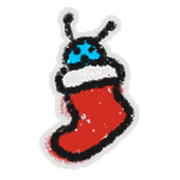

# Stockings

{ align=right width=150 }

This piece of content goes bye bye.

The following content has been removed from the game. The contents below may be archival, but feel free to edit below.

This piece of content contains information obtained through datamining.

Due to the nature of the information, details may be inaccurate or outdated.

Datamined information: The probability of getting every item. — December 19th, 2024

The **Stockings** are a Beesmas-exclusive machine that could be unlocked after completing [Brown Bear](brown-bear.md)'s Beesmas quest. Introduced during Beesmas 2020, they have returned every Beesmas since.

The Stockings are located at the bottom of the hill where Brown Bear stands, next to the [Clover Field](clover-field.md). When used, they will spawn one random [Beequip](beequip.md) and two additional random items in front of them. The cooldown for use is 1 hour.

## Drops

<table class="article-table">
<tbody><tr>
<th>Beequips (1 per use)
</th>
<th>Other items (2 per use)
</th></tr>
<tr>
<td>The range of the quality of the beequip can be found with the below steps:
<ul><li>Let <i>cnt</i> be the number of bees the player has at the time of claiming.</li>
<li>\(middle={\frac {cnt}{50}}\), clamped between 0 and 1.</li>
<li>The quality of the beequip is between \(0.1\times middle^{1.5}\) and \(0.5+0.4\times middle^{1.5}\).</li></ul>

1 <a href="beesmas-top.html">Beesmas Top</a> (~29.66%) 
1 <a href="warm-scarf.html">Warm Scarf</a> (~29.66%) 
1 <a href="single-mitten.html">Single Mitten</a> (~19.77%) 
1 <a href="elf-cap.html">Elf Cap</a> (~19.77%) 
1 <a href="electric-candle.html">Electric Candle</a> (~0.99%) 
1 <a href="bubble-light.html">Bubble Light</a> (~0.1%) 
1 <a href="toy-drum.html">Toy Drum</a> (~0.05%) 
1 <a href="beesmas-tree-hat.html">Beesmas Tree Hat</a> (~0.0005%) 

</td>
<td>

1 <a href="ticket.html">Ticket</a> (~18.51%) 
1 <a href="micro-converter.html">Micro-Converter</a> (~18.51%) 
1 <a href="field-dice.html">Field Dice</a> (~14.81%) 
1 <a href="royal-jelly.html">Royal Jelly</a> (~11.1%) 
5 <a href="gumdrops.html">Gumdrops</a> (~11.1%) 
1 <a href="magic-bean.html">Magic Bean</a> (~7.4%) 
1 <a href="oil.html">Oil</a> (~3.7%) 
1 <a href="enzymes.html">Enzymes</a> (~3.7%) 
1 <a href="red-extract.html">Red Extract</a> (~3.7%) 
1 <a href="blue-extract.html">Blue Extract</a> (~3.7%) 
10 <a href="moon-charm.html">Moon Charms</a> (~3.7%) 
Critter In A Stocking Sticker (~0.07%) 
1 <a href="egg.html#Silver_Egg">Silver Egg</a> (~0.07%) 
1 <a href="egg.html#Gold_Egg">Gold Egg</a> (~0.04%) 
1 <a href="night-bell.html">Night Bell</a> (~0.04%) 
1 <a href="box-o-frogs.html">Box-O-Frogs</a> (~0.02%) 
1 <a href="egg.html#Diamond_Egg">Diamond Egg</a> (~0.004%) 
1 <a href="festive-bean.html">Festive Bean</a> (~0.001%) 
1 <a href="egg.html#Mythic_Egg">Mythic Egg</a> (~0.0004%) 
1 <a href="star-treat.html">Star Treat</a> (~4.0E-5%) 

</td></tr></tbody></table>

## Trivia

* If the player attempts to use the Stockings before the player completed Brown Bear's 2021 Beesmas quest, it will display text saying *"This mantle looks so barren without Stockings on the hooks..."*
* Every time the player uses the Stockings, they can only get 1 of each item, excluding gumdrops and moon charms.
* Tokens spawned by the Stockings can be collected by a [Token Link](ability-tokens.md#Token_Link).
* [Loot Luck](loot-luck.md) does not affect the Stocking drops.
