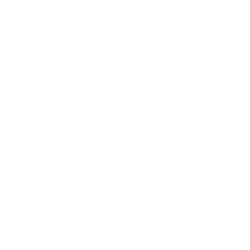

# Tabby Bee

Tabby Bee

<input type="radio" name="bee-infobox-tab" id="bee-tab-original" checked>
<label for="bee-tab-original">Original</label>
<input type="radio" name="bee-infobox-tab" id="bee-tab-gifted">
<label for="bee-tab-gifted">Gifted</label>

<i>"This affectionate bee was raised by cats. It becomes a better worker as it warms up to you."</i>

<b>Rarity</b>Event

<b>Color</b>Colorless

<b>Energy</b>28

<b>Speed</b>16.1

<b>Attack</b>4

Color Scheme

<b>Skin</b><code>#f99d28</code><code>#634927</code><code>#f99d28</code>

**Tabby Bee** is a Colorless [Event bee](bees-event.md) that hatches out of a [Tabby Bee Egg](egg.md#Tabby_Bee_Egg), which is currently available in the [Ticket Tent](ticket-tent.md) for 500 [Tickets](ticket.md).

Like all other Event bees, this bee does not have a favorite treat, and the only way to make it gifted is by feeding it a [Star Treat](star-treat.md), [Gingerbread Bears](gingerbread-bear.md) or [Aged Gingerbread Bears](aged-gingerbread-bear.md).

Tabby Bee likes the [Spider Field](spider-field.md) and [Clover Field](clover-field.md). It dislikes the [Cactus Field](cactus-field.md).

## Stats

* Collects 10 [Pollen](pollen.md) in 4 seconds.
* Makes 160 [Honey](honey.md) in 3 seconds.
* +40% [Energy](energy.md), +15% [Movespeed](stats.md#Speed), +25% Convert Speed, +3 [Attack](stats.md#Attack), up to +1680 [Convert Amount](system-page.md#Convert_Amount), up to +100 [Gather Amount](stats.md#Gather_Amount).
* 🌟 [Gifted Hive Bonus](gifted-bee.md): +50% [Critical Power](system-page.md#Critical_Power).

Unlike other bees, this bee has a unique perk: its stats increase permanently with the collection of Tabby Love [tokens](ability-tokens.md). At the cap of 1,000 Tabby Love, this bee's maximum stats are:

* Collects 110 Pollen in 4 seconds.
* Makes 1,760 [Honey](honey.md) in 3 seconds.
* Collects 88 Pollen from 3 lines of 4 flowers with Scratch (1,056 pollen).

### Abilities

*  **[Scratch](ability-tokens.md#Scratch)** Collects 7 (+1 per lvl) Pollen from 3 lines of 4 [Flowers](flowers.md). If Gifted, Scratch always does Critical hits.
*  **[Tabby Love](ability-tokens.md#Tabby_Love)** Permanently grants Tabby Bee +1% Gather Amount, Convert Amount, and pollen from Scratch. Stacks up to 1,000 times.
  * If at max stacks, Tabby Love grants Tabby Blessing, giving +1% Critical Chance and +25% Critical Power for 20 seconds (+2s per level). If Gifted, it grants Tabby Blessing+, which adds +1% Super-Crit Chance as well.

<table style="font-size:1.5vh; color:#000; width:100%; background:#fff; padding: 15px 0; border:none; color:#000; border-left:15px #000 solid">
<tbody><tr>
<td style="width:100%; text-align:center">

Tabby Bee has a base pollen collection of <b>10 </b> in <b>4 seconds</b>. 

That's equivalent to 2.5  per second. 

(<b>20 </b> in <b>4 seconds</b> with x2 Bee Pollen gamepass)

</td></tr></tbody></table>

<table align="center" class="wikitable" style="text-align:center; width:80%;">
<tbody><tr>
<th colspan="5"> Pollen Collection
</th></tr>
<tr>
<td rowspan="2">Flower Tier
</td><td colspan="1" rowspan="2">Bee Pollen
</td><td colspan="2">with Critical Hit
</td></tr>
<tr>
<td>without Melody
</td><td>with Melody
</td></tr>
<tr>
<td>Single
</td><td>10
</td><td>20
</td><td>30
</td></tr>
<tr>
<td>Double
</td><td>20
</td><td>40
</td><td>60
</td></tr>
<tr>
<td>Triple
</td><td>30
</td><td>60
</td><td>90
</td></tr>
<tr>
<td>Large
</td><td>40
</td><td>80
</td><td>120
</td></tr>
<tr>
<td>Star
</td><td>50
</td><td>100
</td><td>150
</td></tr>
</tbody></table>

<table style="font-size:1.5vh; color:#000; width:100%; background:linear-gradient(to left, #FFB75E, #ED8F03); padding: 15px 0; border:none; color:#fff; border-left:15px #fff solid">
<tbody><tr>
<td style="width:100%; text-align:center">

Tabby Bee can make <b>160 </b> in <b>3 seconds</b>!

That's equivalent to <b>53.33333  per second</b>.

(<b>160  in 1.5 seconds</b> with x2 Honeymaking Speed)

</td></tr>
</tbody></table>

<table align="center" class="wikitable" style="text-align:center; width:75%">
<tbody><tr>
<th>Honey Collection with Science Enhancement
</th></tr>
<tr>
<td>
<h3>Levels 1-8</h3><table align="center" class="wikitable" style="text-align:center;">
<tbody><tr>
<th><i>Science Enhancement</i>
</th><th>Production Rate
</th><th>Number of Produced Honey
</th></tr>
<tr>
<td>1
</td><td>25%
</td><td>200
</td></tr>
<tr>
<td>2
</td><td>50%
</td><td>240
</td></tr>
<tr>
<td>3
</td><td>75%
</td><td>280
</td></tr>
<tr>
<td>4
</td><td>100%
</td><td>320
</td></tr>
<tr>
<td>5
</td><td>125%
</td><td>360
</td></tr>
<tr>
<td>6
</td><td>150%
</td><td>400
</td></tr>
<tr>
<td>7
</td><td>175%
</td><td>440
</td></tr>
<tr>
<td>8
</td><td>200%
</td><td>480
</td></tr>
</tbody></table><h3>Levels 9-16</h3><table align="center" class="wikitable" style="text-align:center;">
<tbody><tr>
<th><i>Science Enhancement</i>
</th><th>Production Rate
</th><th>Number of Produced Honey
</th></tr>
<tr>
<td>9
</td><td>225%
</td><td>520
</td></tr>
<tr>
<td>10
</td><td>250%
</td><td>560
</td></tr>
<tr>
<td>11
</td><td>275%
</td><td>600
</td></tr>
<tr>
<td>12
</td><td>300%
</td><td>640
</td></tr>
<tr>
<td>13
</td><td>325%
</td><td>680
</td></tr>
<tr>
<td>14
</td><td>350%
</td><td>720
</td></tr>
<tr>
<td>15
</td><td>375%
</td><td>760
</td></tr>
<tr>
<td>16
</td><td>400%
</td><td>800
</td></tr>
</tbody></table><h3>Levels 17-24</h3><table align="center" class="wikitable" style="text-align:center;">
<tbody><tr>
<th><i>Science Enhancement</i>
</th><th>Production Rate
</th><th>Number of Produced Honey
</th></tr>
<tr>
<td>17
</td><td>425%
</td><td>840
</td></tr>
<tr>
<td>18
</td><td>450%
</td><td>880
</td></tr>
<tr>
<td>19
</td><td>475%
</td><td>920
</td></tr>
<tr>
<td>20
</td><td>500%
</td><td>960
</td></tr>
<tr>
<td>21
</td><td>525%
</td><td>1000
</td></tr>
<tr>
<td>22
</td><td>550%
</td><td>1040
</td></tr>
<tr>
<td>23
</td><td>575%
</td><td>1080
</td></tr>
<tr>
<td>24
</td><td>600%
</td><td>1120
</td></tr>
</tbody></table><h3>Levels 25-31</h3><table align="center" class="wikitable" style="text-align:center;">
<tbody><tr>
<th><i>Science Enhancement</i>
</th><th>Production Rate
</th><th>Number of Produced Honey
</th></tr>
<tr>
<td>25
</td><td>625%
</td><td>1160
</td></tr>
<tr>
<td>26
</td><td>650%
</td><td>1200
</td></tr>
<tr>
<td>27
</td><td>675%
</td><td>1240
</td></tr>
<tr>
<td>28
</td><td>700%
</td><td>1280
</td></tr>
<tr>
<td>29
</td><td>725%
</td><td>1320
</td></tr>
<tr>
<td>30
</td><td>750%
</td><td>1360
</td></tr>
<tr>
<td>31
</td><td>775%
</td><td>1400
</td></tr>
</tbody></table>

</td></tr>
</tbody></table>

## Stickers

Tabby Bee has no working sticker drop of its own.

<b>Game bug:</b> The Tabby Scratch sticker says it comes from collecting Tabby Love at max stacks while a Stinger is active, but nothing in the game gives it, so it can't be obtained.

<b>Game bug:</b> The Tabby From Behind sticker says it comes from feeding a Moon Charm at max Tabby Love, but the game never rolls stickers when you feed a bee, so this way doesn't work.

Like any bee, it can also find the stickers listed under [Bee sticker drops](sticker.md#bee-sticker-drops).

## Trivia

* When Tabby Bee was added, the maximum Tabby Love stack was mistakenly set to 500. This mistake was fixed in a later update.
* Tabby Bee cost 250 [Tickets](ticket.md) when it was originally released.
* There used to be an [Easter Egg](easter-eggs.md#Tabby_Bee_Block_(Removed)) behind the hives, which was a block with a distorted photo of Tabby Bee on it. It was removed around 2 June 2018. This was possibly a hint for one of the [codes](codes.md), more specifically, "Meow", which gave five tickets before it expired.
* Tabby Bee is one of three bees to have an official plush on the [Official Bee Swarm Simulator Website](https://shop.beeswarm.com/), the others being [Basic Bee](basic-bee.md) and [Vicious Bee](vicious-bee.md).
* Because of a timer glitch that stopped players from buying it early, Tabby Bee returned on sale between June 2 and June 6, 2018.
* Tabby Bee was the third Event bee to be added to the game, after [Photon Bee](photon-bee.md) and [Bear Bee](bear-bee.md) respectively.
* This bee, Bear Bee, [Gummy Bee](gummy-bee.md), [Puppy Bee](puppy-bee.md), [Festive Bee](festive-bee.md), [Windy Bee](windy-bee.md), [and Digital Bee](digital-bee.md) are the only Event bees which can be a first edition bee when hatching them during its first release in-game.
* Tabby Bee, Bear Bee, Gummy Bee, Festive Bee, Photon Bee, [Tadpole Bee](tadpole-bee.md), and [Vicious Bee](vicious-bee.md) are the only bees to have a gifted bonus that affects their signature ability.
* The player's tabby love stack will not be removed if the player transforms Tabby Bee in any way.
* Before the May 23, 2024 update, if the player already had max Tabby Love (x1000) and collected another one, it would neither increase the existing buff nor have any effect.
* Tabby Bee is a reference to Onett's real-life cat named Sam. This is hinted in one of [Onett's](onett.md) dialogues in his star journey [quests](quests.md), and later confirmed on Discord.
* Tabby Bee, along with Basic Bee and [Rascal Bee](rascal-bee.md), are Onett's favorite bees.
* Tabby Bee is mentioned in [Panda Bear](panda-bear.md)'s dialogue during his Ultimate Ant Annihilation 1 quest. As Tabby Bee's description says, he states that Tabby Bee was raised by cats.
* Tabby Bee is one of the few bees based off from animals other than just bees, the others being [Lion Bee](lion-bee.md), [Tadpole Bee](tadpole-bee.md), Puppy Bee, and Bear Bee.
* Tabby Bee, despite having a 50% energy increase compared to Basic bee listed in its stats, has a base energy of 28, which is only comparable to a 40% energy increase.
* Tabby Bee can have the highest conversion rate in the game at maximum Tabby Love.
* This was one of the few bees that could have been summoned from [Onett's Lid Art](onett-s-lid-art.md).
  * If a Tabby Bee from Onett's Lid Art produced a tabby love token, the buff would not be removed after the Tabby Bee despawns.

<table class="mw-collapsible mw-collapsed NavTable">
<tbody><tr>
<th class="NavTitle" colspan="2">Bees
</th></tr>
<tr>
<th class="NavCategory">Common &amp; Rare
</th>
<td class="NavLinks NavLinksRare"><b> <a href="basic-bee.html">Basic Bee</a> •  <a href="bomber-bee.html">Bomber Bee</a>  •  <a href="brave-bee.html">Brave Bee</a> •  <a href="bumble-bee.html">Bumble Bee</a> •  <a href="cool-bee.html">Cool Bee</a> •  <a href="hasty-bee.html">Hasty Bee</a> •  <a href="looker-bee.html">Looker Bee</a> •  <a href="rad-bee.html">Rad Bee</a> •  <a href="rascal-bee.html">Rascal Bee</a> •  <a href="stubborn-bee.html">Stubborn Bee</a></b>
</td></tr>
<tr>
<th class="NavCategory">Epic
</th>
<td class="NavLinks NavLinksEpic"><b> <a href="bubble-bee.html">Bubble Bee</a> •  <a href="bucko-bee.html">Bucko Bee</a> •  <a href="commander-bee.html">Commander Bee</a> •  <a href="demo-bee.html">Demo Bee</a> •  <a href="exhausted-bee.html">Exhausted Bee</a> •  <a href="fire-bee.html">Fire Bee</a> •  <a href="frosty-bee.html">Frosty Bee</a> •  <a href="honey-bee.html">Honey Bee</a> •  <a href="rage-bee.html">Rage Bee</a> •  <a href="riley-bee.html">Riley Bee</a> •  <a href="shocked-bee.html">Shocked Bee</a></b>
</td></tr>
<tr>
<th class="NavCategory">Legendary
</th>
<td class="NavLinks NavLinksLegend"><b> <a href="baby-bee.html">Baby Bee</a> •  <a href="carpenter-bee.html">Carpenter Bee</a> •  <a href="demon-bee.html">Demon Bee</a> •  <a href="diamond-bee.html">Diamond Bee</a> •  <a href="lion-bee.html">Lion Bee</a> •  <a href="music-bee.html">Music Bee</a> •  <a href="ninja-bee.html">Ninja Bee</a> •  <a href="shy-bee.html">Shy Bee</a></b>
</td></tr>
<tr>
<th class="NavCategory">Mythic
</th>
<td class="NavLinks NavLinksMythic"><b> <a href="buoyant-bee.html">Buoyant Bee</a> •  <a href="fuzzy-bee.html">Fuzzy Bee</a> •  <a href="precise-bee.html">Precise Bee</a> •  <a href="spicy-bee.html">Spicy Bee</a> •  <a href="tadpole-bee.html">Tadpole Bee</a> •  <a href="vector-bee.html">Vector Bee</a></b>
</td></tr>
<tr>
<th class="NavCategory">Event
</th>
<td class="NavLinks NavLinksEvent"><b> <a href="bear-bee.html">Bear Bee</a> •  <a href="cobalt-bee.html">Cobalt Bee</a> •  <a href="crimson-bee.html">Crimson Bee</a> •  <a href="digital-bee.html">Digital Bee</a> •  <a href="festive-bee.html">Festive Bee</a> •  <a href="gummy-bee.html">Gummy Bee</a> •  <a href="photon-bee.html">Photon Bee</a> •  <a href="puppy-bee.html">Puppy Bee</a> •  <strong class="mw-selflink selflink">Tabby Bee</strong> •  <a href="vicious-bee.html">Vicious Bee</a> •  <a href="windy-bee.html">Windy Bee</a></b>
</td></tr></tbody></table>

## All bees

--8<-- "all-bees.md"
