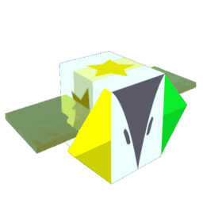

# Vector Bee

Vector Bee

<input type="radio" name="bee-infobox-tab" id="bee-tab-original" checked>
<label for="bee-tab-original">Original</label>
<input type="radio" name="bee-infobox-tab" id="bee-tab-gifted">
<label for="bee-tab-gifted">Gifted</label>

<i>"A bee brought to life by an extremely complex trigonometric equation."</i>

<b>Rarity</b>Mythic

<b>Color</b>Colorless

<b>Energy</b>45.6

<b>Speed</b>16.24

<b>Attack</b>5

Color Scheme

<b>Skin</b><code>#b7bcc8</code><code>#ffffff</code><code>#b7bcc8</code>

**Vector Bee** is a Colorless [Mythic bee](bees-mythic.md).

Vector Bee's favorite treat is [Sunflower Seeds](sunflower-seed.md).

Vector Bee likes the [Spider Field](spider-field.md) and the [Coconut Field](coconut-field.md). It dislikes the [Pineapple Patch](pineapple-patch.md).

## Stats

* Collects 18 [Pollen](pollen.md) in 4 seconds.
* Makes 144 [Honey](honey.md) in 2.72 seconds.
* +4 [Attack](stats.md#Attack), +8 [Gather Amount](stats.md#Gather_Amount), +16% [Movespeed](stats.md#Speed), +32% Convert Speed, +64 [Convert Amount](system-page.md#Convert_Amount), +128% [Energy](energy.md).
* 🌟 [Gifted Hive Bonus](gifted-bee.md): +15% Mark Duration.

### Abilities

* **[Pollen Mark+](ability-tokens.md#Mark)** Marks a large random area on the [Field](fields.md) for 8 seconds (+0.25s per Level) that increases all pollen by 50% while that player stands in it. Stacks up to 3 times.
* **[Triangulate](ability-tokens.md#Triangulate)** Draws a triangle between the player, the bee, and the token. After 3s, it collects [Ability tokens](ability-tokens.md) and 10 pollen (+2 per Level) from all [Flowers](flowers.md) inside. All Marks within the triangle increase the pollen by 50%.
  * If the triangle contains a Pollen Mark, it gains x2 White pollen.
  * If the triangle contains a Honey Mark or Festive Mark, it gains 50% instant conversion.
  * If the triangle contains a Precise Mark, it always deals critical hits.
* **[🌟Gifted Ability: Mark Surge](ability-tokens.md#Mark_Surge)** Causes all of the player's active Marks to collect 7 Pollen (+10% per Level) from all flowers in their radius. Extends the duration of the Marks by 1s (+0.1s per Level). Each mark can perform up to 5 surges.
  * When a Honey Mark or Festive Mark surges, the Pollen is Instantly Converted.
  * When a Precise Mark surges, it always does Critical Hits.

<table style="font-size:1.5vh; color:#000; width:100%; background:#fff; padding: 15px 0; border:none; color:#000; border-left:15px #000 solid">
<tbody><tr>
<td style="width:100%; text-align:center">

Vector Bee has a base pollen collection of <b>18 </b> in <b>4 seconds</b>. 

That's equivalent to 4.5  per second. 

(<b>36 </b> in <b>4 seconds</b> with x2 Bee Pollen gamepass)

</td></tr></tbody></table>

<table align="center" class="wikitable" style="text-align:center; width:80%;">
<tbody><tr>
<th colspan="5"> Pollen Collection
</th></tr>
<tr>
<td rowspan="2">Flower Tier
</td><td colspan="1" rowspan="2">Bee Pollen
</td><td colspan="2">with Critical Hit
</td></tr>
<tr>
<td>without Melody
</td><td>with Melody
</td></tr>
<tr>
<td>Single
</td><td>18
</td><td>36
</td><td>54
</td></tr>
<tr>
<td>Double
</td><td>36
</td><td>72
</td><td>108
</td></tr>
<tr>
<td>Triple
</td><td>54
</td><td>108
</td><td>162
</td></tr>
<tr>
<td>Large
</td><td>72
</td><td>144
</td><td>216
</td></tr>
<tr>
<td>Star
</td><td>90
</td><td>180
</td><td>270
</td></tr>
</tbody></table>

<table style="font-size:1.5vh; color:#000; width:100%; background:linear-gradient(to left, #FFB75E, #ED8F03); padding: 15px 0; border:none; color:#fff; border-left:15px #fff solid">
<tbody><tr>
<td style="width:100%; text-align:center">

Vector Bee can make <b>144 </b> in <b>1 second</b>!

 

(<b>144  in 0.5 seconds</b> with x2 Honeymaking Speed)

</td></tr>
</tbody></table>

<table align="center" class="wikitable" style="text-align:center; width:75%">
<tbody><tr>
<th>Honey Collection with Science Enhancement
</th></tr>
<tr>
<td>
<h3>Levels 1-8</h3><table align="center" class="wikitable" style="text-align:center;">
<tbody><tr>
<th><i>Science Enhancement</i>
</th><th>Production Rate
</th><th>Number of Produced Honey
</th></tr>
<tr>
<td>1
</td><td>25%
</td><td>180
</td></tr>
<tr>
<td>2
</td><td>50%
</td><td>216
</td></tr>
<tr>
<td>3
</td><td>75%
</td><td>252
</td></tr>
<tr>
<td>4
</td><td>100%
</td><td>288
</td></tr>
<tr>
<td>5
</td><td>125%
</td><td>324
</td></tr>
<tr>
<td>6
</td><td>150%
</td><td>360
</td></tr>
<tr>
<td>7
</td><td>175%
</td><td>396
</td></tr>
<tr>
<td>8
</td><td>200%
</td><td>432
</td></tr>
</tbody></table><h3>Levels 9-16</h3><table align="center" class="wikitable" style="text-align:center;">
<tbody><tr>
<th><i>Science Enhancement</i>
</th><th>Production Rate
</th><th>Number of Produced Honey
</th></tr>
<tr>
<td>9
</td><td>225%
</td><td>468
</td></tr>
<tr>
<td>10
</td><td>250%
</td><td>504
</td></tr>
<tr>
<td>11
</td><td>275%
</td><td>540
</td></tr>
<tr>
<td>12
</td><td>300%
</td><td>576
</td></tr>
<tr>
<td>13
</td><td>325%
</td><td>612
</td></tr>
<tr>
<td>14
</td><td>350%
</td><td>648
</td></tr>
<tr>
<td>15
</td><td>375%
</td><td>684
</td></tr>
<tr>
<td>16
</td><td>400%
</td><td>720
</td></tr>
</tbody></table><h3>Levels 17-24</h3><table align="center" class="wikitable" style="text-align:center;">
<tbody><tr>
<th><i>Science Enhancement</i>
</th><th>Production Rate
</th><th>Number of Produced Honey
</th></tr>
<tr>
<td>17
</td><td>425%
</td><td>756
</td></tr>
<tr>
<td>18
</td><td>450%
</td><td>792
</td></tr>
<tr>
<td>19
</td><td>475%
</td><td>828
</td></tr>
<tr>
<td>20
</td><td>500%
</td><td>864
</td></tr>
<tr>
<td>21
</td><td>525%
</td><td>900
</td></tr>
<tr>
<td>22
</td><td>550%
</td><td>936
</td></tr>
<tr>
<td>23
</td><td>575%
</td><td>972
</td></tr>
<tr>
<td>24
</td><td>600%
</td><td>1008
</td></tr>
</tbody></table><h3>Levels 25-31</h3><table align="center" class="wikitable" style="text-align:center;">
<tbody><tr>
<th><i>Science Enhancement</i>
</th><th>Production Rate
</th><th>Number of Produced Honey
</th></tr>
<tr>
<td>25
</td><td>625%
</td><td>1044
</td></tr>
<tr>
<td>26
</td><td>650%
</td><td>1080
</td></tr>
<tr>
<td>27
</td><td>675%
</td><td>1116
</td></tr>
<tr>
<td>28
</td><td>700%
</td><td>1152
</td></tr>
<tr>
<td>29
</td><td>725%
</td><td>1188
</td></tr>
<tr>
<td>30
</td><td>750%
</td><td>1224
</td></tr>
<tr>
<td>31
</td><td>775%
</td><td>1260
</td></tr>
</tbody></table>

</td></tr>
</tbody></table>

<table align="center" class="wikitable" style="text-align:center; width:70%">
<tbody><tr>
<td colspan="3"> Egg and Jelly Probability 
</td></tr><tr>
<td>Item
</td><td>Base Probability
</td><td>Probability of getting a particular mythic bee.
</td></tr><tr>
<td style="text-align:left; padding:5px 0 5px 25px;"><a href="egg.html#Basic_Egg">Basic Egg</a>
</td><td>0%
</td><td>0%
</td></tr><tr>
<td style="text-align:left; padding:5px 0 5px 25px;"><a href="egg.html#Silver_Egg">Silver Egg</a>
</td><td>0.1%
</td><td>0.01667%
</td></tr><tr>
<td style="text-align:left; padding:5px 0 5px 25px;"><a href="egg.html#Gold_Egg">Gold Egg</a>
</td><td>1%
</td><td>0.16667%
</td></tr><tr>
<td style="text-align:left; padding:5px 0 5px 25px;"><a href="egg.html#Diamond_Egg">Diamond Egg</a>
</td><td>5%
</td><td>0.83333%
</td></tr><tr>
<td style="text-align:left; padding:5px 0 5px 25px;"><a href="egg.html#Mythic_Egg">Mythic Egg</a>
</td><td>100%
</td><td>16.66667%
</td></tr><tr>
<td style="text-align:left; padding:5px 0 5px 25px;"><a href="royal-jelly.html">Royal Jelly</a>
</td><td>0.004%
</td><td>0.00067%
</td></tr>
</tbody></table>

## Trivia

* Vector Bee's stats follow a [Geometric Progression](https://en.wikipedia.org/wiki/Geometric_Progression) pattern, where each number is double the amount of the previous number.
* Vector Bee is the only Mythic bee to not share any of its abilities with other bees. It is also the only Mythic Bee to not have a [Passive Ability](passive-abilities.md).
* Vector Bee is the only [bee](bees.md) to have a different skin pattern on each of its sides.
* Vector Bee's design is heavily inspired by mathematics.
  * Its relation to trigonometry is implied in its description and the triangular motifs on its head.
  * Vectors reference Euclidean vectors, objects with magnitude and direction. A triangle can be composed of three vectors.
  * Triangulation is a method to determine the location of a point through forming triangles from known points.
* Vector Bee, [Spicy Bee](spicy-bee.md), [Precise Bee](precise-bee.md) and [Buoyant Bee](buoyant-bee.md) emit light when they are gifted.
* Vector Bee shares similar color schemes with [Brave Bee](brave-bee.md).
* Triangulate is [Onett](onett-developer.md)'s favorite ability, due to the fact that he thinks it's satisfying.
* Mark Surge token is considered by the game as "mark" token despite what the ability does doesn't create mark like what all other mark tokens do. This means the collection of Mark Surge token counts toward some quests, [Coin Scatter passive ability](passive-abilities.md#Coin_Scatter), and anything that requires the collection of "mark" tokens.
  * Triangulate, however, is not considered as "mark" ability token.
  * In a similar fashion, Fuzz Bombs ([Fuzzy Bee](fuzzy-bee.md)'s ability token), Bomb Sync ([Cobalt Bee](cobalt-bee.md) and [Crimson Bee](crimson-bee.md)'s ability token) are not considered "bomb" ability tokens, and Honey Mark isn't considered as "honey" token.

<table class="mw-collapsible mw-collapsed NavTable">
<tbody><tr>
<th class="NavTitle" colspan="2">Bees
</th></tr>
<tr>
<th class="NavCategory">Common &amp; Rare
</th>
<td class="NavLinks NavLinksRare"><b> <a href="basic-bee.html">Basic Bee</a> •  <a href="bomber-bee.html">Bomber Bee</a>  •  <a href="brave-bee.html">Brave Bee</a> •  <a href="bumble-bee.html">Bumble Bee</a> •  <a href="cool-bee.html">Cool Bee</a> •  <a href="hasty-bee.html">Hasty Bee</a> •  <a href="looker-bee.html">Looker Bee</a> •  <a href="rad-bee.html">Rad Bee</a> •  <a href="rascal-bee.html">Rascal Bee</a> •  <a href="stubborn-bee.html">Stubborn Bee</a></b>
</td></tr>
<tr>
<th class="NavCategory">Epic
</th>
<td class="NavLinks NavLinksEpic"><b> <a href="bubble-bee.html">Bubble Bee</a> •  <a href="bucko-bee.html">Bucko Bee</a> •  <a href="commander-bee.html">Commander Bee</a> •  <a href="demo-bee.html">Demo Bee</a> •  <a href="exhausted-bee.html">Exhausted Bee</a> •  <a href="fire-bee.html">Fire Bee</a> •  <a href="frosty-bee.html">Frosty Bee</a> •  <a href="honey-bee.html">Honey Bee</a> •  <a href="rage-bee.html">Rage Bee</a> •  <a href="riley-bee.html">Riley Bee</a> •  <a href="shocked-bee.html">Shocked Bee</a></b>
</td></tr>
<tr>
<th class="NavCategory">Legendary
</th>
<td class="NavLinks NavLinksLegend"><b> <a href="baby-bee.html">Baby Bee</a> •  <a href="carpenter-bee.html">Carpenter Bee</a> •  <a href="demon-bee.html">Demon Bee</a> •  <a href="diamond-bee.html">Diamond Bee</a> •  <a href="lion-bee.html">Lion Bee</a> •  <a href="music-bee.html">Music Bee</a> •  <a href="ninja-bee.html">Ninja Bee</a> •  <a href="shy-bee.html">Shy Bee</a></b>
</td></tr>
<tr>
<th class="NavCategory">Mythic
</th>
<td class="NavLinks NavLinksMythic"><b> <a href="buoyant-bee.html">Buoyant Bee</a> •  <a href="fuzzy-bee.html">Fuzzy Bee</a> •  <a href="precise-bee.html">Precise Bee</a> •  <a href="spicy-bee.html">Spicy Bee</a> •  <a href="tadpole-bee.html">Tadpole Bee</a> •  <strong class="mw-selflink selflink">Vector Bee</strong></b>
</td></tr>
<tr>
<th class="NavCategory">Event
</th>
<td class="NavLinks NavLinksEvent"><b> <a href="bear-bee.html">Bear Bee</a> •  <a href="cobalt-bee.html">Cobalt Bee</a> •  <a href="crimson-bee.html">Crimson Bee</a> •  <a href="digital-bee.html">Digital Bee</a> •  <a href="festive-bee.html">Festive Bee</a> •  <a href="gummy-bee.html">Gummy Bee</a> •  <a href="photon-bee.html">Photon Bee</a> •  <a href="puppy-bee.html">Puppy Bee</a> •  <a href="tabby-bee.html">Tabby Bee</a> •  <a href="vicious-bee.html">Vicious Bee</a> •  <a href="windy-bee.html">Windy Bee</a></b>
</td></tr></tbody></table>

## All bees

--8<-- "all-bees.md"
