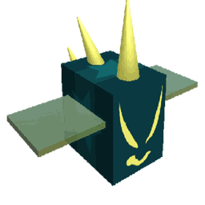

# Vicious Bee

<table class="infobox templateBeeDefault templateBeeBlueBackground">
<tbody><tr>
<td class="templateBeeTitle templateBeeEventText" colspan="3"><b>Vicious Bee</b>
</td></tr>
<tr>
<td class="templateBeeTabber" colspan="3">

<h3>Original</h3>

<h3>Gifted</h3>

</td></tr>
<tr>
<td class="templateBeeDesc" colspan="3"><i>"This cold-blooded bee takes great pleasure in inflicting pain."</i>
</td></tr>
<tr>
<td class="templateBeeDefaultCell" colspan="3"><b>Rarity</b>   Event
</td></tr>
<tr>
<td class="templateBeeDefaultCell" colspan="3"><b>Color</b>   Blue
</td></tr>
<tr>
<td class="templateBeeStatCell templateBeeGoodStat"><b>Energy</b>   50
</td>
<td class="templateBeeStatCell templateBeeGoodStat"><b>Speed</b>   17.5
</td>
<td class="templateBeeStatCell templateBeeGoodStat"><b>Attack</b>   9
</td></tr>
<tr>
<td class="templateBeeHeader templateBeeEventText" colspan="3">COLOR SCHEME
</td></tr>
<tr>
<td colspan="3"><table class="templateBeeDefaultStripeTable">
<tbody><tr>
<td>

 

 

 

 

Skin

#0e141e

#2f4e66

#0e141e

</td></tr>
</tbody></table>
</td></tr></tbody></table>

*> This page is for the tamed version of Vicious Bee. For the hostile version, see [Rogue Vicious Bee](rogue-vicious-bee.md).*

**Vicious Bee** is a Blue [Event bee](bees-event.md). It can be claimed for 250 [Stingers](stinger.md) at the [Vicious Bee Egg Claim](vicious-bee-egg-claim.md).

Like all other Event bees, this bee does not have a favorite treat, and the only way to make it gifted is by feeding it a [Star Treat](star-treat.md), [Gingerbread Bears](gingerbread-bear.md) or [Aged Gingerbread Bears](aged-gingerbread-bear.md).

Vicious Bee likes the [Cactus Field](cactus-field.md) and the [Rose Field](rose-field.md). It dislikes the [Dandelion Field](dandelion-field.md).

## Stats

* Collects 10 [Pollen](pollen.md) in 4 seconds.
* Makes 80 [Honey](honey.md) in 4 seconds.
* +150% [Energy](energy.md), +25% [Movespeed](stats.md#Speed), +8 [Attack](stats.md#Attack).
* 🌟 [Gifted Hive Bonus](gifted-bee.md): -15% Mob Respawn Time.

### Abilities

* **[Impale](ability-tokens.md#Impale)** Summons spikes (1 per level) to damage enemies equal to 5% of their current health (Increased by Vicious Bee's attack. [Reduced damage if larger than 1000]). Creates a honey token per enemy hit (worth 50 honey plus 50 per bee level). Multiple spikes on the same target deal less damage. Impale can damage [mobs](mobs.md) that target other players but will not target other players' [Tunnel Bear](tunnel-bear.md), [King Beetle](king-beetle.md), [Stump Snail](stump-snail.md), or [Coconut Crab](coconut-crab.md). If gifted, Impale has +1 level of accuracy.
* **[Blue Bomb+](ability-tokens.md#Bomb)** Collects 10 pollen from 29 surrounding blue [Flowers](flowers.md) (+10% pollen per Level). Combo with other bombs to increase power.

<table class="article-table">
<tbody><tr>
<th>Mob
</th>
<th>Normal respawn time
</th>
<th>Reduced respawn time
</th>
<th>Difference
</th></tr>
<tr>
<td>Ladybug/Rhino Beetle
</td>
<td>5:00
</td>
<td><i><b>4:15</b></i>
</td>
<td>0:45
</td></tr>
<tr>
<td>Mantis/Scorpion
</td>
<td>20:00
</td>
<td><i><b>17:00</b></i>
</td>
<td>3:00
</td></tr>
<tr>
<td>Spider/Cave Monster/Commando Chick
</td>
<td>30:00
</td>
<td><i><b>25:30</b></i>
</td>
<td>4:30
</td></tr>
<tr>
<td>Werewolf
</td>
<td>60:00
</td>
<td><i><b>51:00</b></i>
</td>
<td>9:00
</td></tr>
<tr>
<td>King Beetle
</td>
<td>24:00:00
</td>
<td><i><b>20:24:00</b></i>
</td>
<td>3:36:00
</td></tr>
<tr>
<td>Coconut Crab
</td>
<td>36:00:00
</td>
<td><i><b>30:36:00</b></i>
</td>
<td>5:24:00
</td></tr>
<tr>
<td>Tunnel Bear
</td>
<td>48:00:00
</td>
<td><i><b>40:48:00</b></i>
</td>
<td>7:12:00
</td></tr>
<tr>
<td>Stump Snail
</td>
<td>96:00:00
</td>
<td><i><b>81:36:00</b></i>
</td>
<td>14:24:00
</td></tr></tbody></table>

<table style="font-size:1.5vh; color:#000; width:100%; background:#fff; padding: 15px 0; border:none; color:#000; border-left:15px #2fa0fc solid">
<tbody><tr>
<td style="width:100%; text-align:center">

Vicious Bee has a base pollen collection of <b>10 </b> in <b>4 seconds</b>. 

That's equivalent to 2.5  per second. 

(<b>20 </b> in <b>4 seconds</b> with x2 Bee Pollen gamepass)

</td></tr></tbody></table>

<table align="center" class="wikitable" style="text-align:center; width:80%;">
<tbody><tr>
<th colspan="5"> Pollen Collection
</th></tr>
<tr>
<td rowspan="2">Flower Tier
</td><td colspan="2">Bee Pollen
</td><td colspan="2">with Critical Hit
</td></tr>
<tr>
<td>Base Value
</td><td>Blue Flower
</td><td>without Melody
</td><td>with Melody
</td></tr>
<tr>
<td>Single
</td><td>10
</td><td>15
</td><td>20
</td><td>30
</td></tr>
<tr>
<td>Double
</td><td>20
</td><td>30
</td><td>40
</td><td>60
</td></tr>
<tr>
<td>Triple
</td><td>30
</td><td>45
</td><td>60
</td><td>90
</td></tr>
<tr>
<td>Large
</td><td>40
</td><td>60
</td><td>80
</td><td>120
</td></tr>
<tr>
<td>Star
</td><td>50
</td><td>75
</td><td>100
</td><td>150
</td></tr>
</tbody></table>

<table align="center" class="wikitable" style="text-align:center; width:80%">
<tbody><tr>
<th colspan="3">Pollen Collection with Boost Tokens
</th></tr>
<tr>
<td>Boost Tokens ( or )
</td><td>Percentage Bonus
</td><td>Collected Pollen
</td></tr>
<tr>
<td>1
</td><td>15%
</td><td>11.5
</td></tr>
<tr>
<td>2
</td><td>30%
</td><td>13
</td></tr>
<tr>
<td>3
</td><td>45%
</td><td>14.5
</td></tr>
<tr>
<td>4
</td><td>60%
</td><td>16
</td></tr>
<tr>
<td>5
</td><td>75%
</td><td>17.5
</td></tr>
<tr>
<td>6
</td><td>90%
</td><td>19
</td></tr>
<tr>
<td>7
</td><td>105%
</td><td>20.5
</td></tr>
<tr>
<td>8
</td><td>120%
</td><td>22
</td></tr>
<tr>
<td>9
</td><td>135%
</td><td>23.5
</td></tr>
<tr>
<td>10
</td><td>150%
</td><td>25
</td></tr>
</tbody></table>

<table style="font-size:1.5vh; color:#000; width:100%; background:linear-gradient(to left, #FFB75E, #ED8F03); padding: 15px 0; border:none; color:#fff; border-left:15px #fff solid">
<tbody><tr>
<td style="width:100%; text-align:center">

Vicious Bee can make <b>80 </b> in <b>4 seconds</b>!

That's equivalent to <b>20  per second</b>.

(<b>80  in 2 seconds</b> with x2 Honeymaking Speed)

</td></tr>
</tbody></table>

<table align="center" class="wikitable" style="text-align:center; width:75%">
<tbody><tr>
<th>Honey Collection with Science Enhancement
</th></tr>
<tr>
<td>
<h3>Levels 1-8</h3><table align="center" class="wikitable" style="text-align:center;">
<tbody><tr>
<th><i>Science Enhancement</i>
</th><th>Production Rate
</th><th>Number of Produced Honey
</th></tr>
<tr>
<td>1
</td><td>25%
</td><td>100
</td></tr>
<tr>
<td>2
</td><td>50%
</td><td>120
</td></tr>
<tr>
<td>3
</td><td>75%
</td><td>140
</td></tr>
<tr>
<td>4
</td><td>100%
</td><td>160
</td></tr>
<tr>
<td>5
</td><td>125%
</td><td>180
</td></tr>
<tr>
<td>6
</td><td>150%
</td><td>200
</td></tr>
<tr>
<td>7
</td><td>175%
</td><td>220
</td></tr>
<tr>
<td>8
</td><td>200%
</td><td>240
</td></tr>
</tbody></table><h3>Levels 9-16</h3><table align="center" class="wikitable" style="text-align:center;">
<tbody><tr>
<th><i>Science Enhancement</i>
</th><th>Production Rate
</th><th>Number of Produced Honey
</th></tr>
<tr>
<td>9
</td><td>225%
</td><td>260
</td></tr>
<tr>
<td>10
</td><td>250%
</td><td>280
</td></tr>
<tr>
<td>11
</td><td>275%
</td><td>300
</td></tr>
<tr>
<td>12
</td><td>300%
</td><td>320
</td></tr>
<tr>
<td>13
</td><td>325%
</td><td>340
</td></tr>
<tr>
<td>14
</td><td>350%
</td><td>360
</td></tr>
<tr>
<td>15
</td><td>375%
</td><td>380
</td></tr>
<tr>
<td>16
</td><td>400%
</td><td>400
</td></tr>
</tbody></table><h3>Levels 17-24</h3><table align="center" class="wikitable" style="text-align:center;">
<tbody><tr>
<th><i>Science Enhancement</i>
</th><th>Production Rate
</th><th>Number of Produced Honey
</th></tr>
<tr>
<td>17
</td><td>425%
</td><td>420
</td></tr>
<tr>
<td>18
</td><td>450%
</td><td>440
</td></tr>
<tr>
<td>19
</td><td>475%
</td><td>460
</td></tr>
<tr>
<td>20
</td><td>500%
</td><td>480
</td></tr>
<tr>
<td>21
</td><td>525%
</td><td>500
</td></tr>
<tr>
<td>22
</td><td>550%
</td><td>520
</td></tr>
<tr>
<td>23
</td><td>575%
</td><td>540
</td></tr>
<tr>
<td>24
</td><td>600%
</td><td>560
</td></tr>
</tbody></table><h3>Levels 25-31</h3><table align="center" class="wikitable" style="text-align:center;">
<tbody><tr>
<th><i>Science Enhancement</i>
</th><th>Production Rate
</th><th>Number of Produced Honey
</th></tr>
<tr>
<td>25
</td><td>625%
</td><td>580
</td></tr>
<tr>
<td>26
</td><td>650%
</td><td>600
</td></tr>
<tr>
<td>27
</td><td>675%
</td><td>620
</td></tr>
<tr>
<td>28
</td><td>700%
</td><td>640
</td></tr>
<tr>
<td>29
</td><td>725%
</td><td>660
</td></tr>
<tr>
<td>30
</td><td>750%
</td><td>680
</td></tr>
<tr>
<td>31
</td><td>775%
</td><td>700
</td></tr>
</tbody></table>

</td></tr>
</tbody></table>

## Gallery

GiiftedViciousBee Slot.png

A Gifted Vicious Bee hive slot.

ViciousFace.png

Vicious Bee's face.

ViciousBeeEggClaim.png

The Vicious Bee Egg Claim.

NighttimeUpdateIcon.png

Vicious Bee with <a href="basic-bee.html">Basic Bee</a> and <a href="puppy-bee.html">Puppy Bee</a> in an older version of the game's icon.

Impale Token Repicture2.png

An impale token.

Impale Token.gif

A 3D Impale token.

Vicious Bee Egg in the inventory.png

A Vicious Bee Egg.

Nymphimpale.png

Stick nymphs being attacked by a Gifted Vicious Bee's impale.

## Trivia

* Vicious Bee's base attack was previously 7 before it was increased to 8 in the 2021-12-26 update.
* Gifted Vicious Bee's impale ability gets golden-colored spikes, instead of the normal colored (gray) ones. The Impale ability does more base damage when gifted due to the +50% gifted attack bonus. The attack bonus is applied to the bee itself, but it indirectly increases the amount of damage Impale does—though this is not a significant buff due to the majority of Impale's attack scaling off of mob health.
* Vicious Bee is the only [Bee](bees.md) who can summon an [Ability Token](ability-tokens.md) that directly attacks enemies.
  * This bee and [Precise Bee](precise-bee.md) are the only bees who have abilities that directly attack the enemies, namely Impale and [Sniper](passive-abilities.md#Sniper) respectively. ([Digital Bee](digital-bee.md)'s Mind Hack ability doesn't count since it doesn't directly attack enemies).
* Vicious Bee is one of three bees to have an official plushie on the [Official Bee Swarm Simulator Website](https://shop.beeswarm.com/), the others being Basic Bee and [Tabby Bee](tabby-bee.md).
* Vicious Bee is the only blue bee that likes the Rose Field. It may like the Rose Field along with the Cactus Field due to the fact that roses and cacti have thorns on them. The [Rogue Version](rogue-vicious-bee.md) can also spawn in both of these fields.
* Vicious Bee and [Windy Bee](windy-bee.md) are the only bees with a hostile variant.
* It would cost the player 2,500 [Tickets](ticket.md) if they were to buy all 250 stingers from the [Stinger Shop](stinger-shop.md) to get a Vicious Bee, which makes it the most expensive event bee to get by spending tickets.
* Vicious Bee, [Ninja Bee](ninja-bee.md), and Cobalt Bee are the only blue bees that don't like [Blueberries](blueberry.md).
* Vicious Bee, [Bear Bee](bear-bee.md), [Gummy Bee](gummy-bee.md), Windy Bee, and [Digital Bee](digital-bee.md) are the only Event bees that cannot be purchased in the [Ticket Tent](ticket-tent.md). These four bees, along with [Festive Bee](festive-bee.md) and Puppy Bee, are also the only Event bees that could have been obtained without spending tickets. Gummy Bee was in the Ticket Tent at one point, however.
* Vicious Bee, Cobalt Bee, Crimson Bee, and [Photon Bee](photon-bee.md) are the only event bees that can't have a 1st Edition Flag.
  * [Onett](onett-developer.md) has stated that the reason a [First Edition](first-edition-bee.md) Vicious Bee does not exist is because there is no room for a 1st Flag on its back with the spikes.[1]
* Vicious Bee, the [Stick Bug Amulet](stick-bug-amulet.md), and the Spider Field [Market Boost](boost-market.md) are the only sources of the -% Mob Respawn Time stats.
* According to [Black Bear](black-bear.md)'s dialogue during his [quest](quests.md) "Black Bear, Why?", Black Bear dislikes this bee.

## References

1. ↑ [[1]](https://discord.com/channels/427553293862961153/427553293862961155/506287555231088658) Discord message from Onett

<table class="mw-collapsible mw-collapsed NavTable">
<tbody><tr>
<th class="NavTitle" colspan="2">Bees
</th></tr>
<tr>
<th class="NavCategory">Common &amp; Rare
</th>
<td class="NavLinks NavLinksRare"><b> <a href="basic-bee.html">Basic Bee</a> •  <a href="bomber-bee.html">Bomber Bee</a>  •  <a href="brave-bee.html">Brave Bee</a> •  <a href="bumble-bee.html">Bumble Bee</a> •  <a href="cool-bee.html">Cool Bee</a> •  <a href="hasty-bee.html">Hasty Bee</a> •  <a href="looker-bee.html">Looker Bee</a> •  <a href="rad-bee.html">Rad Bee</a> •  <a href="rascal-bee.html">Rascal Bee</a> •  <a href="stubborn-bee.html">Stubborn Bee</a></b>
</td></tr>
<tr>
<th class="NavCategory">Epic
</th>
<td class="NavLinks NavLinksEpic"><b> <a href="bubble-bee.html">Bubble Bee</a> •  <a href="bucko-bee.html">Bucko Bee</a> •  <a href="commander-bee.html">Commander Bee</a> •  <a href="demo-bee.html">Demo Bee</a> •  <a href="exhausted-bee.html">Exhausted Bee</a> •  <a href="fire-bee.html">Fire Bee</a> •  <a href="frosty-bee.html">Frosty Bee</a> •  <a href="honey-bee.html">Honey Bee</a> •  <a href="rage-bee.html">Rage Bee</a> •  <a href="riley-bee.html">Riley Bee</a> •  <a href="shocked-bee.html">Shocked Bee</a></b>
</td></tr>
<tr>
<th class="NavCategory">Legendary
</th>
<td class="NavLinks NavLinksLegend"><b> <a href="baby-bee.html">Baby Bee</a> •  <a href="carpenter-bee.html">Carpenter Bee</a> •  <a href="demon-bee.html">Demon Bee</a> •  <a href="diamond-bee.html">Diamond Bee</a> •  <a href="lion-bee.html">Lion Bee</a> •  <a href="music-bee.html">Music Bee</a> •  <a href="ninja-bee.html">Ninja Bee</a> •  <a href="shy-bee.html">Shy Bee</a></b>
</td></tr>
<tr>
<th class="NavCategory">Mythic
</th>
<td class="NavLinks NavLinksMythic"><b> <a href="buoyant-bee.html">Buoyant Bee</a> •  <a href="fuzzy-bee.html">Fuzzy Bee</a> •  <a href="precise-bee.html">Precise Bee</a> •  <a href="spicy-bee.html">Spicy Bee</a> •  <a href="tadpole-bee.html">Tadpole Bee</a> •  <a href="vector-bee.html">Vector Bee</a></b>
</td></tr>
<tr>
<th class="NavCategory">Event
</th>
<td class="NavLinks NavLinksEvent"><b> <a href="bear-bee.html">Bear Bee</a> •  <a href="cobalt-bee.html">Cobalt Bee</a> •  <a href="crimson-bee.html">Crimson Bee</a> •  <a href="digital-bee.html">Digital Bee</a> •  <a href="festive-bee.html">Festive Bee</a> •  <a href="gummy-bee.html">Gummy Bee</a> •  <a href="photon-bee.html">Photon Bee</a> •  <a href="puppy-bee.html">Puppy Bee</a> •  <a href="tabby-bee.html">Tabby Bee</a> •  <strong class="mw-selflink selflink">Vicious Bee</strong> •  <a href="windy-bee.html">Windy Bee</a></b>
</td></tr></tbody></table>

