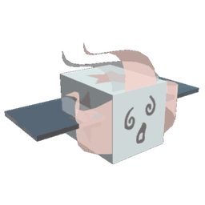
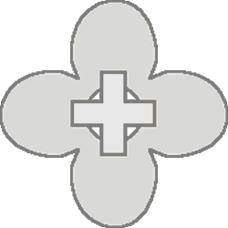

# Windy Bee

Windy Bee

<input type="radio" name="bee-infobox-tab" id="bee-tab-original" checked>
<label for="bee-tab-original">Original</label>
<input type="radio" name="bee-infobox-tab" id="bee-tab-gifted">
<label for="bee-tab-gifted">Gifted</label>

<i>"An ethereal bee as powerful and unpredictable as the weather."</i>

<b>Rarity</b>Event

<b>Color</b>Colorless

<b>Energy</b>20

<b>Speed</b>19.6

<b>Attack</b>4

Color Scheme

<b>Skin</b><code>#f2ffff</code><code>#f2ffff</code><code>#f2ffff</code>

*This page is for the tamed version of Windy Bee. For the hostile version, see [Wild Windy Bee](wild-windy-bee.md).*

**Windy Bee** is a Colorless [Event bee](bees-event.md) that hatches from a [Windy Bee Egg](egg.md#Windy_Bee_Egg), which can be obtained from donating [Cloud Vials](cloud-vial.md) after having previously donated a [Spirit Petal](spirit-petal.md) to the [Wind Shrine](wind-shrine.md).

Like all other Event bees, this bee does not have a favorite Treat, and the only ways to make it gifted are by feeding it a [Star Treat](star-treat.md), [Gingerbread Bears](gingerbread-bear.md) or [Aged Gingerbread Bears](aged-gingerbread-bear.md).

Windy Bee likes the [Dandelion Field](dandelion-field.md) and the [Coconut Field](coconut-field.md). It dislikes the [Bamboo Field](bamboo-field.md) and the [Strawberry Field](strawberry-field.md).

## Stats

* Collects 10 [Pollen](pollen.md) in 3 seconds.
* Makes 180 [Honey](honey.md) in 2 seconds.
* +40% [Movespeed](stats.md#Speed), +50% Convert Speed, +25% Gather Speed, +100 [Convert Amount](system-page.md#Convert_Amount), +3 [Attack](stats.md#Attack).
* 🌟 [Gifted Hive Bonus](gifted-bee.md#List_of_Hive_Bonuses): +15% [Instant White Conversion](system-page.md#Instant_White_Conversion), x2 Boosts From Clouds.

### Abilities

*  **[White Boost](ability-tokens.md#Boost)** Grants x1.2 pollen from White [Flowers](flowers.md) for 15s. Stacks up to 10 times.
*  **[Rain Cloud](ability-tokens.md#Rain_Cloud)** Summons a Cloud in a different field that lasts for 60s (+10s per level). Clouds make flowers grow and grant +25% Pollen and 10% Unique Instant Conversion to nearby players (50% Pollen and 20% Unique IC if the player has a gifted Windy Bee). If another player's Windy Bee spawns a cloud in the field the player is on, a message will appear announcing "🌧️ [Username]'s Windy Bee summoned a Cloud in this field. 🌧️"
*  **[Tornado](ability-tokens.md#Tornado)** Consumes your "[Haste](ability-tokens.md#Haste)" stacks to summon a Tornado which damages enemies and collects Tokens and Pollen as it roams the field. Lifespan, speed, and damage are increased by the number of Haste stacks spent and bee level.

<table style="font-size:1.5vh; color:#000; width:100%; background:#fff; padding: 15px 0; border:none; color:#000; border-left:15px #000 solid">
<tbody><tr>
<td style="width:100%; text-align:center">

Windy Bee has a base pollen collection of <b>10 </b> in <b>3 seconds</b>. 

That's equivalent to 3.33333  per second. 

(<b>20 </b> in <b>3 seconds</b> with x2 Bee Pollen gamepass)

</td></tr></tbody></table>

<table align="center" class="wikitable" style="text-align:center; width:80%;">
<tbody><tr>
<th colspan="5"> Pollen Collection
</th></tr>
<tr>
<td rowspan="2">Flower Tier
</td><td colspan="1" rowspan="2">Bee Pollen
</td><td colspan="2">with Critical Hit
</td></tr>
<tr>
<td>without Melody
</td><td>with Melody
</td></tr>
<tr>
<td>Single
</td><td>10
</td><td>20
</td><td>30
</td></tr>
<tr>
<td>Double
</td><td>20
</td><td>40
</td><td>60
</td></tr>
<tr>
<td>Triple
</td><td>30
</td><td>60
</td><td>90
</td></tr>
<tr>
<td>Large
</td><td>40
</td><td>80
</td><td>120
</td></tr>
<tr>
<td>Star
</td><td>50
</td><td>100
</td><td>150
</td></tr>
</tbody></table>

<table style="font-size:1.5vh; color:#000; width:100%; background:linear-gradient(to left, #FFB75E, #ED8F03); padding: 15px 0; border:none; color:#fff; border-left:15px #fff solid">
<tbody><tr>
<td style="width:100%; text-align:center">

Windy Bee can make <b>180 </b> in <b>2 seconds</b>!

That's equivalent to <b>90  per second</b>.

(<b>180  in 1 second</b> with x2 Honeymaking Speed)

</td></tr>
</tbody></table>

<table align="center" class="wikitable" style="text-align:center; width:75%">
<tbody><tr>
<th>Honey Collection with Science Enhancement
</th></tr>
<tr>
<td>
<h3>Levels 1-8</h3><table align="center" class="wikitable" style="text-align:center;">
<tbody><tr>
<th><i>Science Enhancement</i>
</th><th>Production Rate
</th><th>Number of Produced Honey
</th></tr>
<tr>
<td>1
</td><td>25%
</td><td>225
</td></tr>
<tr>
<td>2
</td><td>50%
</td><td>270
</td></tr>
<tr>
<td>3
</td><td>75%
</td><td>315
</td></tr>
<tr>
<td>4
</td><td>100%
</td><td>360
</td></tr>
<tr>
<td>5
</td><td>125%
</td><td>405
</td></tr>
<tr>
<td>6
</td><td>150%
</td><td>450
</td></tr>
<tr>
<td>7
</td><td>175%
</td><td>495
</td></tr>
<tr>
<td>8
</td><td>200%
</td><td>540
</td></tr>
</tbody></table><h3>Levels 9-16</h3><table align="center" class="wikitable" style="text-align:center;">
<tbody><tr>
<th><i>Science Enhancement</i>
</th><th>Production Rate
</th><th>Number of Produced Honey
</th></tr>
<tr>
<td>9
</td><td>225%
</td><td>585
</td></tr>
<tr>
<td>10
</td><td>250%
</td><td>630
</td></tr>
<tr>
<td>11
</td><td>275%
</td><td>675
</td></tr>
<tr>
<td>12
</td><td>300%
</td><td>720
</td></tr>
<tr>
<td>13
</td><td>325%
</td><td>765
</td></tr>
<tr>
<td>14
</td><td>350%
</td><td>810
</td></tr>
<tr>
<td>15
</td><td>375%
</td><td>855
</td></tr>
<tr>
<td>16
</td><td>400%
</td><td>900
</td></tr>
</tbody></table><h3>Levels 17-24</h3><table align="center" class="wikitable" style="text-align:center;">
<tbody><tr>
<th><i>Science Enhancement</i>
</th><th>Production Rate
</th><th>Number of Produced Honey
</th></tr>
<tr>
<td>17
</td><td>425%
</td><td>945
</td></tr>
<tr>
<td>18
</td><td>450%
</td><td>990
</td></tr>
<tr>
<td>19
</td><td>475%
</td><td>1035
</td></tr>
<tr>
<td>20
</td><td>500%
</td><td>1080
</td></tr>
<tr>
<td>21
</td><td>525%
</td><td>1125
</td></tr>
<tr>
<td>22
</td><td>550%
</td><td>1170
</td></tr>
<tr>
<td>23
</td><td>575%
</td><td>1215
</td></tr>
<tr>
<td>24
</td><td>600%
</td><td>1260
</td></tr>
</tbody></table><h3>Levels 25-31</h3><table align="center" class="wikitable" style="text-align:center;">
<tbody><tr>
<th><i>Science Enhancement</i>
</th><th>Production Rate
</th><th>Number of Produced Honey
</th></tr>
<tr>
<td>25
</td><td>625%
</td><td>1305
</td></tr>
<tr>
<td>26
</td><td>650%
</td><td>1350
</td></tr>
<tr>
<td>27
</td><td>675%
</td><td>1395
</td></tr>
<tr>
<td>28
</td><td>700%
</td><td>1440
</td></tr>
<tr>
<td>29
</td><td>725%
</td><td>1485
</td></tr>
<tr>
<td>30
</td><td>750%
</td><td>1530
</td></tr>
<tr>
<td>31
</td><td>775%
</td><td>1575
</td></tr>
</tbody></table>

</td></tr>
</tbody></table>

## Trivia

* Windy Bee's tornado path doesn't actually travel across the field randomly. It instead loosely follows a grid. This is slightly more noticeable when more haste tokens are spent and the tornado is faster.
* It was formerly available to purchase for 800 Robux until the deadline, October 27 of 2019.
  * This was the 3rd bee available to be bought for Robux; the second being [Festive Bee](festive-bee.md) and the first being [Bear Bee](bear-bee.md).
* There is a gate dedicated to it, known as the [Windy Bee Gate](windy-bee-gate.md) or the 35 bee gate.
* This, and [Vicious Bee](vicious-bee.md) are the only bees to have a hostile variant.
* This bee, [Music Bee](music-bee.md), [Vector Bee](vector-bee.md), [Tadpole Bee](tadpole-bee.md), [Spicy Bee](spicy-bee.md), Fuzzy Bee, Buoyant Bee, Festive Bee and [Digital Bee](digital-bee.md) are the only bees with three different ability tokens, the most of any bee.
* This bee, [Ninja Bee](ninja-bee.md), [Shy Bee](shy-bee.md), and Fuzzy Bee are the only bees that have only one skin color.
* This bee is the only bee to have the same skin color when it turns [gifted](gifted-bee.md).
* This bee and Puppy Bee are the only event bees that don't have an 'enhanced' ability when gifted.
* This bee is the only bee to have 2 gifted bonuses, excluding other Event bees who enhance their ability.
* Currently, this bee, Bear Bee, [Gummy Bee](gummy-bee.md), Digital Bee and Vicious Bee are the only event bees that can't be bought in the [Ticket Tent](ticket-tent.md).
* This is the only Event Bee to dislike 2 fields.
* This, along with Buoyant Bee, are the only bees to be able to produce a White Boost token. However Buoyant Bee only produces it through Surprise Parties.
* The Tornado ability, [frogs](frog.md), [Puppy Bee's](puppy-bee.md) [Fetch](ability-tokens.md#Fetch) ability, the [Cub Buddy](cub-buddy.md) and [Star Saw](passive-abilities.md#Star_Saw) are the only entities that can pick up [items](items.md) outside of personal tokens for the player.
* This bee and Festive Bee are the only non-gifted bees that have tinted wings.
* This bee was hinted at during the [Black Bear](black-bear.md) quest "Black Bear, Why?" when he says this: "Vicious Bee isn't the only bee that causes trouble! One time, I saw a strange bee destroy a whole field with powerful gusts of wind! I wonder if there are any other mysterious bees roaming free out there?"
* At one point, a model of a Windy Bee could be found outside the map, alongside with a model of a Vicious Bee.
* Supposedly, Windy Bee likes the [Dandelion Field](dandelion-field.md) because dandelion seeds 'go wherever the wind takes them'.

<table class="mw-collapsible mw-collapsed NavTable">
<tbody><tr>
<th class="NavTitle" colspan="2">Bees
</th></tr>
<tr>
<th class="NavCategory">Common &amp; Rare
</th>
<td class="NavLinks NavLinksRare"><b> <a href="basic-bee.html">Basic Bee</a> •  <a href="bomber-bee.html">Bomber Bee</a>  •  <a href="brave-bee.html">Brave Bee</a> •  <a href="bumble-bee.html">Bumble Bee</a> •  <a href="cool-bee.html">Cool Bee</a> •  <a href="hasty-bee.html">Hasty Bee</a> •  <a href="looker-bee.html">Looker Bee</a> •  <a href="rad-bee.html">Rad Bee</a> •  <a href="rascal-bee.html">Rascal Bee</a> •  <a href="stubborn-bee.html">Stubborn Bee</a></b>
</td></tr>
<tr>
<th class="NavCategory">Epic
</th>
<td class="NavLinks NavLinksEpic"><b> <a href="bubble-bee.html">Bubble Bee</a> •  <a href="bucko-bee.html">Bucko Bee</a> •  <a href="commander-bee.html">Commander Bee</a> •  <a href="demo-bee.html">Demo Bee</a> •  <a href="exhausted-bee.html">Exhausted Bee</a> •  <a href="fire-bee.html">Fire Bee</a> •  <a href="frosty-bee.html">Frosty Bee</a> •  <a href="honey-bee.html">Honey Bee</a> •  <a href="rage-bee.html">Rage Bee</a> •  <a href="riley-bee.html">Riley Bee</a> •  <a href="shocked-bee.html">Shocked Bee</a></b>
</td></tr>
<tr>
<th class="NavCategory">Legendary
</th>
<td class="NavLinks NavLinksLegend"><b> <a href="baby-bee.html">Baby Bee</a> •  <a href="carpenter-bee.html">Carpenter Bee</a> •  <a href="demon-bee.html">Demon Bee</a> •  <a href="diamond-bee.html">Diamond Bee</a> •  <a href="lion-bee.html">Lion Bee</a> •  <a href="music-bee.html">Music Bee</a> •  <a href="ninja-bee.html">Ninja Bee</a> •  <a href="shy-bee.html">Shy Bee</a></b>
</td></tr>
<tr>
<th class="NavCategory">Mythic
</th>
<td class="NavLinks NavLinksMythic"><b> <a href="buoyant-bee.html">Buoyant Bee</a> •  <a href="fuzzy-bee.html">Fuzzy Bee</a> •  <a href="precise-bee.html">Precise Bee</a> •  <a href="spicy-bee.html">Spicy Bee</a> •  <a href="tadpole-bee.html">Tadpole Bee</a> •  <a href="vector-bee.html">Vector Bee</a></b>
</td></tr>
<tr>
<th class="NavCategory">Event
</th>
<td class="NavLinks NavLinksEvent"><b> <a href="bear-bee.html">Bear Bee</a> •  <a href="cobalt-bee.html">Cobalt Bee</a> •  <a href="crimson-bee.html">Crimson Bee</a> •  <a href="digital-bee.html">Digital Bee</a> •  <a href="festive-bee.html">Festive Bee</a> •  <a href="gummy-bee.html">Gummy Bee</a> •  <a href="photon-bee.html">Photon Bee</a> •  <a href="puppy-bee.html">Puppy Bee</a> •  <a href="tabby-bee.html">Tabby Bee</a> •  <a href="vicious-bee.html">Vicious Bee</a> •  <strong class="mw-selflink selflink">Windy Bee</strong></b>
</td></tr></tbody></table>

## All bees

--8<-- "all-bees.md"
